# Wiener-Gate: Master Brief

> Category: Public Brief | Version: 1.0 | Date: 2026-08-26 | Status: Active

The complete public record of the Wiener-Gate investigation: a multi-brand
pet-sales fraud network operating across Facebook, TikTok, WhatsApp and at
least five websites, taking deposits for puppies that do not exist and
escalating victims into transport, crate and insurance fees through fabricated
shipping companies.

This document compiles every persona brief and the full wiki reference layer
into one file. Each section also exists as a standalone document; see
`briefs/` and `wiki/`.

**This is an evolving situation.** The public corpus is a point-in-time
snapshot synced from a private working repository. Findings marked
PROVISIONAL, UNVERIFIED or HYPOTHESIS may change. See the Changelog section.

**Before reading anything else:** several people whose names and faces appear
in this material are victims of identity and image theft, not participants.
The section titled "Who Is NOT A Suspect" is not an appendix. Read it.

---

## Contents

1. [Why This Matters](#why-this-matters)
2. [If You Have Been Targeted](#if-you-have-been-targeted)
3. [For Law Enforcement](#for-law-enforcement)
4. [For Technical Analysts](#for-technical-analysts)
5. [Analytic Assessment](#analytic-assessment)
6. [How To Help](#how-to-help)
7. [Who Is NOT A Suspect](#who-is-not-a-suspect)
8. [The Network At A Glance](#the-network-at-a-glance)
9. [Domain Roster](#domain-roster)
10. [Indicator Reference](#indicator-reference)
11. [Methodology](#methodology)
12. [Verify Our Work](#verify-our-work)
13. [Glossary](#glossary)
14. [Changelog](#changelog)

---


# Why This Matters


For a reporter deciding whether there is a story here, and for anyone deciding whether to care: what a four-week investigation into a fake-puppy operation actually found, what it proves, and what it deliberately refuses to claim.

---

### Read this before you read anything else: where the evidence stops and we start

This brief argues a case. That means some of it is documented fact and some of it is our reading of the facts. Those are different things and we are not going to blur them to make the story land harder.

| Marker | What it means | How to check it |
|---|---|---|
| **DOCUMENTED** | Captured, hashed, and reproducible by a stranger with a browser | [`../wiki/verify-our-work.md`](#verify-our-work) |
| **PROVISIONAL** | We believe it and the corroborating artifact is not in hand yet. Labeled every time | Stated inline, with what is missing |
| **OUR VIEW** | Analysis and opinion. Argued, not evidenced | Stated inline |

Every claim in the sections below carries one of those three. If a sentence in this brief is not marked, treat it as DOCUMENTED and go check it.

We would rather you find this brief boring in one paragraph than find it wrong in one paragraph. A reporter who catches a single inflated number is right to throw out everything around it, and we have written this on the assumption that you will try.


- [The victims' guide: what to do if this happened to you](#if-you-have-been-targeted)
- [How to help, in ways that actually help](#how-to-help)
- [Who is NOT a suspect](#who-is-not-a-suspect)
- [Verify our work yourself](#verify-our-work)
- [The network at a glance](#the-network-at-a-glance)
- [For law enforcement](#for-law-enforcement)
- [For technical analysts](#for-technical-analysts)
- [The intelligence picture](#analytic-assessment)
- [Redaction contract](REDACTION_CONTRACT.md)

---

### The short version

A family went looking for a small dog. They were told within a day that they had been approved, asked for a deposit through a phone payment app, and given a hard pickup date to hurry them along.

There was no dog.

That much is an ordinary sad story, and it happens every week. What makes this one worth your time is what was sitting behind it.

The people behind that listing did not build a fake breeder. They bought one. The fake shipping company attached to it still ships its template vendor's demonstration password, printed in plain text on its own admin page. Its footer still says "(demo)", in English and in German, on every page. Nobody ever edited it, because editing it was never the point. It is a unit, deployed.

That is not a scammer. That is a supply chain with a customer.

---

### Finding one: they did not even change the demo password

**DOCUMENTED.**

`safepup-delivery.com` presents itself as a pet transport company with a Frankfurt head office, German governing law, and Frankfurt jurisdiction written into its terms.

Its admin login page prints the template vendor's demonstration credentials underneath the login form, in plain text, on the open internet.

Its footer carries the string "(demo)" on every page, in both its English and its German localisation.

Its live tracking system will happily serve you the vendor's demonstration shipment record.

We did not log in. Nobody should. Using those credentials would be unauthorized access no matter how obvious they are, and the evidence is entirely in the fact that the string is published, not in anything behind it. That fact is captured and hashed.

Underneath the pet-services navigation, the page filenames and form fields are generic freight forwarding. It is a freight template repainted as a pet courier.

And the site claiming German establishment publishes no Impressum. A full-text search across all 27 captured files for "Impressum", "Imprint", "Handelsregister", "Amtsgericht", "Umsatzsteuer" and "USt-IdNr" returns zero matches. Under German law that is a standalone violation a regulator can act on without proving a single act of fraud.

This pattern repeats. A second site in the corpus was still using its commercial template's demo contact address years after deployment. A third uploaded its stolen puppy photographs without renaming the files, so a third-party listing site's own filenames and listing IDs are still sitting in the URLs.

**OUR VIEW.** You do not leave the demo password up because you are careless. You leave it up because you are running volume, and editing a footer does not scale. Sloppiness at this exact point in the process is what mass production looks like from the outside.

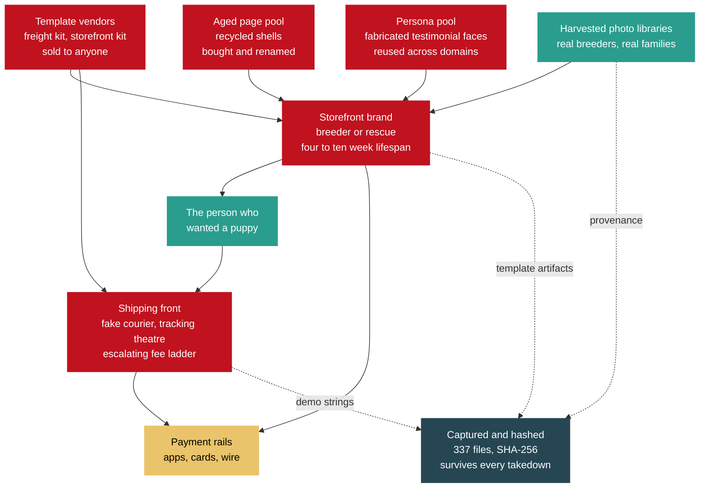

**Context, from published research, not from us.** Peer-reviewed and industry work has already mapped this model at scale: one documented franchise network ran roughly 75,000 fraudulent shop domains; a 2026 industry study mapped 20,000-plus fake shops resolving to only 36 IP addresses; an NDSS 2025 paper machine-classified 46,746 fraudulent shopping sites out of 1.1 million collected.

Those are other people's numbers about the wider market, cited so you can see this is a known criminal industry and not a one-off. **They are not our count of this network, and we do not have one.**

---

### Finding two: the pages are inventory, not people

**DOCUMENTED, with one PROVISIONAL step marked below.**

Facebook publishes a Page Transparency panel showing a page's creation date and every name it has ever carried. The page owner cannot edit it. It is the single most useful public record in this entire investigation.

Here is one page's whole life, out of that panel.

On 7 June 2026, somebody created a page called "Golf carts for sale."

The same day, they renamed it "SMART CARTS."

It sat there for ten weeks with one follower.

On 13 August 2026 it was renamed again, this time into a person's name, and given a profile photograph stolen from a real person's harvested photo library.

Twelve days later, on 25 August 2026, an account displaying that name sent bank account details over Facebook Messenger and asked for a wire transfer.

**PROVISIONAL.** That last step rests on a screenshot the investigator captured, which is filed, hashed, and re-verified by automation on every change. A screenshot is a picture of a record, not the record. The native platform export carrying the server-side message ID and timestamp is requested and not yet in hand. Until it lands, treat the solicitation and the twelve-day cycle time as reported and corroborated but not established. We will say so every time we say it.

That page is not an identity. It is stock.

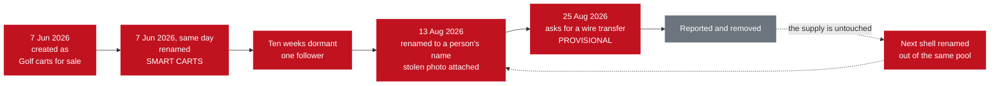

**This is the answer to a question breeders have been asking for years.**

A dachshund breeder whose entire photo library was stolen reported that she cannot keep pace with takedowns, because the pages come back faster than she can file. That sounds like a platform being slow. It is not.

It is that removing a page removes an instance, not the supply. The identity was never in the page. The identity is a name and a stolen photograph applied to a shell drawn from a pool of pre-existing, recyclable pages. Take one down and the next one is a rename away.

Another page in this corpus cycled through a personal name, then viral videos, then news aggregation, then religious content, then pet rescue. Whatever monetises this week.

One more detail shows how deliberate this is. We perceptual-hashed all 98 photographic files in the corpus looking for the same stolen image reused across different accounts. We found zero cross-account reuse. Thirty-eight separate account clusters, each supplied with different stolen photographs.

**OUR VIEW.** Zero reuse is not an accident of scale. It defeats the one check a careful buyer actually performs, which is reverse-image searching a listing to see whether it turns up on a known scam page. Sustaining thirty-eight fronts on non-overlapping imagery requires continuous theft, and somebody decided that was worth paying for.

---

### Finding three: they are wearing real people's lives

**DOCUMENTED.**

Every photograph on these sites belongs to somebody.

More than twenty separate third-party domains had images served directly off their own servers onto one fraudulent storefront. Those businesses paid the bandwidth to display their own stolen work on a fraud site. Among them are a Getty asset and a Yelp-hosted business photo, alongside a long tail of small breeders and rescues.

Real breeders' dogs, photographed by their owners, are listed for sale by people who have never met them. Real families' "going home" photographs, taken on the day they collected a puppy, are reused as proof that a fake breeder delivers.

And in the worst single case in this file, an operator obtained deep access to one individual's personal photo library. Not one photo. The library. Then generated new images from her actual likeness, placing her real face into scenes she was never in.

She has never been contacted. She has given no consent. Her photographs are evidence, not publishable material, and you will not find them in this corpus or in this brief.

Her face is on the account that asked us for money.

That is the sentence to sit with. **The person whose likeness solicited a payment is, on the record as it stands, a victim of this network and not a participant in it.**

The victim classes are not one group. There are at least five, and they do not know about each other.

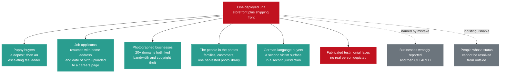

Two of those classes deserve naming out loud, because nobody reports them as pet fraud.

**Job applicants.** The fake courier's careers page advertises four roles and runs a live upload form collecting full name, email, phone, a resume file and a cover letter. Resumes carry home addresses, employment history, education, and frequently dates of birth. That is a document and identity harvesting channel pointed at people looking for work. **OUR VIEW:** one of the four listings, remote customer support, resembles the standard money-mule recruitment pattern and we think it should be assessed that way. The documented fact is narrower: the page advertises a remote support role and collects applicant identity documents. The mule reading is our inference, not a finding.

**German-speaking buyers.** One of the shipping fronts is fully localised into German and claims EU establishment. This is not a US-only harm.

---

### Finding four: the emotional targeting is the design, not a side effect

**OUR VIEW.** This section is analysis. The underlying facts are documented; the argument built on them is ours.

Of the four brand identities in this file, two are framed as rescues rather than breeders. "Rescue. Love. Rehome." "Rescue. Rehome. Restore Love."

That framing does two things at once. It suppresses price scrutiny, because you do not haggle with a rescue. And it recruits the specific person who is trying to do a good deed.

Look at the sequence a target actually experiences.

You are not sold to. You are **approved**. Approval feels like being chosen, and it arrives fast, usually within a day.

The photographs are of real dogs, because they are real dogs, stolen from somebody who loves them. The happy customers vouching underneath are faces no camera ever saw.

The deposit is small enough to feel safe, and it is asked for over apps where money does not come back.

Then the pickup date is already set, so you are the one holding things up.

If you pay, a shipping company you have never heard of writes to you about a crate, then insurance, then customs, and shows you a tracking page with a plane crossing a map for a dog that does not exist. Each fee is framed as the last one.

Every one of those design choices targets the part of you that wants to be good to an animal, and routes around the part of you that checks. This is not a scam that happens to involve puppies. The puppies are the mechanism.

Some of the stolen imagery includes children. Those images will never be published here, by anyone, for any reason. Consent for them belongs to their parents and to nobody in this investigation.

---

### Finding five: it rebuilt itself while it was being watched

**DOCUMENTED.** The registry dates are attested by the domain registry, not by anybody's website copy.

This is the urgency framing, and we use this version because it is the one the dates support:

> This network replaced one storefront and stood up a second shipping front during the four weeks this investigation was running. The newest storefront was registered six days before this file was compiled. Three domains named in the earlier evidence are already deregistered. The infrastructure is being rebuilt faster than reports can be filed against it.

Note what that framing is not. It is not "they are pre-positioning for the holiday season." That is the version a reporter would reach for, and the registry dates contradict it, so we do not use it.

Four domains, four one-year registrations, the standard disposable term. Storefront replacement running roughly every four to ten weeks across five months. Three other domains named in this file came back as unregistered within a day of being written down.

One of them shows you the real shape of a takedown. The shipping front's website returns a 404 and its content is gone. Its mail records are live, its sender policy is published, and its certificate was renewed ten days before we looked.

**Removing the site removed the evidence a victim could screenshot. It did not remove the capability.** That domain can still invoice a victim as a shipping company tomorrow.

Meanwhile the accounts began locking down their friend lists and group lists mid-investigation. Facebook does not do that by default and it does not happen by accident across multiple accounts at once. We cannot tell from outside whether that is a response to us, routine rotation, or pressure from somebody else's reports, and the practical consequence is identical in all three cases: anything still visible has to be archived on sight, not scheduled.

---

### Before you share this: nobody in this file is your suspect

**Read this section even if you skip the rest.**

Several of the people whose faces, names and businesses appear in this material are victims. Some are entirely uninvolved. At least one cannot be distinguished from outside, which means treating them as guilty would be a coin flip with a real person's life.

**Do not identify anyone. Do not go looking. Do not tag, name, dox, brigade, or "just ask around about" anyone in connection with this.**

Seven separate entities sit on an exclusion list in this investigation precisely because this failure mode is predictable. It has a shape: a viral post identifies a face on a scam page as the scammer, the face belongs to somebody whose photos were stolen or who was recruited as a mule, and a person who was already harmed gets harmed again, permanently, by strangers who believed they were helping.

Read [**Who is NOT a suspect**](#who-is-not-a-suspect) before you post about this. That page exists for exactly this reason, and it is the most important link in this brief.

Three things follow from it.

**The face on a fraudulent page is usually a stolen face.** In this investigation, the profile photograph on the account that solicited a payment is a stolen photograph of a real person who never consented to anything.

**A name attached to a bank account is not an operator.** People are recruited into those roles, sometimes through fake job listings like the ones described above. Working out who knew what requires subpoena power, account records and payment-rail data. It does not require, and cannot be done with, a search engine.

**The breeders and rescues whose photographs were stolen are the wronged party.** Six of the seven photographed organisations in this file have not even been told yet. That is why we do not name them here.

We have named no individual as an operator anywhere in the public corpus, and we will not.

---

### What we will not claim

**This list is the point of the brief.** These are the claims that would make the story bigger, and the evidence does not carry them, so they are not here.

| We do not say | Why |
|---|---|
| Any dollar total, any aggregate loss estimate, any headline victim count | The corpus does not support a loss estimate. We argue productization and measurable deployment instead |
| That any victim paid the account that was solicited from us | **Not established.** That account was sent to the investigator. Which account received victim money is an open question |
| That any named person runs this | Attribution belongs to parties with subpoena authority. We do not have it, and neither do you |
| That this is a state influence operation | We tested that hypothesis directly and the evidence points the other way. The content is apolitical, the monetization is immediate and financial, and the category-hopping is commodity page flipping |
| That shared hosting proves shared control | We checked. It is a shared gateway with dozens of unrelated tenants. We downgraded our own finding |
| That a given phone number identifies an operator | One of them runs an unrelated business on another platform. Another returns a probably uninvolved private individual |

We also keep our failures. An image-forensics technique we leaned on early was downgraded because it would not survive expert challenge. A camera-serial lead turned out not to exist at all. A square-image heuristic was demoted when a confirmed-real photograph in our own corpus broke it. All of it stays in the record, dated, with the correction attached.

**OUR VIEW.** A file containing only the things that worked is a file that has been curated for an audience. This one has not been.

---

### For reporters

**Verifiable today, by you, without us.**

- The published demo credential string and the "(demo)" footer, in English and German, on a live site.
- The stolen-photo filenames still carrying a third-party listing site's own naming convention.
- Millisecond upload timestamps showing eleven images harvested in a continuous 93-minute session that finished 34 minutes before the domain was registered.
- Registry creation dates, and the three deregistered domains, from RDAP.
- The full page rename history, from the platform's own transparency panel, on page `1179239581941044`.
- The missing Impressum on a site claiming Frankfurt jurisdiction.
- SHA-256 hashes for every file in the corpus. 337 hashed files, re-verified by automation on every change. Instructions are at [`../wiki/verify-our-work.md`](#verify-our-work).

**Provisional, and please label it as such if you use it.**

- The solicitation itself, and the twelve-day identity-to-payment cycle time derived from it. Both rest on a filed and hashed investigator screenshot; the native platform export is outstanding.

**We will not confirm, on the record or off.**

- A loss figure. Any individual's identity. Any attribution of who runs this.

**Required disclosure.** The compiler of this file is personally acquainted with one of the named complainants, who forwarded the initial material. Which complainant is not stated here and is not derivable from anything published in this corpus. We state that up front rather than waiting to be asked. Every infrastructure finding in the corpus is independently verifiable from the captures and hashes provided, without reference to that relationship.

**On the three complainants.** Three people who were targeted have consented to being named publicly. This version does not name them anyway.

The reason is worth stating plainly, because it is the same reason we are asking you not to hunt anybody. Consent given in the first flush of anger about losing money is real. It is also given without much sense of what it feels like to be a searchable result attached to "puppy scam victim" for the next several years. They are Complainant A, Complainant B and Complainant C here. Pseudonymity is reversible on their say-so. Publication is not.

If you want to interview them, ask us and we will ask them properly, with the exposure explained.

**Contact.** Mario Aldayuz, Legion Code Inc., mario@legioncodeinc.com. Available as an on-record technical source. An FBI IC3 filing is proceeding in parallel.

---

### What you can actually do

Ranked by how much good it does per minute spent.

**If you paid money, in this order, today:**

1. **Call your bank or the payment app first.** Before anything else. Some rails have a reversal window measured in hours, and it closes.
2. **Export your own message thread now**, before you report the account. Scope the platform's own data download to that conversation. If the operator blocks or deletes you, the payment instructions in their own words are gone permanently. Screenshots are better than nothing and are not comparable to an export.
3. **File your own complaint at [ic3.gov](https://www.ic3.gov)** and write down the complaint number. A complaint filed by the person who lost the money is treated differently from a third-party report about them.
4. **Report to the FTC** at [reportfraud.ftc.gov](https://reportfraud.ftc.gov).
5. Read [the victims' guide](#if-you-have-been-targeted) for the payment-rail-specific detail, because the recovery route differs for a card, an app transfer and a wire.

**If you want to help and you were not targeted:**

- **Archive pages to the [Wayback Machine](https://web.archive.org/save) on sight.** This is the highest-value thing a stranger can do. Domains in this file went from live to unregistered inside a single day. An archived capture survives the takedown. A bookmark does not.
- **Report to the platforms with specific IDs**, not general descriptions. Page IDs, shop IDs, account handles. The identifiers we can publish are in [`../wiki/indicators.md`](#indicator-reference).
- **Submit domains to blocklists.** Browser and DNS blocklists act faster than registrars, and they protect people who will never read a word of this.
- **Share the public repository, not a screenshot of it.** A screenshot loses the hashes, the corrections and the firewall page, and the firewall page is the part that stops somebody getting hurt.
- **Do not name anyone.** See above. It is the one way a well-meaning share does net harm.

**If you breed or run a rescue:**

- Search for your own dogs' photographs. Check whether your images are being served off your own server onto somebody else's site.
- Turn on hotlink protection. It costs nothing, and it stops you paying the bandwidth bill for your own theft.
- **If you hold the copyright in the photographs, you can file DMCA takedowns.** That is standing we do not have. The photographer normally holds it, but not always: an employment relationship, a work-made-for-hire agreement, or a signed transfer can put it elsewhere, and DMCA is a US procedure rather than a universal one. Where someone else holds the rights, they are the one who can file, or who can authorize you to file for them, so point them at it. Either way you can report the image theft and the impersonation to the platform, which does not require you to own anything.
- Expect the pages to come back, and understand now that this is not your failure. Read finding two again. You are filing against instances while the supply sits untouched.

Full detail on all of it: [**How to help**](#how-to-help).

---

### Why you should trust a document that keeps telling you what it cannot prove

Because that is the whole method.

The parts of this case that survived every review are the parts already captured and hashed on disk. They do not depend on any account staying visible, and the operators cannot retract them. The parts that kept failing are the ones that tried to link people through shared infrastructure, and we deleted our own conclusions when they failed.

Every claim carries a marker. Every correction stays in the record with its date. Every file has a SHA-256 that automation re-verifies on every change. The redaction rules are published so you can hold us to them, and the list of people we refuse to name is longer than the list of things we allege.

**OUR VIEW, and the last thing in this brief.**

The exaggerated version of this story is a number. An enormous loss figure, a vast victim count, a shadowy mastermind at the top of it. That version is easy to write, impossible to check, and the first reporter who checks it discards everything attached to it.

The true version is worse.

The true version is that somebody bought a website kit, deployed it without reading it, hung a stolen photograph of a real woman on a recycled page that used to sell golf carts, and asked for money. Then, while three complainants were being interviewed and this file was being assembled, they did it again with a new domain, and again with a new courier, and the sites they abandoned kept their mail running.

Nobody in that sentence is a mastermind. That is exactly the problem. It works without one.

---

*This brief is analysis and opinion built on a documented evidentiary record. Documented, provisional and opinion claims are marked throughout. Corrections go into the record, dated, with the original preserved. If you find an error in this document, tell us and we will publish the correction rather than the edit.*


---


# If You Have Been Targeted


For anyone who has just realised something is wrong with a puppy they are buying online, or who is mid-purchase and unsure: what the warning signs actually are, what to do in the next few hours, and why none of this is your fault.


- [`BRIEF-06-how-to-help.md`](#how-to-help), what you can do with what you know, if you want to do something
- [`BRIEF-05-media-public.md`](#why-this-matters), the general-audience account of the whole operation
- [`BRIEF-01-law-enforcement.md`](#for-law-enforcement), the version written for investigators and filing desks
- [`BRIEF-03-technical-analysts.md`](#for-technical-analysts), the full technical evidence, for readers who want to check the work
- [`BRIEF-04-intelligence.md`](#analytic-assessment), analysis and assessment, labelled as such
- [`../REDACTION_CONTRACT.md`](REDACTION_CONTRACT.md), the rules governing what this corpus will and will not publish
- [`../README.md`](../README.md)

If you only have the energy for one more page after this one, make it BRIEF-06. It is the shortest and the most actionable.

**A note on names.** The three people who came forward in this investigation are called Complainant A, Complainant B and Complainant C throughout. All three agreed to be named publicly. We are not using their names in this version anyway, because agreeing to that in the first hours after losing money is not the same as choosing to be a search result attached to the words "puppy scam victim" for the next ten years (Y-6). That door stays open for them, on their timing.

**A disclosure, up front.** The compiler of this file is personally acquainted with one of the named complainants, who forwarded the initial material. Which complainant is not stated here and is not derivable from anything published in this corpus. All infrastructure findings are independently verifiable from the captures and hashes provided (Y-2).

---

### 1. Read this part first

You are not stupid. Please sit with that for a second before you read anything else.

We have spent weeks pulling this operation apart, and here is what we found underneath it. The websites are not homemade. They are professional templates, bought or downloaded, and deployed by people who did not even bother to change the demo settings (T-1). The puppy photographs are real photographs of real dogs, stolen from real breeders and rescues who had nothing to do with any of this (U-3, A5). The glowing customer reviews are fabricated, and the same invented names turn up on site after site that are supposed to be unrelated companies (Q-5, S-3, T-3, U-7).

You were not fooled by a badly spelled email. You were shown a working business, built out of parts that a real business would have used, staffed by people whose entire job is this conversation.

Being deceived by a professionally built deception is not a failure of intelligence. It is the deception working as designed.

The embarrassment you are feeling right now is the single most useful thing this operation has going for it. It is what stops people calling their bank on day two. It is what stops people filing reports. Everything in section 3 of this brief works better the sooner you do it, and embarrassment is the only thing standing between you and doing it.

So: set it down. You can pick it up again later if you really want to. Right now there are some phone calls to make.

---

### 2. Am I being scammed? A checklist

None of these on its own is proof. Two or three of them together and you should stop sending money today.

#### 2.1 The shipping company appeared after you paid

This is the big one.

You agreed a price for a puppy. You paid a deposit. Then, somewhere between the deposit and the delivery date, a shipping company entered the conversation. And that shipping company needs money too.

The fee ladder documented in this case runs: deposit, then transport, then a "climate-controlled crate", then "shipping insurance", sometimes then customs (Q-6). One of the fake shippers we captured publishes an actual rate card, charging by the kilogram plus a percentage of the declared value of the animal (T-8). Its own sample record shows a transport cost set against a much larger declared pet value (T-3), which is the shape of the ask: make the fee look small next to what you would lose by walking away.

The crate fee and the insurance fee are the two most reliable signals in the entire pattern. A real transporter quotes you once, in writing, before you commit.

#### 2.2 The tracking number looks like PAW-######## and the tracking page actually works

The fake shipper we captured uses tracking numbers in the format `PAW-` followed by exactly eight digits (T-3).

Here is the part that catches people, and it is worth understanding, because it is the cleverest thing in the whole operation. The tracking page is not a bluff. Type in a valid number and you get a real record from a real database: a status, a route, a named coordinator, a live map with an aircraft moving across it and updating every few seconds, and a line reading "Payment Status: Paid" (T-3). Type in a made-up number and it correctly tells you the number does not exist.

That is a working system. And it means the operators can issue you a genuine-looking tracking number the moment you pay.

This is the retention mechanism. It is what keeps people believing, and paying, for weeks (T-3). If you have been watching a little plane cross a map and feeling reassured, that reassurance was manufactured and you had no reasonable way to know.

#### 2.3 The site claims to be a German or EU company but has no Impressum

If a website tells you it is established in Germany or the EU, says German law governs your contract, and names a German court, then German law requires it to publish an Impressum: a page identifying the company, its registration number, its VAT number and a named responsible person.

We searched every captured page of one of these shipper sites for "Impressum", "Imprint", "Handelsregister", "Amtsgericht", "Umsatzsteuer" and "USt-IdNr". Zero matches (T-5).

You do not need to read German to check this. Scroll to the footer. A real German or EU commercial site puts a link there. If a site claims Frankfurt and there is no Impressum anywhere, that is a violation on its own, before anyone even argues about fraud (T-5).

#### 2.4 The same customer reviews appear on sites that are supposed to be unrelated

Reviews are the cheapest thing to fake and the easiest thing to check.

Across separate "breeder" and "shipping" websites that present themselves as different companies, the same invented reviewer identities keep reappearing. One first name shows up four times across three domains on two different hosting providers, sometimes as half of a couple, sometimes as a standalone person with a new surname (Q-5, S-3, T-3, U-7). Two of the invented reviewers also turn up as the "customer" and the "recipient" in the shipper's sample tracking record (T-3).

One site carries 43 reviews marked "Verified" in two visibly different styles, produced in two separate batches. The second batch includes a reviewer whose name is a city and a state abbreviation, misspelled, being used as a person's name (U-7).

**How to check this yourself:** copy a sentence from a review, put it in quotation marks, and search for it. Then do the same with the reviewer's name plus the word "puppy". If that person is reviewing four different companies in four different states, you have your answer.

#### 2.5 Blog posts and Terms of Service dated before the website existed

Every domain has a creation date, and anyone can look it up for free. Search for "whois" plus the domain name.

Then look at the site's own dates. On one shipper site, three blog posts are dated from April, May and June. The Terms and Conditions claim they were last updated on 1 July. The domain was registered on 28 July (T-4). The Terms claim to have been revised 27 days before the website existed, and the newest blog post predates the domain by eight weeks (S-2).

There is no innocent explanation for a company blogging three months before it registered its domain. The history was manufactured to make a site registered last month look like a business with a past.

Backdating appears three separate times in this case (T-4). It is a habit, not an accident.

#### 2.6 The delivery company's website is a template, and it still says "demo"

The fake shipper ships the word **(demo)** live in its own footer, in both English and German, inside a trust badge claiming live-animal certification (S-2).

It gets worse, from their side. The site publishes an admin login page that prints the template vendor's demonstration username and password in plain text, right there on the public page (T-1). The statistics counters all read zero ("0 Pets Delivered Safely, 0 Countries Served") on a page that simultaneously claims to have served tens of thousands of families (S-2).

Underneath the pet branding, the page filenames are generic freight forwarding: ocean freight, warehousing, customs clearance, cargo insurance (T-2). The quote form asks for your **company name** and your **cargo type** (T-2). One "pet carrier" hero image is, byte for byte, a photograph of a shipping container truck that somebody renamed (T-2).

There is no company. There never was one. The template was bought and deployed without modification (T-1).

#### 2.7 Everything moves to WhatsApp, and no payment method is ever published

Across all four storefronts in this case, not one publishes a payment instrument. No bank details, no card processor, no wallet. Every single one funnels you to WhatsApp (U-8).

That is deliberate. A published payment method can be reported and shut down. A conversation cannot.

Watch also for the pace: a 24-hour application turnaround, a five-step "adoption process", an approval that arrives fast and warm, a deposit that "secures your chosen puppy" and removes it from the listings, and a pickup date close enough to keep you moving (U-8).

#### 2.8 The storefront disappears

If the website you bought from is suddenly gone, that is not the end of it and it does not mean you imagined it.

This network replaces its storefronts every four to ten weeks. Three domains named earlier in the investigation are already deregistered (R-1, R-2). One shipping site had its web pages stripped so it returns an error, but its mail records, its sender policy and its security certificate are all still live and freshly renewed (R-3). Translated: the website is gone so you cannot screenshot it, but they can still email you invoices as a shipping company from that same domain.

Removing the site removes the evidence. It does not remove the capability (R-3).

**This is why section 3.3 matters so much.** Save everything now.

---

### 3. What to do right now, in order

This is the most important section in this brief. Time genuinely matters here, and the order matters too.

Do these in sequence. Do not wait until you are certain. Being wrong about a scam costs you an awkward phone call. Being slow costs you the money.

#### 3.1 First: your own bank or payment provider

**Before the police, before the FBI, before anything else, contact the bank or app that the money left from and ask them to recall or reverse it** (Z-16).

This is the fastest lever you personally control. Recalls, disputes and chargebacks run on the sending institution's clock, and your bank acts on your instruction as its own customer. It does not need law enforcement's permission and it does not need to wait for anyone (Z-16).

Say clearly: "I have been the victim of fraud. I need to know which recovery process applies to this payment, and I want to start it now."

Then **ask which process applies to your specific payment method, and write down the reference or case number they give you** (Z-20).

That question is not a formality. Dispute rights differ sharply between payment types and several are not reversible at all (Z-20). Here is the rail-by-rail picture:

| How you paid | Who you call first | What to ask for |
|---|---|---|
| **ACH transfer or wire** | Your own bank's fraud team | A recall or reversal. Ask them to attempt it today (Z-20) |
| **Zelle** | Your bank or the Zelle provider's fraud team | Ask **which** recovery process applies. Rights here differ sharply from card rights (Z-20) |
| **Cash App** | Cash App's fraud team | Ask which process applies to your transfer type (Z-20) |
| **Apple Pay** | Apple's fraud process, and the bank behind the card or account you funded it with | Ask which process applies. Person-to-person transfers and card payments are treated very differently (Z-20) |
| **Chime** | Chime's fraud team | Ask which process applies to your transfer type (Z-20) |
| **Card (credit or debit)** | Your card issuer | A **chargeback**. Use that word (Z-20) |
| **Gift card** | The gift card issuer's fraud line, immediately | Ask them to freeze the balance. Some unspent balances can still be frozen (Z-20) |
| **Cryptocurrency** | Your exchange or wallet provider | Report the receiving address. Be prepared for this to be evidentiary rather than recoverable (Z-20) |

**Be honest with yourself about the harder rails.** Several of these are not reversible, and we are not going to pretend otherwise. You should still make the call, still ask the question, and still get the case number, because that record matters later even when the money does not come back.

**The date you sent the money is the single most important detail you have** (Z-5, Z-17). There is a mechanism through which the FBI can attempt to freeze funds on the receiving side, and it is strongly time-dependent, working best within roughly 72 hours of the transfer (Z-5). It applies to qualifying domestic transfers and wire recalls, and it is **not** a universal remedy across app-based payment rails (Z-20). So find the exact date and time before you make any call, and lead with it.

If you are past 72 hours: still do all of this. The window affects whether recovery is procedurally available. It does not affect whether your report matters, and section 3.2 stands regardless.

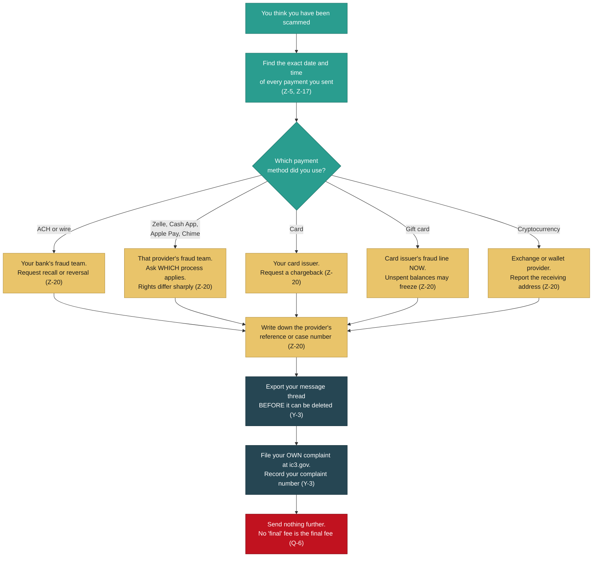

#### 3.2 Second: file at IC3 yourself

Go to **ic3.gov** and file your own complaint. Then write down the complaint number you receive.

**File it yourself. Do not rely on someone else filing on your behalf.** This matters more than it sounds like it should.

Third-party reports triage downward. A complaint filed by the actual victim receives a complaint number, and IC3 clusters related complaint numbers on its own side (Y-3). Three linked complaint numbers plus a documented infrastructure file is a materially different submission from one civilian report describing three people (Y-3).

Put plainly: your individual complaint is not a drop in an ocean. It is the thing that makes everyone else's complaint count for more. The clustering only works if the complaints exist.

This runs in parallel with section 3.1, not after it. Your own bank may recall the funds while IC3 works the receiving side (Z-16).

#### 3.3 Third: preserve everything, before it disappears

Do this today. Do it even if you are still hoping this is all a misunderstanding.

**Export your message thread.** If the conversation happened on Facebook or Messenger, use Meta's **Download Your Information** tool, scoped to that conversation (Y-3).

**Screenshots are acceptable. A timestamped export is not comparable** (Y-3). Take the screenshots too, by all means, and take them right now as a backstop. But the export carries structure and timing that a screenshot cannot.

**Here is why the urgency is real.** If the operator blocks you or deletes the conversation, the payment instructions in their own words are gone permanently (Y-3). Not recoverable. Not retrievable by asking nicely. Gone.

And this network is actively hardening its operational security (X-2). Storefronts are being replaced on a four-to-ten-week cycle (R-1). One shipper's website was already stripped down to a mail-only asset, which removes exactly the evidence a victim could have screenshotted while leaving the operator's ability to keep emailing you fully intact (R-3).

Also save, in whatever form you have them:

- Every email, including any invoice for shipping, crating, insurance or customs
- Any tracking number you were given, especially in the `PAW-########` format (T-3)
- The website addresses, even if the sites are already gone
- The WhatsApp number or numbers you spoke to (U-8)
- Screenshots of the listing and the puppy photograph you were shown
- Every payment confirmation, with dates and times (Z-5)
- The name on the receiving account, if you ever saw one. This is one of the highest-value details in the entire intake, and it is more searchable than any email address (Y-3)

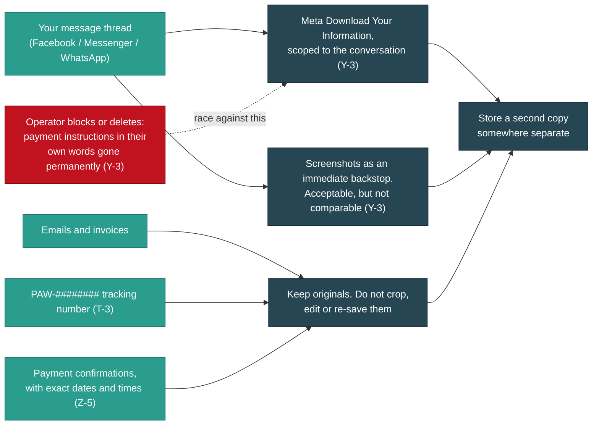

#### 3.4 Fourth: stop paying

If you are mid-scam and reading this, this is the section for you.

There is no final fee. The ladder is deposit, transport, crate, insurance, customs (Q-6), and every rung is presented as the last one. That framing is the product. It is what section 4 of this brief is about.

You will likely be told that the puppy is already in transit, that it is distressed, that it is in a holding facility, that the fee is refundable on delivery, or that walking away now loses everything you have already paid. Some of that will be delivered with real warmth, by someone who has had this exact conversation many times.

There is no puppy. The tracking page that shows you an aircraft moving across a map is running on the template vendor's demonstration database (T-3).

Stop paying. Go back to section 3.1.

---

### 4. The escalation pattern, and why it is designed this way

Understanding the shape of this helps, both for deciding what to do next and for forgiving yourself for how far it went.

The canonical ladder documented in this case: **deposit taken, then "transport", then "climate-controlled crate", then "shipping insurance"** (Q-6). Customs charges appear in some variants.

Three design features make it work.

**First, each fee is framed as the last one.** You are never told the total. You are told about one more obstacle, and one more payment that clears it. Each individual request is small compared to what you have already committed, which makes each individual "yes" feel rational. It is rational, at each step. That is the trick.

**Second, the sunk cost does the work.** By the time the crate fee arrives, you have paid a deposit and formed an attachment to a specific animal with a specific name and a specific face. Walking away does not feel like avoiding a loss. It feels like causing one.

**Third, the tracking theatre keeps you believing between payments.** This is the part that separates this operation from a crude scam. A working tracking database issues you a genuine record with a live map, a named coordinator and a "Payment Status: Paid" line (T-3). Between fee demands, you are not sitting in silence growing suspicious. You are watching a plane move.

**And the shipper is not an independent third party.** In this case the fake shipping company and the puppy storefront sat on the same server (Q-6). The "shipping company" arguing with you about crate fees is the same operation that sold you the puppy. Both ends of the ladder, one operator (Q-6).

The escalation is not opportunism. It is the design. The puppy sale is the entry point; the fee ladder is the business.

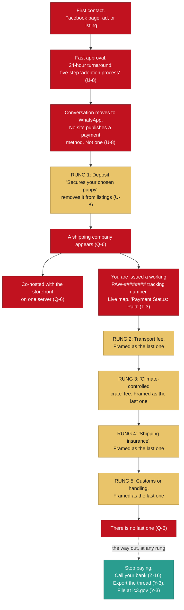

---

### 5. Walking through the IC3 form

The form at **ic3.gov** is not difficult, but it asks for things in an order that assumes you already know what matters. Here is what each part is really asking for, in plain language.

Two things before you start. **Gather your dates and amounts first**, because the form does not save well mid-flight and the transfer dates are the most important detail you have (Z-5, Z-17). And **the exact field names and layout may differ from what is written here**; treat this as a guide to what the form wants, not a screen-by-screen script.

#### Who you are

Your name, address, phone and email. Straightforward.

If you are filing about money your child or a family member sent, file as the victim's representative and say so plainly in the description. Do not file as though it happened to you if it did not; the record needs to be accurate.

#### What happened, and when

**The dates.** This is the field to get exactly right. Every payment, with its date and if possible its time (Z-5, Z-17). If there were four payments across three weeks, list all four.

**How you were first contacted.** A Facebook page, a group, an advertisement, a website, an email. Name the brand or page name if you remember it.

**Who contacted you.** The email address, the WhatsApp number, the page name, the display name of the person you spoke to.

#### The financial transaction section

This is where the form asks for transaction details and account identifiers (Z-20).

Give it, for each payment:

- The amount
- The date
- The payment method (ACH, wire, Zelle, Cash App, Apple Pay, Chime, card, gift card, cryptocurrency)
- Where the money went: the receiving name, handle, account identifier or address, if you have it

**On the receiving name.** If you saw a name attached to the account, include it. This is the highest-value single field in a victim intake, because a name on a receiving account is more searchable than any email address in the case (Y-3).

**On your provider's case number.** If you already called your bank per section 3.1 and have a reference number, include it. Be clear on what it is and is not: **IC3 requests transaction details and account identifiers, and does not list a provider case number as a required field. It is useful supporting detail, not a requirement** (Z-20). Do not delay your filing to chase one.

#### Describing the incident

This is a free-text box and it is where your filing either helps the clustering or does not.

Write it in order. What you saw, what you were told, what you paid, what happened next. Plain sentences.

**Include these specifics if they apply to you**, because they are what links your complaint to other people's:

- The tracking number, especially if it was in the `PAW-########` format (T-3)
- The name of the "shipping company"
- Whether an invoice arrived for a crate, for insurance, or for customs (Q-6)
- Whether any invoice came from a shipping or logistics domain, even one whose website no longer loads. One such domain in this case still has live mail records and a freshly renewed certificate, meaning it can still send you email while showing nothing on the web (R-3)
- Whether the conversation moved to WhatsApp, and the number (U-8)
- The website addresses, even if they are gone now (R-1, R-2)

**Say what you do not know.** If you are unsure whether a payment completed, write that you are unsure. Accuracy is worth more than completeness, and an analyst who catches one overstatement discounts everything around it.

#### Have you reported this elsewhere

Yes, if you have. Name your bank or payment provider and give the reference number from section 3.1. Name any local police report. Name the platform, if you reported the page to Facebook or TikTok.

#### Submit, then record your complaint number

**Write the complaint number down and keep it with your evidence** (Y-3).

If more than one person in your family was involved, or if you know other people hit by the same page, **each person files separately and each records their own number** (Y-3). That is what makes clustering possible on IC3's side. Do not consolidate into one filing to be tidy.

---

### 6. What this investigation has surfaced

You are not looking at one person with a fake profile. Here is what the record shows, without the jargon.

**The websites are bought kits, not builds.** One fake shipping site publishes its template vendor's demonstration login credentials in plain text on a public page, ships the word "(demo)" in its own footer in two languages, and serves the vendor's demonstration shipment record from a live tracking database (T-1). Underneath the pet branding it is a freight-forwarding template with the paint still wet: the page filenames are ocean freight, warehousing, customs clearance and cargo insurance, and the quote form asks for your company name and cargo type (T-2). One "pet carrier" image is byte-for-byte a photograph of a container truck (T-2).

**The puppy photographs are stolen from real breeders and rescues.** One storefront never even renamed the files, so the upload paths still carry the original source filenames and marketplace listing identifiers (U-3). Several real breeders and rescues appear in this material purely as **victims of image theft** (A5). They had no part in any of this. Most have not yet been notified, which is why this brief does not name them (Y-5).

**The reviews are invented, and reused.** The same fabricated identities recur across domains that present as unrelated companies, on different hosting stacks (Q-5, S-3, T-3, U-7). One site's 43 "Verified" reviews were produced in two visibly different batches (U-7). Two of the invented reviewers double as the customer and the recipient in the shipper's demonstration tracking record (T-3).

**The history is manufactured.** Blog posts and Terms of Service dated weeks or months before the domain was registered. Three separate instances (T-4, S-2). A claimed founding year contradicted by the registry (T-4). Named executives with no photographs (T-4).

**The company that claims Germany is not registered in Germany.** No Impressum, no company form, no register number, no VAT identification, no named responsible person, on a site asserting EU establishment and Frankfurt jurisdiction (T-5). That is a standalone violation that a German authority can act on without proving any fraud at all (T-5).

**The infrastructure is rebuilt faster than reports can be filed against it.** Storefronts replaced every four to ten weeks over five months. Three domains named earlier in the investigation are already deregistered (R-1, R-2). One shipping front was replaced by another six weeks later (S-1). During the four weeks this investigation ran, the network replaced one storefront and stood up a second shipping front.

**Two honest limits.** We have been careful to say what is not established, because a report that overstates one thing gets discounted on everything. Some things that looked like strong links between operations turned out not to be, and were downgraded after testing: a shared server address turned out to be a shared gateway with dozens of unrelated tenants (R-4, S-6), and phone numbers turned out to move between operations and carry stale third-party history (V-5). The linkages that survived every test are all at the content layer: the persona pools, the stolen-image provenance, the template artifacts (HANDOFF section 4b).

And on money: what is established is that operators sent bank account details and solicited a transfer from the **investigator**. It is **not** established that any victim's money ever reached that account, and the account that received victim funds remains unidentified (Z-12, Z-18). We are not going to tell you we know where your money went. We do not.

---

### 7. Protecting yourself, and other people

#### Reverse image search the puppy photograph

This is the single most effective check available to you, it is free, and it takes about a minute.

Save the photograph you were sent, or right-click it. Then run it through a reverse image search: Google Images, TinEye, Bing Visual Search or Yandex. Try more than one; they index differently.

What you are looking for is the same dog on a different website, under a different name, belonging to a different business, possibly in a different country. In this case the dogs in the photographs are real and belong to real breeders, some of them on the other side of the world from where the seller claimed to be (U-3, A5).

If the photograph appears on a stock photography site, that is equally conclusive in the other direction.

**A caveat, so you do not over-trust this.** At least one site in this network deliberately destroys the identifying information in its images before publishing them (U-6), and reverse search is not guaranteed to find a match. **A hit is proof. A miss is not clearance.**

#### Verify the breeder independently, not through anything they gave you

The rule is simple: **never verify a seller using a link, phone number or reference the seller gave you.**

- Search the kennel or business name plus the word "scam", and plus "reviews"
- Look them up in the relevant national or regional breed club or registry, found through your own search, not their link
- Ask for a live video call with the puppy, at a time you choose, with something specific held up beside it. A real breeder will find this normal. Note that a refusal is a red flag but a video is not proof; treat it as one signal among several
- Ask for the veterinary practice's name, then call that practice using the number you find yourself
- Check the domain's registration date yourself, with a "whois" search. A business claiming fifteen years of operation on a two-month-old domain has told you everything (T-4)
- Look for an address you can find on a map, and a phone number that is not only a WhatsApp handle (U-8)

#### Never pay by an irreversible rail

The payment method is not a detail. It is the whole game.

Anyone who *requires* a payment method with weak or no reversal rights, and who resists any method with dispute protection, has told you what they are. Reasonable sellers accept reasonable payment methods.

The rails with the weakest recovery position are gift cards, cryptocurrency, and person-to-person app transfers (Z-20). Card payments carry chargeback rights (Z-20). If a seller talks you off a card and onto an app, that is the signal.

And watch for the pattern from section 2.7: across every storefront in this case, no payment method was ever published on the site. Everything moved to WhatsApp (U-8).

#### What a legitimate transport company actually looks like

If someone genuinely needs to ship you an animal, here is the contrast.

| A real transporter | What this network does |
|---|---|
| Quotes the full cost once, in writing, before you commit | Escalates: deposit, transport, crate, insurance, customs, each framed as the last (Q-6) |
| You choose and engage them yourself | They appear in the conversation after you have already paid a deposit (Q-6) |
| Independent of the seller | Co-hosted with the storefront on the same server (Q-6). Shared hosting alone is weak evidence of common control (R-4) |
| Publishes a verifiable company registration, and an Impressum if it claims EU establishment | No Impressum, no register number, no named responsible person (T-5) |
| Verifiable accreditation you can check with the accrediting body | Ships a "(demo)" placeholder inside its own trust badge (S-2) |
| A traceable business history | Blog posts and Terms dated before the domain existed (T-4, S-2) |
| A working switchboard and a findable address | A WhatsApp number and a live chat widget (U-8, T-7) |
| Never asks for insurance money that goes to them rather than to an insurer | "Shipping insurance" as a rung on the ladder (Q-6) |

One more thing worth saying plainly: **a real transporter does not hold an animal hostage against a fee.** If the emotional pressure is the product, it is not a transport company.

---

### 8. Three kinds of victim, and one of them does not know it yet

This is here because you may be in the second or third group and have no idea you are connected to any of this.

**Puppy buyers.** The group this brief is mostly written for. Solicited through Facebook pages, groups and advertisements, moved to WhatsApp, taken up the fee ladder (U-8, Q-6).

**Job applicants.** The fake shipping company runs a careers page. It advertises four positions and carries a live upload form that collects your full name, email, phone, a resume file and a cover letter (T-6).

Think about what is in a resume: your home address, your employment history, your education, often your date of birth. This is a document and personal-data harvesting channel aimed at job seekers, and it is **entirely separate from the pet-buyer victims** (T-6). If you applied for a remote pet-transport coordinator or customer-support role at a company matching this description, you did not lose a deposit, but you handed over a dossier on yourself.

The "Customer Support Representative, Remote" listing also fits the standard money-mule recruitment pattern and should be assessed that way (T-6). If you were hired into a remote role that involved receiving payments and forwarding them on, please read that sentence twice, and get advice.

**Peptide purchasers.** A phone number published on one of the puppy storefronts is also published as the WhatsApp contact on two TikTok accounts selling peptides (V-1). Both live accounts share the same signature: heavy follow-spam ratios, almost no engagement, and a "DM for catalogue" bio whose only call to action is an off-platform WhatsApp handoff (V-1). A third account in the set has already been removed, and one of the survivors opens with "This is our first official account", which is what a respawned account says after a ban (V-1).

If you bought peptides through a WhatsApp catalogue after finding it on TikTok, you may be dealing with people who also run the puppy operation. **An honest caveat:** phone numbers move between operations and carry stale history, so a shared number means one WhatsApp identity, not necessarily one business (V-5). It is a lead worth knowing about, not a proof of identity.

There is also a separate European surface. One of the shipping sites opens with a German language interstitial and offers EU-specific services, so the victims of that front are not all in the United States (S-4).

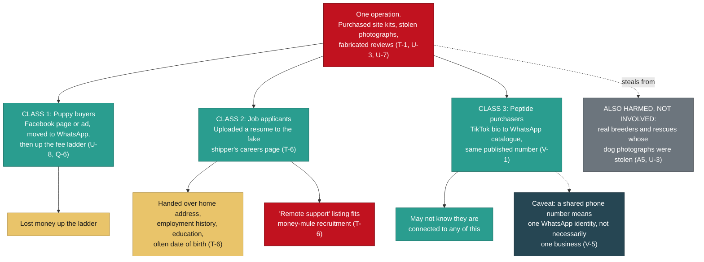

**One more group, named here only so it is clear where they stand.** Real breeders and rescues whose dogs' photographs were stolen are victims in this too, not participants (A5). Several have not yet been notified that their images are being used this way, which is why this brief does not name them (Y-5). If you recognise your own dogs in a listing like this: whoever took the photograph normally holds its copyright, which is often you but not always, and it is the rights holder who can file a takedown or authorize someone to file on their behalf. Reaching the families in your photographs is the part only you can do.

---

### 9. You are not alone, and it is not your fault

Three people came forward in this case (Y-1). They are not three people who fell for something obvious. They are three people who were shown a professionally produced business, with a working tracking system, a real photograph of a real dog, and an approval message written in warm and competent English.

Everything in section 6 is what it took to see through it: registry lookups, file hashing, source-code inspection, a full-text search for German corporate disclosure terms, and cross-referencing invented reviewer names across multiple domains and hosting providers. Weeks of it. That is not a fair fight, and you were never given the tools to have it.

The operation is designed so that each individual decision you made was reasonable. The deposit was reasonable against the price. The transport fee was reasonable against the deposit. The crate was reasonable against everything already committed. Each rung is rational, which is exactly why the ladder works (Q-6).

There is also a specific cruelty in this one that deserves saying out loud. Most fraud takes your money. This takes your money while you are picturing a specific animal in your home, and it uses that picture against you. If you feel a grief that seems out of proportion to the amount involved, it is not out of proportion. You were sold a family member, and the loss you are feeling is the loss they engineered.

So, if nothing else lands, take these:

- **You did not fail an intelligence test.** You encountered a professionally built deception (T-1, U-3, U-7).
- **Your report is not a drop in an ocean.** Complaints filed by victims get clustered. Yours makes the next person's count for more (Y-3).
- **Speed matters more than certainty.** Call your bank before you are sure (Z-16). Export the thread before you decide what to do with it (Y-3).
- **Save everything now.** These operators delete, block and rebuild, and once the payment instructions in their own words are gone, they are gone (Y-3, X-2, R-3).
- **Whatever you do next, stop paying.** There is no final fee (Q-6).

If you are still mid-conversation with them and part of you is hoping this brief is wrong: that hope is the mechanism. Go to section 3.1, and make the call.

---

*This is a public brief. It is derived from a private evidence record, and every load-bearing claim about the network carries a reference to that record. Names of complainants, of individuals whose status is undetermined, and of image-theft victims who have not yet been notified are withheld under the redaction contract that governs this corpus.*


---


# For Law Enforcement


For the detective, IC3 analyst, or federal agent deciding in ninety seconds whether this file is worth opening: it is, because a US chartered bank holds the account the operators asked us to wire money to.


- [`../REDACTION_CONTRACT.md`](REDACTION_CONTRACT.md), binding on this document
- [`BRIEF-02-victims.md`](#if-you-have-been-targeted), the same case for the people it happened to
- [`BRIEF-03-technical-analysts.md`](#for-technical-analysts)
- [`BRIEF-04-intelligence.md`](#analytic-assessment)
- [`BRIEF-05-media-public.md`](#why-this-matters)
- [`BRIEF-06-how-to-help.md`](#how-to-help)

This brief carries no analysis or opinion marker because it asserts only what the
record establishes. Per the redaction contract, `BRIEF-04` and `BRIEF-05` do.

---

### 1. The jurisdictional hook, first, because it is why you are still reading

On 2026-08-25 the operators of this fraud network sent bank account details over
Facebook Messenger and asked for a wire transfer. The account sits at a
**United States chartered institution** (Z-1):

| Field | Value | Status |
|---|---|---|
| Bank | **Lead Bank** | Institution identified (Z-1) |
| Bank address | 1801 Main St., Kansas City, MO 64108 | Matches the address given to the recipient exactly (Z-2) |
| Routing number | **101019644** | **VERIFIED** against the routing directory (Z-2, Z-24) |
| Account number | Withheld from this document | Suspect-side detail, law enforcement and the bank only (Z-1, Z-26) |
| Account holder | Withheld from this document | **UNDETERMINED**, not named as a suspect (Z-4) |

That single fact is the difference between a case you can work and a case you
cannot. Most fraud of this shape terminates in a referral to a jurisdiction
nobody at your desk can reach, and the file dies in triage. This one has a
domestic nexus: a chartered US bank carrying a BSA/AML obligation, a routing
number that resolves against the routing directory, and a Kansas City street
address that matches (Z-2, Z-3). **Lead Bank can be served. Lead Bank can freeze.
Lead Bank can file a SAR, and can tell you which of its programs holds the
account** (Z-3, Z-5). None of that requires you to reach Cameroon, Bangladesh, or
Hamburg, all of which this case also touches (Q-1, B-15, A3h).

**What we are not saying.** It is **not established** that any victim ever sent
money to that account (Z-12, Z-18). It was solicited **from the investigator**,
which is a different evidentiary object from a completed victim payment. Read
section 3 before you write anything down.

**HYPOTHESIS, labelled as such.** A Thai holder address paired with a Kansas City
routing number is not a branch relationship, and Lead Bank is one of the larger
banking-as-a-service sponsors in the United States, so the account is more likely
a sponsored fintech program, which would mean remote onboarding and a partner
holding the KYC file. **No KYC or program record supports that yet** (Z-3, Z-13).
The BSA/AML point stands either way: Lead Bank is the chartered institution and
the correct recipient of a report regardless of who holds the front end (Z-13).

---

### 2. Who, what, when, where, why

**Who.** A multi-brand pet-sales fraud network running across Facebook, TikTok,
WhatsApp, and at least five websites. The operator layer geolocates to **Limbe,
Southwest Region, Cameroon** on account-registration artifacts across four
independent platforms (Q-1, Q-8). A separate page-farm layer is
platform-attested to **Dhaka, Bangladesh** (B-15). A payment leg runs through a
**Shopify checkout on a German domain** behind a registered Hamburg entity
(A3g, A3h). Three complainants have come forward, referred to here as
**Complainant A, Complainant B and Complainant C** (Y-1).

**What.** Deposits taken for puppies that do not exist, then escalation into
transport, crate, and insurance fees through fake shipping companies that are
co-hosted on the same server (Q-6, T-1). Co-hosting alone does not establish common control; that shared IP carries 48 or more unrelated tenants, and the linkage rests on persona reuse at Q-5, not on the address (R-4, S-6). Two additional victim classes
exist beyond puppy buyers: job applicants who uploaded resumes to a fake
shipper's careers page, and purchasers in an unrelated peptide vertical run from
a phone number this network also publishes (T-6, V-1).

**When.** Storefront domains registered April through August 2026 and replaced
every four to ten weeks; three domains named in this file were already
deregistered within a day of capture (R-1, R-2). The newest storefront was six
days old when captured (R-1). The wire solicitation landed 2026-08-25 (Z-7).

**Where.** Victims in the United States and, on a separate German-language
surface, in Europe (S-4). Infrastructure at Hostinger, Vercel, Shopify, and
Realtime Register (R-1, Q-5, A3g).

**Why it is actionable now.** The network replaced one storefront and stood up a
second shipping front during the four weeks this investigation ran, so the
infrastructure is being rebuilt faster than reports can be filed against it
(HANDOFF section 7). And the money leg now terminates at a US bank.

---

### 3. What is established, and what is not

**This section governs every other sentence in this brief.** Z-18 is the
controlling note in the underlying record, and it exists because an earlier draft
of the evidence log overstated exactly this point.

> **ESTABLISHED:** on 2026-08-25 the operators sent bank account details to the
> **investigator** and solicited a wire transfer. The bank and routing number
> verify against the routing directory.
>
> **NOT ESTABLISHED:** that any victim ever sent money to that account; that the
> account received victim funds; that the named holder knowingly participated in
> anything. **The account that received victim money remains unidentified.**

Stated as a table, because this is the part that gets copied wrong (Z-24):

| Claim | Status |
|---|---|
| Routing 101019644 is Lead Bank, Kansas City MO | **VERIFIED** against the routing directory |
| The account number exists and is controlled by the named holder | **UNVERIFIED.** Requires the institution |
| The named holder knowingly participated | **UNDETERMINED** (Z-4) |
| Any victim paid this account | **NOT ESTABLISHED** (Z-12, Z-18) |

**Why the holder is not named.** Three readings fit the evidence equally well
(Z-4): a recruited money mule, an identity-theft victim, or an operator. Mules in
fraud of this shape are commonly recruited through fake remote-job offers, and
this case already documents a fake careers page at the shipper surface, which is
exactly that recruitment channel (Z-4, T-6). Every identity this network has
displayed so far has been stolen or fabricated (G, M-1, W-3), so a real name on a
remotely-onboarded account is not evidence of consent to its use. Subscriber
records and payment-rail process resolve this; nothing in open source will (Z-4).

**One further firewall.** The Facebook page that sent the solicitation displays a
**stolen photograph** as its profile image. The person depicted is, on the
existing record, an image-theft victim of this network and not a participant in
it, never contacted and never consenting (Z-9). Their likeness appearing on a
payment solicitation makes that distinction more important, not less.

**Provisional findings, labelled.** The solicitation screenshot is filed and
hashed (Z-29). The Meta "Download Your Information" export is not yet in hand.
Until it is, the conclusions in section 5 about operational tempo remain
**PROVISIONAL** (Z-14, Z-29). A screenshot is a rendering produced by the
investigator; it carries no message ID and no server-side timestamp, so it
corroborates the report but does not corroborate itself (Z-29).

#### What this brief does not claim

Stated in its own section so a validator does not have to hunt for the edges.

| We do not claim | Why |
|---|---|
| That any victim paid the account in section 1 | Not established. The account was solicited from the investigator (Z-12, Z-18) |
| Any aggregate dollar-loss figure | The corpus does not support one. Scale is argued from productization and deployment count instead (Z-18) |
| That the named account holder did anything | UNDETERMINED, and three readings fit equally (Z-4) |
| That the page's operational role and the twelve-day cycle time are settled | **PROVISIONAL** until the Meta export lands (Z-8, Z-9, Z-14, Z-29) |
| A total count of domains or countries | The investigation has no attested count of its own, and no figure is asserted here |
| That shared infrastructure links these operators | Tested and downgraded. See section 7 (R-4, S-6) |
| Any identification of a person from an image | Forbidden under standing rules. Identification comes from subscriber records and payment rails (HANDOFF section 2b) |

---

### 4. The governing model: a supply chain, not a suspect

**Do not look for "the guy." Look for the chokepoints** (HANDOFF section 1).

The evidence describes a market of rented services rather than a single
organization: separate vendors sell separate components, and whoever runs a given
storefront assembles them. This is not an inference drawn to sound sophisticated,
it is visible in the shipped artifacts (W-6). The hardest single proof is that
`safepup-delivery.com` publishes its **template vendor's demonstration
credentials** in plain text on a public admin page, ships `(demo)` in the footer
of every page in English and German, and serves the vendor's demo shipment record
from a live tracking database (T-1). That is not an operator who built a site.
That is an operator who bought a product and deployed it unmodified.

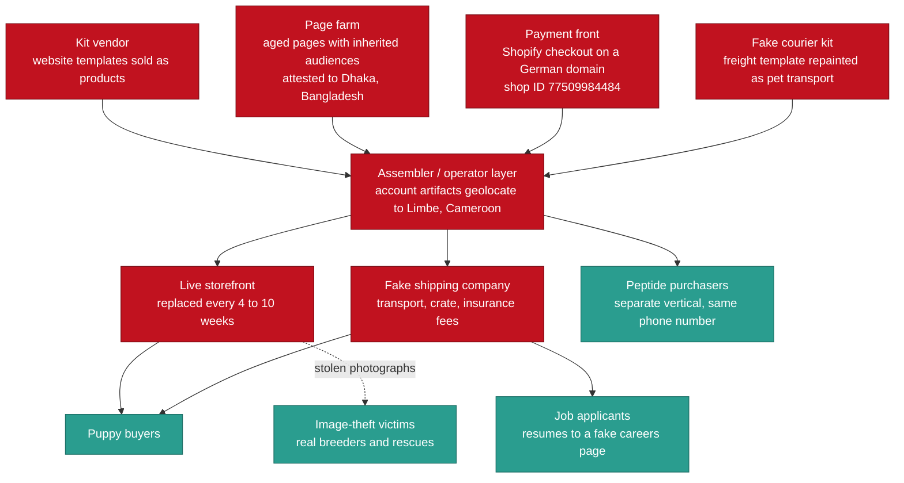

**Why this matters operationally.** Taking down one storefront removes an
instance, not the supply (N-1). The durable targets are the shared components:
the Shopify shop ID that can enumerate sibling stores (A3g), the page-farm
inventory (B-15), and the template vendor whose published demo string can be
searched across every vertical it was ever sold into (HANDOFF section 5, item 9).
**The general principle worth carrying into any charging decision:** this case's
durable linkages are at the **content layer**, meaning persona pools,
stolen-image provenance, and template artifacts. **Infrastructure linkages have
failed every test** (HANDOFF section 4b). Section 7 lists the failures.

---

### 5. The solicitation: a recycled page, twelve days from identity to money ask

The page that solicited the wire was **already in this file** before it ever
asked for money. It was documented on 2026-08-24 as an example of automated page
churn, with one follower and a rename history captured from Facebook's own Page
Transparency panel (N-1). The next day it solicited a wire transfer (Z-7).

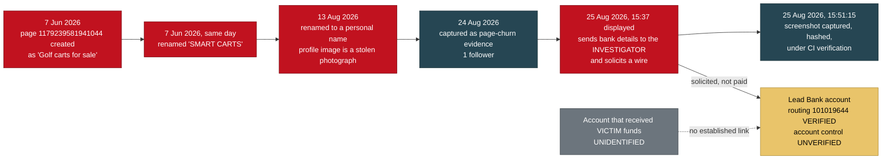

**Twelve days from identity assignment to payment solicitation.** The page was
renamed on 13 August and solicited a wire on 25 August (N-1, Z-7, Z-8). That is a
concrete cycle time for this network, testable against the other recycled pages
in the file, and **it is PROVISIONAL** because it is computed from a solicitation
date that currently rests on a screenshot rather than on Meta's own record
(Z-14, Z-29).

**Three things this changes** (Z-8). First, the page pool is not dormant
inventory, it is the delivery mechanism: removing one page removes an instance
and not the supply (N-1), and this shows what an instance does once activated.
Second, operational tempo becomes measurable and testable against the rest of the
pool. Third, the Facebook layer and the money layer now connect through a single
artifact, where before the file had a persona layer, a website layer, a shipper
layer, and no financial trail.

**On the timestamps, and this matters for your timeline.** The filename and
filesystem mtime record **15:51:15** as the capture time, which is directly
evidenced. The **15:37** value is what Messenger displayed inside the rendering,
which is a picture of a clock and authoritative for nothing on its own (Z-29).
There is also an unresolved one-hour ambiguity: in August, US Eastern observes
daylight time, so 15:37 EDT is 19:37 UTC, while a genuine EST reading would be
20:37 UTC (Z-10). The Meta export resolves it; a screenshot cannot resolve its own
timezone (Z-29). That precision is not pedantry, because the file documents an
operator activity window of 22:00 to 03:00 UTC with 91 percent clustering on one
storefront and a completely different window on another, which is one of the few
findings bearing on how many people are involved (U-5).

---

### 6. The eight findings that survived every test

These are content-layer, already captured, hashed, and the operators cannot
retract them (HANDOFF section 4).

1. **A fake courier publishes its template vendor's demo credentials.**
   `safepup-delivery.com/admin/login.php` prints `admin / Admin@12345` in plain
   text beneath the login form, ships `(demo)` in every page footer in English
   and German, and serves the vendor's demo shipment record from a live tracking
   database. **No login was attempted and none should be**; the evidentiary value
   is entirely that the string is published, preserved in the captured file
   (T-1).

2. **A storefront never renamed the photographs it stole.** Upload paths on
   `usapetsforhome.com` retain source filenames verbatim, including a third-party
   marketplace's brand string and its `breed-listingID-imageNumber` convention.
   The filenames prove the images came from a listing site and were not
   photographed by the seller; **which** marketplace is not asserted until
   confirmed (U-3).

3. **Millisecond upload timestamps give a minute-resolution build log.** The
   13-digit suffix on each upload decodes to a Unix millisecond timestamp. Eleven
   of twelve images were uploaded in a continuous 93-minute session **finishing
   34 minutes before the domain was registered** (U-4), at a steady 3-to-16
   minute cadence. Whether that cadence reflects a person collecting listings by
   hand rather than a script pacing its uploads is **HYPOTHESIS**: the timestamps
   establish timing and cadence, not who or what produced them.

4. **82 timestamped uploads on a second storefront give a pattern of life.**
   91 percent fall in a 22:00 to 03:00 UTC window, **incompatible with the first
   storefront's window** (U-5). This is a behavioral indicator, not a
   geolocation: upload timestamps reflect the server clock, and an operator
   targeting US buyers may deliberately work US hours (U-5).

5. **A shared persona pool links three domains across two hosting stacks.** The
   fabricated testimonial name "Priya" appears four times across three domains,
   alongside "James" and "Sarah M." On two sites they are bound as one couple
   with different assigned cities; on a third they are split into two individuals
   with new surnames (Q-5, S-3, T-3, U-7). **This linkage never depended on
   hosting**, which is why it survived when the infrastructure linkages did not.

6. **Backdating, three separate instances.** Blog posts and Terms of Service
   dated weeks before the domain existed (T-4).

7. **No Impressum on a site claiming German establishment, German governing law,
   and Frankfurt jurisdiction.** A standalone violation of German law requiring
   no proof of fraud whatsoever, reportable on its own (T-5).

8. **A hard registry timeline.** Continuous storefront replacement every four to
   ten weeks across five months, registry-attested via RDAP, with three domains
   already deregistered (R-1, R-2). One domain named in the corpus on 8/23 was
   unregistered by 8/24, so **anything still resolving must be archived on sight,
   not scheduled** (R-2).

---

### 7. The five claims that were tested and downgraded

A file that only ever grows in one direction is a file nobody should trust
(HANDOFF section 2d). These were promising, they failed, and they stay in the
record so that nobody rebuilds the case on them (HANDOFF section 4b).

1. **Shared IP does not prove common control.** The address that appeared to bind
   three domains is a shared Hostinger FTP gateway with 48-plus tenants. Three
   domains web-serve from it, which is a narrower claim and is how it should be
   stated (R-4, S-6). Co-tenants surfaced by reverse IP are innocent bystanders,
   excluded from every network claim (S-6). One business initially flagged on
   this basis was **cleared outright**; publishing the co-tenancy would defame a
   working company (S-7).

2. **Phone numbers are not clean operator identifiers.** One number runs an
   unrelated peptide vertical on TikTok. Another returns a probably-uninvolved
   private individual, never contacted and treated as a third party, not a
   suspect (V-5, V-4).

3. **A square 2048x2048 image is not by itself an AI indicator.** A
   confirmed-real photograph in the corpus has exactly those dimensions, so the
   indicator is corroborative only (W-3).

4. **Error Level Analysis is corroborative, not probative** (M-2). An earlier
   draft overweighted it as an AI-generation signal and that was corrected.

5. **The camera serial route does not exist.** The camera model that produced the
   only file with intact EXIF writes no body serial number, so the identification
   path that appeared open is a dead end (W-5).

Two further negative results worth your time: a perceptual-hash sweep across the
full corpus returned **zero image reuse** between clusters (K-4), and a
separately flagged business was cleared as a website-appropriation **victim**
(A5c).

**None of the eight findings in section 6 depends on any of these five.**

---

### 8. Where each authority has a hook

Nothing in this case requires one agency to carry all of it. Several of these
hooks stand entirely on their own, without proving fraud at all.

```mermaid
flowchart TD
    caseFile["Wiener-Gate evidence corpus<br/>305 version-controlled files"]

    ic3["FBI IC3<br/>Recovery Asset Team,<br/>Financial Fraud Kill Chain"]
    leadBankAuth["Lead Bank<br/>BSA/AML, SAR, freeze,<br/>identifies the sponsoring program"]
    originBank["Each complainant's own bank<br/>or payment provider<br/>recall and reversal"]
    ftc["FTC<br/>pattern, scope, consumer harm"]
    fda["FDA<br/>the peptide vertical,<br/>stands independent of the pet fraud"]
    meta["Meta<br/>page, profile and group IDs<br/>plus preservation"]
    tiktok["TikTok<br/>two handles,<br/>ban-evasion language"]
    shopify["Shopify Trust and Safety<br/>shop ID 77509984484<br/>enumerates sibling stores"]
    hostinger["Hostinger<br/>registrar and host<br/>for one whole cluster"]
    germanAuth["German authorities<br/>missing Impressum,<br/>false EU establishment claim"]

    caseFile --> ic3 & leadBankAuth & originBank
    caseFile --> ftc & fda & meta & tiktok
    caseFile --> shopify & hostinger & germanAuth

    classDef evidenceArt fill:#264653,stroke:#152d33,color:#ffffff
    classDef moneyFlow fill:#e9c46a,stroke:#b08f3c,color:#000000
    classDef scamInfra fill:#c1121f,stroke:#7a0c14,color:#ffffff
    class caseFile evidenceArt
    class ic3,leadBankAuth,originBank moneyFlow
    class ftc,fda,meta,tiktok,shopify,hostinger,germanAuth scamInfra
```

The escalation mechanism is where the repeat losses come from. A deposit is
taken, then transport, crate, or insurance fees are demanded, and the victim is
referred to a shipping company that is **the same hosting provider on the same server**.
Both ends of that ladder were found on one IP address (Q-6).

The ladder runs: contact via a recycled page or template storefront, deposit
taken, referral to the "shipping company", then transport, climate-controlled
crate, and shipping insurance fees in sequence. A `PAW-########` tracking number
arriving in a complainant's inbox proves the **shipper stage**, not merely the
sale, and is a specific intake question worth asking every victim you interview
(T-3, Y-3). The tracking system works, which is the point: it returns the
vendor's demo shipment record from a live database (T-1, T-3).

---

### 9. Evidence integrity: why you can rely on this file

This corpus was built to be attacked. Every claim above traces to a captured
artifact with a recorded hash.

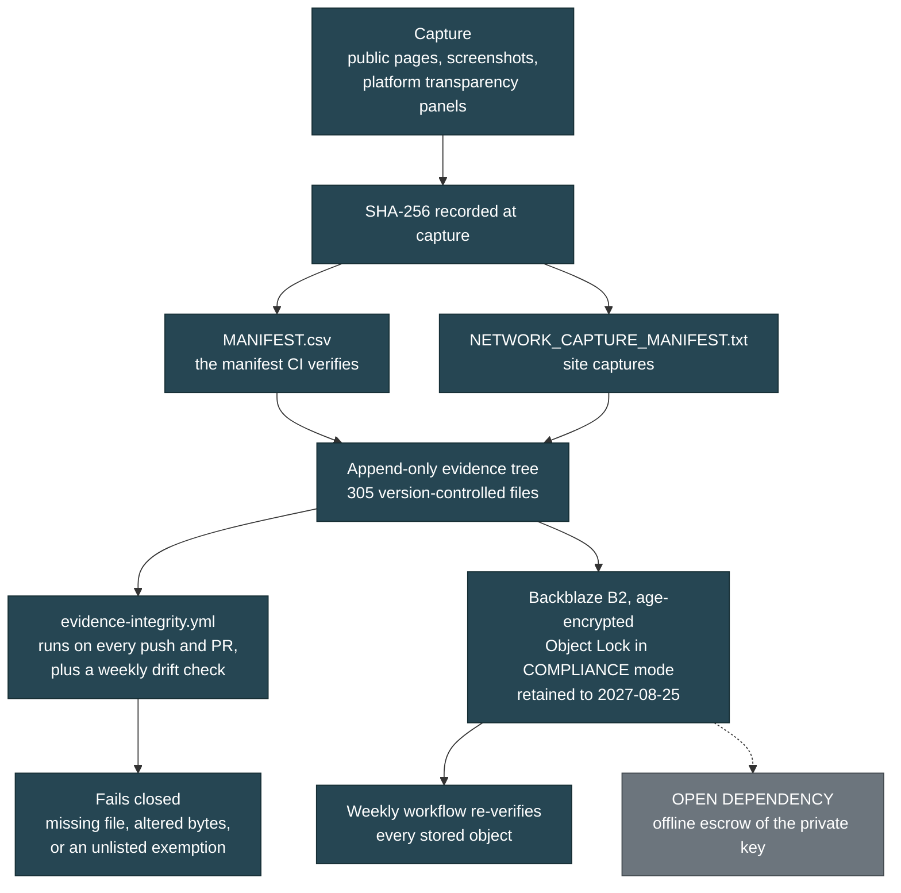

**The specifics.**

- **305 files** are under version control in the evidence tree. `MANIFEST.csv`
  carries the SHA-256 and byte count for the collected corpus; site captures are
  hashed separately in `NETWORK_CAPTURE_MANIFEST.txt`.
- **The tree is append-only.** Captured artifacts, site captures, images, session
  logs, and message exports are never edited and never renamed. When a filename
  arrived untidy it was kept as it arrived, because renaming it to look neater is
  the kind of silent alteration the rule exists to prevent (Z-29).
- **CI verifies the manifest on every push** and on every pull request touching
  the evidence tree, plus a weekly scheduled drift check. It fails closed. A
  manifest entry with no file on disk is an integrity failure unless it appears
  in a hardcoded allowlist, and that allowlist is deliberately not derived from
  the ignore rules, since deriving it would let a change authorize its own
  exemption.
- **The most recent full verification run** reported 141 files verified exact,
  1 expected-absent, 0 missing, 0 mismatched, replicated locally before commit
  (Z-27). Two source artifacts previously hashed only in a point-in-time snapshot
  were brought under continuous verification then (Z-27), and the solicitation
  screenshot followed (Z-29).
- **Off-site duplication is done.** The full corpus plus three large originals
  that exceed practical repository size live in Backblaze B2, age-encrypted,
  under **Object Lock in COMPLIANCE mode retained until 2027-08-25**. Compliance
  mode cannot be bypassed by any credential, including the account owner and the
  provider's own support. The upload key deliberately lacks delete, bypass, and
  retention-write capabilities; a delete attempt against the stored archive
  returns 401 unauthorized. A scheduled workflow re-verifies every stored object
  weekly (HANDOFF AMENDMENT 1 A3 item 19).
- **The honest weakness.** The archive's private key currently exists in two
  online locations controlled by one person. Offline escrow is an open dependency
  and is recorded as one (HANDOFF AMENDMENT 1 A3 item 19).
- **One integrity nuance, stated plainly.** Two large session logs were hashed at
  one moment and kept appending afterward, so their whole-file hashes no longer
  match the values recorded earlier. Those hashes still match the files' byte
  prefixes exactly, verified at archive time: the growth is pure append and
  nothing was modified in place (HANDOFF section 8).

---

### 10. Contamination controls, and one disclosure we would rather make than have you find

**Standing procedure since 8/24** (HANDOFF section 2c): no form population, no
cart creation, no checkout interaction, no login attempt, and no message sending
against any surface in this case. Retrieval is limited to reading publicly served
pages. The published demo credentials at `safepup-delivery.com` **were not used
and must not be**; accessing that panel would be unauthorized access regardless
of how the credentials were obtained (T-1). Every contact with an operation
surface is logged, dated, and classified, and the classification set separates
what the investigation sent **to** the operation from what the operation sent
**to** the investigator. Those are opposite things evidentially: the first is
investigator conduct a defence can attack, the second is operator conduct that
supports the case (INTERACTION_LOG Amendment 2.1).

**The disclosure.** One interaction cannot be cleanly classified, and rather than
leave a self-contradiction in the record it is classified conservatively and
stated openly (HANDOFF AMENDMENT 1 A4):

> The `banbestmk.click` checkout interaction of approximately 8/24 is classified
> **ACTIVE-OUT**. A form was populated with placeholder identity data and a cart
> API was contacted. **Whether this was performed manually by the investigator,
> by browser autofill, or by an automation tool was not recorded and is not
> recoverable.** No payment instrument was entered and no order was placed. The
> conservative classification is used because the evidence does not support the
> narrower one.

The canonical class token is `ACTIVE-OUT`; an earlier descriptive phrase,
"ACTIVE SUBMISSION", is prose and not a class (Z-25). This wording should travel
with any filing that relies on the checkout material, because it is materially
better to disclose an unrecorded mechanism than to have opposing counsel discover
the contradiction unaided (HANDOFF AMENDMENT 1 A4).

**Six of nine interaction-log entries are marked UNRESOLVED.** That is an
uncomfortable number and it is the honest one, reflecting that the log was
reconstructed after the fact rather than kept contemporaneously (INTERACTION_LOG
Amendment 3.1). The governing rule: an unresolved fact must be **reviewed**
before filing, never necessarily **completed**. Where it is recoverable, record
it; where it is not, the honest answer is final and ships as-is, because guessing
to close a field damages the record (INTERACTION_LOG Amendment 3.4).

**One further disclosure, recorded because it belongs on the record.** A payment
to the solicited account was **contemplated and not made**. The investigator
considered remitting funds to create a traceable transaction and did not do it,
logged so that any later reader finding the account details in the private file
can establish that no investigator funds entered that account (INTERACTION_LOG
Amendment 1).

---

### 11. Required disclosure: the investigator is not a neutral third party

**The compiler of this file is personally acquainted with one of the named
complainants, who forwarded the initial material. Which complainant is not
stated here and is not derivable from anything published in this corpus. All
infrastructure findings are independently verifiable from the captures and
hashes provided (Y-2).**

This is stated early and plainly because concealing it would be the problem, not
the relationship itself. Fraud referrals routinely originate from someone
connected to a victim, and an analyst who discovers an undisclosed relationship
discounts everything around it (Y-2). It also explains why a forensic file of
this size exists over a puppy deposit, which is otherwise the first question an
analyst asks (Y-2). The mapping between Complainant A, B, and C and their real
identities is held only in the private law-enforcement package, and no public
document in this corpus attaches the forwarding to a letter (REDACTION_CONTRACT
sections 3 and 3a).

**On the complainants generally.** All three consented to public attribution
(Y-6), and version 1 of this public corpus does not use their names anyway. The
reasoning is recorded: consent given in the first flush of anger about losing
money is real, but it is given without much sense of what it feels like to be a
searchable result attached to "puppy scam victim" for years. Pseudonymity is
reversible on their say-so; publication is not (Y-6, REDACTION_CONTRACT section
3). Whether two of the three represent one household or two separate loss events
is an open intake question, and it changes the count (Y-1). The referral package
that goes to IC3 and to the platforms is **unredacted**; consent was never the
constraint there (Y-6b).

---

### 12. What we are asking you to do, ranked, time-critical first

#### Tier 1: clocks are already running

1. **Get the transfer dates from each complainant.** This is the single most
   urgent missing field in the entire case (Z-5, Z-6, Z-17). It determines
   whether the FBI Recovery Asset Team can attempt a freeze through the Financial
   Fraud Kill Chain, which is strongly time-dependent and works best within
   roughly 72 hours of the transfer (Z-5). Without dates this is purely
   evidentiary. The Recovery Asset Team pathway applies to qualifying domestic
   transfers and wire recalls and is **not** a universal remedy across app-based
   rails (Z-20).

2. **Tell each complainant to contact their own bank or payment provider now,
   ahead of everything else.** This is the fastest lever a victim personally
   controls, it runs on the sending institution's clock rather than on IC3's, and
   the sending institution acts on its own customer's instruction without needing
   legal process (Z-16). It is rail-specific (Z-20):

   | Rail | First action by the victim |
   |---|---|
   | ACH or wire | Originating bank fraud team, request recall or reversal |
   | Zelle, Cash App, Apple Pay, Chime | The provider's fraud team; ask **which** recovery process applies, as dispute rights differ sharply and several are not reversible |
   | Card | Issuer chargeback |
   | Gift card | The card issuer's fraud line immediately; some balances can be frozen if unspent |
   | Cryptocurrency | The exchange or wallet provider; report the receiving address |

   In every case, ask which process applies and **record the provider's reference
   or case number**. It is useful supporting detail, not an IC3 requirement
   (Z-20).

3. **Serve or contact Lead Bank.** As the chartered institution it can freeze,
   can file a SAR, and can identify which of its programs holds the account
   (Z-5). Ask one narrow, answerable question alongside the report: **which
   fintech program sponsored this account?** That identifies the platform that
   onboarded the holder and holds the KYC documents (Z-5). A civilian report to
   the bank requires no standing; a subscriber-record request requires you.

4. **Meta preservation, which requires law enforcement process.** Privacy
   settings do not delete underlying records (HANDOFF section 5, item 6).
   Preservation is requested on page **1179239581941044** (the soliciting page,
   N-1, Z-7), profile **100022087874969**, and the suspected successor account
   (HANDOFF section 5, items 4 and 6). The network is **actively hardening**:
   friend and group lists were locked down during this investigation, and the
   solicitation gives the operators a fresh reason to clean up (X-2, Z-11).
   **TikTok preservation** likewise requires your process, on handles
   `@meyouqpbokz` and `@herman.walker90`; a third account in the same set has
   already been removed (HANDOFF section 5, item 5).

5. **The Meta "Download Your Information" export of the solicitation thread.** It
   is materially stronger than the screenshot because it carries Meta's own
   timestamps and message IDs rather than a rendering of them (Z-15). Until it
   lands, the operational-tempo findings in section 5 remain PROVISIONAL (Z-14,
   Z-29). Each complainant should likewise export their own thread today; if the
   operator blocks or deletes, the payment instructions in the operator's own
   words are gone permanently (Y-3).

#### Tier 2: high yield, no clock but no reason to wait

6. **Shopify.** Report shop ID **77509984484** with the storefront-to-checkout
   redirect as evidence. Payment processors retain historical merchant-to-domain
   mappings, so this can potentially enumerate **every storefront funnelling into
   that account** (A3g). One terminology note your analysts will want: a Shopify
   shop ID is not a Merchant ID. It identifies the store account receiving funds,
   where a MID would identify the acquiring relationship, and only the shop ID
   has been recovered (A3g).

7. **Each complainant files their own IC3 complaint and records the number.**
   Third-party reports triage down. Victim-filed complaints receive a number and
   IC3 clusters related numbers on its own side. **Three linked complaint numbers
   plus this file is a materially different submission from one civilian report
   about three people** (Y-3).

8. **Obtain the live-chat provider's written retention statement.** Property
   `6a68d4d16e813a1d4d6629ee` was reported and the account preserved and
   terminated. Termination ends the live channel; **what was retained from before
   termination is unknown** and must be established in writing. Ask what data was
   preserved, covering what date range, under what retention policy, and for how
   long it will be held (HANDOFF AMENDMENT 1 A3 item 10, AMENDMENT 2 B1). Victim
   chat transcripts would be in it.

9. **Hostinger abuse**, one registrar and host covering an entire cluster of
   these domains, a single desk with unusual reach (HANDOFF section 7, R-1).
   **German authorities**, on the missing Impressum and the false
   EU-establishment claim, a standalone violation requiring no proof of fraud,
   plus a separate German-language victim surface (T-5, S-4). **FDA**, on the
   peptide vertical, independent of the pet fraud (HANDOFF section 7, V-3).

#### Tier 3: what would strengthen the file most

10. **Which victim sent money to which account.** If a complainant's records show
    payment to the solicited account, that is materially stronger than either
    fact alone, because it links the solicitation channel to completed money
    movement (Z-12). If they show payment elsewhere, that is also a finding: a
    second receiving account would establish a **mule network** rather than a
    single receiver (Z-6).

11. **The operator's own message directing a victim to an account.** The account
    details alone show where funds went; the operator's instruction is what ties
    the account to the fraud (Z-6). Preserve that message before anything else.

12. **A file-hash comparison** between the profile image now on page
    `1179239581941044` and the image captured on 8/24. If they match, the page
    carried the same stolen photograph from 13 August through the solicitation.
    **This is a hash comparison against an existing capture, not a comparison of
    faces**; face matching is forbidden under this investigation's standing rules
    (Z-8, HANDOFF section 2b).

---

### 13. How to disprove this

Every finding in section 6 is independently reproducible from the captures and
hashes provided, and each has a stated failure condition.

- If the demo credential string is absent from the captured file, finding 1
  fails. It survives in the capture even if the live page is fixed (T-1).
- If the stolen-photo upload paths decode to timestamps after the domain
  registration, finding 3 fails. They do not (U-4, R-1).
- If the persona names do not recur across the domains named, finding 5 fails.
  They recur four times across three domains on two hosting stacks (Q-5, S-3).
- If RDAP returns registration dates inconsistent with the timeline, finding 8
  fails. RDAP and DNS are registry-attested, not user-editable narrative (R-1).

And the standing caution, restated once because it is the sentence most likely to
be dropped in a summary: **it is not established that any victim paid the account
described in section 1** (Z-12, Z-18).

**If you take one thing from this brief.** The parts of this case that survived
scrutiny are the parts already captured and hashed on disk, and they do not
depend on any account staying visible. The parts that kept failing are the ones
that tried to link operators through shared infrastructure (HANDOFF section 9).
Open-source collection has reached its ceiling: **who controls the accounts, who
receives the money, and whose numbers these are were never answerable from
outside** (HANDOFF section 9). Those questions are answerable with subscriber
records, bank process, and platform preservation, and every one of those requires
you. The door that was open is closing, and three domains named in this file are
already gone from the registry (R-2).


---


# For Technical Analysts


For threat analysts, DFIR practitioners, and OSINT researchers who intend to reproduce this investigation's findings from public sources, test them adversarially, and extend them into adjacent verticals.


---

### Required disclosure

**The compiler of this file is personally acquainted with one of the named
complainants, who forwarded the initial material.** Which complainant is not
stated here and is not derivable from anything published in this corpus. All
infrastructure findings are independently verifiable from the captures and
hashes provided (Y-2).

This is stated at the front for the reason the record itself gives: an analyst
who discovers an undisclosed relationship discounts everything around it. It
also explains why a file of this size exists over a puppy deposit, which is
otherwise the first question a reader asks.

---

### 1. What this document is, and the reading contract

This is the reproduction guide. Every substantive claim below carries a bracketed reference to the section of the private evidence log where it originates, in the form `(U-4)`, `(T-1)`, `(N-1)`. Those references are stable identifiers, not page numbers. When you challenge a claim, challenge it at its reference.

Three constraints govern what appears here, and you should know them before you weigh anything else.

**The corpus is redacted, not summarized.** Suspect-side financial detail, the identities of image-theft victims, imagery depicting minors, and one HTTP archive carrying live session credentials are withheld under a published contract. Everything else in the technical record is here: domains, page IDs, hashes, timestamps, template artifacts, tooling, and the negative results. Where a redaction removes something you would need to reproduce a finding, this document says so at that point rather than leaving you to discover the hole.

**Complainants are pseudonymous.** Three named complainants exist and consented to public attribution. Version 1 of the public corpus does not use their names anyway, on the reasoning that consent given in the first days after losing money is real but is given without much sense of what it is like to be a searchable result attached to "puppy scam victim" for years. They appear as Complainant A, Complainant B, and Complainant C.

**Ten findings in this record make the case smaller.** They are in section 10, and they are not an appendix. They are the reason to trust section 2.

#### 1.1 What the investigation covers

A multi-brand pet-sales fraud network operating across Facebook, TikTok, WhatsApp, and at least five websites, taking deposits for animals that do not exist and escalating buyers into transport, crate, and insurance fees through fake shipping companies (Q-6, T-8). Three victim classes are documented, not one: puppy buyers, job applicants who uploaded resumes to a fake shipper's careers page (T-6), and purchasers on a gray-market peptide vertical running off a phone number published by one of the storefronts (V-1).

The governing model is a supply chain, not a suspect. Separate vendors sell separate components, and whoever rents them assembles the result.

---

### 2. The thesis: content layer versus infrastructure layer

This is the intellectual core of the case, and it was arrived at by failure rather than by design.

**Every infrastructure-layer linkage claim in this investigation was tested and downgraded. Every content-layer linkage claim survived.**

That statement is not rhetorical. It describes three specific, dated retractions.

#### 2.1 The three infrastructure failures

**Failure one: the shared IP (R-4).** Four domains in the network resolved through one hosting provider, three of them to `77.37.34.75`. The initial reading was common control. Live nameserver queries returned three *different* provider nameserver pairs across those three domains (`pixel`/`byte`, `nebula`/`aurora`, `ns1`/`ns2`, all under `dns-parking.com`). That provider assigns nameserver pairs per hosting plan, so three distinct pairs on one shared address is consistent with three separate hosting purchases rather than one account holding three domains. Passive DNS already showed 48 co-hosted domains on that address. Co-residency there proves nothing (R-4).

**Failure two: the FTP gateway (S-6).** A co-tenancy list for the same address ran to roughly 87 entries, and the overwhelming majority were `ftp.<domain>` hostnames. Checking apexes directly settled it: `safepup-delivery.com` serves its apex from `2.57.91.196` and `84.32.84.119`, and only `ftp.safepup-delivery.com` points at `77.37.34.75`. The address is a shared Hostinger FTP endpoint, not a web host (S-6).

The inverse turned out to be the interesting part, and it is the only version of this claim that should ever be filed. Three domains have their **apex A record**, not merely their FTP hostname, on that address, and all three serve live content from it. Every other tenant in the list uses it for file transfer only. So:

> Do not say "48 domains share this IP, therefore related." Say "these three domains web-serve from an address that other tenants use only as an FTP endpoint, and they share a registrar, a mail configuration, and a persona pool." (S-6)

That precision is what keeps the section credible. An analyst who tests the loose version, finds shared hosting, and discounts everything downstream of it is behaving correctly.

**Failure three: the phone numbers (V-5).** Five WhatsApp numbers were recovered across the storefronts (U-1). The working assumption was that each is an operator handle for its site. Two findings broke it. One number is concurrently the published WhatsApp contact in the bios of two live TikTok accounts selling peptides, a different vertical on a different platform (V-1). Another returns, on reverse lookup, a private individual in Oregon whose profile does not fit the operation on any axis and who is treated throughout this record as a probable uninvolved third party and possible victim, never as a suspect (V-4). Revised position: the numbers are working infrastructure that moves between operations and carries stale third-party history. A name returned by a reverse lookup on any of them is not an operator identification and must never be filed as one (V-5).

Note that V-1 is not itself a downgrade. A WhatsApp number is bound to one registration and the messages land on whatever device holds it, so it is a categorically different artifact from a shared IP and should not be discounted the same way (V-2). What V-5 downgrades is the assumption that a number maps cleanly to one business.

#### 2.2 The content-layer linkages that held

**The persona pool.** Two fabricated testimonial identities, "Sarah M." and "James & Priya K.", appeared on two independent storefronts with different assigned cities (Q-5). A third site later split the couple into two separate individuals with new surnames, "Priya Sharma" and "James Whitfield" (S-3). A fourth appearance came as "Priya N." in a testimonial block (U-7), and a fifth as the recipient in the shipper's demo tracking record (T-3). The name "Priya" now appears four times across three domains on two separate hosting stacks. That linkage never depended on hosting at all, which is exactly why it survived R-4 and S-6.

**Stolen-image provenance.** One storefront preserved the source filenames of every photograph it stole (U-3, section 8 below). That is a self-documenting provenance chain that cannot be argued with and cannot be retracted, because it is already captured and hashed.

**Template artifacts.** A published demo credential string, `(demo)` shipped in the footer of every page in two languages, a vendor's demonstration shipment record served from a live database, and a purchased-template placeholder email address left in a contact `mailto:` (T-1, T-9, T-3, N-2). These are the cleanest exhibits in the case because they require no interpretation.

```mermaid
flowchart TD
    subgraph contentLayer["CONTENT LAYER: linkages that held"]
        personaPool["Shared persona pool<br/>Priya x4, James, Sarah M.<br/>Q-5, S-3, T-3, U-7"]
        filenameProv["Unrenamed stolen filenames<br/>marketplace listing IDs<br/>U-3"]
        templateArt["Template artifacts<br/>(demo) EN and DE, demo credentials,<br/>vendor demo DB record<br/>T-1, T-3, T-9"]
        scrapeStrings["Unedited search-result strings<br/>shipped as site copy<br/>M-3"]
    end

    subgraph infraLayer["INFRASTRUCTURE LAYER: linkages that failed"]
        sharedIp["Shared IP 77.37.34.75<br/>DOWNGRADED: 48 tenants,<br/>3 distinct nameserver pairs<br/>R-4"]
        ftpGateway["FTP co-tenancy<br/>DOWNGRADED: shared FTP<br/>endpoint, ~87 entries<br/>S-6"]
        phoneNumbers["WhatsApp numbers<br/>DOWNGRADED: move between<br/>operations, stale history<br/>V-5"]
    end

    storefrontA["Storefront A<br/>Vercel stack"]
    storefrontB["Storefront B<br/>Hostinger stack"]
    shipperSite["Fake shipper<br/>Hostinger stack"]

    personaPool --> storefrontA
    personaPool --> storefrontB
    personaPool --> shipperSite
    filenameProv --> storefrontA
    templateArt --> shipperSite
    scrapeStrings --> storefrontA
    scrapeStrings --> storefrontB

    sharedIp -.->|"proves nothing"| storefrontB
    ftpGateway -.->|"proves nothing"| shipperSite
    phoneNumbers -.->|"proves nothing"| storefrontA

    classDef scamInfra fill:#c1121f,stroke:#7a0b14,color:#ffffff
    classDef evidence fill:#264653,stroke:#16303a,color:#ffffff
    classDef cleared fill:#6c757d,stroke:#444a4f,color:#ffffff

    class storefrontA,storefrontB,shipperSite scamInfra
    class personaPool,filenameProv,templateArt,scrapeStrings evidence
    class sharedIp,ftpGateway,phoneNumbers cleared
```

#### 2.3 Why this generalizes

Infrastructure is rented, so it links nothing. Content production is the thing the operators actually do, so it links everything (V-5, W-6).

If you work fake-storefront networks, this is the transferable finding. The reflex in this space is to pivot on hosting: reverse IP, passive DNS, nameserver clustering, WHOIS registrant. In a market where kits, pages, hosting, and payment fronts are each purchased separately from separate vendors, those pivots return the vendor's customer list, not the operator's asset list. What links two fraudulent properties is the artifact that came out of the same content-production pass: the same fabricated name, the same unedited placeholder, the same scraped filename convention.

State it that way in filings. It also happens to be the version an adversarial reviewer cannot break.

---

### 3. Collection methodology

#### 3.1 What was captured

| Corpus | Volume | Method |
|---|---|---|
| Collected image evidence | 140 files (97 JPEG, 40 PNG, 1 AVIF) | Downloaded from Facebook surfaces and one Messenger thread; grouped into 38 account clusters by fbid middle-segment tail (K-3, L) |
| Live site captures | 104 files across four live sites | Unauthenticated HTTPS GET of publicly served pages; page source saved, per-site SHA-256 manifests written (U, count corrected at Z-31) |
| OSINT platform exports | 10 JSON exports | Account-enumeration service run by the investigator (P, Q-1, R) |
| Registry and DNS | RDAP, authoritative DNS, certificate records | Live queries, 8/24 (R-1 through R-6) |
| Session custody | Harness session JSONL and audit log, sanitized | Byte-prefix hashed; originals held off-repo (HANDOFF section 8) |

The four site crawls produced 11, 21, 24, and 48 files respectively. None of the four sites serves a `robots.txt` or a `sitemap.xml` (U).

#### 3.2 The capture and verification pipeline

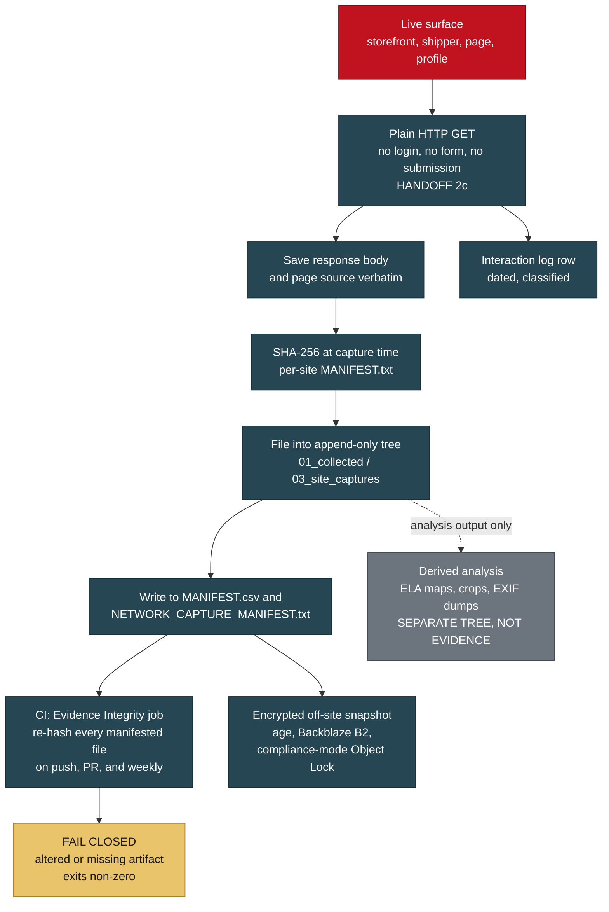

Two design decisions in that pipeline are worth copying.

**Derived artifacts live outside the manifest, deliberately.** Error Level Analysis maps, crops, contact sheets, and EXIF dumps are analysis output, not evidence. They sit in a separate directory with a README stating exactly that, and they are deliberately excluded from `MANIFEST.csv` (W-2 item 4.5). Mixing generated artifacts into an evidence manifest is how a corpus quietly acquires items nobody can source.

**Investigator screenshots are separated from collected evidence at the directory level** (L). Any recipient can see at a glance which files came from the targets and which were produced during the investigation. Provenance you have to reconstruct is provenance you will get wrong.

#### 3.3 Reproducing a site capture

```bash
## Capture a page and its exact bytes. Save the body, not a rendering.
curl -sS -A "$UA" --compressed -D headers.txt -o pages/index.html "https://<target>/"
sha256sum pages/*.html >> CAPTURE_HASHES.txt

## The byte-identity test that proves a templated catalogue (U-9).
for slug in bella daisy luna max oliver winston; do
  curl -sS -o "detail_${slug}.html" \
    "https://<target>/individual-puppy-detail?slug=${slug}"
done
sha256sum detail_*.html
```

On the target storefront, all six of those detail pages returned **byte-identical HTML**, SHA-256 prefix `8649dbb1cfeb...`. The slug is ignored and the page renders the first record regardless: requesting `slug=bella` returns "Chloe". The same listing page states "9 Available Now" and "Showing 12 puppies" on one screen (U-9). Identical hashes are identical bytes, and identical bytes across six named animals is one page with a name swapped in at render.

That is a claim any competent engineer can falsify in ninety seconds, which is the property you want in a headline claim.

#### 3.4 Registry and DNS procedure

```bash
## Registry-attested creation dates. RDAP is authoritative and not user-editable.
curl -sS "https://rdap.verisign.com/com/v1/domain/<domain>" | jq '.events'

## Authoritative DNS: nameserver pairs are the tell, not the A record.
dig +short NS <domain>
dig +short A  <domain>
dig +short A  ftp.<domain>     # this is where the co-tenancy claim dies (S-6)
dig +short MX <domain>
dig +short TXT <domain>        # SPF, DKIM, DMARC posture
```

The registry timeline that came out of this is the spine of the case (R-1): four one-year registrations, the standard disposable-asset term, with a fake shipping domain registered roughly ten weeks after the first storefront and roughly three weeks before the second. One shipper served two consecutive breeder brands. Three further domains referenced in the corpus returned RDAP 404, not merely offline but deregistered, within a day of being logged (R-2).

The operational consequence is a collection rule: **anything still resolving is archived on sight, not scheduled** (R-2).

One further finding worth reproducing at R-3. A shipping domain whose website returns HTTP 404 still resolves, still publishes MX records and SPF, and had its certificate renewed ten days before capture. A domain with live MX, live SPF, and a freshly renewed certificate is a working mailbox. Removing the site removes the evidence a buyer could screenshot; it does not remove the capability. Do not record a domain as "dark" on the basis of the web surface alone.

One artifact worth recording because it is counterintuitive. The fake shipper's domain returned a clean reputation verdict, zero malicious and zero suspicious across 91 engines (R-6). Reputation services do not catch pet-fraud infrastructure. Do not treat a clean scan as exculpatory in this category, and do not treat a dirty one as a prerequisite for filing.

---

### 4. Evidence integrity architecture

#### 4.1 The manifests

Three SHA-256 manifests cover the corpus at different scopes: `MANIFEST.csv` for the 140-file collected-evidence set with per-file size and a verification column, `NETWORK_CAPTURE_MANIFEST.txt` for the live-site captures, and `EXPORT_MANIFEST.txt` for the whole repository as it stood at handoff. All 140 files were hashed before a folder reorganization, moved without modification, and re-hashed after: 140 of 140 identical, zero integrity failures (L).

Verify from the evidence root on an LF checkout:

```bash
sha256sum -c <(awk -F, 'NR>1 && $3 != "" {print $3 "  " $2 "/" $1}' MANIFEST.csv)
```

One manifested file is excluded from version control by design and will report missing: an HTTP archive carrying 209 live `Cookie` headers and 2 `Authorization` headers. It is treated as secret-bearing and exists only inside the encrypted off-site archive. Its hash is recorded in the custody documents.

#### 4.2 The CI job, and why it fails closed

A GitHub Actions workflow re-hashes every file in `MANIFEST.csv` on every push and pull request touching the evidence tree, plus weekly as a drift check. It exits non-zero on any altered file and on any manifested file that is missing.

Three details in that job are the interesting part.

**The CRLF re-expansion allowance.** A file counts as intact if its bytes match the recorded hash either directly, or after re-expanding LF back to CRLF. This exists because Git's `core.autocrlf` normalized CRLF to LF when some artifacts were first committed, so the stored bytes differ from the bytes hashed at capture time by line endings alone.

Does that weaken tamper detection? No, and the reason is worth being precise about. The transform is a fixed, reversible, content-preserving substitution over a single byte pair. Accepting exactly two candidate encodings of the same content does not admit any content change, because **a real content edit matches neither form**. What it costs you is the ability to detect a pure line-ending rewrite, which is not a threat model anyone is defending against here. What it buys you is a job that does not cry wolf on every Windows checkout, and a job that cries wolf is a job that gets disabled.

You can run the same normalization by hand:

```bash
python -c "import hashlib,sys;print(hashlib.sha256(open(sys.argv[1],'rb').read().replace(b'\r\n',b'\n')).hexdigest())" <file>
```

**The allowlist is hardcoded, not derived from `.gitignore`.** This is the sharper design decision. Deriving the expected-absent list from the ignore file would let a single change authorize its own exemption: delete an artifact, add a matching ignore rule in the same commit, and the check goes green. An integrity control must not be bypassable by the change it is meant to police. Hardcoding fails closed instead. Newly excluding an artifact breaks the job until someone updates the list on purpose, and that is the intended friction. Adding an entry is an evidence-custody decision requiring repository-owner review, and the excluded artifact's hash must be recorded in the custody folder.

**Actions are pinned to commit SHAs, not tags.** Standard supply-chain hardening, and it matters more than usual for a job whose entire purpose is asserting that files have not changed.

#### 4.3 The append-only tree

Nothing in the evidence tree is ever edited, renamed, re-encoded, or re-saved. Corrections happen in analysis documents, never in artifacts.

This has consequences that look like defects and are not. The evidence log's header records a last-updated date that is wrong, and the correction is an appended note rather than an edit (Z-21). A screenshot filed under a machine-generated name keeps that name even after a tidier convention is proposed, because renaming it to look tidier would be exactly the kind of silent alteration the rule exists to prevent (Z-29).

The rule also creates a real navigation problem, which the record acknowledges and solves rather than ignoring. Append-only means superseded statements remain in place with no inline marker, so a reader who stops at the body can act on a statement a later addendum already corrected. Two review findings arrived against text that had already been superseded, which is that failure mode showing up in practice. The fix is a **corrections index**: every superseded or qualified statement, and where its correction lives, later entries winning, with a standing rule that any future correction must add a row in the same addendum that makes it. As the index itself says, a corrections index that is not maintained is worse than none, because it implies a completeness it does not have.

#### 4.4 The off-site archive

The full corpus plus three gitignored originals sit in Backblaze B2 as a single `age`-encrypted tarball under **compliance-mode Object Lock** with a retention date one year out. Compliance mode cannot be bypassed by any credential, including the account owner and the provider's own support, until that date expires.

The access-control shape is worth copying:

- The CI runner holds the age **public** key only. It can encrypt and upload; it can never decrypt anything in the bucket, including its own output.
- The B2 application key is scoped to one bucket and deliberately lacks `deleteFiles`, `bypassGovernance`, `writeKeys`, `writeBucketLifecycleRules`, `writeFileRetentions`, and `shareFiles`. A compromised runner can add objects but cannot destroy or alter what is stored.
- CI snapshots are written under a separate `ci/` prefix so they are never confused with the canonical hand-built archive, which is the only copy containing the three off-repo originals.
- There is no `pull_request` trigger on the archive workflow. Archive credentials must never be reachable from a branch that has not been merged and reviewed.
- The verification step enforces a **retention floor**, not merely a mode check. Object Lock protection ends at `retainUntilTimestamp`, so `mode == "compliance"` alone is insufficient: a compliance retention expiring early would satisfy a mode check while failing the custody requirement. Every verified object must be retained at least as long as the earliest retention across the stored set.

Two custody details generalize. First, the session originals are append-only logs that kept writing after their hashes were taken, so their whole-file hashes no longer match. Verification was done by hashing the recorded byte prefix, which still matches exactly. The growth is pure append; nothing was modified in place, and the recorded originals survive intact as byte-prefixes. Recording *why* a hash no longer matches is worth more than a hash that always matches.

Second, the restore procedure was itself audited and found defective twice. The published script set `-u` but never assigned the key path, so copying it verbatim halted with an unbound-variable error before decrypting anything. More seriously, under `set -e` a failing plaintext checksum or a failing tar exited before the final `shred` line, leaving the fully decrypted corpus on disk: victim PII and imagery of minors, which is precisely what the encryption exists to protect. The corrected form decrypts to a `mktemp` path and registers an `EXIT` trap **before the plaintext exists**, so it is removed on every exit path including interrupt.

```bash
set -euo pipefail
CT=<archive>.tar.gz.age
: "${AGEKEY:?set AGEKEY to the path of the age private key}"

PT="$(mktemp ./archive.XXXXXX)"
trap 'shred -u "$PT" 2>/dev/null || rm -f "$PT"' EXIT

echo "<ciphertext-sha256>  $CT" | sha256sum -c -
age -d -i "$AGEKEY" -o "$PT" "$CT"
echo "<plaintext-sha256>  $PT"  | sha256sum -c -
tar -xzf "$PT"
```

Register the trap before the plaintext is created, not after. Registering it afterwards reintroduces a window in which an interrupt leaves the corpus decrypted on disk.

One dependency remains open and is stated rather than buried: offline escrow of the age private key. It currently exists in two online locations controlled by one person. Without it the archive is unrecoverable.

#### 4.5 The known gap, stated plainly

**Twenty-nine HTML files under the site-capture tree do not match their recorded hashes under any transformation**: not the stored git bytes, not the working-tree bytes, not LF normalization, not CRLF re-expansion.

Worked example on one file:

| Form | SHA-256 |
|---|---|
| Recorded in both manifests | `3153aed916f1b6f37be9da90056653eaa5157c40d693ed809fc6df90ced72fea` |
| Git stored blob, LF | `4b5b95f7f79b57f675997fbe60bc5b14dca21c1a086cef99990e21609a00fda7` |
| Working tree, CRLF | `bc07d7b3891971b87beaa01a6589356d2e5c97d515ae4a4f52b172ba64d96859` |

Line-ending conversion only toggles between the latter two; neither reaches the recorded value. The most likely cause is that the originals carried mixed line endings, which `core.autocrlf` normalized irreversibly at first commit.

What is established about the gap: it predates the folder reorganization, since the same pass/fail split is present before any file moved. The two manifests agree with each other on the site captures, so the recorded hashes are internally consistent and were taken from the original captured bytes. Across the full export manifest, of the evidence files checked, 264 match the stored bytes, 12 match the working-tree bytes, 29 match nothing, and one is the intentionally excluded archive.

What is **not** being done about it: the files are not being re-saved or overwritten. This tree is append-only, and restoring bytes into it is a custody decision, not a routine edit. Until resolved, treat those 29 files as present but not hash-verifiable from the repository, and cite the archive copy when the exact captured bytes matter.

If you are building a corpus, add a `.gitattributes` with `* -text` on day one, on a clean tree, followed by `git add --renormalize .`, and confirm the resulting diff is empty before committing. This gap is the entire argument for that one line.

---

### 5. Contamination controls

#### 5.1 The problem, and why it is the first thing a defense will reach for

An external review identified a self-contradiction: a note describing a checkout as "inspected read-only" while simultaneously describing a populated form with a test name, a test street address, and a ZIP the form rejected. Populating a form is an interaction. The record never said which mechanism produced it, and that silence was the finding (W-1).

Three consequences followed, and all three were accepted without qualification.

**The operators may already know.** Merchant platforms surface abandoned checkouts in the merchant admin. A backend cart API call is loggable. Logged-in Facebook views appear in page insights. Any deletion clock that is running may be running for an active reason.

**The file needs a contact log.** The reasoning is the part that matters: it forecloses the only viable defense theory against the web-capture evidence, which is *the activity on our servers was the investigator's own*. That argument should die in disclosure, not in cross-examination.

**Active probing stops.** Adopted as standing procedure and carried into every subsequent capture: no form population, no cart creation, no checkout interaction, no login attempt, no message sending against any surface in the case. Retrieval limited to reading publicly served pages. Any future capture comes from a clean machine or a fully isolated browser profile: no logins, no autofill, no saved wallet state (HANDOFF 2c).

The single strongest exhibit in the case exists because that rule was followed. A fake shipper publishes its template vendor's demo credentials in plain text on a public admin login page. **No login was attempted and none should be.** Accessing the panel would be unauthorized access regardless of how the credentials were obtained. The evidentiary value is entirely in the fact that the string is published, and that fact is preserved in the captured file (T-1).

One interaction in that capture round is declared rather than buried: a tracking lookup endpoint was requested three times, using the site's own printed placeholder number plus two obviously invalid numbers. No personal data was submitted. It is a URL parameter on a public lookup page, and it belongs in the log as a read with a query parameter (W-1).

#### 5.2 The classification set

Bare `ACTIVE` was retired because it collapsed two opposite things. The complete set:

| Class | Meaning |
|---|---|
| **PASSIVE** | Reading a publicly served page. No login, no form, no submission, and login state **positively known** to be logged out |
| **ACTIVE-OUT** | Something sent by the investigation **to** the operation: a form, a message, a cart, a login attempt, a payment |
| **ACTIVE-IN** | Something sent by the operation **to** the investigator, in a channel the investigator is party to. Establishes operator conduct, not investigator conduct |
| **ACTIVE-3P** | Contact with a third party about the operation: an abuse desk, a registrar, a bank, a blocklist. Not contact with the operation |
| **UNRESOLVED** | The facts needed to classify are not recoverable |

**Direction is the whole point.** ACTIVE-OUT is investigator conduct that a defense can attack. ACTIVE-IN is operator conduct that supports the case. Recording both under one label defeats the purpose of keeping the log at all.

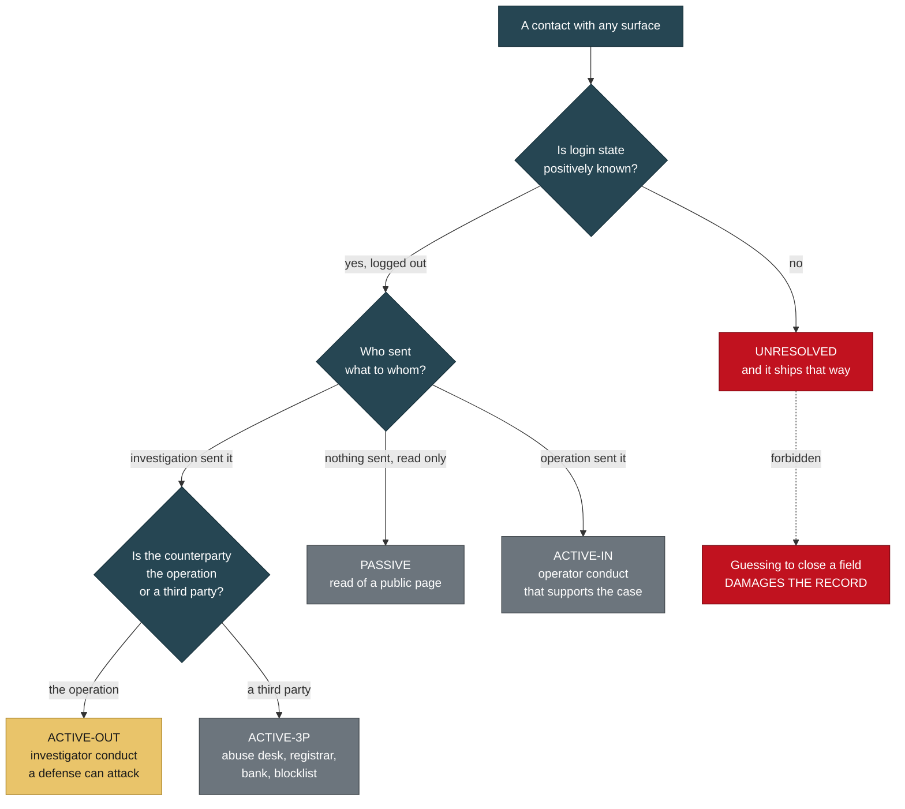

#### 5.3 The honest disclosure: six of nine entries are UNRESOLVED

The interaction log has nine entries. Six of them are classified `UNRESOLVED`.

That is an uncomfortable number and it is the correct one. It reflects that the log was reconstructed after the fact rather than kept contemporaneously, which is precisely the cost the original note warned about.

The path to that number is instructive, because the log corrected itself three times in one day and each correction *increased* the count.

- Two TikTok profile captures were classified `PASSIVE` while simultaneously recording login state as unrecorded. `PASSIVE` requires no login. Classifying them `PASSIVE` presumed the answer to the open question. Reclassified `UNRESOLVED`.
- The same amendment then left two other entries as `PASSIVE` on the basis that they were "recorded as anonymous", while itself noting that should be confirmed rather than assumed. That is the identical error one paragraph later. Both reclassified `UNRESOLVED`.
- An improvised label, `ACTIVE-IN-adjacent`, was used at the point of need for a logged-in third-party view. No such class existed. Removed. Do not invent classes at the point of use; the entire reason bare `ACTIVE` was replaced is that an undefined label is unsearchable.

The governing rule, stated once and scoped to every unresolved fact or field in the log:

> An unresolved fact must be **reviewed** before filing, never necessarily **completed**. Where it is genuinely recoverable, record it. Where it is not, the honest answer is final and ships as-is. Guessing to close a field damages the record.

An earlier draft said `UNRESOLVED` entries "should be completed before filing." That was corrected precisely because it pressures an investigator to supply an answer under deadline, which is exactly how a reconstructed-from-memory fact enters an evidence record and later collapses under cross-examination.

Note the distinction between an entry whose *class* is `UNRESOLVED` (we cannot say what kind of contact it was) and an unresolved *field* within a classified entry (a contact is firmly `ACTIVE-IN`, but its outbound side is unknown pending an export). Both are governed by the same rule; they are not the same thing.

#### 5.4 The disclosure that could not be resolved

The checkout interaction that started this section could not be reconstructed. The mechanism that populated the form was not recorded at the time and is not recoverable from the corpus. Rather than leave a self-contradiction in the record, it is classified conservatively and disclosed:

> The checkout interaction is classified **ACTIVE-OUT**. A form was populated with placeholder identity data and a cart API was contacted. Whether this was performed manually, by browser autofill, or by an automation tool was not recorded and is not recoverable. No payment instrument was entered and no order was placed. The conservative classification is used because the evidence does not support the narrower one.

That wording is intended to appear verbatim in any filing relying on that material. It is materially better to disclose an unrecorded mechanism than to have opposing counsel or a skeptical analyst discover the contradiction unaided.

One further entry belongs in the same category and is recorded for completeness: a payment to the solicited account was **contemplated and not made**. It is in the log because the log must show what was considered as well as what occurred, and so a later reader finding account details in the file can establish that no investigator funds entered that account.

---

### 6. Template-artifact forensics

This is the highest-yield technique in the case and the cheapest to run. Fraud kits are purchased products. Operators deploy them under time pressure and edit only what is visible above the fold. Everything they did not edit is a fingerprint of the vendor, and the vendor's customer list is the network.

#### 6.1 The published demo credentials

A fake pet-transport site renders an "Admin Control Panel" login form at `/admin/login.php` and prints beneath it, in plain text:

> **Demo credentials: admin / Admin@12345**

Combined with `(demo)` in the footer of every page, this settles the question permanently. The vendor's demonstration text, demonstration credentials, and demonstration database are all still in place. There is no company. There never was (T-1).

The page does implement a CSRF token, which tells you the underlying template is competently built. The operator simply never edited it. That is the vendor-layer model made visible in a shipped artifact rather than inferred from behavior (W-6).

#### 6.2 The `(demo)` footer, in two languages

The English footer trust badge reads, verbatim, `IATA Live Animal Certified (demo)` (S-2).

The German build reads `IATA-zertifiziert für Lebendtiere (Demo)` (T-9).

Read that second one carefully. Someone hand-translated the placeholder rather than deleting it, and capitalized it to match German convention. The operator read that string, processed it, and left it in. The German localization file is roughly 87 KB of English-to-German phrase mapping, thorough and idiomatic across legal text, data-protection language, pricing, tracking statuses, and job listings. This is not machine-dumped output; someone with German competence produced or carefully reviewed it, and the giveaway survived translation anyway.

Supporting artifacts of the same unedited character on that page: animated statistics counters that all read `0` ("0 Pets Delivered Safely, 0 Countries Served, 0 Pets In Transit Now, 0 Happy Pet Families") on a page that simultaneously claims 31,000-plus families served, and a live tracking widget showing a single hardcoded static shipment (S-2).

#### 6.3 The vendor's demo shipment record, served from a live database

The tracking form enforces the format `PAW-\d{8}` and prints a sample number as placeholder text. Querying that sample number returns a fully populated shipment record: status Delivered at 100 percent, a live position updating every few seconds, a named origin and destination airport, a dispatch date, a named pet owner and a named recipient both at `@example.com` addresses, breed and weight and crate dimensions, a declared pet value, a transport cost, insurance status, payment status "Paid", and a multi-stage journey history with timestamps (T-3).

Arbitrary numbers return "Tracking Number Not Found". So this is a real database with real records, not a generator that fabricates output for any input.

Two conclusions follow, and the second is the one that matters operationally.

**This record is the vendor's demo seed data.** The `@example.com` addresses give it away, and the "customer" and "recipient" are two of the same fabricated personas that appear in the testimonial block on that site and across two other domains (S-3, T-3).

**The operator can create records.** When a buyer pays, they can be issued a genuine tracking number that produces a live map, a moving aircraft position, a named coordinator, and a line reading "Payment Status: Paid". That is the retention mechanism. It is what keeps someone believing and paying escalating fees for weeks instead of calling their bank on day three (T-3).

The demo record also discloses the intended fee scale, and the calculator publishes the rate card behind it: per-kilogram rates across four transport methods, plus an add-on priced at 1.5 percent of declared value, plus urgency tiers (T-8). The insurance line is the escalation lever. The buyer is induced to declare a high value for the animal they believe they bought, then charged a percentage of that declared value. The urgency tiers supply the pressure.

#### 6.4 The template underneath the paint

The pet-services navigation on that site is cosmetic. The page filenames are generic freight forwarding:

| Nav label shown to buyers | Actual page file |
|---|---|
| Ferry Ground Transport | `ocean-freight.php` |
| Boarding Layover Care | `warehousing.php` |
| Import Export Documents | `customs-clearance.php` |
| Pet Travel Insurance | `cargo-insurance.php` |
| Van Road Transport | `road-transport.php` |
| Air Pet Transport | `air-freight.php` |

The quote form collects `cargo_type`, `shipment_type`, `weight_kg`, `company_name`, `origin_country`, `destination_country`. A pet relocation service asking a grieving family for their **company name** and **cargo type** is the template showing through the paint (T-2).

The image assets confirm it, and one pair is conclusive. All 19 images are exactly 1600px on the long edge with EXIF fully stripped, the signature of bulk stock-photo download. Four pairs are byte-identical duplicates under different filenames:

| Filename A | Filename B | SHA-256 prefix |
|---|---|---|
| `hero-pet-carrier.jpg` | `container-truck.jpg` | `c0cb5abf319426e9` |
| `puppy-carrier-ready.jpg` | `puppy-travel-carrier.jpg` | `58bfb6f8e4de7a57` |
| `logistics-hub.jpg` | `hero-containers.jpg` | `502fdf1ca1fae637` |
| `warehouse-alt.jpg` | `shipping-dock.jpg` | `b160c5aca35846ec` |

`hero-pet-carrier.jpg` is byte-for-byte a photograph of a shipping container truck. They renamed a freight image to a pet filename and shipped it. Of 19 assets only three are pet-related, and two of those are the same file twice (T-2).

Hashing every asset on a candidate site and looking for internal byte-identical pairs under semantically different filenames is a fast, high-precision test for a repainted kit. It requires no reverse image search and no external service.

#### 6.5 The Porto placeholder

A Wayback capture of a now-deregistered storefront shows its contact `mailto:` resolving to `porto@consulting.com`. That is the demo placeholder address from the "Porto" HTML/Bootstrap template, one of the best-selling commercial website templates on the market. The operators deployed a purchased commercial template and never replaced the demo contact address (N-2).

Note the method: the domain was already dead when this was found. The artifact came out of a web archive, not a live fetch. Archive coverage is a first-class collection surface in a case where domains burn every four to ten weeks.

#### 6.6 The unedited-artifact table

Every one of these is a string or asset the operator shipped without editing. Together they are the case's most durable class of evidence, because they are already captured and hashed and cannot be retracted by fixing the live site.

| Artifact | What it is | Ref |
|---|---|---|
| `Demo credentials: admin / Admin@12345` | Vendor demo credentials published on a public admin page | T-1 |
| `IATA Live Animal Certified (demo)` | English footer trust badge, `(demo)` shipped to production | S-2 |
| `IATA-zertifiziert für Lebendtiere (Demo)` | German footer, placeholder hand-translated and capitalized | T-9 |
| Vendor demo shipment record | Seed data served from the live tracking database, `@example.com` parties | T-3 |
| `porto@consulting.com` | Commercial template demo contact address, never replaced | N-2 |
| `1234 Oak Street, Richmond VA 23219` | Template placeholder address published as a business address | A6 |
| `0+ satisfied clients` | Unpopulated counter shipped as a trust signal | A6 |
| Alt text naming a real Tennessee kennel | Scraped alt text left intact, exposing the source of the imagery | H-4, M-3 |
| Search-result strings as product titles | Verbatim image-search result strings emitted as site copy | M-3 |
| `/static/default/img/20220514153821.png` | Template fallback image, filename encodes 2022-05-14 15:38:21, rendered as a live product photo | A3f |
| Integer category names ("6", "28", "32", "118") | Backend taxonomy never populated with real labels | A3f |
| Two theme directories deployed at once | Duplicate jQuery and Bootstrap builds; kit assembled from multiple purchased templates | A3f |

The dated placeholder is the single strongest item in that table. It appeared *in the live rendered page*, standing in for two product photos where no scraped image was available. Two implications: the kit predates the domain by years, and the catalog is auto-generated filler with no inventory behind it. A genuine retailer does not ship a placeholder as a product photo (A3f).

A second-generation tell sits alongside it. One storefront carries 43 "Verified" reviews in two visibly different production styles on one page: an initial-plus-surname set matching the persona pool, and a full-name-plus-city set that is visibly mangled, including a city name rendered as a person's name and several entries corrupted in a way that suggests scraped or OCR-degraded real names rather than generated ones. Two distinct production methods on one page means two separate content passes, probably at different times or by different hands. That is a methodology fingerprint worth carrying forward (U-7).

---

### 7. Timestamp forensics

#### 7.1 The build sequence

One storefront is a Next.js application serving images through the framework's image optimizer, but the underlying upload paths are recoverable. Each path carries a 13-digit suffix, which is a Unix millisecond timestamp. Decoded, twelve uploads resolve to the minute (U-4):

```
2026-08-17 17:57:05 UTC   Teacup_poodle                              -
2026-08-18 10:11:44 UTC   Yorkie_Puppy_for_Sale_-_Heavenly_Puppies   +16h
2026-08-18 10:27:39 UTC   Yorkie_puppy_golddust                      +16m
2026-08-18 10:54:33 UTC   yorkie-puppy-for-sale-male-21334-1         +27m
2026-08-18 10:56:33 UTC   Poodle_for_sale                            +2m
2026-08-18 11:07:35 UTC   25171-1                                    +11m
2026-08-18 11:18:37 UTC   26042-1                                    +11m
2026-08-18 11:26:29 UTC   mini-goldendoodle-...-24287-1              +8m
2026-08-18 11:33:47 UTC   26091_Male_Goldendoodle_HeavenlyPuppies_1  +7m
2026-08-18 11:37:49 UTC   Golden-Doodle-20074-2                      +4m
2026-08-18 11:40:38 UTC   English-Bulldog-140935-2                   +3m
2026-08-18 11:44:49 UTC   English-Bulldog-160221-2                   +4m
```

The domain was registered, per the registry, at **2026-08-18 12:18:40Z** (R-1).

Eleven of the twelve images were uploaded in a continuous 93-minute session finishing **34 minutes before the domain was bought.**

```mermaid
flowchart LR
    priorDay["2026-08-17 17:57:05Z<br/>first upload<br/>Teacup_poodle"]
    sessStart["2026-08-18 10:11:44Z<br/>session opens<br/>filename retains<br/>source marketplace brand"]
    sessMid["10:27 to 11:26Z<br/>steady 2 to 27 minute cadence<br/>a person working a source site<br/>listing by listing"]
    sessEnd["2026-08-18 11:44:49Z<br/>eleventh upload<br/>session closes"]
    gapNode["34 MINUTES"]
    domainReg["2026-08-18 12:18:40Z<br/>REGISTRY: domain created<br/>one-year term"]
    conclusion["Content harvested FIRST.<br/>Domain bought SECOND.<br/>An operator activity window<br/>measured to the second."]

    priorDay --> sessStart
    sessStart --> sessMid
    sessMid --> sessEnd
    sessEnd --> gapNode
    gapNode --> domainReg
    domainReg --> conclusion

    classDef scamInfra fill:#c1121f,stroke:#7a0b14,color:#ffffff
    classDef evidence fill:#264653,stroke:#16303a,color:#ffffff
    classDef money fill:#e9c46a,stroke:#a8842f,color:#1a1a1a

    class priorDay,sessStart,sessMid,sessEnd scamInfra
    class domainReg evidence
    class gapNode,conclusion money
```

The steady 3-to-16-minute cadence is a person working through a source listing by listing, not a script. This is the finest-grained behavioral artifact in the case.

#### 7.2 Pattern of life across 82 uploads

A second storefront uses PHP `uniqid()` plus a Unix-second suffix in its upload filenames: `pup_69d1c544481e6_1775355204.jpg`. Both components encode the same moment, so the timeline is self-verifying. 82 unique images recovered (U-5).

Upload sessions by day show two bulk stocking passes, 39 images on one day and 28 four days later, building the inventory in the first week after the domain was registered, then a slow trickle and nothing at all for the final seven weeks even though the storefront was still taking inquiries.

Hour-of-day distribution across all 82: **75 of 82 uploads, 91 percent, fall between 22:00 and 03:00 UTC.**

The correct reading of that window is careful rather than conclusive:

- Mapped to US Eastern in that month, it is 18:00 to 23:00 local: ordinary evening hours.
- Mapped to the attributed operator region, it is 23:00 to 04:00 local: the middle of the night.
- Mapped to the attributed content-farm region, it is 04:00 to 09:00.

And the other storefront's window is incompatible: its upload session ran 10:11 to 11:44 UTC, morning in Europe and Africa and pre-dawn in the US.

**The assessment is that the two storefronts show incompatible working-hour signatures**, consistent with the infrastructure split already recorded, and arguing that they are operated by different people or different shifts while drawing on a shared content-production toolkit (U-5).

#### 7.3 The limits of this method, which must travel with the finding

Upload timestamps are **server-side**. They reflect the server's clock, not the operator's location. An operator targeting US buyers may deliberately work US hours. VPN use changes nothing about these timestamps but says nothing about them either.

This is a behavioral indicator, **not a geolocation**. It must not be used to walk back or to reinforce the geographic attribution elsewhere in the record, which rests on entirely separate account-level evidence (U-5).

A second limit is a hard stop on reproduction: **the upload epochs are recoverable only while the sites are live.** When the sites go down, the filenames go with them. If you are extending this work, capture the paths first and analyze them later.

A third site in the same network defeats the method entirely. It stores images under a content-hash naming scheme with 32-character hexadecimal filenames. No original filenames and no upload timestamps survive. Whether that is deliberate or simply the CMS default, the practical effect is that this analysis cannot be repeated against it, and its imagery has to be traced by reverse image search and perceptual hashing instead (U-6).

#### 7.4 Capture time is not event time

One further discipline, because it is the kind of thing that gets collapsed silently.

A screenshot in the corpus has a filename and filesystem mtime encoding one time, while the message depicted inside it displays a time fourteen minutes earlier. These are two facts about two different events and must not be merged (Z-29):

| Value | What it is | Authoritative for |
|---|---|---|
| The mtime | Capture metadata | **When the investigator captured the screen.** Directly evidenced, already settled |
| The displayed time | A rendering of a clock inside an application | Nothing on its own. A picture of a clock |

A screenshot cannot resolve its own timezone. The displayed value also sits under a daylight-saving ambiguity of exactly one hour, which matters because a precisely placed UTC value is a data point about which of the two working patterns at U-5 an operator follows (Z-10). It stays labeled as *displayed by the application* until a native platform export carries the server-side timestamp.

---

### 8. Filename provenance

The single highest-value find in the site captures, and the easiest to reproduce.

**The operator of one storefront never renamed the photographs after downloading them.** The upload paths retain the source filenames verbatim (U-3):

```
/assets/images/Yorkie_Puppy_for_Sale_-_Heavenly_Puppies-1787047904186.jpg
/assets/images/26091_Male_Goldendoodle_HeavenlyPuppies_1-1787052827691.webp
/assets/images/yorkie-puppy-for-sale-male-21334-1-1787050473882.webp
/assets/images/mini-goldendoodle-puppy-for-sale-male-red-24287-1-1787052389551.webp
/assets/images/Golden-Doodle-20074-2-1787053069791.webp
/assets/images/English-Bulldog-140935-2-1787053238978.webp
/assets/images/English-Bulldog-160221-2-1787053489849.webp
/assets/images/25171-1-1787051255597.webp
/assets/images/26042-1-1787051917213.webp
```

Two filenames carry a source brand string verbatim. The rest carry a `breed-listingID-imageNumber` convention used by large puppy-listing marketplaces: `21334-1`, `24287-1`, `20074-2`, `140935-2`, `160221-2`, `25171-1`, `26042-1`, `26091`.

This is a direct, self-documenting provenance chain. The operator browsed a third-party sales site, saved listing photos, and uploaded them straight to their own storefront with the source site's filenames intact. It is the same failure class as leaving `(demo)` in the footer.

**The discipline that goes with it.** The domain matching that brand string currently resolves to a domain-parking address, so the source site is not presently live at that name. **Do not assert which marketplace the images came from until it is confirmed.** Assert only what the filenames prove, which is that they came from a third-party listing site and were not photographed by the seller (U-3).

That restraint is not squeamishness. Naming the wrong marketplace in a filing hands an adversary a free, checkable error, and the marketplace behind those listing IDs is a victim of large-scale image theft with takedown standing nobody else has. Identifying it correctly and notifying it is an open action item, not a published conclusion.

#### 8.1 How to run this against a candidate site

```bash
## Next.js image optimizer: the underlying path is in the query string.
curl -sS "https://<target>/" | grep -oE '/_next/image\?url=[^"&]+' | \
  python -c "import sys,urllib.parse; [print(urllib.parse.unquote(l.split('url=')[1])) for l in sys.stdin]"

## Decode a 13-digit millisecond suffix.
python -c "import datetime,sys; print(datetime.datetime.utcfromtimestamp(int(sys.argv[1])/1000))" 1787047904186
```

Look for three things in the recovered paths: a source brand string, a `listingID-imageNumber` convention from a known marketplace, and an epoch suffix. Any one of them is worth something. All three together give you provenance and a build timeline from a single `curl`.

---

### 9. Page recycling

#### 9.1 The full record on one page

Facebook's Page Transparency panel is platform-attested and cannot be edited by the page owner. Captured for one page (N-1):

| Field | Value |
|---|---|
| Page ID | `1179239581941044` |
| Followers | **1** |
| Category | Product/service |
| **Created** | **7 June 2026, as "Golf carts for sale"** |
| Renamed | **7 June 2026, same day, to "SMART CARTS"** |
| Renamed | **13 August 2026, to a personal name** |
| Merged with | 0 other pages |
| Profile image | A photograph from a harvested persona album belonging to an image-theft victim |

A page created for golf carts, renamed the same day, then converted ten weeks later into a personal-name identity carrying a stolen photograph.

Combined with a second documented history (a page that cycled through a personal name, then viral-video content, then news aggregation, then religious content, then pet rescue, carrying 26,000 inherited followers through all of it), this establishes page recycling as standard operating practice rather than an isolated case (N-1, B-15).

**This directly explains the takedown failure.** A rights-holder in this case reported being unable to keep pace with DMCA takedowns because pages respawn faster than they can be removed. That is the expected outcome when identities are drawn from a pool of pre-existing, recyclable pages rather than created fresh. Removing one page removes an instance, not the supply (N-1).

#### 9.2 The twelve-day cycle, labeled PROVISIONAL

On 25 August, twelve days after that page was renamed to a personal name, an account displaying that name sent bank account details to the investigator over Messenger and solicited a wire transfer (Z-7).

Three consequences follow (Z-8):

1. **The page pool is not dormant inventory. It is the delivery mechanism.** The earlier finding concluded that removing one page removes an instance. This shows what an instance does once activated.
2. **Operational tempo becomes measurable.** Twelve days from identity assignment to payment solicitation. That is a concrete cycle time for this network, and it is testable against the other recycled pages.
3. **The identity layer and the payment layer connect through a single artifact.** Previously the record had a persona layer, a website layer, a shipper layer, and no financial trail.

**All three of those conclusions are PROVISIONAL and are labeled that way under the record's own rules (Z-14, Z-29).**

The reason is methodological and worth stating in full, because it is the exact discipline this document is arguing for. The artifact currently in the corpus is a screenshot: filed, hashed, and under CI verification, but a rendering produced by the investigator, not a native export produced by the platform. It carries no message ID, no server-side timestamp, and nothing that independently ties it to the account it depicts. **It corroborates the report; it does not corroborate itself.** These conclusions are load-bearing, so they should rest on the platform's own record. They become established when the platform export lands and is filed, and not before (Z-29).

Note also what is **not** claimed. It is **not established** that any complainant's funds ever reached the solicited account, that the account received complainant funds, or that the named holder knowingly participated in anything. The account that received complainant money remains unidentified, and the named holder's status is UNDETERMINED and is not published (Z-12, Z-18).

The bank institution behind the routing number verifies against the ACH routing directory, and the institution address given matches the registered address exactly, which distinguishes this artifact from most of what this network produces (Z-2). That verification establishes that the banking details are real. It establishes nothing about whose money went where. The account number itself is suspect-side infrastructure and is withheld from every public artifact.

There is also a firewall consideration that outranks all of it: the photograph on the soliciting page belongs to the harvested album of an image-theft victim who has never been contacted and has given no consent (Z-9). The person depicted on the account that solicited a payment is, on the existing record, a victim of this network and not a participant in it. The coincidence of their likeness appearing on a payment solicitation makes that distinction more important, not less.

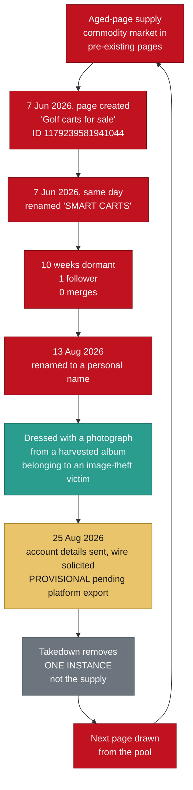

#### 9.3 The reproducible part

Page Transparency is public, platform-attested, and not editable by the page owner. Open any page's Transparency panel and read the creation date, the full name history with dates, the merge history, and the ads status. For a page presenting as a small breeder or rescue, a name history spanning unrelated verticals is dispositive of commodity page flipping, and it costs one click.

A cheap, decisive extension nobody has run yet: check the Ad Library across the page set. Paid amplification is separately archived and searchable. The captured Transparency panel for the page above already shows it was not running ads, so the check is answerable at scale (N-4).

---

### 10. Negative results

This section is why the rest of the document should be believed.

Ten findings in this record make the case smaller, weaker, or narrower. They are retained deliberately, they survive every packaging pass by standing instruction, and they are listed here rather than buried (HANDOFF 2d, W-9).

**A file that only ever grows in one direction is a file nobody should trust.**

| # | Finding | What it killed | Why it was retained | Ref |
|---|---|---|---|---|
| 1 | **The `majori` theme correction** | A theme path had been flagged as a possible unique kit signature. It is a legitimate commercial e-commerce theme sold through mainstream template marketplaces. Its presence indicates a pirated or adapted commercial template, not a bespoke fraud kit, and is not a reliable pivot on its own | The reasoning trail matters more than the conclusion. A downstream investigator needs to know this was checked so they do not spend a day re-checking it | A3c |
| 2 | **The `huidaodingbu` correction** | A pinyin-derived identifier in client-side source was proposed as a strong hunting signature. Tested: it is standard, widely used vocabulary throughout the Chinese web-development ecosystem, appearing in public plugin directories, tutorials, icon-font class names, and commercial CMS asset manifests. It occurs across thousands of unrelated legitimate sites and has **no discriminating power** | Same reason, plus a second one: it prevents an over-read of a foreign-language artifact as an operator-location indicator when it is a kit-authorship indicator | A3e |
| 3 | **Zero cross-account image reuse** | All 98 photographic files were compared with perceptual (pHash) and difference (dHash) hashing to detect the same image re-encoded across accounts. **Result: zero reuse.** The only near-duplicate pairs were download artifacts of the same file | This is a **probative negative**. Each account is supplied with different stolen photographs rather than all accounts recycling a shared pool. That implies large ongoing harvesting volume, is consistent with whole-gallery theft, and is deliberate detection avoidance: non-reuse defeats the most common check a buyer runs, reverse-image-searching a listing and finding it on another scam page | K-4 |
| 4 | **The shared-IP downgrade** | See section 2.1. Three distinct nameserver pairs on one shared address, 48 co-hosted domains | The loose version is the easiest thing in the case to falsify. An analyst who tests it and finds shared hosting discounts everything downstream | R-4 |
| 5 | **The FTP-gateway downgrade** | The co-tenancy list is roughly 87 entries, overwhelmingly `ftp.` hostnames on a shared endpoint. Co-residency there is close to meaningless | It also produced the narrower claim that *does* hold: three domains web-serve from an address other tenants use only for file transfer | S-6 |
| 6 | **The phone-number downgrade** | Five WhatsApp numbers are working infrastructure that moves between operations and carries stale third-party history, not clean operator identifiers | Directly protects a probably uninvolved private individual from being filed as a suspect, and makes carrier and line-type lookups *more* valuable rather than less | V-5 |
| 7 | **The square-2048 correction** | A perfect 2048x2048 dimension had been treated as a synthetic-image signal across the corpus. A thirteenth file in the persona album is square 2048 and is a demonstrably real photograph: coherent crowd geometry with correct occlusion at depth, anatomically consistent hands and face, natural single-source outdoor lighting, believable specular reflection, plausible depth-of-field falloff. The platform's own pipeline produces square 2048 renditions | The dimension indicator was carrying more weight than it could bear. Demoted to **corroborative only**, on the same footing as the ELA demotion. The finding came out of closing a completeness gap a reviewer identified, which is the argument for closing such gaps | W-3 |
| 8 | **The camera-serial dead end** | A budget compact camera model was the only device in the corpus with intact EXIF, and a body-serial-to-warranty-records route was proposed. Run and closed: that model **does not write a body serial into its MakerNote.** The route does not exist for this device | Recorded so nobody spends another hour on it. The same pass found the MakerNote partially corrupted and the file to be a downscaled derivative carrying its parent's metadata, not a camera original | W-5 |
| 9 | **A co-tenant business cleared** | A working web-development and social-media business appeared in the co-tenancy list and drew immediate attention because its domain name contains a country name matching the geographic attribution. It does not hold up. Its public portfolio lists its clients, none of which is a pet, breeder, rescue, or logistics domain, and several other entries in the same co-tenancy list are its own portfolio clients, which explains a visible chunk of the list benignly. Its only connection to the address is the shared FTP endpoint every tenant on that host uses | **Assessment: coincidental co-tenancy, no evidentiary value, do not contact, do not name, do not include in any referral.** A real small business sharing a hosting provider with fraudulent sites is not evidence of anything, and treating a country name in a domain as an indicator would be exactly the reasoning error corrected at items 1 and 2 | S-7 |
| 10 | **An Arizona breeder cleared, and an Oregon individual refused** | A breeder reported as a co-admin was checked and cleared: their website was appropriated by a two-follower sock page borrowing their credibility, making them a victim of website appropriation and not a participant. Separately, a reverse lookup returned a named private individual associated with one of the published phone numbers, and the record refused to pursue it | The refusal is the point. Everything in this network is built on stolen identity: stolen photographs, stolen persona names, a fabricated executive roster, a fake head office. An operation that steals every other identity it displays is not likely to have published its own name. Standing rules were adopted: no enumeration against that address, no data-broker dossier, no naming in any referral, and consideration for victim notification once the case is filed | A5c, V-4 |

Two of those, items 1 and 2, are hypotheses that were proposed by this investigation and then disproven by this investigation. Both corrections are retained in place rather than deleted. An investigative log that shows which leads were checked and discarded is more useful to a downstream investigator than one that shows only the surviving conclusions (A3e).

#### 10.1 Two defects found in our own source corpus

The argument of this section is that a record which retains its own negative results is worth trusting. That argument obliges us to disclose defects we find in our own documents, not only hypotheses we killed. Two were identified during preparation of this brief and are stated here rather than quietly corrected.

**Defect one: an internal count contradiction in the hotlink victim registry (A3b).** The prose introducing that registry states that 21 third-party domains had images served directly from their servers onto a fraudulent storefront. The table beneath it lists 22 numbered rows. Counted and confirmed. Nothing downstream depends on which figure is right, and no finding in this brief rests on either, but an analyst who counts the table and finds a discrepancy against the stated figure gets a free shot at the record's accuracy over nothing at all. Until the discrepancy is resolved at its source under the append-only rule, the correct public phrasing is **"more than twenty"**, and that is the phrasing this document uses.

The entities in that registry are recorded as victims of bandwidth theft and copyright infringement, with independent standing to file takedowns. Two of them are major rights-holders with active enforcement operations. None of them is a suspect, and the count defect does not change that.

**Defect two: an unattested scale figure circulating in the derivative deliverables.** A figure of the form "400-plus domains across 10-plus countries" appears in eight audience-specific deliverables built from this investigation. It appears **zero** times in the evidence log. It has no artifact behind it in the record.

It is therefore not carried here, and it should not be carried anywhere else. This document makes no claim about the total size of the network. Where scale needs situating, cite published research explicitly as somebody else's measurement of the wider fake-storefront market and state plainly that this investigation has no count of its own.

That is the same failure mode as the two disproven hypotheses in the table above, arriving from the opposite direction. There, a real artifact was over-read into a signature it could not support. Here, a number with no artifact behind it propagated through eight documents because each inherited it from the last. Both are caught the same way: by asking what specific captured thing the sentence points at, and refusing the sentence when the answer is nothing.

A third figure in the same class was flagged in the investigation's own counter-thesis review and is recorded here for completeness: a dramatic account-spawn rate quoted in early conversation is unsubstantiated and was never measured. It is either derived by counting new pages appearing in a fixed set of groups over a measured interval, or it is removed. It has not been derived, so it is removed.

---

### 11. Tooling, and where each tool stops

| Tool or method | What it produced here | Limit |
|---|---|---|
| `sha256sum`, manifest diffing | Proof that six named "puppies" are one templated file; four byte-identical asset pairs under different filenames; corpus integrity across a folder move | Line-ending normalization can make a byte-identical file appear altered. Normalize before concluding anything (section 4.2) |
| RDAP and authoritative DNS | The hard registration timeline, three deregistered domains, three distinct nameserver pairs, live MX and SPF on a domain whose website was stripped | Registry data is authoritative for dates and registrar. It is not authoritative for control. Privacy proxies and reseller registrars are the norm |
| Passive DNS and reverse IP | Discovery of two previously unknown domains in the network | **Downgraded as a linkage claim.** Produces the hosting provider's customer list, not the operator's asset list (R-4, S-6) |
| `exiftool -a -G1` | Three EXIF survivors out of 140 files; one ICC profile indicating Android capture; one `ImageDescription: "Screenshot"` tag proving manual screen-capture harvesting rather than download | The platform strips EXIF, camera make and model, and GPS server-side. 91 of 97 JPEGs in the corpus carry the platform's own re-encode signature. Only files that never passed through the platform are checkable |
| Perceptual hashing (pHash, dHash) | The zero-reuse negative across 98 files | Returns a similarity score, not an identity. Useful for detecting re-encodes of one image; useless for proving two different images share an owner |
| **Error Level Analysis** | Cited in two early authenticity calls | **Corroborative only. Not probative.** ELA and noise-residual comparison are unreliable discriminators against modern diffusion output and would not withstand expert challenge. The authenticity conclusions were re-based on strong indicators alone and are unchanged (M-2) |
| Image dimension profiling | Twelve perfect-square files against a corpus otherwise dominated by 3:4 phone ratios | **Square 2048x2048 is not by itself an AI indicator.** A confirmed-real photograph in this corpus is square 2048, and the platform pipeline produces square renditions of its own accord. Corroborative only (W-3) |
| Generator-path inspection | **Conclusive** where an image URL self-declares its generator, for example a path segment literally reading `generatedImages` | Only works where the operator hotlinks from the generator rather than re-hosting |
| In-frame text inspection | **Strong.** Garbled rendered text inside an image is a characteristic large-model failure and is visible without tooling | Improves with model generation. Treat as strong today, weaker each year |
| Page Transparency panels | Full name histories with dates, creation dates, merge counts, managing-location attestations, ads status | Platform-attested and not editable, which is why it outranks anything the page itself says. It attests to a management session, not to a residence |
| Wayback and archive.today | A template placeholder contact address recovered from a domain that no longer exists | Coverage is patchy and cannot be created retroactively. Archive on sight |
| Reputation services | A clean verdict across 91 engines on a live fraud domain | **Reputation services do not catch this category.** Do not treat a clean scan as exculpatory (R-6) |

#### 11.1 The revised indicator weighting

The authenticity determinations in this case were re-based after review. The resulting weighting is the transferable artifact (M-2):

| Indicator | Weight |
|---|---|
| Garbled rendered text inside the image | **Strong** |
| Self-declaring generator path in the asset URL | **Conclusive** |
| Generator-default dimensions (2048x2048, 1024x1024) | **Moderate**, and further demoted to corroborative by W-3 |
| ELA mean, noise floor | **Corroborative only. Not probative** |

One correction in that pass reversed an interpretation rather than merely weakening it. Two persona images had been grouped as "AI-generated" alongside genuinely fabricated testimonial faces. They are not the same phenomenon. The persona images are a real person's **own likeness** placed into a generated scene, and a filter applied to a real photograph. Generating stylized scenes from an actual likeness requires source photographs of that individual. Combined with a bulk-scraped album and a file flagged as a screen capture, the correct reading is that the operator obtained deep access to one person's personal photo library and generated derivative content from it. That is likeness misappropriation, not identity fabrication, and it substantially **increases** the assessed harm (M-1).

No further detail about that individual appears anywhere in this corpus, by design. They are an image-theft victim who has never been contacted and has given no consent, and describing them is prohibited independently of whether any image is reproduced.

The methodological point: a correction that flips an interpretation is worth more than one that only adjusts a confidence score, and you only find it by re-examining the items you were most confident about.

#### 11.2 One handling rule that constrains the tooling

No facial recognition, no face matching between images, no reconstruction or enhancement of tattoos or other identifying marks, and no recommending tools in that class. Observable details are described where completeness requires it, and no further (G, HANDOFF 2b).

The reasoning is evidentiary rather than squeamish. In stolen-identity pet fraud, persona photographs frequently belong to uninvolved third parties whose accounts were scraped, and at least one set of subjects in this corpus is already established as a legitimate breeder's customers, meaning victims. A reconstructed or inferred identifier is a fabrication, and introducing one into an investigative record risks directing investigators toward the wrong person while carrying the appearance of evidence without the substance. Attribution belongs to parties with subpoena authority, resolved through account records, subscriber data, and payment rails (G).

Note what this rule does *not* forbid. Comparing a profile image against a previously captured file by **hash** is a file-identity test, not a face-matching test, and it is expressly available (Z-8).

---

### 12. What is unrun, and what to run first

#### 12.1 The highest-yield unrun item

**The exact-phrase dork on the published demo credential string.**

The fake shipper publishes its template vendor's demonstration credentials in plain text on a public page (T-1). That exact string is not a pet-industry artifact. It is a **vendor** artifact. Any operator who deployed the same kit without editing the login page publishes the same string.

Searching for it as an exact phrase across general web search and code-search surfaces may enumerate **every deployment of that kit across every vertical**, not only pet transport. Freight, courier, escrow, parcel, and any other front that vendor sells into.

This is the single cheapest high-yield pivot in the case and it has not been run (W-7 item 3.1, HANDOFF 5 item 9).

Companion strings from the same class, in rough order of expected precision:

```
"Demo credentials: admin / Admin@12345"
"IATA Live Animal Certified (demo)"
"Every Paw's Journey, Safely Home"
"$500 secures your chosen puppy"
"Free ground delivery to all 50 states on orders over $2,500"
```

The first is a vendor fingerprint and should return the kit's install base. The rest are operator copy and should return siblings within this network. Run them against general search, code search, and full-text site-scan corpora, and against archive indexes for domains already dead.

#### 12.2 Everything else unrun, and why it is worth running

| Item | Why it is worth running | Ref |
|---|---|---|
| **Web-archive capture of every live domain** | Three domains named in the corpus were already deregistered within a day of being logged. Anything still resolving is archived on sight, not scheduled | R-2, W-7 item 3.4 |
| **Binary asset hash comparison across candidate siblings** | Fetch the logo and template-placeholder image from candidate domains and compare hashes. Identical binaries do not occur by convention, so a match is near-conclusive evidence of shared deployment. Higher precision than any text string | A3f |
| **Backend catalog API comparison** | One storefront exposes a category-tree endpoint returning eight-digit record IDs in a sequential range that implies a large shared backend serving far more than one storefront. Querying it on siblings and comparing ID ranges would indicate whether they share one backend instance | A3f |
| **Listing enumeration on the sequential-ID storefront** | A quick-view endpoint returns records across a numbering range with visible gaps. The gaps are deleted or sold-out listings. **Sold or removed listings are exactly where paid buyers are found** | U-9, HANDOFF 5 item 14 |
| **Reverse-image and perceptual-hash sweep of the 82-image pool** | The highest-volume pool of stolen photography in the case. Each match is a rights-holder entitled to notification and holding takedown standing | U-10 item 6 |
| **Identify the marketplace behind the listing-ID filenames** | A named victim of large-scale image theft with takedown standing nobody else has. Do not name it publicly until confirmed | U-3, U-10 item 4 |
| **The largest and least-examined account cluster** | 18 files with fbids spanning a wide range, indicating posting over time rather than a single bulk dump. An account posting over time leaves more history. Still unexamined | K-3, W-7 item 3.10 |
| **Carrier and line-type lookups on all five numbers** | Establishing that a number is VoIP or a recently ported resale, and dating its assignment, is exactly what separates present control from stale history. More valuable after the V-5 downgrade, not less | V-5 |
| **Ad Library check across the page set** | Cheap and decisive on whether any page in the network ran paid amplification. Separately archived and searchable | N-4 |
| **C2PA provenance check** | Only viable on assets that never passed through the platform, since the platform strips metadata. Caveat: generator-hosted originals may no longer be retrievable, and if so the check dies with them | W-7 item 3.3 |
| **Archive every third-party citation** | Scam-report databases, scanner records, and business-bureau profiles rotate. A referral citing dead links is weaker for no reason | W-4 |

#### 12.3 One thing this case does not need

More enumeration. The record says so plainly and it is worth repeating to anyone extending it: the file roughly doubled in size over two days while the foundational gap stayed open, and thirty-two action items were added in a single review pass without advancing it (W-8). The gap in question was a documented loss narrative with a payment rail and a receiving account name. It has since been partially closed by three complainants coming forward, and the remaining bottleneck is narrower and specific:

> The case has three named, consenting complainants and an infrastructure map that has survived six rounds of adversarial review. What it does not have is money movement. Until each complainant's amounts, dates, payment rails, and receiving account names are on paper, there is a fraud story with no financial trail. (HANDOFF Amendment 1, A6)

If you are extending this work, the receiving account name is the field to chase. Money lands somewhere with a real name attached, that name is typically a reused mule, and mule accounts recur across otherwise unconnected complainants. Two complainants who dealt with two different brand personas paying the **same** receiving name is the hard link between networks that no amount of DNS or image analysis has produced. It is more searchable and more actionable than any mailbox in the record (M-9).

---

### 13. Falsification paths

Every headline claim below is stated as claim, method, independent verification, and what would falsify it. Teaching the falsification path is what separates an investigation from a conspiracy board.

| Claim | How to verify independently | What would falsify it |
|---|---|---|
| The storefront inventory is one templated page reused for every animal | Fetch each detail page by slug, `sha256sum`, compare. Identical hashes are identical bytes | Distinct hashes with genuinely different content per listing |
| Testimonial faces on one storefront are machine-generated | View source, read the image URLs, note the self-declaring generator path segment. Optionally check for content-provenance metadata, noting it only survives on files that never passed through the platform | URLs resolving to a real photographer or stock house, and faces reverse-imaging to real, consenting customers |
| The template kit predates the domains by years | Fetch the fallback asset, read the `YYYYMMDDHHMMSS` filename, confirm it renders as a live product photo | The file is unused, or the timestamp is coincidental and the catalog is genuinely populated |
| The shipper is a purchased kit deployed unmodified | Retrieve the public admin login page and read the published credential string. **Do not use it.** Read the footer in both language builds. Query the printed sample tracking number and confirm a populated record, then query an arbitrary number and confirm "not found" | The credential string absent, the footer clean, and the tracking system returning generated output for arbitrary input |
| Content was harvested before the domain was bought | Recover the upload paths, decode the millisecond suffixes, compare against the RDAP creation event | Upload epochs falling after the registry creation event, or paths without recoverable epochs |
| The photographs were not taken by the seller | Read the upload filenames. Marketplace listing-ID conventions and a source brand string are on their face not the seller's own naming | Filenames consistent with original photography, and imagery not appearing on any third-party listing site |
| Pages are recycled commodity inventory | Open the Page Transparency panel and read the name history with dates | Name histories confined to one vertical, with creation dates consistent with the business the page claims to be |
| Corporate history is backdated | Diff every published date on the site (blog posts, legal pages, "last updated" stamps) against the RDAP creation event | Publication dates falling after domain creation |
| The site claiming EU establishment violates disclosure law | Full-text search every captured page for the required disclosure terms. Zero matches is the finding | Any compliant disclosure block present anywhere on the site |
| The two storefronts show incompatible working hours | Recompute the hour-of-day distribution from the recovered epochs yourself | A distribution that overlaps, or a demonstration that the server clock is not UTC |
| The corpus has not been altered since capture | Run the manifest verification. Normalize line endings before concluding anything. Note the documented 29-file gap in section 4.5 | Files matching neither their recorded hash nor any documented transformation, beyond the 29 already disclosed |

Three claims in this record are deliberately **not** on that list, because they are not established: that the twelve-day cycle time is confirmed rather than provisional (Z-14, Z-29), that any complainant's funds reached the solicited account (Z-12, Z-18), and that the co-hosted domains share operators rather than a hosting provider (R-4, S-6).

---

### 14. Provenance of this document

Everything here derives from a private evidence log addressed by section ID, an interaction log, three SHA-256 manifests, and a set of adversarial review responses. The private record contains material this document does not: suspect-side financial detail, the identities and imagery of image-theft victims, imagery depicting minors, one HTTP archive carrying live session credentials, and the mapping from complainant pseudonyms to names. Those withholdings are governed by a published contract, and a script that fails closed on every literal in it runs before anything in this tree ships. Automation catches literals; it does not catch a paraphrase that identifies someone, so a human reads the diff as well.

Two things follow for anyone extending this work.

**Cite at the reference.** `(U-4)` and `(T-1)` are stable identifiers into a record that is append-only and carries a corrections index. If a claim here is wrong, it is wrong at a specific place that can be corrected without rewriting anything.

**Assume the live surfaces are gone.** The parts of this case that survived scrutiny are the parts already captured and hashed. They do not depend on any account staying visible. The parts that kept failing are the ones that tried to link operators through shared infrastructure. That asymmetry is the finding, and it is the reason this document is organized the way it is.


---


# Analytic Assessment


> ## READ THIS BEFORE ANYTHING ELSE
>
> **This brief contains assessed judgments and hypotheses. They are the authors' analysis. They are not established fact.**
>
> Every other document in this corpus is built to a narrower standard: a claim appears only when an artifact supports it. This brief is deliberately allowed to reason past that line, because an intelligence consumer needs to know what the analysts think is happening and not merely what has been photographed. The cost of that permission is that every step past the evidence must be visible.
>
> Three markers are used, and only these three. They are the sanctioned vocabulary defined at `CONTRIBUTING.md` line 15 and at A5.1. No others are introduced anywhere in this document.
>
> | Marker | Means |
> |---|---|
> | **[ASSESSED]** | A conclusion the evidence supports. Contestable, but the artifacts are on the table and they point this way. |
> | **[HYPOTHESIS]** | A proposed explanation that has not been tested. It fits the evidence; so may several others. It is offered so it can be attacked. |
> | **[UNVERIFIED]** | A claim that outruns its evidence. Recorded because it is in circulation, not because it is believed. |
>
> An unmarked sentence is a factual claim and carries a reference to the private evidentiary record. A sentence with neither a marker nor a reference is an editorial connective and carries no weight.
>
> **What this brief will not do.** It will not name a complainant, name any person under the firewall, publish suspect-side financial identifiers, state or imply that any complainant paid the account solicited from the investigator, or attach a dollar figure to aggregate loss. Those are binding constraints from the redaction contract, and several of them forbid claims the corpus could not support anyway.


- [`../REDACTION_CONTRACT.md`](REDACTION_CONTRACT.md), the binding publication contract this brief was written against
- [`../README.md`](../README.md), the scope rule for the public knowledge tier

Companion briefs for the victim-facing, technical, and law-enforcement audiences ship alongside this one in the same folder. This brief assumes none of them.

---

### 1. Scope, sourcing, and the analyst's warning label

#### 1.1 What the corpus is

The underlying record is a chain-of-custody evidence log covering a multi-brand pet-sales fraud network operating across Facebook, TikTok, WhatsApp, and five websites, together with the site captures, hashes, OSINT exports, and derived analysis behind it (HANDOFF sections 1 and 3). It has been through six rounds of adversarial review, two of them formal red-team passes whose findings are preserved in full rather than absorbed (HANDOFF A6; analysis documents 03 and 04).

Nearly everything is open-source or platform-attested: registry records (R-1), Facebook Page Transparency panels (N-1, A2-11, B-15), a German commercial register entry (A3h), account-enumeration exports (Q-1, P), and direct HTTP captures of live sites (U, T, S). Two items are different in kind: one Messenger thread supplied by a complainant (Z-27), and one screenshot supplied by the investigator (Z-29). Both are flagged where used, because a rendering produced by a party to the investigation is a different evidentiary object from an export produced by a platform (Z-29).

#### 1.2 Structural disclosure: the collector is not a neutral third party

The three complaining victims are referred to throughout the public corpus as **Complainant A**, **Complainant B**, and **Complainant C**, with the mapping held only in the private law-enforcement package (redaction contract section 3). This brief never needs to distinguish between them and therefore never uses an individual label.

**The compiler of this record is personally acquainted with one of the named complainants, who forwarded the initial material** (Y-2). Which one is not stated here and is not derivable from any public document in this corpus.

This is disclosed at the front for the reason the record itself gives: an analyst who discovers an undisclosed relationship discounts everything around it (Y-2). It also answers a question the file otherwise invites, which is why a corpus of this size exists over a pet deposit.

The analytic exposures it creates:

1. **Collection is not random.** The investigation started from material one acquainted person forwarded (Y-1) and expanded outward. **[ASSESSED]** The corpus over-represents the brands and personas reachable from that starting point and systematically under-represents the rest of the network.
2. **The collector interacted with the target.** A Messenger conversation existed, a checkout form on a card-harvesting storefront was populated, and a cart API was contacted (HANDOFF section 6; AMENDMENT 1 A4). The mechanism that populated the form was not recorded and cannot be reconstructed, so it is classified conservatively as an active submission and disclosed rather than characterised more favourably (AMENDMENT 1 A4).
3. **The account solicited at Z-1 was solicited from the investigator, not from a complainant** (Z-12, Z-18). That single fact governs the entire money section of this brief.

#### 1.3 Confidence scale

| Term | Means |
|---|---|
| **High confidence** | Multiple independent artifact classes, each captured and hashed, and no surviving alternative explanation the authors can construct. |
| **Moderate confidence** | The evidence points one way and competing explanations are weaker, but a single collection item could move it. |
| **Low confidence** | Offered because a consumer needs a working assumption, not because the evidence compels one. |

A confidence level never substitutes for a marker. A **[HYPOTHESIS]** held with moderate confidence is still a hypothesis.

---

### 2. Bottom line up front

**[ASSESSED]** This is a commercially motivated, multi-vertical fraud operation assembled from purchased components rather than a single bespoke build, with an operator layer whose account artifacts converge on one Cameroonian city and a content and page-farming layer that is platform-attested to Bangladesh (Q-4). High confidence on productization; moderate confidence on each geographic layer; low confidence that any single actor spans both.

**[ASSESSED]** The durable linkages are at the content layer, not the infrastructure layer. Stolen-image provenance and template artifacts have survived every test, and the reuse of persona names across supposedly unrelated brands is documented and reproducible. Shared IP, shared FTP gateway, and shared phone numbers were each advanced as linkage and each was withdrawn after testing (R-4, S-6, V-5; HANDOFF 4b). High confidence, because the record contains the failures as well as the successes.

**[HYPOTHESIS]** The reused names may be operator-generated rather than vendor-seeded data shipped with the kit. That provenance question is untested and it is load-bearing: if the names ship with the template, shared personas show only that two sites bought the same kit. What is documented is the reuse itself, not its origin (Q-5, T-3). Section 6 treats this as the most consequential open assumption in the corpus.

**NOT ESTABLISHED, and it is the most important negative in the file:** that any complainant sent money to the account the operators solicited from the investigator (Z-12, Z-18). The account that received complainant funds remains unidentified (Z-18; D13 B1 supersession note).

**[HYPOTHESIS]** The absence of an identified victim-receiving account is a collection gap rather than a substantive finding. Untested, and there is no artifact behind it.

---

### 3. Analysis of competing hypotheses

The seven hypotheses below are not mutually exclusive. Several can be true at once, which is the analytic point: the record describes a market of services rather than a single enterprise (analysis document 03 W1; HANDOFF section 1).

The matrix scores diagnosticity, meaning how much each item discriminates between hypotheses, not how much it supports the leading one. Evidence consistent with everything discriminates nothing.

| Evidence item | H1 Limbe | H2 Multiple operators | H3 Productized kit | H4 Scale | H5 State | H6 Mule net | H7 Emotional leverage |
|---|---|---|---|---|---|---|---|
| T-1 vendor demo credentials published on a live site | neutral | neutral | **strongly consistent** | consistent | inconsistent | neutral | neutral |
| N-2 template placeholder address left in place | neutral | neutral | **strongly consistent** | consistent | inconsistent | neutral | neutral |
| U-5 two incompatible upload windows | inconsistent | **strongly consistent** | consistent | consistent | neutral | neutral | neutral |
| Q-1, Q-8 four platform artifacts on one mailbox | **strongly consistent** | inconsistent | neutral | neutral | neutral | neutral | neutral |
| Q-5 persona pool shared across domains and stacks | neutral | consistent | **strongly consistent** | consistent | neutral | neutral | neutral |
| N-4 zero political content across the corpus | neutral | neutral | neutral | neutral | **strongly inconsistent** | neutral | consistent |
| P-2 gig-labour profile on a public marketplace | inconsistent | consistent | consistent | consistent | **strongly inconsistent** | neutral | neutral |
| V-1 one phone number spanning two verticals | neutral | neutral | consistent | consistent | neutral | neutral | **strongly inconsistent** |
| T-6 fake careers page with a remote support role | neutral | neutral | consistent | neutral | neutral | **consistent** | neutral |
| R-1 storefront replacement every four to ten weeks | neutral | consistent | **strongly consistent** | consistent | inconsistent | neutral | neutral |

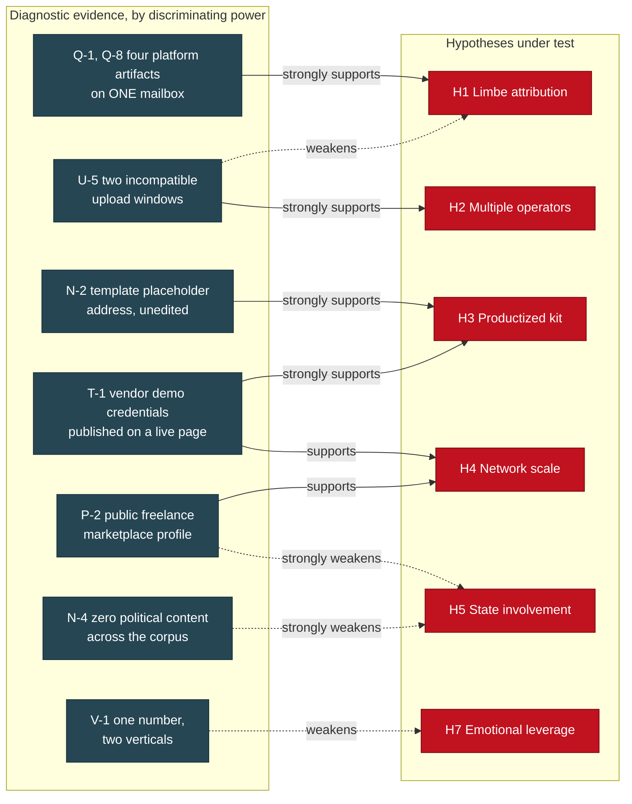

**Reading the matrix.** Two items carry most of the discriminating load. The published vendor demo credentials (T-1) and the untouched template placeholder (N-2) are close to dispositive for H3 and inconsistent with H5. The two incompatible upload windows (U-5) are the only evidence in the corpus that speaks directly to how many hands are on the keyboard, and it cuts against H1's strongest formulation at the same time as it supports H2. That tension is the most analytically interesting thing in the record.

---

### 4. Hypothesis 1: the operator layer is in Limbe, Southwest Region, Cameroon

#### 4.1 The pro-advocate case

Four platform artifacts and one timestamped physical-presence indicator converge on a single small coastal city.

| Signal | Source | Class |
|---|---|---|
| Recovery phone hint carrying the +237 country code | Samsung account registration (Q-1) | Registration metadata |
| Account country CM, created 2025-06-20 | Microsoft account (Q-1) | Registration metadata |
| Contributor coordinates 4.0091953, 9.2071428 | Google Maps contributor profile (Q-1, Q-8) | Platform geolocation |
| Dine-in lunch review of a named beachfront business in Limbe | Google Maps review, approximately August 2025 (Q-8) | Physical-presence assertion |

The convergence is the argument. Registration country, phone prefix, and contributor coordinates are all metadata and all spoofable or proxyable, and the record says so explicitly (Q-8). The review is a different class of claim: it asserts that the account holder was bodily at a specific small location, ordering lunch (Q-8). Metadata can be manufactured cheaply. A dine-in review of a named restaurant in a specific district of a small city is a different kind of lie to tell, and there is no reason to tell it.

The corroborating context is real. A previously unexplained francophone thread resolves once the operator layer is francophone: two French-provider mailboxes and a country-FR registration on an office suite all become ordinary rather than anomalous (Q-2). The same account's professional profile claims a United States location while the account operates from elsewhere, which is a documented misrepresentation by the operator rather than an inference about one (Q-1). The finding fits an established, previously prosecuted pattern rather than presenting as novel (Q-3).

The record also earns credit for correcting itself: an earlier draft placed the coordinates in a larger city roughly seventy kilometres east, and the correction is retained in place rather than quietly fixed (Q-8).

**Operational value.** For a referral this converts a generic and frequently triaged classification into a named city with four corroborating signals and a timestamped physical-presence indicator (Q-8). That is approximately the finest geolocation obtainable from open sources without compulsory process.

#### 4.2 The devil's advocate case

**The four signals are not four independent observations. They are four platform surfaces of one mailbox.** Every row above derives from account enumeration against a single address and its eleven platform registrations (Q-1). Counting them as four independent corroborations double-counts one underlying object. If that mailbox was purchased, resold, compromised, or operated by someone who is not the person taking deposits, all four rows fall together.

**Registration artifacts are cheap to spoof and cheaper to buy.** A country field on a free account is self-asserted. A recovery phone hint proves a number was attached at some point, not that it is held now. Contributor coordinates reflect where a device reported itself, and consumer VPN endpoints and residential proxy services are commodity products. The account-resale market for aged, geolocated platform accounts is mature. Nothing in the corpus tests whether this mailbox was originally provisioned by the person who later used it.

**The physical-presence indicator is weaker than its billing.** The record itself notes that the review prose is stylistically consistent with machine generation, and that the profile is a low-tier contributor account with one review and six answers, a shape consistent with points farming (Q-8). The corpus's defence is that points-farming accounts overwhelmingly review businesses near the operator (Q-8). That is a behavioural generalisation, not an artifact, and it is exactly the kind of reasoning this corpus demotes elsewhere.

**The corpus's own best evidence argues the mailbox does not speak for the network.** Two storefronts show incompatible working-hour signatures (U-5) and sit on different registrars, hosting, and nameserver pairs (R-4). The log states in terms that account-level evidence establishes where that mailbox's registrations originate, not that the same hands run every storefront (X-4 Q3). A geolocation of one node in a supply chain is not a geolocation of the chain.

**The onomastic support has already been withdrawn**, because names attached to infrastructure in this case are unreliable (X-4 Q3, V-4, A5c). What remains is the mailbox, and the mailbox is one node.

**[UNVERIFIED]** Any statement that the person who collected a deposit from a complainant is located in Limbe. Nothing connects the enumerated mailbox to a completed transaction with any complainant.

#### 4.3 Assessment

**[ASSESSED]** The account artifacts place *that mailbox's platform registrations* in Limbe, Southwest Region, Cameroon. Moderate confidence, and the confidence attaches to the mailbox rather than to the operation.

**[ASSESSED]** The corpus does not support extending that geolocation to storefront operators generally. Moderate confidence, resting on U-5 and R-4 rather than on positive evidence of a different location.

The honest formulation is the one the corpus already applies to its Bangladesh finding: this attests to where a service-layer account sits, not to where the person who took the money lives (analysis document 03 W3).

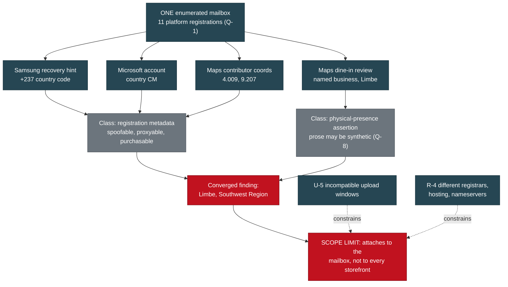

#### 4.4 What would resolve it

**Subscriber records.** Carrier subscriber data for the hinted recovery number, platform account records from the four services, and device and IP history from a preservation request (X-2 item 3). These are the only artifacts that separate present control from a purchased history, and the corpus is explicit that open-source collection has reached its ceiling on exactly this question (X-2 item 4; HANDOFF section 9). Second-order and cheaper: whether the enumerated mailbox appears in any complainant's message thread. If it does, the mailbox stops being an isolated node.

---

### 5. Hypothesis 2: one operator versus several

#### 5.1 The pro-advocate case for several

Two storefronts in the same network were built in working windows that cannot belong to the same person on the same schedule.

One storefront yielded 82 timestamped uploads, self-verifying because the filenames encode the same moment twice (U-5). Seventy-five of the eighty-two, which is 91 percent, fall between 22:00 and 03:00 UTC (U-5). Two bulk stocking sessions of 39 and 28 images built the inventory in the first week after registration, followed by a trickle and then nothing for seven weeks while the site kept taking inquiries (U-5).

The other storefront's entire image-upload session ran 10:11 to 11:44 UTC, eleven images in a continuous 93-minute stretch at a steady three to sixteen minute cadence, finishing 34 minutes before the domain was registered (U-4, U-5). That is morning in Europe and Africa and pre-dawn in the United States.

The windows do not overlap. **[ASSESSED]** Distinct, non-overlapping working patterns on two storefronts in the same network are consistent with distinct operators or distinct shifts drawing on a shared content-production toolkit (U-5). This is reinforced by infrastructure separation that has nothing to do with time: different registrars, different hosting stacks, different nameserver pairs, and in one case an entirely different platform and mail provider (R-1, R-4). The structural finding follows: different storefront operators are buying from the same marketplace, and a model describing one victim served by four vendors understates it (X-4 Q1).

#### 5.2 The devil's advocate case for one

**One person with an irregular schedule produces exactly this signature.** A fraud operator is not on a shift roster. Bulk-stocking a new storefront at night and harvesting images for the next one in the morning six weeks later is not a contradiction. The two windows are separated by four months of calendar time, and the corpus does not demonstrate that both patterns were ever active concurrently.

**Scheduled automation produces the same signature and is cheaper to explain.** Bulk uploads of 39 and 28 images in single sessions are as consistent with a script running against a queue as with a person clicking. If the upload leg is automated, the timestamp reflects the cron window, not a human's waking hours.

**Server clocks are not operator locations, and the corpus says so.** Upload timestamps are server-side (U-5). The two sites sit on different hosting stacks (R-4), so the two windows are not even measured against the same reference unless both hosts run correct UTC.

**An operator targeting a foreign market may deliberately work that market's hours.** The record raises this itself (U-5). The 22:00 to 03:00 UTC window maps to 18:00 to 23:00 US Eastern in the relevant month, which is precisely when a US buyer browses for a puppy.

**And the count is two.** Two windows on two storefronts, out of five sites, is a thin base for a claim about the size of an organisation. It supports "not demonstrably one" far better than any specific number.

#### 5.3 Assessment

**[ASSESSED]** At least two distinct working patterns exist. Moderate confidence. The evidence is self-verifying and the corpus treats it as one of the few conclusions bearing on how many people are involved (Z-10).

**[ASSESSED]** The evidence does not establish how many operators there are, and cannot. Low confidence in any specific count. The corpus's posture is correct: allege a shared criminal market with specific linked sub-clusters, not a single monolithic enterprise, because overclaiming one operation is the easiest thing to falsify and would discredit the rest (analysis document 03 W1).

**[HYPOTHESIS]** The most economical reading is a small number of storefront operators purchasing from a common vendor layer that supplies the persona pool, the templates, and the aged pages. Untested, though it predicts observable things.

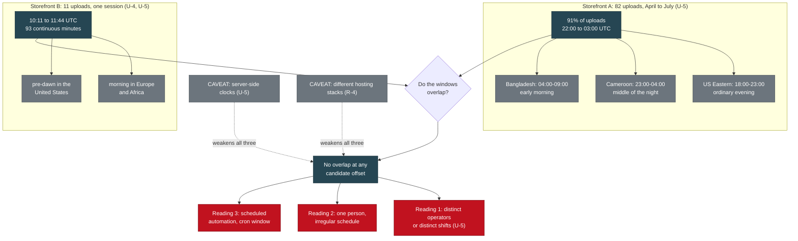

#### 5.4 What would resolve it

**Concurrency, not sequence.** Recover upload or edit timestamps from two storefronts demonstrably live at the same time. Two non-overlapping windows during a shared active period is a far stronger claim than two windows four months apart.

**Session-level records.** Platform login and device history from a preservation request would settle it directly (X-2 item 3).

**An automation test that costs nothing.** Inter-upload interval distribution across all 82 uploads. A human working through a listing page produces the irregular three to sixteen minute cadence already observed (U-4); a script produces tight, near-constant intervals. Unrun.

**A precisely placed solicitation timestamp.** The record identifies this explicitly: a solicitation event placed unambiguously in UTC is a data point about which working pattern that operator follows (Z-10). It currently cannot be placed, because the only artifact is a screenshot and a screenshot cannot resolve its own timezone (Z-29).

---

### 6. Hypothesis 3: a productized kit deployed unmodified, not a bespoke build

This is the strongest structural claim in the corpus and deserves to be argued at full strength before it is attacked.

#### 6.1 The pro-advocate case

**The vendor's demonstration credentials are published on the open internet.** A live shipping-company site renders an admin login page and prints beneath it, in plain text, a demo credential string (T-1). The string "(demo)" appears in the footer of every page in both English and German (T-1). The vendor's demonstration shipment record is still live in the tracking database (T-1, T-3). No login was attempted and none should be; the evidentiary value is entirely in the fact that the string is published (T-1; HANDOFF 2c). That is not an inference about a kit market. That is a purchased product deployed unmodified, visible in the shipped artifact (X-4 Q1).

**The paint is thinner than the template underneath.** The pet-services navigation is cosmetic; the page filenames beneath it are generic freight forwarding, so "Ferry Ground Transport" is ocean-freight, "Boarding Layover Care" is warehousing, and "Pet Travel Insurance" is cargo-insurance (T-2). The quote form asks a family relocating an animal for their company name and cargo type (T-2). Four image pairs on that site are byte-identical duplicates under different filenames, and one of them is a photograph of a shipping container truck saved as the pet-carrier hero image (T-2).

**A second, unrelated brand shipped a different vendor's placeholder.** An archived capture of another site in the family shows its contact mailto resolving to a demonstration placeholder address from a well-known commercial template (N-2). Two vendors, two unedited placeholders, one methodology.

**The unedited-artifact table is long and each row is arithmetic rather than interpretation.** Alt text naming a completely different kennel in a different state (A2). A live stat counter reading zero satisfied clients (A-7). A self-referential copyright line naming a throwaway domain as its own publisher (A3). A dated placeholder image rendering as a product photo (analysis document 04 S3). A Terms page claiming it was last updated 27 days before the domain existed, alongside three blog posts dated before the domain existed (T-4). A fabricated corporate history claiming a founding fifteen years before the registration record, with four executives who have no photographs (T-4).

**Content harvesting is self-documenting.** One storefront never renamed the photographs it took, so the upload paths retain the source site's filenames and marketplace listing IDs (U-3). Eleven of twelve images were uploaded in a continuous 93-minute session finishing 34 minutes before the domain was purchased (U-4). Content first, domain second.

**The persona pool is a shared asset.** The same fabricated testimonial names recur across independent domains on different hosting stacks with different assigned cities, and one persona appears four times across three domains, including as the recipient in the template vendor's own demo shipment record (Q-5, S-3, T-3, U-7). One site carries two visibly different generations of fabricated testimonials on a single page, indicating two separate content passes (U-7).

**The replacement cadence is industrial.** Registry records show continuous storefront replacement every four to ten weeks across at least five months, with three domains already deregistered and one storefront registered six days before the file was compiled (R-1, R-2).

**[ASSESSED]** This is a purchased-component operation. High confidence. It rests on artifacts the operators cannot retract, because they are captured and hashed (X-2; HANDOFF section 9).

#### 6.2 The devil's advocate case

**Commercial templates are sold to everyone, and using one proves nothing about who you are.** The corpus has already over-read foreign-language template artifacts twice and corrected itself both times (A3c, A3e; HANDOFF 2d). Template evidence has a history in this file of looking more probative than it is.

**"Productized" and "coordinated" are different claims, and the first does not imply the second.** Ten thousand unrelated people buying the same freight template and failing to edit the footer would produce exactly this artifact set on ten thousand unrelated sites. The unedited placeholder is evidence about the vendor's customer base, not about whether these sites share an operator. The corpus's own counter-thesis makes the point: the rebuttal must rest on the specific-shared, not the generic-shared (analysis document 03 C1).

**The strongest cross-network linkage in the file may itself be a template artifact.** The persona pool is the load-bearing linkage, explicitly substituted for the discredited shared-IP claim (R-4, Q-5). But one of those personas appears as the recipient in the template vendor's own demonstration seed data (T-3). If the persona names ship *with the kit*, two sites sharing them proves they bought the same kit and nothing else. **[UNVERIFIED]** That the persona pool is operator-generated rather than vendor-shipped. The corpus does not test it, and T-3 is a live reason to doubt it.

**The kit-deployment count is unmeasured.** The case for productization at scale would be far stronger with a number, and the cheapest way to get one, an exact-phrase search on the published demo-credential string, is listed as the highest-yield unrun pivot in the file (HANDOFF item 9). Until it is run, "this is a product" is well evidenced and "this product is widely deployed" is not.

#### 6.3 Assessment

**[ASSESSED]** The sites are purchased kits deployed with minimal or no modification. High confidence. This survives the devil's advocate intact, because the demo credential string and the demo shipment record are properties of the shipped artifact and require no inference at all.

**[ASSESSED]** Productization does not by itself establish common operation across brands. Moderate confidence, and this is where the pro-advocate case overreaches if left unchecked.

**[HYPOTHESIS]** The persona pool is operator-generated and therefore remains a valid cross-network linkage. Moderate confidence, and it is the single most consequential untested assumption in the corpus, because the shared-IP and shared-phone linkages were both already withdrawn (R-4, S-6, V-5) and the persona pool is what replaced them.

#### 6.4 What would resolve it

1. **Exact-phrase search on the published demo-credential string** (HANDOFF item 9). Returns the deployment count. Cheapest high-value action in the file.
2. **Inspect the template vendor's demonstration data set.** If the recurring persona names ship in vendor seed data, the persona linkage collapses and a large part of the cross-network case goes with it. If they do not, the linkage hardens substantially.
3. **Certificate transparency pulls and favicon hashing** across the domain family (blind-spots review 3.5; D13 B9). Certificate batches issued together are linkage that survives hosting changes.

---

### 7. Hypothesis 4: network scale

#### 7.1 The pro-advocate case

The defensible scale thesis is productization and measurable deployment count. It is not money and it is not a domain tally.

What is measurable and in hand: five sites in the immediate network, four live and one reduced to a working mailbox with live MX, live SPF, and a certificate renewed ten days before capture (U, R-3). Page recycling is documented rather than assumed, with one page created for an unrelated commercial vertical, renamed the same day, then converted ten weeks later into a personal-name identity carrying a stolen photograph (N-1), and another cycling through a personal name, viral-video aggregation, news, religious content, and finally pet rescue while carrying an inherited follower base (B-15). Sock-page admin rosters were captured directly before the network began locking group and friend lists down (B-13, X-2).

Cross-vertical reuse is documented at the identifier level: one published phone number is simultaneously the sole contact for a fraudulent pet storefront and the WhatsApp handle in the bios of two live gray-market peptide accounts on a second platform, with a third account in that set already removed for what its own bio language marks as ban evasion (V-1, V-3). One storefront in the wider corpus is not a pet site at all; its own header advertises clothing, furniture, toys, baby products, and sports merchandise, with puppy listings as auto-generated filler priced at template defaults no living animal is sold for (A3). On that one storefront, more than twenty third-party domains had images served directly from their own servers, each an independent victim of bandwidth theft and copyright infringement with independent standing to act (A3b).

Replacement tempo is registry-attested: four to ten weeks per storefront across at least five months, three domains already deregistered, one storefront six days old at capture (R-1, R-2).

**[ASSESSED]** This is a repeatable production line rather than a single site. High confidence. **[ASSESSED]** Page identities are commodity inventory rather than purpose-built fronts. High confidence (N-1, B-15, X-4 Q2).

#### 7.2 The devil's advocate case, and two claims that must be killed

**A domain count and a country count are circulating inside our own deliverables with nothing behind them.** A figure asserting a domain total and a country total appears in eight documents in the D-series, including the submission kit and the master packet. It appears **zero** times in `EVIDENCE_LOG.md`. There is no artifact behind it anywhere in the record. **[UNVERIFIED]**, and that label is generous. The figures are not reproduced in this brief, not even in order to rebut them, and no version of them should reach a validator.

**The propagation is itself the finding, and it is the most instructive thing in this section.** A number that entered at the deliverable layer and replicated across eight documents without ever touching the evidence layer is precisely how a corpus talks itself into a scale claim it cannot defend. It is the same failure mode the record already caught once and corrected as a documented custody exception: a claim living only in a derived, machine-consumed artifact while contradicting the narrative record beneath it (Z-23, Z-26). Corrections that live only in prose do not reach the artifacts that build the filings. **The productization thesis exists to replace that number, and it is stronger than the number would have been even if the number were true, because every element of it is captured and hashed.**

**Third-party market research is not our measurement and must never be transposed.** Published research on the wider fake-storefront market reports franchise networks with tens of thousands of domains resolving to a few dozen IP addresses (A3d). Those are other people's numbers about a market. They establish that this shape of operation exists at industrial scale; they say nothing about the size of *this* network. **We have no count of our own**, and saying so plainly is better analysis than borrowing one.

**Several country claims are already known to outrun the evidence.** The counter-thesis identifies which geographies are evidenced and which are not, and directs that the unevidenced ones be produced or dropped before anything is filed or published, because a single unsupported country claim invites the response that the analyst is seeing patterns everywhere (analysis document 03 W2). One account-spawn-rate figure also in circulation has no measurement behind it at all and the counter-thesis directs that it be derived or removed (analysis document 03 W4). It is not repeated here.

**And the dollar figure must not be written.** There is no aggregate loss estimate in this brief and there will not be one in any version of it. The corpus does not support one (redaction contract section 4; D13; Z-18). The temptation is strong precisely because a dollar figure is what makes a fraud story legible to a general reader. Resisting it is not squeamishness: a number that cannot be reproduced is the easiest thing for a hostile reader to attack, and when it falls it takes the well-evidenced findings with it. What the corpus does support is narrower: published deposit asks and price ranges are recoverable from the site captures (U-8), and the template vendor's own demo record reveals the intended fee scale for the shipping leg (T-3). Neither is a loss.

**The devil's advocate case against the scale thesis itself**, so it is not left unattacked: five sites and two page-recycling case studies is a small sample. Page recycling is a documented commodity market anyone can buy from, so observing recycled pages establishes that these operators are customers of that market, not that they run it. And the cross-vertical phone number is one number; the corpus's own correction says phone numbers are working infrastructure that moves between operations and carries stale third-party history (V-5), which cuts against reading a single shared number as a measure of anything's size.

#### 7.3 Assessment

**[ASSESSED]** The productization argument is the defensible scale thesis. High confidence. **[ASSESSED]** Domain and country counts beyond the corpus's own enumeration are unreproducible as the record stands, and the specific figure circulating in the D-series is unattested. High confidence in that negative. **[ASSESSED]** No aggregate loss figure is supportable, and it is a binding publication constraint independent of confidence (redaction contract section 4).

#### 7.4 What would resolve it

**Structural enumeration by URL pattern** across the storefront family (D13 B6), named in the record as the way the scale claim gets its receipts, and unrun. **The demo-credential dork** (HANDOFF item 9), which measures deployment of one kit across every vertical rather than domains in one vertical. **Registry creation-date clustering** across the enumerated set (D13 B2), where dates arriving in batches are linkage as well as scale.

---

### 8. Hypothesis 5: state involvement or state tolerance

**Status before the argument begins: this hypothesis has already been assessed in our own record and concluded against.** N-4 evaluates it on the evidence and finds that the evidence supports a commercially motivated page-farming and fraud operation and does **not** support a state-influence attribution (N-4). It is run pro-advocate and devil's advocate below because it continues to circulate and because a consumer is entitled to see the reasoning rather than the verdict. But it is not presented as open. The devil's advocate side has already won inside our own record, and the countervailing evidence at N-4 is the reason.

#### 8.1 The pro-advocate case, presented fairly

The underlying concern is legitimate and the record preserves it rather than dismissing it (N-4). The strongest form of the argument is not that political content exists. It is that political content is not what you would expect to see yet.

**The capability is genuinely dual-use.** The commodity market in aged and repurposed pages supplies fraud operations and influence operations alike, and this is documented in open-source research on both (N-4). Described by capability, the machine can mass-produce and age credible social identities, generate synthetic faces and brand assets on demand, harvest real identities and social graphs at scale, move value across borders, and cloak against automated scanners (D10 section 2). That capability set is payload-agnostic (D10 section 2).

**Some observed behaviour is audience-building rather than retail.** One page shows a follower-to-following ratio consistent with aggressive outbound following, which is how you build an audience and not how you run a shop (N-4). One page's name history passes through viral-video aggregation and a news-adjacent category before arriving at pet rescue (N-4, B-15), and news aggregation is influence-adjacent tooling. **A page can be repointed at any time**: the mechanical action that turned a commercial page into a personal-name identity in ten weeks (N-1) is the same action that would turn a rescue page into a cause page.

**The geography is not neutral**, overlapping jurisdictions with documented mass online-fraud ecosystems and weak enforcement, with a European registered entity on the payment leg (D10 section 4). **And the honest form of the timing argument is uncomfortable but real:** a pre-activation commercial ramp looks identical to ordinary fraud until the payload is loaded, so the current absence of political content is what the hypothesis predicts before activation (D10 section 3).

#### 8.2 The devil's advocate case, which has already prevailed at N-4

**The monetization is immediate, direct, and asset-burning.** Deposits, escalating fee ladders, and a live card-capture checkout routed through a real merchant account (N-4). Influence operations do not typically monetize assets this way, because doing so burns the asset and attracts payment-processor scrutiny (N-4). Every dollar extracted is an identity spent.

**The staffing is gig labour on a public marketplace.** The single account-level identity recovered in the case resolves to a freelance profile on an open marketplace advertising social media marketing services, with a stated location, a stated timezone, and an edit-dated profile photograph (P). The record calls this the strongest evidence to date against the state-influence hypothesis, for the obvious reason: influence operations do not staff via public freelance marketplaces with searchable profiles (P-2).

**The Chinese-language artifact is a commercial template, purchasable by anyone, and this file has already corrected two over-readings of exactly that kind of evidence** (N-4, A3c, A3e). Kit authorship is not operator attribution (D10 section 4). **The platform-attested location is not China**, across two independent captures of a South Asian managing location for the page layer (A2-11, B-15, N-4).

**The content is apolitical across the entire corpus**, with nothing across 140 files and 38 account clusters containing political messaging, candidates, parties, or election themes (N-4; analysis document 03 C2). **And the category-hopping is better explained as commerce**: pages repurposed to whatever monetizes this week is the signature of commodity page flipping (N-4). The strategic assessment presents the same pivot as evidence of pre-positioning (D10 section 3). One observation, two readings, and the commercial one requires no additional assumptions.

**On the unfalsifiability problem.** The argument that absence of political content is what the hypothesis predicts is structurally unfalsifiable in the short run: it makes every possible present observation consistent with the theory. That is not a reason to dismiss the underlying concern, and the strategic assessment is explicit that it labels itself a hypothesis and pairs every escalation claim with what would confirm and disconfirm it (D10 reading note, D10 section 7). An intelligence consumer should price it accordingly.

#### 8.3 Assessment

**[ASSESSED]** The evidence supports a commercially motivated page-farming and fraud operation and does not support a state-influence attribution. Moderate to high confidence. This restates N-4's own conclusion and the devil's advocate case above is the reason (N-4, P-2; analysis document 03 C2).

**[HYPOTHESIS]** The infrastructure could be repurposed or resold for influence work. This is a capability observation, not an attribution, and it is worth carrying to a recipient as an infrastructure concern precisely because it asserts nothing the evidence cannot support (N-4; D10 section 5).

**[UNVERIFIED]** State direction, state tasking, or state tolerance of this network by any government. Nothing in the corpus speaks to it, and the strategic assessment itself classes state direction as unproven opinion (D10 section 7).

#### 8.4 What would resolve it, and the cheap decisive test is unrun

**The Meta Ad Library check.** Free, no login, and it surfaces whether any page in the network ever bought paid reach, with spend, targeting, and reach attached (N-4; D13 B3). Paid political amplification is separately archived and searchable (N-4). The record describes it as the single cleanest test of the hypothesis and as cheap and decisive (N-4; D13 B3).

**It has not been run across the network.** One data point exists: a single page capture shows that page not currently running ads (N-4). That is one page, at one moment, and it is a present-tense field rather than a history. **[ASSESSED]** The most decision-relevant open item on this hypothesis is free, takes an afternoon, and would either materially strengthen or materially weaken it. That it remains unrun while the theory continues to circulate is the clearest tradecraft gap in the file.

Secondary tests, all named in the record: audit outbound following lists rather than follower counts, check whether any page previously carried political content in its name history since Page Transparency shows this and cannot be edited, and look for coordinated posting timing across unrelated pages (N-4).

---

### 9. Hypothesis 6: one receiving account or a mule network

#### 9.1 What is actually established

This section is written with unusual care, because the record's most consequential self-correction lives here.

**ESTABLISHED:** on one date in August 2026 the operators sent bank account details to the **investigator** and solicited a wire transfer (Z-18). The routing number and the institution verify against the routing directory (Z-2, Z-24).

**NOT ESTABLISHED:** that any complainant ever sent money to that account; that the account received complainant funds; that the named holder knowingly participated in anything (Z-18). The account that received complainant money remains unidentified (Z-18; D13 B1 supersession note).

The account number is not published here and appears in no public artifact (redaction contract section 1). The named holder is not identified here and is not to be named as a suspect (Z-4; redaction contract section 2).

The solicitation arrived from a page already documented in the corpus a day earlier as recycling inventory: created for an unrelated commercial vertical, renamed the same day, and renamed again to a personal-name identity **twelve days** before the solicitation (N-1, Z-7, Z-8). Both the page identifier and its rename history are cleared for publication (redaction contract section 5).

**That finding is PROVISIONAL.** The supporting screenshot is filed, hashed, and under continuous integrity verification (Z-29), so the report is no longer uncorroborated. That does not make the finding established. A screenshot is a rendering produced by a party to the investigation; it carries no message ID, no server-side timestamp, and nothing that independently ties it to the account it depicts (Z-29). The finding becomes established when the platform's own export lands and is filed (Z-15, Z-29).

The timestamps illustrate the discipline. Capture metadata and filesystem modification time agree on when the investigator captured the screen. The time displayed inside the rendering is a picture of a clock and is authoritative for nothing on its own (Z-29). The one-hour daylight-saving ambiguity in the displayed value cannot be resolved from the screenshot, because a screenshot cannot resolve its own timezone (Z-10, Z-29).

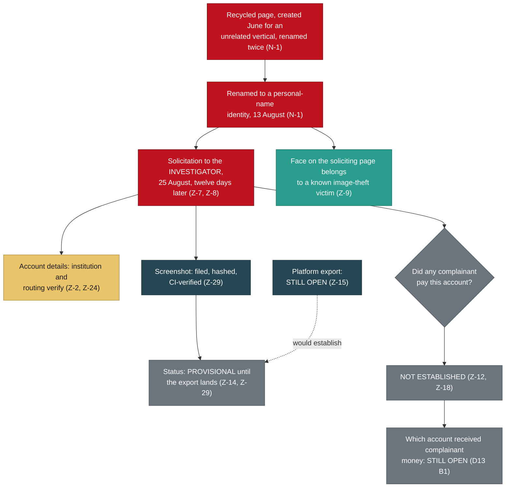

#### 9.2 The pro-advocate case for a mule network

**All three readings of the account holder fit the evidence equally well** (Z-4): a recruited money mule, an identity-theft victim, or an operator or an operator's associate. That is the record's stated position and it has not moved. The pro-advocate case for the mule reading rests on three things.

**First, the recruitment channel is documented on the operators' own infrastructure.** The fake shipping company runs a live careers page advertising four roles, including a remote customer support position, with an upload form collecting full name, email, phone, a resume file, and a cover letter (T-6). Resumes carry home addresses, employment history, education, and frequently dates of birth. The record classes this as document and identity harvesting aimed at job seekers, and notes that the remote support listing fits the standard money-mule recruitment pattern (T-6).

**Second, the account shape is consistent with remote onboarding.** A holder address in one country paired with a routing number in another is not a branch relationship (Z-3). This is explicitly relabelled: **[HYPOTHESIS]** the account is a sponsored fintech program rather than a branch relationship, which would mean remote onboarding, and an in-person opening is not excluded by anything currently in the file (Z-13). Remote onboarding is the channel through which stolen and synthetic identities pass most easily (Z-3).

**Third, every identity this network has displayed so far has been stolen or fabricated** (Z-4): breeder photographs, an executive roster, testimonial personas, and an entire harvested photo album. A real name attached to a remotely-onboarded account, in a network built entirely from other people's identities, is not evidence that the person consented to its use (Z-4).

#### 9.3 The devil's advocate case

**The sample size is one, and it is the wrong one.** A single account, solicited from the investigator rather than from a complainant, cannot distinguish a mule network from a single receiver from an operator's own account. The record frames the discriminating question correctly: whether other accounts were given, because a second account name would establish a mule network rather than a single receiver (Z-6).

**The rail mismatch is a live alternative explanation.** The solicited account is an ACH and wire account at a chartered institution; the rails anticipated from complainant intake are consumer payment apps (Z-12). Those are different rails and possibly different accounts, and three readings remain open: one account across all victims and rails, rotating accounts with complainants having paid earlier and different ones, or this account reserved for wire and ACH with app rails handled separately (Z-12).

**The mule reading may be motivated reasoning.** It is the humane assumption, and humane assumptions deserve the same scrutiny as damning ones. Reasoning from a base rate to an individual case is exactly the move this corpus refuses elsewhere when the direction of the inference is unflattering.

**And the careers page proves capability, not use.** That this network operates a mule-recruitment-shaped channel does not establish that the account holder came through it, or that any mule was ever recruited. Nothing links the two.

#### 9.4 Assessment

**[ASSESSED]** The holder's status is genuinely undetermined and all three readings survive. High confidence in the undeterminedness itself, which is a finding rather than an absence of one. **[ASSESSED]** The account and the person are different evidentiary objects and must never be conflated: the number, the routing, and the institution are hard artifacts, while the person is a name on a remotely-opened account (Z-4).

**[UNVERIFIED]** That a mule network exists in this operation, that a single receiving account serves it, or that the named holder occupies any particular role.

**[HYPOTHESIS]** Given a documented recruitment-shaped channel on the operators' own infrastructure (T-6), the mule reading has slightly more supporting structure than the other two. Low confidence, offered so it can be attacked rather than relied on.

#### 9.5 What would resolve it

**Subscriber and KYC records from the institution, obtained through process** (Z-4, Z-24). Nothing in open source resolves this and the record says so directly (Z-4). **Whether other accounts were given, to anyone**, since a second holder name converts a single receiver into a network (Z-6). **Which complainant, if any, sent to which account, and on what rail** (Z-6). **Transfer dates**, which the record now names as the number one collection priority in the entire case, because originating-institution recall and the federal recovery pathway both run on clocks that started when funds moved (Z-5, Z-16, Z-17). Recovery process differs sharply by rail and several rails are not reversible (Z-20).

---

### 10. Hypothesis 7: why puppies

#### 10.1 The pro-advocate case: emotional leverage

The vertical is chosen for the psychology, and the artifacts show the mechanism.

**The funnel is built for sustained belief, not a single hit.** The sequence is application, then deposit, then escalating transport, crate, and insurance fees, with the victim referred onward to a shipping company that is the same operation (A2, Q-6, U-8). One storefront publishes the clearest version: a five-step adoption process, a 24-hour application turnaround, a fixed deposit that secures the chosen animal, and a delivery promise to all fifty states (U-8).

**The retention mechanism is the strongest single artifact for this hypothesis.** The fake shipper's tracking database is real and populated, not a generator that fabricates output for any input; arbitrary numbers return not-found (T-3). When a victim pays, they can be issued a genuine tracking number that produces a live map, a moving aircraft position, a named coordinator, and a line reading that payment is complete (T-3). The record's assessment is direct: this is what keeps a victim believing and paying escalating fees for weeks instead of calling their bank on day three (T-3).

**The bait is priced to be irresistible rather than plausible**, well below market for every advertised breed (A2, U-8). The harm attaches to something the buyer has already begun to love: the animal is named, photographed, and reserved. The victim population is self-selecting for trust, because families looking for a puppy are not looking for a counterparty.

**[ASSESSED]** The vertical is exploited for emotional leverage and the funnel is engineered around sustained belief rather than a single extraction. High confidence on the mechanism, which is documented in captured artifacts.

#### 10.2 The devil's advocate case: the vertical is fungible

**The same identifier sells peptides.** One published phone number is simultaneously the sole contact for a fraudulent pet storefront and the WhatsApp handle in the bios of two live gray-market peptide accounts on a second platform (V-1). A shared WhatsApp number is not shared infrastructure in the way a shared IP is; it is a single account bound to one registered number, so whoever answers it answers for both verticals (V-2). The record's conservative formulation is that whether this reflects one person, one crew, or a resold number is a question subscriber records answer and open-source research does not (V-2), and the subsequent correction downgrades phone numbers generally as operator identifiers (V-5). Even at its weakest, that artifact says the *contact channel* crosses verticals. A crew that has to be sold on the emotional pull of puppies does not also run injectable research chemicals off the same handle.

**One storefront in the corpus is not a pet site at all.** Its own header advertises clothing, furniture, toys, baby products, and sports merchandise; the puppy listings are auto-generated filler built from image-search result strings, priced at uniform template defaults, with identical five-star ratings and no individual reviews (A3). The puppies there are search-engine bait attached to a card-harvesting checkout, which is a different fraud type entirely (A3).

**The pages themselves have no vertical.** A page created for one commercial vertical became a personal-name identity in ten weeks (N-1). Another passed through viral video, news aggregation, and religious content before arriving at pet rescue while carrying an inherited audience (B-15). The pet framing is packaging; the audience is the commodity (blind-spots review section 2).

**So the emotional-leverage thesis answers the wrong question.** It explains why a puppy funnel converts well. It does not explain why *this* operation is in puppies, because this operation is in whatever is converting.

#### 10.3 Assessment

**[ASSESSED]** Emotional leverage explains the funnel design and the retention mechanism. High confidence. **[ASSESSED]** Emotional leverage does not explain vertical selection, because the same infrastructure and in at least one case the same contact identifier serve unrelated verticals. Moderate to high confidence (V-1, V-5, A3, N-1, B-15).

**[HYPOTHESIS]** Vertical selection is driven by conversion rate and enforcement friction rather than by the emotional properties of the product, with the pet vertical currently favoured because it combines high emotional commitment, an above-average tolerance for shipping delays, and buyer expectations that normalise paying a stranger before receiving anything. Untested.

**A consequence worth stating.** Three victim classes are documented, not one: buyers, job applicants who uploaded identity documents to the fake shipper's careers page, and purchasers on the second vertical (X-4; HANDOFF section 7). Framing this as a pet-fraud case understates the harm surface and under-serves two of the three classes.

---

### 11. Analytic confidence levels, consolidated

| # | Judgment | Marker | Confidence | Load-bearing evidence |
|---|---|---|---|---|
| 1 | Sites are purchased kits deployed with minimal modification | **[ASSESSED]** | High | T-1, T-2, N-2, T-4, U-3 |
| 2 | Durable linkages are at the content layer, not infrastructure | **[ASSESSED]** | High | R-4, S-6, V-5, Q-5 |
| 3 | Page identities are commodity recyclable inventory | **[ASSESSED]** | High | N-1, B-15 |
| 4 | The funnel is engineered for sustained belief | **[ASSESSED]** | High | T-3, Q-6, U-8 |
| 5 | Commercially motivated, not state-directed | **[ASSESSED]** | Moderate to high | N-4, P-2 |
| 6 | At least two distinct working patterns exist | **[ASSESSED]** | Moderate | U-5, R-4 |
| 7 | The enumerated mailbox's registrations sit in Limbe | **[ASSESSED]** | Moderate | Q-1, Q-8 |
| 8 | That geolocation does not extend to all storefront operators | **[ASSESSED]** | Moderate | U-5, R-4, X-4 Q3 |
| 9 | Emotional leverage does not explain vertical selection | **[ASSESSED]** | Moderate to high | V-1, A3, N-1 |
| 10 | The account holder's role is genuinely undetermined | **[ASSESSED]** | High | Z-4, Z-24 |
| 11 | The persona pool is operator-generated, not vendor-shipped | **[HYPOTHESIS]** | Moderate | Q-5; T-3 against |
| 12 | The account is a sponsored fintech program, remotely onboarded | **[HYPOTHESIS]** | Low to moderate | Z-3, relabelled at Z-13 |
| 13 | The infrastructure could be repurposed for influence work | **[HYPOTHESIS]** | Capability claim | N-4; D10 section 2 |
| 14 | Vertical selection is driven by conversion economics | **[HYPOTHESIS]** | Low | V-1, A3, N-1 |
| 15 | A mule network exists behind the solicited account | **[UNVERIFIED]** | None | none |
| 16 | The D-series domain and country figure | **[UNVERIFIED]** | None | zero support in the evidence log |
| 17 | State direction, tasking, or tolerance | **[UNVERIFIED]** | None | D10 section 7 classes it opinion |
| 18 | Any complainant paid the solicited account | **NOT ESTABLISHED** | None | Z-12, Z-18 |

---

### 12. Collection gaps, ranked by decision value

Ranked by how much each closure changes a decision, not by how interesting it is. A gap whose closure changes nothing is not a priority however large it looks.

```mermaid
flowchart TD
  classDef scamInfra fill:#c1121f,stroke:#7a0b14,color:#ffffff;
  classDef victims fill:#2a9d8f,stroke:#1d6f66,color:#ffffff;
  classDef cleared fill:#6c757d,stroke:#495057,color:#ffffff;
  classDef evidenceNode fill:#264653,stroke:#16303a,color:#ffffff;
  classDef moneyNode fill:#e9c46a,stroke:#b08d3c,color:#1a1a1a;

  startNode{"Is the decision<br/>time-bound?"}
  recoveryBranch{"Are recovery remedies<br/>still procedurally live?"}
  transferDates["GAP 1: transfer dates<br/>Decides recovery eligibility (Z-5, Z-16)"]
  railPerRail["GAP 2: rail per transfer<br/>Decides WHICH remedy; several<br/>rails are irreversible (Z-20)"]
  evidenceBranch{"Does it rest on a<br/>provisional finding?"}
  metaExport["GAP 3: platform export of the<br/>solicitation thread. Converts<br/>PROVISIONAL to established (Z-15, Z-29)"]
  preservation["GAP 4: preservation requests.<br/>Privacy settings do not delete<br/>underlying records (X-2)"]
  attributionBranch{"Does it rest on<br/>attribution?"}
  subscriberRecords["GAP 5: subscriber and KYC records.<br/>Only path to control and role (Z-4)"]
  transparencyPanel["GAP 6: Page Transparency on the<br/>successor account (X-1)"]
  cheapBranch{"Is there a free test that<br/>flips a whole hypothesis?"}
  adLibrary["GAP 7: Ad Library sweep. Cheap and<br/>decisive on H5 (N-4, D13 B3)"]
  credentialDork["GAP 8: exact-phrase search on the<br/>demo credential. Measures kit<br/>deployment (HANDOFF 9)"]
  urlEnumeration["GAP 9: structural URL enumeration.<br/>Makes scale reproducible (D13 B6)"]
  deferNode["DEFER: enumeration backlog.<br/>Open, not blocking (AMENDMENT 1 A3)"]

  startNode -->|"yes"| recoveryBranch
  startNode -->|"no"| evidenceBranch
  recoveryBranch -->|"unknown, and that is the problem"| transferDates
  transferDates --> railPerRail
  railPerRail --> evidenceBranch
  evidenceBranch -->|"yes"| metaExport
  metaExport --> preservation
  evidenceBranch -->|"no"| attributionBranch
  preservation --> attributionBranch
  attributionBranch -->|"yes"| subscriberRecords
  subscriberRecords --> transparencyPanel
  attributionBranch -->|"no"| cheapBranch
  transparencyPanel --> cheapBranch
  cheapBranch -->|"yes"| adLibrary
  adLibrary --> credentialDork
  credentialDork --> urlEnumeration
  cheapBranch -->|"no"| deferNode

  class startNode,recoveryBranch,evidenceBranch,attributionBranch,cheapBranch,deferNode cleared
  class transferDates,railPerRail moneyNode
  class metaExport,preservation,subscriberRecords,transparencyPanel,adLibrary,credentialDork,urlEnumeration evidenceNode
```

| Rank | Gap | Resolves | Cost | Why this rank |
|---|---|---|---|---|
| 1 | Transfer dates, per transfer | Whether recovery is available at all | Ask the complainants | Named the number one collection priority; the clocks already started (Z-5, Z-16, Z-17) |
| 2 | Payment rail per transfer | Which remedy applies | Ask the complainants | Remedies differ sharply by rail and several are not reversible (Z-20) |
| 3 | Platform export of the solicitation thread | Converts the identity-to-money bridge from provisional to established, resolves the timezone | One export | Two load-bearing findings are gated on it (Z-14, Z-15, Z-29) |
| 4 | Preservation requests on operator accounts | Everything downstream of account control | One request | Configuration changes do not delete underlying records, and the network is hardening (X-2) |
| 5 | Subscriber and KYC records | H1 and H6 simultaneously | Requires process | The only path; open source has reached its ceiling (X-2; HANDOFF section 9) |
| 6 | Page Transparency on the successor account | Operational continuity in the control layer | Free, perishable | Most productive artifact class in the investigation, first to vanish (X-1, B-15) |
| 7 | Ad Library sweep across the network | H5, in one direction or the other | Free, an afternoon | Cheap and decisive, and unrun (N-4; D13 B3) |
| 8 | Exact-phrase search on the demo credential string | Kit deployment count, feeding H3 and H4 | Free | Highest-yield unrun pivot in the file (HANDOFF item 9) |
| 9 | Structural URL enumeration of the storefront family | Makes any scale claim reproducible | Low | Explicitly how the scale claim gets its receipts (D13 B6) |
| 10 | Provenance metadata on non-platform-processed assets | Upgrades machine-generation findings from inference to documentary | Low | Only files that never passed a metadata-stripping pipeline are checkable (D13 B10) |
| 11 | Reverse image search sorted oldest-first | Proves theft direction definitively | Low | Matters for victim notification and any rights-based remedy (D13 B7) |
| 12 | Carrier and line-type lookups | Separates present control from stale history on the phone identifiers | Low | More valuable after the phone-identifier downgrade, not less (V-5) |

---

### 13. What would falsify our own thesis

A brief that cannot state this is advocacy, not analysis. Each item below would damage or destroy a judgment this brief makes, and each is observable.

**1. The persona pool turns out to ship with the template.** If the recurring fabricated testimonial names are vendor seed data rather than operator output, the principal surviving cross-network linkage collapses. This is not speculative: one of those personas already appears as the recipient in the vendor's own demonstration record (T-3). The shared-IP and shared-phone linkages have already been withdrawn (R-4, S-6, V-5). If the persona pool goes, the claim that these brands are connected at all rests on very little. **This is the single most dangerous open question in the file and it is cheap to test.**

**2. Structural enumeration returns a small number.** The strategic assessment's own falsifiability table states the disconfirming condition plainly: if the network turns out to be fewer than a dozen sites, the disproportionate-scale argument dies (D10 section 7). Every strategic inference built on scale dies with it. Note that this brief has already refused the unattested D-series figure, so it is exposed here only to the extent the productization thesis itself depends on breadth.

**3. The platform export shows the solicitation did not come from the documented page.** The bridge between the identity layer and the money layer rests on one page and one screenshot (Z-7, Z-8, Z-29). If the export contradicts it, the twelve-day cycle time and the "page pool is the delivery mechanism" conclusion both fall (Z-14).

**4. Subscriber records place the enumerated account holder outside Cameroon, or show the account was purchased.** H1 falls entirely, and the corpus loses the finest geolocation it has.

**5. The Ad Library sweep returns paid political amplification.** The commercial-motivation assessment at section 8.3, and N-4's conclusion beneath it, both fall, and the hypothesis this brief treats as already decided reopens.

**6. Complainant records show payment to accounts unrelated to anything in the corpus.** The money section's relevance shrinks to a single solicitation directed at the investigator, which is a much smaller finding than it currently reads as.

**7. Concurrency evidence shows one operator working both windows.** H2 falls, and with it the market-of-services framing the whole structural model rests on (analysis document 03 W1).

**8. The retained disproofs turn out to have been withdrawn too aggressively.** The corpus withdrew shared IP, FTP co-tenancy, phone-number identity, a square-dimension AI indicator, and error-level analysis as probative (HANDOFF 4b, M-2, W-3). If any of those were sound, the network is more tightly linked than this brief says, and this brief is wrong in the cautious direction. That is the failure mode this corpus is built to have, and it should be named as a failure mode rather than presented as a virtue.

---

### 14. Tradecraft notes and known biases in the underlying corpus

Offered so a consumer can discount appropriately rather than uniformly.

**What the corpus does unusually well.** It retains its disproofs: nine findings that make the case smaller or weaker are preserved by explicit instruction rather than sanded off during packaging (HANDOFF 2d). It maintains a victim and suspect firewall and moves nobody across it without new evidence (HANDOFF 2a). It records a significant negative result as probative rather than discarding it (K-4). It refuses to fabricate identifiers for persons depicted and declines facial comparison entirely (HANDOFF 2b, X-1b). It corrects itself in place with the prior text retained, including a geographic correction of roughly seventy kilometres (Q-8) and a supersession that reverses the headline of an entire section (Z-18).

**Where the corpus is exposed.**

1. **Selection bias from the collection start point**, as described in section 1.2.
2. **Three linkage claims advanced and withdrawn** (R-4, S-6, V-5). The pattern is consistent enough that the record states the general principle itself: durable linkages are at the content layer and infrastructure linkages have failed every test (V-5; HANDOFF 4b). A reader should apply that same scepticism to the content-layer linkages, which have simply not yet been tested as hard.
3. **Two foreign-language artifacts over-read and corrected** (A3c, A3e). Any language-based inference in this file should be read with that history in mind.
4. **A weak forensic technique used and then demoted.** Error-level analysis would not survive expert cross-examination and is now corroborative colour only (M-2; analysis document 03 W5).
5. **One interaction whose mechanism was not recorded and cannot be reconstructed**, classified conservatively and disclosed rather than characterised favourably (AMENDMENT 1 A4). The correct posture on unrecoverable facts is that unresolved is the final answer and guessing is forbidden (AMENDMENT 2 B2; AMENDMENT 3).
6. **One preservation outcome characterised more confidently than the facts supported, then corrected.** A third-party service terminated an operator account; what it retained from before termination is **[UNVERIFIED]** and must be established in writing (AMENDMENT 1 A3 item 10; AMENDMENT 2 B1).
7. **Numbers that live only in derived artifacts.** A structured index contained a claim contradicting the narrative record, in a file that downstream filings are generated from, and it was corrected in place as a documented custody exception (Z-23, Z-26). The unattested domain and country figure discussed at section 7.2 is the same failure mode, uncaught for longer and replicated across eight documents. **Corrections that live only in prose do not reach the machine-read artifacts that actually build the deliverables**, and this is the corpus's most repeatable weakness.
8. **One internal inconsistency in the evidence log itself.** A count of hotlink-victim domains stated in prose does not match the number of rows in the table beneath it (A3b). This brief writes "more than twenty" rather than either number, and the discrepancy should be reconciled in the log.

**The strategic layer is a hypothesis and labels itself one.** The dual-use and escalation assessment states in its own reading note that it argues a hypothesis and pairs every escalation claim with what would confirm and disconfirm it (D10 reading note), and that the commercial-fraud findings stand independently of whether that strategic layer is correct. A consumer should treat those as two separable products and is entitled to accept the first while rejecting the second.

---

### 15. The weakest link, stated plainly

If this brief is wrong somewhere, the most likely place is the attribution in section 4.

The convergence reads as four independent signals. It is four platform surfaces of one mailbox (Q-1), and the corpus's own best evidence says that mailbox does not speak for every storefront (U-5, R-4, X-4 Q3). The strongest of the four, the physical-presence indicator, sits on a profile the record itself describes as consistent with points farming, carrying prose the record itself describes as consistent with machine generation (Q-8). The defence, that points-farming accounts review businesses near the operator, is a behavioural generalisation rather than an artifact.

The finding is probably right. It is carried at moderate confidence and no higher, and it should never be written as "the operator is in Limbe". The supportable sentence is that one enumerated mailbox's platform registrations converge there, and that the mailbox is one node in a chain the corpus explicitly declines to describe as a single enterprise (analysis document 03 W1; HANDOFF section 1).

---

*Prepared as an intelligence assessment against the private evidentiary record. No source document was modified in its preparation. Verified against the redaction contract before release, per section 6 of that contract, which requires verification every time and not once.*


---


# How To Help


For anyone who has read this material and wants to do something useful with it: what actually helps, what to do first, and the two or three things that would quietly damage the case if a crowd did them.

### Scope of this brief

| | |
|---|---|
| **This brief covers** | Preserving public pages before they disappear. Reporting to the platform and registrar desks that can act. Blocklist submissions that protect people this week. Verifying our published hashes and challenging our conclusions. Passing this to the breeder and rescue community whose images are being used. |
| **This brief does not cover** | Reconnaissance against the operators' websites, storefronts, chat widgets, or social accounts. Identifying the people behind the accounts. Finding, contacting, or interviewing victims. |
| **Why the line is drawn there** | Because those three activities, done by volunteers, damage the evidence, hurt people who have already been hurt, and land on innocent bystanders. Sections 2 through 4 explain each one in full. The investigator scoped this brief deliberately, and the omission is not an oversight. |


- [`BRIEF-02-victims.md`](#if-you-have-been-targeted)
- [`BRIEF-03-technical-analysts.md`](#for-technical-analysts)
- [`BRIEF-05-media-public.md`](#why-this-matters)
- [`../wiki/verify-our-work.md`](#verify-our-work)
- [`../wiki/domain-roster.md`](#domain-roster)
- [`../wiki/who-is-not-a-suspect.md`](#who-is-not-a-suspect)
- [`../wiki/changelog.md`](#changelog)
- [`../REDACTION_CONTRACT.md`](REDACTION_CONTRACT.md)

---

### Required disclosure

**The compiler of this file is personally acquainted with one of the named
complainants, who forwarded the initial material.** Which complainant is not
stated here and is not derivable from anything published in this corpus. All
infrastructure findings are independently verifiable from the captures and
hashes provided (Y-2).

This is stated at the front for the reason the record itself gives: an analyst
who discovers an undisclosed relationship discounts everything around it. It
also explains why a file of this size exists over a puppy deposit, which is
otherwise the first question a reader asks.

---

### 1. Start here

Thank you for reading this far. Most people who encounter a scam corpus close the tab, and the fact that you are looking for a way to be useful is the reason any of this ever gets fixed.

The most valuable thing an outside volunteer can do in this case is **preserve and report**. Not investigate. Three of the domains named in the earlier evidence are already deregistered and their content is gone from the live web. Every page archived today is a page that still exists when a regulator, a journalist, or a lawyer goes looking in six months. That is not a consolation prize for people who are not allowed to do the exciting part. It is the part that keeps mattering after the exciting part is over.

```mermaid
flowchart TD
    startHere["You want to help"] --> qVictim{"Did you lose money to<br/>one of these sellers?"}
    qVictim -->|Yes| victimPath["Read BRIEF-02.<br/>Stop there. Your own report<br/>is worth more than anything<br/>else on this page."]
    qVictim -->|No| qOwner{"Are your photos, your kennel,<br/>or your rescue's name<br/>being used by these pages?"}
    qOwner -->|Yes| ownerPath["You are a victim here too.<br/>BRIEF-02, then send us the URL."]
    qOwner -->|No| qTechnical{"Comfortable with a terminal,<br/>checksums, and reading<br/>an argument critically?"}
    qTechnical -->|Yes| verifyPath["Verify our manifests.<br/>Try to break our conclusions.<br/>Section 6."]
    qTechnical -->|No| qTime{"How much time<br/>do you have?"}
    qTime -->|Ten minutes| preservePath["Archive public pages.<br/>File platform reports.<br/>Sections 5 and 7."]
    qTime -->|Ten seconds| blockPath["Submit the domains to<br/>the blocklists. Section 8."]
    qTime -->|You know the community| spreadPath["Pass it to breeders<br/>and rescues. Section 9."]

    verifyPath --> neverDo
    preservePath --> neverDo
    blockPath --> neverDo
    spreadPath --> neverDo
    neverDo["Never, on any path:<br/>probe the sites, message the<br/>operators, or contact victims"]

    classDef scamInfra fill:#c1121f,stroke:#c1121f,color:#ffffff
    classDef victims fill:#2a9d8f,stroke:#2a9d8f,color:#ffffff
    classDef cleared fill:#6c757d,stroke:#6c757d,color:#ffffff
    classDef evidence fill:#264653,stroke:#264653,color:#ffffff
    classDef money fill:#e9c46a,stroke:#e9c46a,color:#1a1a1a

    class startHere,qVictim,qOwner,qTechnical,qTime cleared
    class victimPath,ownerPath victims
    class verifyPath,preservePath,spreadPath evidence
    class blockPath money
    class neverDo scamInfra
```

---

### 2. Why this brief is report-and-preserve only

Three reasons. None of them is that we do not trust you.

#### 2.1 Contamination

No further active probing is standing procedure in this investigation, and every contact with an operation surface gets logged with its date, the surface, the action taken, and a classification of passive capture or active submission.

That log exists for one purpose. The only viable defence against web-capture evidence is *"that traffic on our infrastructure was the investigator's own."* The interaction log forecloses it, because it accounts for every request the investigation made.

Untrained volunteers hitting those same surfaces generate traffic that is **indistinguishable from the investigator's** in any later forensic reconstruction of the server logs. There is no field in an access log that says "this one was a helpful stranger." A hundred well-meaning page loads reopen the door the interaction log was built to close, and hand a defence the argument that the captured evidence was self-generated.

The cost is not theoretical. One interaction in this case had its mechanism go unrecorded at the time. It could not be reconstructed afterward, so it had to be classified conservatively as an active submission and disclosed in full rather than claimed as the narrower and probably accurate thing it was. That is what a single unrecorded touch costs. Please do not make it a crowd.

#### 2.2 Contacting victims

A stranger appearing in someone's inbox to talk about the puppy scam they fell for is, from the recipient's side, **indistinguishable from a recovery scam**. Recovery fraud is a well-documented secondary victimisation pattern: the people most likely to be defrauded a second time are the people who were defrauded once, and the second approach almost always arrives as sympathy and an offer to help.

You know your intentions are good. They have no way to know that, and their caution is correct. Even a perfectly worded message teaches them that being a known victim attracts approaches, which is a lesson we would rather they did not have to learn twice.

Beyond the harm to the individual: uncoordinated outreach can tip off operators that a specific person is talking to someone, and it can interfere with an active matter. Notification of affected parties in this case runs through a tracked process, deliberately, one at a time, with the status recorded. Contact from outside does not accelerate that. It corrupts it.

#### 2.3 Misidentification

This corpus carries an exclusion list of **seven entities** who must never be named as participants. They are on it because identification was either wrong or unverified. Among them: a working technology business that shared a hosting gateway with the operation and turned out to be an innocent co-tenant; a private individual attached to a scam-published phone number by nothing more than a stale association; a small breeder whose entire website was appropriated by a two-follower sock page; and people whose photographs were harvested wholesale and now appear as the operation's fake staff.

That last one is worth sitting with. **A face on a scam page is evidence of image theft, not evidence of guilt.** In this case that has been true every single time it has been checked. Every identity this network displays has turned out to be stolen or fabricated: breeder photographs, testimonial personas, an executive roster, an entire photo album belonging to a real person who never consented to any of it.

Crowdsourced identification has a poor track record and a very specific failure mode: it is confident, it is fast, and when it is wrong the cost lands on somebody innocent who then spends years explaining themselves. We are not going to be the reason that happens to someone. See [`../wiki/who-is-not-a-suspect.md`](#who-is-not-a-suspect) for how that firewall is maintained.

---

### 3. Where the boundary sits, exactly

The rule is short enough to hold in your head: **you may handle URLs, snapshots, and hashes. You may not handle the live sites.**

The archiving services are the elegant part of this. When you paste a URL into the Wayback Machine or archive.today, *their* crawler fetches the page from *their* infrastructure. The request that lands in the operator's server log comes from the Internet Archive, not from you. You get a permanent, citable copy, and you never touch the site.

```mermaid
flowchart TD
    subgraph volunteerZone["What you touch"]
        publishedUrl["A URL copied from<br/>a published brief"]
        archiveForm["Wayback / archive.today<br/>save form"]
        snapshotUrl["The snapshot URL<br/>you get back"]
        platformForm["Platform and registrar<br/>report forms"]
        blocklistForm["Safe Browsing / SmartScreen<br/>submission forms"]
        manifestCheck["Published SHA-256 manifests,<br/>on your own machine"]
    end

    subgraph thirdPartyZone["Fetched by a third party, never by you"]
        archiveCrawler["Internet Archive and<br/>archive.today crawlers"]
    end

    subgraph operatorZone["Operator infrastructure"]
        livePage["The live storefront,<br/>courier site, or profile"]
    end

    subgraph outcomeZone["Where it lands"]
        platformDesk["Trust and safety desk<br/>with a preservation duty"]
        browserWarning["Interstitial warning shown<br/>to the next buyer"]
        corpusFix["Correction or confirmation<br/>recorded in the corpus"]
    end

    publishedUrl --> archiveForm
    archiveForm --> archiveCrawler
    archiveCrawler --> livePage
    archiveCrawler --> snapshotUrl
    snapshotUrl --> platformForm
    snapshotUrl --> blocklistForm
    platformForm --> platformDesk
    blocklistForm --> browserWarning
    manifestCheck --> corpusFix
    corpusFix --> publishedUrl

    classDef scamInfra fill:#c1121f,stroke:#c1121f,color:#ffffff
    classDef victims fill:#2a9d8f,stroke:#2a9d8f,color:#ffffff
    classDef cleared fill:#6c757d,stroke:#6c757d,color:#ffffff
    classDef evidence fill:#264653,stroke:#264653,color:#ffffff
    classDef money fill:#e9c46a,stroke:#e9c46a,color:#1a1a1a

    class livePage scamInfra
    class publishedUrl,archiveForm,snapshotUrl,manifestCheck,corpusFix evidence
    class archiveCrawler,platformForm cleared
    class platformDesk,browserWarning money
    class blocklistForm victims
```

Two things that look harmless and are not:

- **"I just opened it to check the link still works."** That is a page load on their server from your address, and it is exactly the traffic the interaction log exists to account for. Paste the URL into the archiver without visiting it. If the page is gone, the archiver will tell you, and *that* is a useful finding in its own right.
- **"I clicked through to see what the checkout does."** No. Never populate a form, add to a cart, start a checkout, attempt a login, or open a chat widget on any surface in this case. One of these sites publishes its template vendor's demo credentials in plain text on a public page. The evidence is that the string is published. The credentials were not used and must not be, by anyone, ever.

---

### 4. If you are a victim

Stop reading this brief and go to [`BRIEF-02-victims.md`](#if-you-have-been-targeted).

That is not a brush-off. Your own first-hand report, with your own dates and amounts, is worth more to this case than every volunteer task on this page combined. BRIEF-02 tells you where to file it and what to gather first. Come back here afterward if you want to, but do that first.

This applies to breeders and rescues too. If your dogs' photographs, your kennel name, or your rescue's branding is being used to sell puppies that do not exist, you are a victim in this case, not a bystander, and BRIEF-02 is written for you as well.

---

### 5. Preserve public pages

**Time: two minutes per page. Skill: none. Value: high and rising.**

This network replaces storefronts every four to ten weeks. Three domains named in the earlier evidence are already deregistered and their content is gone. Anything not archived before the next rotation is simply lost.

#### How

For each URL published in [`../wiki/domain-roster.md`](#domain-roster) or in the technical brief:

1. Open the Wayback Machine save form at `web.archive.org/save`. Paste the URL. Submit. Do not visit the URL itself.
2. Open `archive.today` (also reachable as `archive.is` or `archive.ph`). Paste the same URL into the save box. Submit.
3. Record the snapshot URL each service hands back, along with the UTC date and time.

Do both services. They fail differently and they are worth having in parallel. The Wayback Machine is the one institutions cite, and it preserves the raw response, but it renders script-heavy pages poorly and it will honour a later robots.txt exclusion. archive.today produces a frozen visual copy that survives that, and handles scripted pages better.

#### What is worth archiving

Beyond the obvious home page, the pages that carry evidentiary weight are the boring ones:

- **Terms of service, privacy policy, and any imprint or legal page.** These carry the false establishment and jurisdiction claims.
- **Blog posts and any page with a visible date.** Backdating is one of the strongest findings in this case, and it only works as a finding if the dated page is preserved.
- **About, team, and testimonial pages.** These carry the recycled personas that link separate storefronts to each other.
- **Tracking and careers pages on the courier sites.** The careers pages matter because job applicants who uploaded resumes are a distinct victim class in this case, and they are the class nobody thinks to look for.
- **Footers.** More than one of these deployments ships its template vendor's placeholder text unmodified in the footer, in two languages.

Then send us the snapshot URLs. Section 10 explains how.

---

### 6. Verify our work

**This is the best contribution a technical volunteer can make, and it is an open invitation.**

We would much rather find out from you that something does not reconcile than find out from opposing counsel.

[`../wiki/verify-our-work.md`](#verify-our-work) is the step-by-step page and it is the one to follow. What belongs here is why it is worth your time and what specifically to attack.

#### The manifests

The corpus publishes SHA-256 hashes for its artifacts in three places: a manifest for the original collected-evidence corpus, one for the site captures, and one for the export set. Every hash in those files is cleared for publication, deliberately, so that they can be checked by people who have no reason to trust us. The columns give you a filename, a folder, the hash, and a byte count, which is enough to verify any single artifact or to walk the whole set.

#### What the CI job does

A GitHub Actions workflow re-runs that verification automatically: on every push and pull request that touches the evidence tree, once a week as a drift check, and on demand. Two of its design decisions are worth understanding, because both are places where a careless implementation produces a control that looks strict and is not:

- **It accepts a file that matches only after re-expanding LF back to CRLF.** Git's line-ending normalization changed the stored bytes of some artifacts after they were hashed at capture time. That transform is reversible and content-preserving, so accepting it does not weaken tamper detection: a genuine content change matches neither form. Every file that passes this way is reported in the job output rather than passing silently.
- **The list of files allowed to be absent is hardcoded in the workflow, not derived from the ignore rules.** Deriving it would let a single change authorize its own exemption: delete an artifact, add a matching ignore rule beside it, and the check goes green. An integrity control must not be bypassable by the change it is meant to police.

If you can find a way to make that job pass over a corpus that has actually been altered, we want to hear about it more than almost anything else on this page.

#### A discrepancy we already know about

So as not to waste your time: **29 site-capture HTML files do not match their recorded SHA-256 under any line-ending transformation.** This is a pre-existing condition, present before the corpus was reorganized, and it is disclosed in the changelog and in the evidence tree's own README. You do not need to report it as new. If you can work out what transformed those 29 files, or recover them from an upstream source, that closes a real gap.

#### Adversarial review is the point

This corpus keeps its own negative results. Nine findings in the record make the case **smaller or weaker**, and they stay in the file: a shared-IP linkage downgraded once it turned out to be a hosting gateway with dozens of unrelated tenants; phone numbers abandoned as operator identifiers after one led to an unrelated business and another to a probably uninvolved private individual; an image-forensics indicator corrected after a confirmed-real photograph in the corpus displayed it; a hardware-serial route that turned out not to exist at all; and two entities affirmatively cleared.

A file that only ever grows in one direction is a file nobody should trust. So: read the arguments and try to break them. If a conclusion outruns its evidence, say so. If a claim marked provisional is being leaned on as though it were settled, say so. Someone who finds an error in this corpus is helping it, not attacking it, and corrections are recorded with the same care as findings.

---

### 7. Report to platforms

**Time: ten to twenty minutes per desk. Skill: patience with forms.**

Platform reports work far better when they arrive in the shape the desk expects. A report that names the violated policy and hands over the identifiers gets actioned. A report that says "this is a scam, please help" gets queued. Each desk wants something specific:

| Desk | Lead with |
|---|---|
| **Meta** | Account, page, and group IDs, with the violated policy attached to each. Identifiers, not just profile URLs. Note where a page has been renamed, and include the previous names: page recycling is a documented pattern here, and rename history is exactly what a platform can check and an outsider cannot. |
| **TikTok** | The account handles, plus the ban-evasion language quoted directly from the bio. A phrase such as *"this is our first official account"* is what a respawned account says, and it is independently actionable under platform policy without proving anything at all about fraud. |
| **Shopify** | The shop ID and the redirect evidence showing where the storefront sends buyers. Shopify acts on shop IDs. A screenshot of a storefront is much weaker than the identifier. |
| **Hostinger** | The domains together, in one report, to the one abuse desk. They are registrar and host for the whole cluster, which makes this the single most efficient report available in this case. |
| **The German desks** | The missing imprint, the false EU-establishment claim, and the Frankfurt jurisdiction claim. A missing imprint is a standalone violation of German law and requires no proof of fraud whatsoever. This is the lowest evidentiary bar anywhere in this matter. |

The identifiers themselves are published in [`BRIEF-03-technical-analysts.md`](#for-technical-analysts) and [`../wiki/indicators.md`](#indicator-reference). Copy them from there rather than gathering them yourself.

**One thing to leave alone: do not file a report with the FBI's IC3 about someone else's loss.** IC3 wants the person who lost the money, with their own dates and amounts. A third-hand report from a volunteer dilutes the signal rather than adding to it, and it can make a genuine victim's later filing look like a duplicate. If you are the victim, see BRIEF-02.

When you file, ask for **preservation**. Most trust and safety desks will retain account data on request even when they will not tell you what they retained. Phrase it plainly: "please preserve all account data associated with these identifiers pending a law enforcement request." Then record the date you asked and the ticket number you received, and send those to us. A dated preservation request is useful in itself, whatever the platform does next.

---

### 8. Blocklist submissions

**Time: under a minute each. Skill: none. Requires no standing whatsoever.**

This is the fastest harm reduction available to anyone reading this page. A domain on the major blocklists means the next person who clicks a sponsored post gets a full-page browser warning instead of a checkout form. That is a person who does not lose a deposit this week, and it does not require you to be a victim, an investigator, or an authority of any kind.

| Where | What it does |
|---|---|
| **Google Safe Browsing** | Feeds the interstitial warning in Chrome, Firefox, Safari, and Android. The highest-reach submission by a wide margin. Use the phishing report form. |
| **Microsoft SmartScreen** | Feeds Edge and Windows. Submit through the Microsoft "report an unsafe site" form. |
| **Netcraft** | Fast human review, and it feeds several downstream blocklists and browser extensions. |
| **APWG** | The Anti-Phishing Working Group clearinghouse, which redistributes to member vendors. |
| **PhishTank** | Community verification, feeding a number of open-source filter lists. |

A substantial part of this has already been done for the domains known at the time. New storefronts appear every few weeks, and any newly published domain that is still live is a two-minute submission nobody has made yet.

You do not need to visit a site to submit it. Copy the domain from the roster and paste it into the form.

---

### 9. Spread it to people who need it

The community most exposed here, and least likely to see this document, is the legitimate breeder and rescue community. Their photographs are the raw material this operation runs on. One rescue's images, one small kennel's entire website, whole albums of somebody's dogs, all lifted and redeployed under a brand that takes deposits.

Most of them do not know. Notifications in this case go out one at a time through a tracked process, and there are more affected businesses than there is time to reach them.

What helps:

- Pass this corpus to breed-specific clubs, rescue networks, and breeder associations, and let them circulate it internally.
- If you moderate or belong to a buyer-facing group, pin the warning signs from [`BRIEF-05-media-public.md`](#why-this-matters). The productization pattern is the useful part: the same purchased website template, the same recycled testimonial personas, the same escalation into transport, crate, and insurance fees through a courier that does not exist.
- If you recognise a stolen photograph as belonging to a specific business, tell **us**, not them. We will check it and notify them through the tracked process. This is the one place where "I will just let them know" creates duplicate and contradictory contact with someone who is about to have a bad day.

Do not turn any of this into a naming-and-shaming campaign. Circulating an analysis is helpful. Assembling a list of suspects is the failure mode in section 2.3, and it is how bystanders get hurt.

---

### 10. How to report something to us

Two channels, and the choice between them matters.

**Public issues on the repository** are the right place for: corrections to a published document, gaps or errors in the analysis, broken links, a newly observed public scam surface (a domain, a page, a handle), or an argument that one of our conclusions does not hold.

**The security reporting channel** is for anything that contains or concerns personal data. Specifically: victim identities, personal information of any third party, credentials or tokens, content that exceeds documented consent, and **evidence-integrity problems, including hash mismatches**. Those do not go in a public issue. The address and the current instructions are in the repository's `SECURITY.md`.

When you use that channel, **do not send the sensitive material itself.** Send only enough to locate the problem: the file path, tag, or commit, the category of problem, and why it is sensitive, described in general terms. If a report cannot be made useful without transmitting sensitive content, say so and wait for a protected channel to be arranged rather than sending it anyway.

#### What makes a report useful

A good report is boring and complete:

- **The full URL**, exactly as you found it. Not a shortener, not a description, the actual string.
- **A UTC timestamp** of when you observed it.
- **A screenshot with visible browser chrome.** The address bar and the system clock in the same image is worth a great deal more than a cropped screenshot of page content, because it ties what you saw to where and when you saw it.
- **Where you found it.** A search result, a sponsored post, a group, a comment, a forwarded message. Provenance matters more than people expect: how a surface is being distributed is often more useful than the surface itself.
- **The archive snapshot URL**, if you made one. Please make one.
- **What you did not do.** A plain sentence saying "I did not visit the page, interact with it, or contact anyone" is genuinely valuable, and it lets your contribution be classified correctly the first time instead of conservatively.

And the other side of it: **do not send us anything obtained by probing a site, by messaging the operators, by contacting a victim, or by accessing an account that is not yours.** We cannot use it, and taking it in would contaminate the parts of the record that are clean. If you have already done something along these lines, tell us plainly what and when. That is recoverable. An undisclosed touch is not.

---

### 11. This is an evolving situation

Please read what follows as a caveat on everything above.

**This is an active, developing matter.** Storefronts are being replaced faster than reports can be filed against them. What is accurate in this snapshot may be stale in a month.

**The public corpus is a point-in-time snapshot, synced from a private working repository.** It is not a live view. Some material will never cross over, because of the redaction contract that governs every public artifact here. Lag between the two is normal, and it is not evidence that anything is being improperly withheld.

**Findings marked `PROVISIONAL` or `UNVERIFIED` may change.** Those labels are load-bearing, not decorative. Several claims in this case have already been tested and downgraded, and the downgrades stay in the record permanently rather than being quietly removed. If you are building on something, check its label first, and do not repeat a provisional claim in a stronger form than we stated it.

**The changelog is the place to watch.** Every substantive change to this corpus lands there with its reasoning, at [`../wiki/changelog.md`](#changelog). If you want to track the case, track the changelog rather than re-reading the briefs.

**Automated collection is continuing under the investigator's own vendor-approved arrangements.** That is precisely why volunteers do not need to collect, and should not. The gap in this case has never been more enumeration. It has been the things that cannot be gathered from outside at all.

---

### 12. In short

- **Archive pages.** The archivers fetch on your behalf. You never touch the site.
- **File platform reports** in the shape each desk expects, and ask for preservation.
- **Submit domains to the blocklists.** Sixty seconds, no standing required, and it protects somebody this week.
- **Check our hashes and try to break our arguments.** We would rather hear it from you.
- **Pass it to breeders and rescues**, and let us handle the notifications.
- **Never** probe the sites, contact the operators, or contact victims.

If you have read this far, you are already treating this material more carefully than most people would. That care is the contribution. Thank you.


---


# Who Is NOT A Suspect


The exclusion list: every party who appears in this material as a victim, a cleared party, or an undetermined identity, and the reason a name attached to this operation proves nothing on its own.


---

### 1. This is the most important page here

Publishing a fraud investigation carries exactly one catastrophic failure mode: a reader decides they have identified someone, and acts on it. The person they have identified turns out to be a victim, a bystander, or nobody at all, and the harm is permanent and lands on the wrong human being.

That failure mode is not hypothetical in this case. It is the expected outcome, because of what this network is made of.

**Please read the whole page before you conclude anything about anyone.**

### 2. The firewall principle

The governing rule of this investigation, carried through every document, is this:

> **Never move a name from the victim column to the suspect column without new evidence.** (HANDOFF section 2a)

The reason is empirical rather than cautious. Every displayed identity this investigation was able to check has turned out to be stolen or fabricated. Two were never resolved and stand as **UNDETERMINED** (3e, 3j): the record does not place them on either side of the line, and neither does this page.

```mermaid
flowchart LR
    display["What the network<br/>displays to a buyer"] --> a["Breeder photographs"]
    display --> b["Customer testimonials"]
    display --> c["Executive roster<br/>of the shipping company"]
    display --> d["Profile photo on the page<br/>that solicited a wire"]
    display --> e["Business phone numbers"]

    a --> a2["Stolen from real breeders<br/>and rescues (A5b, H-1, H-3, H-4)"]
    b --> b2["Fabricated personas reused<br/>across three domains (Q-5, S-3, U-7)"]
    c --> c2["Four invented people, no photos,<br/>domain 15 years younger<br/>than the claimed founding (T-4)"]
    d --> d2["A real image-theft victim's<br/>likeness (Z-9, N-1)"]
    e --> e2["Not clean operator identifiers.<br/>One runs an unrelated vertical,<br/>one reaches a private individual (V-5)"]

    classDef scam fill:#c1121f,color:#ffffff,stroke:#7a0b14
    classDef victim fill:#2a9d8f,color:#ffffff,stroke:#1d6f66
    classDef evidence fill:#264653,color:#ffffff,stroke:#152a33
    class display,a,b,c,d,e scam
    class a2,b2,c2,d2,e2 victim
```

Five layers of displayed identity. Every layer that could be checked was theft or invention. What was left over is the two people at 3e and 3j, still **UNDETERMINED**, and leaving them that way is the whole point of this page.

**The consequence for a reader is direct: a name, a face, or a phone number attached to this operation is evidence of nothing until subscriber records say otherwise.** Who controls an account, who receives the money, and whose number a line belongs to are all questions that can only be answered from inside a platform, a carrier, or a bank, under compulsory process. They were never answerable from the outside (X-2, HANDOFF section 9).

An open-source investigation can prove that infrastructure exists and how it behaves. It cannot prove who is holding it. Treating those as the same question is how bystanders get hurt.

### 3. The exclusion list

Everyone below appears somewhere in the private record. **None of them is named as a suspect, a participant, or a person of interest in any public document.** Several are confirmed victims. Several are confirmed uninvolved. Several are genuinely undetermined, which is a status this investigation uses rather than a placeholder for "probably guilty".

Some are not named here at all. Where a party has not been notified that they appear in this material, naming them publicly would tell the internet before it told them, and would attach their business to the phrase "puppy scam" in search results permanently. That is not a cost anyone gets to impose on a victim.

#### 3a. The complaining victims

**Three people who lost money and came forward. Referred to throughout as Complainant A, Complainant B, and Complainant C.** (Y-1)

All three consented to public attribution (Y-6). Version 1 of this public corpus does not use their names anyway, and the mapping is held only in the private law-enforcement package. The reasoning is recorded plainly: consent given in the first flush of anger about losing money is real, but it is given without much sense of what it feels like to be a searchable result attached to "puppy scam victim" for years. Pseudonymity is reversible on their say-so. Publication is not (Y-6, contract section 3).

One of the three is the founding witness of the case: the two photographs that opened the investigation came from their message thread (Y-1).

**The investigator is not a neutral third party.** He is personally acquainted with one of the three complainants. This is disclosed here, as it is in every referral, worded so it does not identify which one. Fraud referrals routinely originate from someone connected to a victim; concealing the connection would be the problem, not having it (Y-2, contract section 3).

#### 3b. Businesses whose photographs and names were stolen

**Eight entities: legitimate breeders and animal rescues in the United States and Australia whose photographs, names, or alt text appear in the fraudulent material.** They are victims of image theft and appropriation. They are not participants, and no evidence suggests otherwise (A5-1, A5-2, A5b, H-1, H-3, H-4, A5c).

**One has been notified. Seven have not** (Y-5). For that reason this page does not name them individually. Notifying an unnotified victim by publishing their name is not notification, it is exposure.

The character of the theft is worth stating, because it explains the volume:

- All 98 photographic files in the collected corpus were compared by perceptual and difference hashing. **Zero cross-account image reuse was found** (K-4). Each front page is supplied with different stolen photographs, which means the harvesting volume is large and sustained, and which defeats the most common check a buyer performs.
- The pattern is whole-gallery theft: an entire photo library is taken from one breeder and then distributed so that no two fronts show the same picture (K-4, A5b).
- One legitimate breeder reports being unable to keep pace with takedown requests, because pages respawn faster than they can be removed (N-1). That is the expected outcome when identities are drawn from a pool of recyclable pages rather than created fresh each time.

Two of the eight are established, verifiable rescues, and the private record says so explicitly to prevent exactly the reporting error this page exists to prevent (A5-1, A5-2). One of them restricts adoptions to a 100-mile radius, which is a hallmark of genuine rescue practice and the direct opposite of the "nationwide delivery" model every fraudulent entity in this case advertises (A5-1).

#### 3c. Minors

**Children appear in material stolen from one of the breeders.** (Y-6a, contract section 1)

No image depicting them is published, described, or reproduced anywhere in this corpus, at any resolution, under any circumstances. Consent belongs to their parents and to nobody in this investigation. No adult can give it on their behalf, and the copyright holder's consent to notification is not consent to publication (Y-6a).

This is the single hardest prohibition in the redaction contract and it has no exceptions clause.

#### 3d. The person whose entire photo album was harvested

**A real individual whose complete personal photo library, thirteen files, was taken and used to build operator personas, including at least one restyled version of their own likeness.** (G, M-1, W-3)

They have never been contacted and have given no consent. Their photographs are evidence and are not publishable material. They are not named, not described, and not depicted here.

**One fact about this makes the distinction urgent rather than academic.** On 2026-08-25 a Facebook page sent bank details to the investigator and asked for a wire transfer. That page was, at that moment, displaying this person's stolen photograph as its profile image (N-1, Z-7).

Two things are worth keeping apart there. **Established:** the investigator received that message, and the screenshot of it is in the corpus. **PROVISIONAL:** everything the record concludes from it, including the profile-image identification, rests on that screenshot alone. The platform export that would establish it independently has not been filed (Z-14, Z-29).

> **On the existing record, the person whose likeness appears on the account that asked for money is a victim of this network and not a participant in it.** (Z-9, **PROVISIONAL**)

If you find that page, or a screenshot of it, and recognise the face: you have recognised somebody who was robbed. The coincidence of their likeness appearing on a payment solicitation makes the firewall more important, not less.

#### 3e. A person depicted in a successor-account profile photograph

**Status: UNDETERMINED and indistinguishable.** (X-1b)

This individual may be an operator, or may be another image-theft victim. **The evidence does not distinguish between those two possibilities, and no technique available to an open-source investigation can distinguish between them.** They are not named, not described, and no facial analysis of any kind was performed or will be.

UNDETERMINED here means what it says. It is not a soft accusation.

#### 3f. A cleared technology business

**A working web-development and social-media business, operating legitimately, which shares a hosting provider's shared file-transfer gateway with several domains in this network. CLEARED.** (S-7)

It drew immediate attention for a superficial reason, and it did not hold up. Its published client portfolio contains no pet, breeder, rescue, or logistics domain anywhere. Its co-tenancy is fully explained by the fact that it is a web shop whose client sites sit on the same host, and several other entries in the same co-tenancy list are its own portfolio clients. Its only connection to the address in question is the shared endpoint that every tenant of that provider uses (S-7).

**Assessment: coincidental co-tenancy, no evidentiary value.** It is not named in this corpus because publishing the co-tenancy would defame a working business (contract section 2). A real small business sharing a hosting provider with fraudulent sites is not evidence of anything.

#### 3g. A small breeder whose website was appropriated

**A long-operating small breeder, roughly twenty years of continuous web presence, who was reported to this investigation as a co-administrator of a group alongside a suspect account. CLEARED.** (A5c)

The report was wrong, and the record resolves it precisely. The account on the administrator roster is not hers. It is a Facebook **Page** with two followers that has pointed itself at her website to borrow her credibility, exactly like the seven other low-follower sock pages on the same roster (A5c, B-13, B-16).

A twenty-year business with a photographic review history is not a two-follower page. **She is a victim of website appropriation, and the sock page is the entity to report.** She has not been notified and is not named here (contract section 2).

#### 3h. A probable uninvolved third party attached to a published phone number

**A private individual whose email address carries a stale association with one of the phone numbers published by a fraudulent storefront. Never contacted. Probably uninvolved, possibly a victim.** (V-4)

The finding that matters more than this individual is the general one it produced:

> **Phone numbers are not clean operator identifiers.** (V-5)

One number published by this network also runs an entirely unrelated commercial vertical on a different platform. Another returns a probably-uninvolved private individual. Numbers appearing in scam material can be spoofed, recycled, borrowed, or simply wrong. The private record refuses to enumerate this person, and so does this page.

#### 3i. The resident, if any, of an unverified address

**One storefront publishes a rural street address in Florida. It has not been verified against parcel records.** (U-2, contract section 1)

Using a stranger's home address is a documented tactic in this category of fraud. The address is not published in this corpus in any form. The standing instruction in the private record is unambiguous:

> If a real person lives there, they are a victim, not a suspect. Do not send anyone to that address. (U-2, HANDOFF section 5 item 17)

The storefront that publishes it simultaneously claims a Florida address, a Wisconsin messaging number, and a Pennsylvania telephone, for one "small, family-run breeding program" (U-1, U-2). The address is best understood as one more fabricated credibility marker, not as a location.

#### 3j. The named holder of the solicited bank account

**Status: UNDETERMINED. Not named in any public document.** (Z-4, contract section 2)

On 2026-08-25 the investigator received bank account details and a request for a wire transfer (Z-7, Z-18). The bank and routing number verify against the routing directory (Z-2). The account is registered to a named individual whose name and address are both withheld here (Z-4, contract section 2). That the message came from this network's operators is **PROVISIONAL** pending the platform export (Z-14, Z-29); the account details are in the screenshot either way.

Three readings fit that evidence **equally well**: a recruited money mule, an identity-theft victim whose details were used to open an account remotely, or an operator (Z-4, Z-12). Nothing currently in the record separates them.

Two further limits apply, and both matter:

- **It is not established that any victim ever paid this account.** What is established is that the operators solicited it from the investigator. The account that received victim money remains unidentified (Z-12, Z-18).
- **The likeness on the page that solicited it is the image-theft victim's, described in 3d**, not the account holder's (Z-9, **PROVISIONAL**). The account holder and the displayed face are two different undetermined people, and neither is established as the other.

Naming an undetermined account holder publicly would mark a person who may have been robbed twice: once for their identity and once for their name. The details go to the bank's fraud and anti-money-laundering function and to law enforcement, and nowhere else (Z-1, contract section 1).

#### 3k. Everyone else in the frame

Three residual categories, each with the same answer.

**Third parties inside a victim's message thread.** If a victim publishes their conversation with the operators, other people's names travel with it. They are redacted (Y-6a).

**A person the investigator recognised in a group.** One account observed in a pet group is personally familiar to the investigator. **No connection to the operation was established.** It is recorded as possible coincidental group overlap or a compromised or impersonated account, and it stays there (A2-10).

**Co-tenants on shared hosting.** The shared address that once looked like a linkage carries 48 or more unrelated tenants, and is a file-transfer endpoint rather than a web host (R-4, S-6). Every one of those tenants is an innocent bystander unless independently linked, and none has been. The claim built on that address was withdrawn (see [`changelog.md`](#changelog)).

> **The operator side of a published conversation is fair game. The victim side belongs to the victim. Everyone else in the frame belongs to themselves.** (contract section 2)

### 4. Please do not hunt anyone

This is a direct request, and it is the reason this page exists.

Do not run facial recognition against any image connected to this case. Do not attempt to match faces between images. Do not reconstruct or enhance tattoos or other identifying marks. Do not use PimEyes-class tools. Do not compile a list of names. Do not contact anyone named or depicted in this material. Do not go to any address. (HANDOFF section 2b)

These are not suggestions for the public that the investigation exempted itself from. **They are the rules the investigation ran under.** No facial analysis was performed at any point in this case, including at the moment it would have been most tempting, when a face appeared on an account soliciting money (Z-8, Z-9). The one verification permitted there was a file-hash comparison between two captured images, which is a question about bytes and not about people (Z-8).

Identification is resolved through subscriber records and payment rails, by investigators with legal process. It is not resolved from photographs, and an amateur identification that is wrong cannot be taken back.

There is also a practical argument, for anyone unmoved by the ethical one. **A misidentification does not merely harm a bystander. It discredits the entire record.** An analyst who finds one bad identification in this corpus is entitled to discount everything downstream of it, and the parts of this case that survived six rounds of adversarial review would go down with it.

### 5. What to do instead

If you think you have identified someone, here is the whole list of useful actions.

| Situation | Do this |
|---|---|
| **You think you recognise a face** | Nothing publicly. If you believe it is material, send it privately to law enforcement through [`BRIEF-01-law-enforcement.md`](#for-law-enforcement), or use the reporting route in [`../SECURITY.md`](../../../SECURITY.md). Do not post it |
| **You think you recognise a stolen photograph as your own** | You are an image-theft victim with standing nobody else has. You can file takedowns directly. Get in touch through the contribution route in [`BRIEF-06-how-to-help.md`](#how-to-help) |
| **You think you were scammed by this network** | Go to [`BRIEF-02-victims.md`](#if-you-have-been-targeted). File your own complaint under your own name. A victim-filed complaint is treated very differently from a third-party report |
| **You found a new domain, page, or handle** | That is genuinely useful. Report the **infrastructure**, not a person. See [`indicators.md`](#indicator-reference) for the format and [`BRIEF-06-how-to-help.md`](#how-to-help) for where to send it |
| **You think a finding here is wrong** | Say so. Adversarial review has already corrected this record repeatedly. See [`verify-our-work.md`](#verify-our-work) |
| **You want to warn people** | Point them at [`index.md`](#contents). Do not name individuals in the post |

### 6. If you are on this list

If you have found yourself described on this page, three things are true and worth saying plainly.

You are here because the record says you were **wronged, cleared, or genuinely undetermined**, and because leaving you out entirely would have been worse: an unexplained gap invites a reader to fill it in badly.

You are not named. Where the record can describe a role without identifying a person, that is what it does.

If you believe anything on this page is inaccurate, or you want your status stated differently, that is a correction this project will make and log. See [`changelog.md`](#changelog) for how corrections are handled, and [`../SECURITY.md`](../../../SECURITY.md) for the private reporting route. Nothing here is more important than getting this part right.


---


# The Network At A Glance


The entity map: which brands, domains, social pages, handles, and shipping fronts exist, how they relate to each other, and which of those relationships actually survived testing.


---

### 1. The governing model

**This is a supply chain, not a suspect** (HANDOFF section 1).

Separate vendors sell separate components. Website templates come from one place, aged Facebook pages with inherited audiences from another, payment-settlement fronts from a third, fake courier sites from a fourth. Whoever is renting them assembles the parts into a storefront. When the storefront burns, they assemble another one from the same parts.

That model explains the two things a reader will otherwise find confusing: why the storefronts look identical but do not share infrastructure, and why removing one page removes an instance rather than the supply (N-1).

```mermaid
flowchart TD
    subgraph Suppliers["Component suppliers, sold separately"]
        tpl["Website templates<br/>freight-forwarding kit,<br/>commercial HTML themes"]
        pages["Aged social pages<br/>with inherited audiences"]
        personas["Persona and testimonial<br/>content generation"]
        courier["Courier and tracking<br/>site kits"]
    end

    subgraph Assembly["Assembled by whoever is renting"]
        store["Puppy storefronts<br/>multiple brands"]
        ship["Shipping fronts<br/>fee escalation"]
        social["Facebook pages, groups,<br/>TikTok accounts"]
    end

    subgraph Layers["Two geographic layers"]
        farm["Content and page farming<br/>Bangladesh signals (A2-11, B-15, P)"]
        op["Fraud operation<br/>Limbe, Cameroon (Q-1, Q-8)"]
    end

    tpl --> store
    tpl --> ship
    courier --> ship
    pages --> social
    personas --> store
    personas --> ship

    farm -.supplies.-> pages
    farm -.supplies.-> personas
    op -.rents and operates.-> store
    op -.rents and operates.-> ship
    op -.rents and operates.-> social

    classDef scam fill:#c1121f,color:#ffffff,stroke:#7a0b14
    classDef evidence fill:#264653,color:#ffffff,stroke:#152a33
    class tpl,pages,personas,courier,store,ship,social scam
    class farm,op evidence
```

The two layers are **not in conflict** (Q-4). They describe different functions. The page-farming layer is plausibly a contracted supplier serving multiple unrelated fraud customers, which is the franchise model documented in published research on this category (Q-4, A3d).

### 2. The brands

Eight brand identities appear in the collected material. All of them use one of two framings, breeder or rescue, and the rescue framing appears twice because it suppresses price scrutiny and attracts adopters who believe they are doing a good deed (C).

| Brand framing | Breed focus | Notes |
|---|---|---|
| "S.M Home Raised Doxies" and its name variants | Dachshund | The original brand that opened the case. Its domain is no longer registered (R-2). Logo is AI-generated (C-1) |
| "USA Pets for Home" | Five unrelated breeds on one site | Built on an AI website generator. Testimonial photographs resolve to a generated-image path (A2-1, A2) |
| "Royal Paws Companions" | Bernedoodle, Dachshund, French Bulldog | "America's #1 Rated Bernedoodle Breeder", "Recognized nationally since 2012" (A4) |
| "Evergreen Companion Dogs" | Dachshund, Poodle, Basset Hound, Chihuahua, Golden Retriever | Publishes a Florida address, a Wisconsin messaging number, and a Pennsylvania telephone (U-1, U-2) |
| "ABKC American Bully Puppies" | American Bully | Cross-linked from the original brand's footer. Domain no longer registered (A-8, R-2) |
| "Happy Tail Dachshunds" | Dachshund | Fourth brand cluster (A6) |
| "Dachshund Rescue and Adoption Network" | Dachshund, rescue framing | AI-generated logo (C-2) |
| "Bernedoodle Hearts Rescue and Rehoming" | Bernedoodle, rescue framing | AI-generated logo. A similarly named entity carries a documented consumer-harm trail in another jurisdiction (C-4) |

**The logos share a generator signature**: identical brown, cream and dusty-pink palette, script-over-serif lockup, paw prints and hearts, a bottom benefit-icon strip, and near-identical tagline construction (C). Same template, same hand.

### 3. The storefronts and the shipping fronts

Four sites were live and fully captured. A fifth had its website stripped but kept its mail capability.

```mermaid
flowchart TD
    subgraph Store["Storefronts, live at capture"]
        rp["royalpawscompanions.com<br/>11 files captured<br/>Hostinger"]
        eg["evergreencompaniondogs.com<br/>21 files captured<br/>Hostinger"]
        us["usapetsforhome.com<br/>24 files captured<br/>Vercel"]
    end

    subgraph Ship["Shipping fronts"]
        gt["globaltransit-logistics.com<br/>web dark, mail live<br/>registered 2026-06-15"]
        sp["safepup-delivery.com<br/>48 files captured<br/>registered 2026-07-28"]
    end

    subgraph Contact["The only contact channel"]
        wa["WhatsApp deep links.<br/>No payment instrument<br/>published on any site"]
    end

    rp --> wa
    eg --> wa
    us --> wa
    sp --> wa

    rp -.fee escalation.-> gt
    eg -.fee escalation.-> gt
    gt ==>|"replaced by"| sp

    classDef scam fill:#c1121f,color:#ffffff,stroke:#7a0b14
    classDef money fill:#e9c46a,color:#1a1a1a,stroke:#b8912f
    class rp,eg,us,gt,sp scam
    class wa money
```

**One shipper served two consecutive breeder brands, then was replaced by a second shipper.** The first shipping domain was registered roughly ten weeks after the first storefront and roughly three weeks before the second, so it was stood up to serve an already-running storefront and then survived into the next storefront's lifecycle. That is operational continuity at the infrastructure layer, independent of anything at the content layer (R-1).

The first shipper's website now returns HTTP 404, but its mail exchange records are live, its sender policy is published, and its certificate was renewed ten days before capture. **It is a working mailbox, not a dead asset.** Removing the site removes what a victim could screenshot; it does not remove the capability to send shipping and crate invoices from a shipping-company address (R-3).

The second shipping front is a freight-forwarding template repainted as pet transport. Its navigation labels are cosmetic; the underlying page filenames are `ocean-freight`, `warehousing`, `customs-clearance`, `cargo-insurance`, `road-transport`, `air-freight`, and its quote form asks a grieving family for their **company name** and **cargo type** (T-2). One image file is served under the name `hero-pet-carrier.jpg` and is byte-for-byte a photograph of a shipping container truck (T-2).

**No site in the network publishes a payment instrument.** No bank details, no processor, no wallet address. Every one funnels to a single messaging number. The site's job is to make the invoice look legitimate; the money moves elsewhere (U-8, T-8).

### 4. What actually links these sites

This is the part most likely to be misread, so it is stated precisely.

```mermaid
flowchart LR
    us["usapetsforhome.com<br/>Vercel stack"]
    eg["evergreencompaniondogs.com<br/>Hostinger stack"]
    sp["safepup-delivery.com<br/>Hostinger stack"]

    us -->|"'James and Priya K.'<br/>shared testimonial persona"| eg
    eg -->|"'James' and 'Priya'<br/>split into two people"| sp
    eg -->|"'Sarah M.' and 'Priya N.'<br/>fourth Priya appearance"| us

    note["Persona pool: 'Priya' appears 4 times<br/>across 3 domains on 2 hosting stacks,<br/>with 'James' and 'Sarah M.'<br/>(Q-5, S-3, T-3, U-7)"]
    sp --- note

    classDef scam fill:#c1121f,color:#ffffff,stroke:#7a0b14
    classDef evidence fill:#264653,color:#ffffff,stroke:#152a33
    class us,eg,sp scam
    class note evidence
```

**The durable linkage is at the content layer.** Fabricated testimonial personas recur across domains that share no hosting, no registrar, and no nameserver configuration. That linkage never depended on infrastructure and therefore survives every infrastructure correction (S-3, Q-5).

The same persona pool reaches into the shipping front's demonstration tracking record, where the sample shipment's "pet owner" and "recipient" are two of the four testimonial identities used elsewhere (T-3).

**The infrastructure linkage was tested and withdrawn.** Three domains do web-serve from an address that other tenants use only as a file-transfer endpoint, which is a narrower and more unusual observation than it first appeared. But that address carries 48 or more tenants, the domains use three different nameserver pairs consistent with three separate hosting purchases, and one storefront sits on a completely different stack (R-4, S-6). The correct framing for any filing is the narrow one. See [`changelog.md`](#changelog) for the full list of withdrawn claims.

**General principle from the private record:** this case's durable linkages are at the content layer. Infrastructure linkages have failed every test (HANDOFF section 4b).

### 5. The social layer

| Surface | What is documented |
|---|---|
| **Facebook account clusters** | 38 distinct clusters identified in the collected corpus by media-ID grouping. The largest holds 18 files with IDs spanning a wide range, indicating posting over time rather than a single bulk dump (K-3) |
| **Page recycling** | Documented as standard practice, not an isolated case. One page was created for one product category, renamed the same day, then converted ten weeks later into a personal-name identity carrying a stolen photograph (N-1). A separate page ran through a personal name, viral videos, news aggregation, religious content, and finally pet rescue (B-15) |
| **Group administration** | One captured roster documents all eight administrators of a single group. Seven of the eight were low-follower sock pages (B-13). The capture may no longer be reproducible: rosters are exactly what the network began hiding during the investigation (X-2) |
| **Sock pages appropriating real businesses** | At least one two-follower Page points itself at a legitimate breeder's website to borrow credibility (A5c, B-16) |
| **TikTok** | Three accounts in one cluster sell peptides and publish a phone number that a puppy storefront also publishes. One of the three was removed before capture; the other two carried ban-evasion language (V-1) |
| **Shopify** | One shop identifier is documented alongside redirect evidence (A3g) |
| **Live chat** | A third-party live-chat property was embedded on the second shipping front. It was reported and the account was preserved and terminated. **What the provider actually retained from before termination is UNVERIFIED and must be established in writing** (T-7, HANDOFF Amendment 2 B1) |

### 6. The page-recycling lifecycle

The clearest single illustration of how the page supply works, and the reason takedowns do not keep up.

```mermaid
stateDiagram-v2
    [*] --> Created: 7 June 2026<br/>created as a<br/>product-category page
    Created --> Renamed1: same day<br/>renamed
    Renamed1 --> Dormant: sits in inventory<br/>ten weeks
    Dormant --> Activated: 13 August 2026<br/>renamed to a personal name,<br/>stolen photograph attached
    Activated --> Soliciting: 25 August 2026<br/>sends bank details,<br/>solicits a wire transfer
    Soliciting --> [*]: twelve-day cycle time<br/>from identity assignment<br/>to payment solicitation

    note right of Dormant
        1 follower. Merged with
        0 other pages. (N-1)
    end note

    note right of Soliciting
        PROVISIONAL: the twelve-day
        figure inherits the provisional
        status of the solicitation
        finding. (Z-8, Z-14)
    end note
```

Two conclusions follow, and both are load-bearing.

**The page pool is not dormant inventory. It is the delivery mechanism.** A page previously documented only as churn evidence turned out to be operationally active in the fraud (Z-8).

**Removing one page removes an instance, not the supply.** This is the direct explanation for the takedown failure a real breeder reported: pages respawn faster than they can be removed, because identities are drawn from a pool of pre-existing recyclable pages rather than created fresh (N-1).

### 7. Three victim classes, not one

A reader who assumes the only victims are puppy buyers will undercount this operation by two whole categories (HANDOFF section 7).

```mermaid
flowchart TD
    net["The network"]

    net --> buyers["Puppy buyers<br/>deposit, then escalating<br/>transport, crate and<br/>insurance fees (Q-6, T-8)"]
    net --> jobs["Job applicants<br/>careers page collects name,<br/>email, phone, resume file<br/>and cover letter (T-6)"]
    net --> pep["Peptide purchasers<br/>separate vertical on TikTok,<br/>separate regulator (V-1, V-3)"]
    net --> theft["Image-theft victims<br/>breeders and rescues whose<br/>photographs were taken (K-4)"]

    classDef scam fill:#c1121f,color:#ffffff,stroke:#7a0b14
    classDef victim fill:#2a9d8f,color:#ffffff,stroke:#1d6f66
    class net scam
    class buyers,jobs,pep,theft victim
```

The careers page deserves specific attention. It advertises four positions and carries a live upload form collecting a full name, email, phone, a resume file, and a cover letter. **Resumes contain home addresses, employment history, education, and frequently dates of birth.** That is a document and identity-harvesting channel aimed at job seekers, entirely separate from the pet-buyer victims. One listing, a remote customer support role, also fits the standard money-mule recruitment pattern and should be assessed that way (T-6).

### 8. Adjacent infrastructure

Two clusters appear in the corpus that are related but structurally distinct from the puppy storefronts.

**A card-harvest family of throwaway domains.** A group of short, meaningless `.click` domains operating as card-harvesting storefronts. They are catalogued in [`domain-roster.md`](#domain-roster). One of them is the subject of the single contamination event in this investigation: a checkout form was populated with placeholder identity data. That event is disclosed rather than minimised, and the mechanism that populated the form was not recorded and cannot be reconstructed. See [`methodology.md`](#methodology).

**A payment and storefront platform layer.** A small number of hosted-commerce shops and a European payment-adjacent domain appear alongside the card-harvest family. Their exact role is documented but not fully resolved (A3g, A3h).

### 9. What this map does not show

- **Who operates it.** The map shows infrastructure and behaviour. Control is a subscriber-record question and was never answerable from outside (X-2, HANDOFF section 9).
- **A single operator.** The upload-timing evidence shows two storefronts with incompatible working-hour signatures, consistent with different people or different shifts drawing on a shared content-production toolkit (U-5).
- **Money flow.** The account that received victim money remains unidentified. What is established is a solicitation sent to the investigator (Z-12, Z-18). See [`who-is-not-a-suspect.md`](#who-is-not-a-suspect) section 3j.
- **The full scale.** The enumerated in-corpus slice is roughly 90 candidate domains after noise removal. A larger investigator-tracked total exists and its reconciliation is in progress; the honest citation is the confirmed count, with the larger figure labelled as tracked rather than enumerated (D12).


---


# Domain Roster


Every domain attributed to this operation, with registry dates, registrar, hosting and current status where those are known, plus an explicit account of which domains were deliberately left out of this page.


---

### 1. How to read this page

Classification is deliberately conservative. When a domain is ambiguous it is called a candidate or noise, not network (D12).

| Status | Meaning |
|---|---|
| **NETWORK** | Infrastructure attributable to the operation. Each still warrants independent confirmation |
| **CANDIDATE** | Matches the pattern, not yet fully verified. Treat as `UNVERIFIED` |
| **DEAD** | RDAP returns 404. The registration has lapsed or been deleted |
| **MAIL-ONLY** | The website is gone, the mail capability is live |

Registry dates come from Verisign RDAP lookups and live authoritative DNS queries run 2026-08-24 (R-1, R-2, R-3). **RDAP and authoritative DNS are registry-attested and operator-controlled respectively. Neither is user-editable narrative, so both are higher-grade evidence than anything written on a website** (R).

Everything on this page is a domain name, which the redaction contract clears for publication (contract section 5). No hosting relationship listed here identifies a person.

### 2. The registry timeline

This is the spine of the scale argument, and it is the one table to read if you read only one.

| Domain | Created (registry) | Expires | Registrar | Role | Status |
|---|---|---|---|---|---|
| `royalpawscompanions.com` | 2026-04-03 16:52:32Z | 2027-04-03 | HOSTINGER operations, UAB | Storefront | NETWORK, live at capture |
| `globaltransit-logistics.com` | 2026-06-15 17:01:13Z | 2027-06-15 | HOSTINGER operations, UAB | Shipping front 1 | NETWORK, MAIL-ONLY |
| `evergreencompaniondogs.com` | 2026-07-09 08:56:27Z | 2027-07-09 | HOSTINGER operations, UAB | Storefront | NETWORK, live at capture |
| `safepup-delivery.com` | 2026-07-28 21:53:10Z | 2027-07-28 | HOSTINGER operations, UAB | Shipping front 2 | NETWORK, live at capture |
| `usapetsforhome.com` | 2026-08-18 12:18:40Z | 2027-08-18 | Realtime Register B.V. | Storefront | NETWORK, live at capture |

**All five are one-year registrations, the standard disposable-asset term** (R-1).

Three findings sit in that table.

**Continuous replacement.** A storefront or a front is registered every four to ten weeks across a five-month window. The newest storefront was registered six days before the file was compiled (R-1).

**The shipper was stood up to serve a running storefront.** The first shipping domain was registered roughly ten weeks after the first storefront and roughly three weeks before the second, then survived into the next storefront's lifecycle. One shipper, two consecutive breeder brands (R-1).

**The build order is recoverable to the minute.** Eleven images were uploaded to the newest storefront in a continuous 93-minute session finishing **34 minutes before the domain was registered** (U-4). The content was harvested first and the domain bought second.

### 3. Deregistered domains

RDAP returns 404 (not registered) for these. Live DNS confirms no nameserver, no address, and no mail exchange records. These are not merely offline sites: **the registrations are gone** (R-2).

| Domain | Former role | Status |
|---|---|---|
| `smhomeraiseddachshunds.com` | Original brand storefront, the domain that opened this investigation | DEAD, RDAP 404 |
| `abkcamericanbullypuppies.com` | Cross-linked second brand, appeared in the original brand's footer | DEAD, RDAP 404 |
| `pauldachshundhome.com` | Name-family storefront | DEAD, RDAP 404 |

**Consequence, and it governs the whole collection posture:** the burn cycle on a brand domain is short enough that a domain named in the record on one day can be unregistered the next. Anything still resolving must be archived on sight, not scheduled (R-2).

### 4. Shipping and courier fronts

| Domain | Status | Detail |
|---|---|---|
| `safepup-delivery.com` | NETWORK, live at capture | 48 files captured and hashed. Publishes its template vendor's demonstration credentials on a public admin login page, and ships the string `(demo)` in the footer in English and German (T-1, S-2, T-9) |
| `globaltransit-logistics.com` | NETWORK, MAIL-ONLY | HTTP 404 at the host. Mail exchange records live, sender policy published, certificate renewed ten days before capture and running to 2026-11-12. **Treat as an active sending address** (R-3) |
| `safepupdelivery.com` (unhyphenated) | **NOT REGISTERED** | The second shipping front publishes a business email at this domain. RDAP 404, no nameserver, no mail exchange, no address record. **Mail to the published business address is undeliverable** (S-5) |
| `aozora-delivery.com` | CANDIDATE | Same `-delivery.com` naming family. Not independently verified (D12) |
| `onayami-delivery.com` | CANDIDATE | Same family. Not independently verified (D12) |
| `rush-delivery.com` | CANDIDATE | Same family. Not independently verified (D12) |
| `yalla-delivery.com` | CANDIDATE | Same family. Not independently verified (D12) |

**Two generic domains were removed from this family list.** `delivery.com` and `logistics.com` appeared in the raw extraction as substring artifacts. Both are or may be real unrelated businesses and neither is asserted as network infrastructure (D12).

A hosting-provider content delivery edge hostname for the second shipping front also appears in the raw extraction. It is provider infrastructure, not a separately registered asset.

### 5. Hosting and nameserver detail

| Domain | Apex address | Nameservers | Mail |
|---|---|---|---|
| `royalpawscompanions.com` | 77.37.34.75 | `pixel` and `byte` at `dns-parking.com` | Hostinger |
| `evergreencompaniondogs.com` | 77.37.34.75 | `nebula` and `aurora` at `dns-parking.com` | Hostinger |
| `globaltransit-logistics.com` | 77.37.34.75, plus an IPv6 record | `ns1` and `ns2` at `dns-parking.com` | Hostinger, sender policy published, DMARC set to monitor-only |
| `safepup-delivery.com` | 2.57.91.196, 84.32.84.119 | `hyperion` and `atlas` at `dns-parking.com` | Hostinger |
| `usapetsforhome.com` | Vercel | `ns1.vercel-dns.com` | Spacemail, with a published DKIM key |

#### The shared-address caution, in full

**Do not cite the shared address 77.37.34.75 as proof of common control.** This claim was made, tested, and narrowed twice (R-4, S-6).

- The address carries 48 or more co-hosted domains, so co-residency there is close to meaningless on its own (R-4).
- The three domains use **three different nameserver pairs**. The provider assigns pairs per hosting plan, so three distinct pairs is consistent with three separate hosting purchases, not one account holding three domains (R-4).
- The address is a shared **file-transfer gateway**, not a web host. Of roughly 87 co-tenancy entries, the overwhelming majority are `ftp.` hostnames whose apex resolves elsewhere entirely (S-6).
- One storefront is on a completely different stack: different registrar, different host, different nameservers, different mail provider (R-4).

**The narrow observation that survives:** three domains have their apex address, not merely their file-transfer hostname, on that gateway, and they serve live content from it, while every other tenant uses it only for file transfer. That is tighter and more unusual than the raw list suggested, and it is how it should be stated (S-6).

**The A-to-A linkage rests on the persona reuse at the content layer, not on the address** (R-4). An analyst who tests the address claim and finds shared hosting will discount everything downstream of it.

### 6. Storefront candidates, pattern-matched and unverified

These match the naming and structural pattern but have **not** been individually verified by registry, hosting, or content review. Every one is `UNVERIFIED` and none should be characterised as network infrastructure without independent confirmation (D12).

| Domain | Note |
|---|---|
| `homeraiseddachshunds.com` | Original brand name family |
| `smhomeralseddachshunds.com` | Typosquat or optical-character-recognition variant of the original brand domain |
| `happydachshundfamily.com` | Name family |
| `happydachshundhome.com` | Name family |
| `pagesdachshunds.com` | Name family |
| `poeticfrenchbulldogs.com` | Pending review (A4-7) |
| `royalpawsmaltese.com` | Brand extension beyond the documented "Royal Paws" storefront |
| `eliteyorkiesandbiewers.com` | Pattern match |
| `superstarpuppiesraleigh.com` | Pattern match |
| `kimberliskuties.com` | Pattern match |
| `prettiestsppuppies.com` | Pattern match |
| `thebernedoodles.com` | Pattern match |
| `buildempire.land` | Adjacent cluster, role unclear |
| `empirelandsolutions.com` | Adjacent cluster, role unclear |

### 7. Card-harvest storefront family

A cluster of short throwaway `.click` domains operating as card-harvesting storefronts (D12).

`adfreetvmk.click`, `adfrestmk.click`, `banbestmk.click`, `chubfreecxzd.click`, `dkmlovemk.click`, `goodmecar.click`, `goodzhuostu.click`, `ikloveov.click`, `loveisleet.click`, `lufasaletrt.click`, `tsalessm.click`, `ufasaletrt.click`, `wclovertsh.click`, `wowlovervs.click`

One domain in this family is the subject of the single disclosed contamination event in this investigation. See [`methodology.md`](#methodology) section on contamination controls.

### 8. Payment and hosted-commerce layer

| Asset | Note |
|---|---|
| `pekira.de` | European payment-adjacent domain with a registered entity behind it (A3h) |
| `nv6w2d-tj.myshopify.com` | Hosted-commerce shop, documented alongside redirect evidence (A3g) |
| `aliou-store-5.myshopify.com` | Hosted-commerce shop. The subdomain contains a given name matching an admin-layer handle observed elsewhere in the corpus, and the sequential `-5` suffix implies sibling stores exist. **This is a string observation about a domain, not an identification of a person.** See [`who-is-not-a-suspect.md`](#who-is-not-a-suspect) |

One further hosted-commerce shop carrying an unverified personal-sounding name has been withheld from this page. It is `UNVERIFIED`, and publishing an unconfirmed shop bearing what may be a real person's name would be exactly the error this corpus is built to avoid.

### 9. What is deliberately not on this page

Three categories were removed, and saying so is part of the record.

**Image-theft victim domains.** Roughly thirty real breeder, rescue, and stock-photography domains appear in the raw extraction because their photographs or names were stolen. They are **victims, and seven of the eight primary entities have not yet been notified** (Y-5, D12). Publishing a victim's domain on a fraud-investigation page tells the internet before it tells them, and permanently attaches their business to the phrase "puppy scam" in search results. They are named only in the private notification tracker. See [`who-is-not-a-suspect.md`](#who-is-not-a-suspect) section 3b.

**Co-tenant noise.** Roughly a dozen unrelated businesses share the file-transfer gateway described in section 5. They surfaced only through reverse-address lookup and are innocent bystanders unless independently linked. **None has been linked.** They are excluded from network claims and are not named here (D12, S-7).

**Tooling, platform, and investigator-owned domains.** Search engines, content delivery networks, generic mail providers, the open-source tools used during the investigation, and the investigator's own business domains all appear in a raw extraction of every domain string in the corpus. All are noise and all are excluded (D12).

### 10. Scale, stated honestly

The raw extraction produced 236 unique domain strings. After noise removal the in-corpus slice is roughly **90 candidate domains** (D12).

A larger investigator-tracked total exists across sessions. **The enumeration reconciling the two is in progress and is not complete.** The standing instruction for any filing or article is to cite the confirmed count that can actually be enumerated, and to label the larger figure as investigator-tracked with enumeration in progress (D12). This page follows that instruction, and no aggregate scale claim here should be quoted beyond it.

### 11. Reproducing this

Every row in section 2 and section 3 can be re-derived from public registry data in a few minutes.

```bash
## Registry record, creation and expiry dates, registrar
curl -s https://rdap.verisign.com/com/v1/domain/royalpawscompanions.com | python3 -m json.tool

## A deregistered domain returns HTTP 404 from RDAP
curl -s -o /dev/null -w '%{http_code}\n' \
  https://rdap.verisign.com/com/v1/domain/smhomeraiseddachshunds.com

## Live authoritative DNS: nameservers, address records, mail exchange
dig +short NS royalpawscompanions.com
dig +short A  royalpawscompanions.com
dig +short MX globaltransit-logistics.com
dig +short TXT globaltransit-logistics.com
```

**Read only.** Do not submit anything to any of these hosts. The contamination controls in [`methodology.md`](#methodology) apply to readers of this corpus exactly as they applied to the investigation.

Registry state changes. Several rows above will drift, and domains going dead is itself a finding rather than a broken link. [`changelog.md`](#changelog) records the drift.


---


# Indicator Reference


The publishable subset of the investigation's indicator sheet, with the type, value, context, status and evidence-log reference for each entry, plus a full account of every category that was withheld and the reason.


---

### 1. This is a filtered subset. Read this section first.

The private indicator sheet carries every indicator the investigation holds, including the ones that identify people. **This page is a deliberate subset of it.**

Rows are withheld here for exactly three reasons, and every withheld category is itemised in [section 10](#10-what-was-withheld-and-why) rather than silently dropped. A gap you cannot see is worse than a gap that is labelled.

| Reason a row is withheld | Governing rule |
|---|---|
| It identifies a victim, a cleared party, or an undetermined individual | Redaction contract sections 1 and 2 |
| It is suspect-side financial detail belonging to law enforcement and a bank | Redaction contract section 1 |
| It is a claim the evidence does not support | Redaction contract section 4 |

**Every value on this page is either infrastructure the operation published about itself, or a registry fact anyone can re-derive.** Nothing here identifies a private individual, and nothing here should be used to try.

Status tokens follow the corpus vocabulary. `UNVERIFIED`, `HYPOTHESIS`, `PROVISIONAL` and `UNRESOLVED` mean specific things and are defined in [`glossary.md`](#glossary).

### 2. Domains

| Type | Value | Context | Status | Ref |
|---|---|---|---|---|
| domain | `royalpawscompanions.com` | Storefront, Hostinger, created 2026-04-03 | CAPTURED AND HASHED | U, R-1 |
| domain | `evergreencompaniondogs.com` | Storefront, Hostinger, created 2026-07-09 | CAPTURED AND HASHED | U, R-1 |
| domain | `usapetsforhome.com` | Storefront, Vercel and Realtime Register, created 2026-08-18 | CAPTURED AND HASHED | U, R-1 |
| domain | `safepup-delivery.com` | Shipping front 2, Hostinger, created 2026-07-28 | CAPTURED AND HASHED | S, T |
| domain | `globaltransit-logistics.com` | Shipping front 1, web dark, mail live, created 2026-06-15 | MAIL ASSET ACTIVE | R-3 |
| domain | `smhomeraiseddachshunds.com` | Original brand | DEAD, RDAP 404 | R-2 |
| domain | `abkcamericanbullypuppies.com` | Cross-linked brand | DEAD, RDAP 404 | R-2 |
| domain | `pauldachshundhome.com` | Name-family storefront | DEAD, RDAP 404 | R-2 |
| domain | `safepupdelivery.com` | Unhyphenated form published as the shipping front's business email domain | PROVEN NON-EXISTENT | S-5 |

The full roster, including the card-harvest family and the unverified candidates, is in [`domain-roster.md`](#domain-roster).

### 3. Social and platform identifiers

| Type | Value | Context | Status | Ref |
|---|---|---|---|---|
| fb_page_id | `1179239581941044` | Recycled shell page. Created 7 Jun 2026 as a product-category page, renamed the same day, renamed again 13 Aug 2026 to a personal name. 1 follower. Profile image is stolen | SCAM-INFRA, active solicitation | N-1, Z-7 |
| persona_name | "Connie Malone" | Display name assigned to the page above on 13 Aug 2026. **The page is a recycled shell, not a person** | SCAM-INFRA | N-1, Z-7 |
| fb_profile | `61583600066450` | Linked from a storefront. Capture priority | CAPTURE URGENT | U-1 |
| fb_profile | `100022087874969` | Account of investigative interest. **Not named here** | PRESERVATION REQUESTED | B-12 |
| fb_profile | `61592228827729` | Associated with the original brand cluster | OPEN | A-2a |
| fb_profile | `61590754176221` | Associated with the original brand cluster | OPEN | A-2a |
| fb_album_id | `144814298693276` | Successor-account album | PENDING CAPTURE | X-1 |
| fb_media_id | `144814252026614` | Successor-account media identifier root | CAPTURED | X-1b |
| tiktok | `@meyouqpbokz` | Peptide vertical. Publishes a phone number also published by a puppy storefront | LIVE, archive now | V-1 |
| tiktok | `@herman.walker90` | Peptide vertical, same number, ban-evasion language | LIVE, archive now | V-1 |
| tiktok | `@dimitripacks8` | Third account in the same cluster | ALREADY REMOVED | V-1 |
| shopify_shop_id | `77509984484` | Hosted-commerce shop, documented with redirect evidence | REPORT PENDING | A3g |
| tawkto_property | `6a68d4d16e813a1d4d6629ee/1juknukmm` | Live chat embedded on shipping front 2, tied to an operator mailbox. Reported; account preserved and terminated. **What the provider retained from before termination is UNVERIFIED** | REPORTED, retention UNVERIFIED | T-7, HANDOFF Amdt 2 B1 |

### 4. Contact channels published by the operation

| Type | Value | Context | Status | Ref |
|---|---|---|---|---|
| phone_whatsapp | `+1 702-208-4235` | Published by a storefront. Las Vegas NV area code | OPEN, line type unknown | U-1 |
| phone_whatsapp | `+1 534-626-0482` | Published by a storefront. Wisconsin area code | OPEN, line type unknown | U-1 |
| phone | `+1 724-860-4140` | Published by a storefront **and** by two peptide accounts on a different platform. Western Pennsylvania area code | HIGHEST PRIORITY, cross-vertical | V-1, Q-7 |
| phone_whatsapp | `+49 1521 7163344` | Published by shipping front 2. German mobile. The only working contact channel on that entire site | OPEN | S-1, S-5 |
| email | `hello@royalpawscompanions.com` | Storefront contact address | OPEN | U-1 |
| email | `hello@evergreencompaniondogs.com` | Storefront contact address | OPEN | U-1 |
| email | `contact@usapetsforhome.com` | Storefront contact address | OPEN | U-1 |
| email | `sales@safepupdelivery.com` | Published by shipping front 2 on an **unregistered** domain. Undeliverable | PROVEN NON-EXISTENT | S-5 |
| email | `brescueshelter@gmail.com` | Operator-side mailbox. 11 platform registrations, three of which independently place the account in Cameroon | KEY, attribution anchor | Q-1, A4-4 |

> **Standing caution, and it is not optional.** **Phone numbers are not clean operator identifiers** (V-5). One number in this network runs an entirely unrelated commercial vertical. Another, withheld from this page, reaches a probably-uninvolved private individual. Numbers in scam material can be spoofed, recycled, borrowed, or simply wrong. Report them; do not chase the person behind them. See [`who-is-not-a-suspect.md`](#who-is-not-a-suspect) section 3h.

### 5. Template and content artifacts

These are the strongest exhibits in the case, because they require no interpretation and the operators cannot retract them: they are already captured and hashed.

| Type | Value | Context | Status | Ref |
|---|---|---|---|---|
| template_string | `Demo credentials: admin / Admin@12345` | Printed in plain text on a public admin login page of shipping front 2. **No login was attempted and none should be** | DORK CANDIDATE, highest yield | T-1 |
| template_string | `IATA Live Animal Certified (demo)` | Vendor demonstration text shipped live, in English and hand-translated into German with the placeholder intact | DORK CANDIDATE | T-2, T-9 |
| template_string | `Every Paw's Journey, Safely Home` | Shipping front 2 hero copy | DORK CANDIDATE | S-1 |
| template_string | `$500 secures your chosen puppy` | Storefront deposit copy | DORK CANDIDATE | U-8 |
| tracking_format | `PAW-` plus 8 digits | Shipping front 2 tracking numbers. **Ask victims for these**: receiving one proves the shipper stage, not merely the sale | INTAKE FIELD | T-3 |
| persona | "Priya" (K., N., Sharma) | 4 appearances across 3 domains on 2 hosting stacks | CONFIRMED SHARED POOL | Q-5, S-3, T-3, U-7 |
| persona | "James" (K., Whitfield) | 3 appearances | CONFIRMED SHARED POOL | Q-5, S-3, U-7 |
| persona | "Sarah M." | 2 appearances | CONFIRMED SHARED POOL | Q-5, U-7 |

The persona names above are **operator-side fabrications**, which the redaction contract explicitly clears for publication (contract section 5). They are not real people and must not be searched for as though they were.

### 6. Infrastructure observations

| Type | Value | Context | Status | Ref |
|---|---|---|---|---|
| ip | `77.37.34.75` | Shared Hostinger file-transfer gateway. Three domains web-serve from it while other tenants use it only for file transfer | **WEAK LINKAGE, see caution** | R-4, S-6 |
| address_claimed | `Flughafenstrasse 12, 60549 Frankfurt am Main, DE` | Shipping front 2 claimed head office, in the airport cargo district. **No Impressum is published anywhere on the site** | UNVERIFIED. Possible standalone section 5 DDG exposure, subject to scope and standing | T-5, S-4 |
| geo | Limbe, Southwest Region, Cameroon | Operator-layer attribution. Four corroborating signals plus one timestamped physical-presence indicator | ATTRIBUTION | Q-1, Q-8 |
| timing_metric | 12 days | Identity assignment to payment solicitation on one recycled page. Operational cycle time, testable against other pages | **PROVISIONAL** | Z-8, Z-14 |

**On the shared address:** do not cite it as proof of common control. It carries 48 or more tenants and the domains on it use three different nameserver pairs. The full narrowing is in [`domain-roster.md`](#domain-roster) section 5.

**On the geolocation:** three of the four signals are metadata and all metadata is spoofable. The fourth is a dine-in review of a named beachfront business, which asserts bodily presence rather than a registration setting. The account's review prose is stylistically consistent with machine generation and the profile is consistent with points farming, so **the review text may be synthetic even if the visit occurred.** The city holds even if the prose does not, because it is independently corroborated by contributor coordinates and two separate platform registrations (Q-8).

### 7. Financial indicators

Only two rows here are publishable, and the framing around them is load-bearing.

| Type | Value | Context | Status | Ref |
|---|---|---|---|---|
| bank_institution | Lead Bank | Chartered institution, a major banking-as-a-service sponsor. The account is likely a sponsored fintech program rather than a branch account, which is a **HYPOTHESIS**, not a finding | REPORT PENDING | Z-3, Z-13 |
| bank_routing | `101019644` | Lead Bank, 1801 Main St, Kansas City MO 64108. Verified against the Federal Reserve routing directory | VERIFIED | Z-2 |
| intake_field | Transfer dates | **The most urgent missing field in the case.** Determines eligibility for the FBI Recovery Asset Team and the Financial Fraud Kill Chain, both of which run on clocks that have already started | OPEN, TIME CRITICAL | Z-5, Z-16 |

> **What is established, and what is not** (Z-18, governing):
>
> **ESTABLISHED:** on 2026-08-25 the operators sent bank account details to the **investigator** and solicited a wire transfer. The bank and routing number verify against the routing directory.
>
> **NOT ESTABLISHED:** that any victim ever sent money to that account; that the account received victim funds; that the named holder knowingly participated in anything. **The account that received victim money remains unidentified.**

The account number itself, the named holder, and the holder's address are suspect-side detail. They go to the bank's fraud and anti-money-laundering function and to law enforcement, and to nowhere else (Z-1, contract section 1).

### 8. Image provenance

The strongest provenance finding in the corpus, described in words rather than reproduced (contract section 5).

| Type | Detail | Status | Ref |
|---|---|---|---|
| image_provenance | One storefront **never renamed the photographs it took.** Its upload paths preserve a third-party listing site's own filename convention verbatim, including a brand string and eight listing identifiers: `21334`, `24287`, `20074`, `140935`, `160221`, `25171`, `26042`, `26091` | VICTIM IDENTIFICATION PENDING | U-3 |
| image_provenance | The 13-digit suffix on each upload path is a Unix millisecond timestamp. Eleven images were uploaded in a continuous 93-minute session **finishing 34 minutes before the domain was registered** | ESTABLISHED | U-4 |
| image_provenance | A second storefront yields 82 timestamped uploads. Two bulk sessions of 39 and 28 images built the inventory in the first week, then a slow trickle. 91 percent fall in a five-hour window incompatible with the first storefront's window | ESTABLISHED, behavioural not geographic | U-5 |
| image_provenance | A third storefront stores images under content-hash filenames. **No original filenames and no upload timestamps survive**, so this analysis cannot be repeated against it | NEGATIVE RESULT | U-6 |
| image_provenance | All 98 photographic files compared by perceptual and difference hashing. **Zero cross-account image reuse.** Each front is supplied with different stolen photographs | NEGATIVE RESULT, probative | K-4 |

**The brand string in the first row is withheld.** It identifies a listing marketplace that is itself an image-theft victim, and it has not been notified. The eight listing identifiers carry the forensic value and are published; the victim's name is not. See [`who-is-not-a-suspect.md`](#who-is-not-a-suspect) section 3b.

**The upload-hour finding is a behavioural indicator, not a geolocation** (U-5). Upload timestamps reflect the server's clock. An operator targeting buyers in one region may deliberately work that region's hours. It must not be used to reinforce or walk back the attribution at Q-1, which rests on entirely separate account-level evidence.

### 9. Indicators that were tested and downgraded

Recorded here so nobody resurrects them. **Do not cite these as linkage** (HANDOFF section 4b).

| Downgraded claim | What replaced it | Ref |
|---|---|---|
| A shared address proves common control | It is a shared file-transfer gateway with 48 or more tenants. Three domains web-serve from it, which is narrower and is how it should be stated | R-4, S-6 |
| Phone numbers are clean operator identifiers | One runs an unrelated vertical; another reaches a probably-uninvolved private individual | V-5 |
| A 2048 by 2048 square image is an AI indicator | A confirmed-real photograph in the corpus is 2048 by 2048. Corroborative only | W-3 |
| Error level analysis is probative of manipulation | Corroborative only, never probative | M-2 |
| A camera serial number can be recovered | The camera model in question writes no body serial. Dead end | W-5 |
| Breach records mentioning a country corroborate the attribution | Substring matches on unrelated real freight companies. **Do not cite them** | R-5 |

### 10. What was withheld, and why

Nine categories of row exist in the private indicator sheet and do not appear on this page.

| Withheld | Reason | Governing rule |
|---|---|---|
| The solicited **bank account number** | Suspect-side financial detail. Law enforcement and the bank only | Contract 1, Z-1, Z-26 |
| The **named account holder** and their address | Status UNDETERMINED. Mule, identity-theft victim and operator all fit the evidence equally | Contract 2, Z-4 |
| One published **phone number** | Carries a stale association with a probably-uninvolved private individual | Contract 2, V-4, V-5 |
| A claimed **residential street address** | Unverified. If a real person lives there they are a victim | Contract 1, U-2 |
| The **names of the three complainants** | Pseudonymous in version 1 as Complainant A, B and C, notwithstanding their consent | Contract 3, Y-6 |
| The **eight image-theft victim entities** | Seven of eight are not yet notified | Contract 2, Y-5 |
| The **persona-album subject** and the **successor-account profile subject** | An image-theft victim, and an individual whose status is genuinely indistinguishable | Contract 2, G, M-1, X-1b |
| Two **cleared parties**: a technology business and a small breeder | Publishing either would defame or expose a party the record clears | Contract 2, S-7, A5c |
| A network capture file | Carries 209 live session cookie headers and 2 authorization headers | Contract 1, Z-26 |

Two claims are also absent by rule rather than by redaction: **no aggregate dollar-loss figure** appears anywhere in this corpus, because the evidence does not support one (D13, Z-18); and **no statement or diagram implies that a victim paid the solicited account**, because that is not established (Z-12, Z-18).

### 11. Contributing an indicator

New infrastructure is genuinely useful. New names are not.

Report a domain, page identifier, handle, template string, or tracking number, with where you saw it and when. Do not report a person, do not run reverse lookups on the numbers above, and do not submit anything to any of these surfaces. The contamination rules in [`methodology.md`](#methodology) apply to readers exactly as they applied to the investigation. Routing is in [`../briefs/BRIEF-06-how-to-help.md`](#how-to-help).


---


# Methodology


How this investigation was actually conducted: the capture procedures, the contamination controls and why each one exists, the interaction log and its classification set, the prohibition on identifying people from images, and the deliberate retention of findings that weaken the case.


---

### 1. Why methodology is published at all

Most fraud write-ups publish conclusions. This one publishes the procedure, including the places where the procedure failed.

There is a self-interested reason and an honest one, and both are worth stating.

**The self-interested reason.** Web-capture evidence has exactly one viable defence against it: *that traffic on our infrastructure was the investigator's own.* A contemporaneous record of what was touched, when, how, and whether anything was submitted forecloses that argument. Without such a record, every capture in the case is arguable (W-1, INTERACTION_LOG).

**The honest one.** A methodology that is only published when it went well is marketing. This one includes a contamination event that cannot be fully explained, an interaction log where six of nine entries are marked unresolved, and nine findings that make the case smaller. Those are in here because leaving them out would make everything else less believable, not more.

### 2. Sources, and how they are weighted

Not all evidence is the same grade, and the corpus is explicit about the ordering.

```mermaid
flowchart TD
    top["Highest grade:<br/>registry-attested and<br/>operator-controlled records"]
    mid["Middle grade:<br/>platform-attested data"]
    low["Lowest grade:<br/>narrative the operator wrote"]

    top --> t1["RDAP registry records:<br/>creation date, expiry, registrar"]
    top --> t2["Authoritative DNS:<br/>nameservers, address, mail, policy"]
    top --> t3["Upload path timestamps<br/>and preserved source filenames"]

    mid --> m1["Page Transparency panels:<br/>creation date, rename history,<br/>managing location"]
    mid --> m2["Account-registration artifacts<br/>across independent platforms"]

    low --> l1["Website copy: claimed founding<br/>dates, addresses, staff, statistics"]
    low --> l2["Testimonials and reviews"]
    low --> l3["Phone numbers published<br/>by the operation"]

    classDef evidence fill:#264653,color:#ffffff,stroke:#152a33
    classDef cleared fill:#6c757d,color:#ffffff,stroke:#495057
    classDef scam fill:#c1121f,color:#ffffff,stroke:#7a0b14
    class top,t1,t2,t3 evidence
    class mid,m1,m2 cleared
    class low,l1,l2,l3 scam
```

**Registry and authoritative DNS records are neither user-editable narrative nor operator marketing, so both outrank anything written on a site** (R). This is what makes the backdating findings work: a blog post dated eight weeks before the domain existed is a contradiction between a low-grade claim and a high-grade record, and the high-grade record wins (S-2, T-4).

Platform-attested data sits in the middle for the same reason. A page's managing location is derived from an actual administrative session, whereas a phone number is trivially provisioned. That is why one carries weight and the other was formally downgraded (A2-11, V-5).

### 3. Capture procedure

**Sites.** Four live sites were crawled in full, retrieving publicly served pages only. Every retrieved file was hashed with SHA-256 and written to a per-site manifest. 104 files total (U). Page source was saved, not just rendered output, because the findings live in the markup: upload paths, image filenames, script comments, and configuration hints (U-3, T-7, T-9).

**Collected artifacts.** The 140-file collected corpus was **hashed before it was reorganised, moved without modification, and re-hashed afterwards. 140 of 140 verified identical, zero integrity failures** (L).

**Original filenames were preserved unchanged**, because platform media identifiers are themselves evidence: they are what groups the corpus into 38 distinct account clusters (L, K-3).

**Derived analysis is segregated.** Error-level-analysis maps, crops, and contact sheets were written to a separate outputs directory and are clearly labelled as derivative. **No original file was modified, cropped, enhanced, or re-encoded**, because the embedded markers that give these files evidentiary value exist only in the unaltered originals (J, L).

**Investigator screenshots are separated from harvested material**, so any recipient can see immediately which files came from the targets and which were produced during the investigation. Mixing them muddies provenance (L).

### 4. Contamination controls

This is the section that most constrained the investigation, and it is standing procedure rather than a one-off decision (W-1, HANDOFF section 2c).

#### The rules

> **No form population, cart creation, checkout interaction, login attempt, or message sending against any surface in this case.**
>
> **Retrieval is limited to reading publicly served pages.**
>
> Any future capture that must happen comes from a clean machine or a fully isolated browser profile: no logins, no autofill, no saved wallet state.
>
> **Every contact with an operation surface gets logged**, dated, and classified.

#### Why each rule exists

| Control | The failure it prevents |
|---|---|
| No submissions of any kind | A populated form appears in a merchant's admin panel. It is both a signal to the operators that they are being watched, and a defence argument that investigator traffic contaminated the record |
| No login attempts | A logged-in view attaches the investigator's identity to the platform's record of the visit, and appears in the operator's page insights |
| Reading public pages only | Keeps every capture inside what any member of the public could retrieve, which is what makes the captures usable and repeatable |
| Clean machine or isolated profile | Autofill and saved wallet state can submit real identity data without an explicit decision to submit anything. This is not hypothetical: see section 5 |
| Log every contact, on the day | A log reconstructed from memory months later is worth a fraction of one kept contemporaneously, and this investigation has the evidence of that cost (INTERACTION_LOG) |

#### The credentials that were not used

One shipping front publishes its template vendor's demonstration administrator credentials in plain text on a public page (T-1).

**They were not used and must not be.** Accessing that panel would be unauthorised access regardless of how the credentials were obtained. **The evidentiary value is entirely in the fact that the string is published**, and that fact is fully preserved in the captured file (T-1, T-10 item 6, contract section 5).

This is the cleanest illustration of the whole posture: the temptation to look inside was real, the value of looking inside was zero, and the cost would have been the admissibility of everything around it.

#### A note to readers

**These rules apply to you too.** If you are following up on anything in this corpus, do not submit forms, do not attempt logins, and do not message the operation. Beyond the legal exposure, an outsider's submission lands in the same admin panel and is indistinguishable from the investigation's own traffic, which damages the record for everyone.

### 5. The disclosed contamination event

One interaction breaks the rules above, and the way it is handled is the point.

Around 2026-08-24, a checkout form on a card-harvest domain was **populated with placeholder identity data and a cart interface was contacted.** No payment instrument was entered and no order was placed.

**The mechanism that populated that form was not recorded at the time and cannot be reconstructed from the corpus.** Whether it was performed manually, by browser autofill, or by an automation tool is not recoverable (HANDOFF Amendment 1 A4).

The original note described the interaction as read-only while simultaneously describing a populated form. Those cannot both be true. Rather than leave a self-contradiction in the record, or resolve it by guessing, it is classified **conservatively** and disclosed:

> The checkout interaction is classified **ACTIVE-OUT**. A form was populated with placeholder identity data and a cart interface was contacted. The mechanism is unrecorded and unrecoverable. No payment instrument was entered and no order was placed. **The conservative classification is used because the evidence does not support the narrower one.**

That wording travels with any filing that relies on the material. **It is materially better to disclose an unrecorded mechanism than to have a skeptical analyst discover the contradiction unaided** (HANDOFF Amendment 1 A4).

### 6. The interaction log and its classification set

Every contact between the investigation and any surface in this case has a row: date, surface, action, classification, account used, and notes.

#### The classification set

The set went through two revisions, and both revisions were driven by defects found in review.

| Class | Meaning |
|---|---|
| **PASSIVE** | Reading a publicly served page. No login, no form, no submission, **and login state positively known to be logged out** |
| **ACTIVE-OUT** | Something sent by the investigation **to** the operation: a form, a message, a cart, a login attempt, a payment |
| **ACTIVE-IN** | Something sent by the operation **to** the investigator, in a channel the investigator is party to. Establishes operator conduct, not investigator conduct |
| **ACTIVE-3P** | Contact with a third party about the operation: an abuse desk, a registrar, a bank, a blocklist. Not contact with the operation |
| **UNRESOLVED** | The facts needed to classify are not recoverable |

**A bare `ACTIVE` label was retired.** It collapsed two opposite things into one token, and the distinction is the entire reason the log exists:

> **ACTIVE-OUT is investigator conduct that a defence can attack. ACTIVE-IN is operator conduct that supports the case.** Recording both under one label defeats the purpose. (INTERACTION_LOG Amendment 2.1)

#### How a contact gets classified

```mermaid
flowchart TD
    start["A contact with a surface"] --> who{"Who was the<br/>other party?"}

    who -->|"A third party:<br/>abuse desk, registrar,<br/>bank, blocklist"| tp["ACTIVE-3P"]
    who -->|"The operation"| dir{"Which direction did<br/>the content travel?"}

    dir -->|"Operation sent it<br/>to the investigator"| ain["ACTIVE-IN<br/>operator conduct"]
    dir -->|"Investigation sent<br/>something to them"| aout["ACTIVE-OUT<br/>investigator conduct"]
    dir -->|"Nothing was sent.<br/>A page was read"| login{"Is the login state<br/>POSITIVELY KNOWN<br/>to be logged out?"}

    login -->|"Yes, confirmed"| pass["PASSIVE"]
    login -->|"No, or not recorded"| unres["UNRESOLVED<br/>do not presume"]

    classDef evidence fill:#264653,color:#ffffff,stroke:#152a33
    classDef victim fill:#2a9d8f,color:#ffffff,stroke:#1d6f66
    classDef scam fill:#c1121f,color:#ffffff,stroke:#7a0b14
    classDef cleared fill:#6c757d,color:#ffffff,stroke:#495057
    class start,who,dir,login evidence
    class pass,ain victim
    class aout,unres scam
    class tp cleared
```

#### Six of nine entries are UNRESOLVED

That number is uncomfortable and it is the honest one.

The log was created after the fact rather than kept contemporaneously, which is exactly the cost its own closing note warns about. Two entries originally classified `PASSIVE` were **reclassified to `UNRESOLVED`** on review, because `PASSIVE` requires login state positively known to be logged out, and recording them as anonymous without confirming it presumed the answer to the open question (INTERACTION_LOG Amendments 2.2 and 3.1).

The correction is instructive: the reviewer wrote a precondition, then failed to apply it to two entries in the same document, and a later pass caught it. **The rule was applied to the rule.**

#### The governing rule for unresolved facts

Two documents stated this separately with slightly different scope, which is itself a defect, so it now lives in one place:

> An unresolved fact must be **reviewed** before filing, never necessarily **completed**. Where it is genuinely recoverable, record it. Where it is not, the honest answer is final and ships as-is. **Guessing to close a field damages the record.** (INTERACTION_LOG Amendment 3.4)

The reasoning behind that is specific rather than pious. Pressuring an investigator to supply an answer under a filing deadline is **precisely how a reconstructed-from-memory fact enters an evidence record and later collapses under cross-examination** (HANDOFF Amendment 2 B2).

There is also a distinction the rule preserves: an entry *classified* `UNRESOLVED` (we cannot say what kind of contact it was) is not the same as an *unresolved field within a classified entry* (the class is certain, one column is not). Both are governed by the rule; they are not the same thing.

#### One thing the log records that did not happen

The log includes a decision that was considered and rejected: remitting funds to the solicited account from an account not in the investigator's own name, in order to create a traceable transaction. **It was not done.**

It is recorded because the interaction log must show what was considered as well as what occurred, and because a later reader finding the account details in the private file should be able to establish that no investigator funds entered that account (INTERACTION_LOG Amendment 1).

### 7. No identification of persons

An absolute rule, applied throughout (HANDOFF section 2b).

> **No facial recognition. No face matching between images. No reconstruction or enhancement of tattoos or other identifying marks. No recommending face-search tools.**
>
> Describe what is plainly visible when completeness requires it, and stop.

**Identification is resolved through subscriber records and payment rails by investigators with legal process, not from images.**

The rule held when it was hardest to hold. When a profile image appeared on the account that solicited a wire transfer, the verification the record calls for is a **file-hash comparison between two captured images**, explicitly noted as a question about bytes rather than a comparison of faces, with the reason given as: section 2b forbids the latter (Z-8).

Who that image depicts, and what their relationship to this network is, is withheld here under the redaction contract and remains **PROVISIONAL** on the private record pending the platform export (Z-14, Z-29). That is exactly the point. A face match would have produced a confident answer long before the evidence could carry one, about a person the record still cannot place on either side of the line.

**The rule also has an evidentiary rationale, not only an ethical one.** An amateur identification that is wrong cannot be taken back, and one bad identification entitles a reviewer to discount everything downstream of it. See [`who-is-not-a-suspect.md`](#who-is-not-a-suspect).

### 8. The victim and suspect firewall

> **Never move a name from the victim column to the suspect column without new evidence.** (HANDOFF section 2a)

An explicit exclusion list is maintained in the private record, naming parties who must not be enumerated, compiled, or named as suspects: victim mailboxes, cleared businesses, probable uninvolved third parties, and individuals whose status is genuinely indistinguishable.

The list is not a courtesy. It is maintained because **every identity this network has displayed has turned out to be stolen or fabricated**, which makes any displayed identity worthless as an indicator of control. The public expression of that list is [`who-is-not-a-suspect.md`](#who-is-not-a-suspect).

Statuses come from a fixed taxonomy: `SCAM-INFRA`, `STOLEN-CONTENT`, `AI-ASSET`, `UNDETERMINED`, `LIKELY-VICTIM`, `CLEARED` (CONTRIBUTING). `UNDETERMINED` is a real status, not a placeholder for "probably guilty".

### 9. Labelling, and the append-only rule

**Every factual claim carries a pointer to its evidence**: a log section identifier, a file hash, a URL, or a corpus filename. **Claims that outrun their evidence are labelled `UNVERIFIED` or `HYPOTHESIS`** (CONTRIBUTING).

The labels are used in practice, including against the investigation's own preferred conclusions. An inference about how a bank account was opened was relabelled `HYPOTHESIS` because no record supported it (Z-13). A confidence phrase was removed from a finding because it assigned certainty in the same paragraph that conceded no artifact was yet filed (Z-19). Two findings are marked `PROVISIONAL` pending an export that is not in hand (Z-14).

**The evidence tree is append-only.** No file under it is edited, renamed, re-encoded, or re-saved. Corrections are appended as amendments, so a reader can see what was believed at each point and what changed. Where an in-place edit proved unavoidable, the edit was itself documented as a custody decision, with what was changed, why an appended correction was insufficient, and the explicit limits of the exception (Z-26, CONTRIBUTING).

That is why the private log reads newest-section-last in places and why the handoff document carries three appended amendments that contradict its own body. **The contradictions are the feature.**

### 10. Negative results are retained

**Nine findings in the record make the case smaller or weaker. They stay, and packaging them away is explicitly forbidden** (HANDOFF section 2d).

| Retained negative result | What it cost the case |
|---|---|
| Shared-address linkage narrowed twice | The headline infrastructure link between two storefront clusters (R-4, S-6) |
| Phone numbers downgraded as operator identifiers | Five identifiers that looked like leads (V-5) |
| Zero cross-account image reuse | A perceptual-hash sweep across 98 files returned nothing linking accounts (K-4) |
| Square image dimensions downgraded | An AI-generation indicator, reduced to corroborative only (W-3) |
| Error-level analysis downgraded | An image-manipulation indicator, reduced to corroborative only (M-2) |
| Camera serial route found not to exist | A hardware-attribution path, closed (W-5) |
| A technology business cleared | A superficially compelling geographic coincidence, removed (S-7) |
| A small breeder cleared | A reported scam co-administrator, resolved as an impersonating page (A5c) |
| A third party refused as an identifier | A name attached to a published phone number, declined (V-4) |

**Why this is not self-harm.** A file that only ever grows in one direction is a file nobody should trust. Each of these entries is also a warning to the next analyst not to re-run a route that has already been closed, and one is explicitly recorded to stop a later reviewer "discovering" breach records that are substring matches on unrelated real companies (R-5).

Two of the nine, `K-4` and the interaction-log reclassifications, are **negative findings recorded because they are probative**, not because absence needed noting. Zero image reuse across 38 account clusters is itself a finding about harvesting volume and deliberate detection avoidance (K-4).

### 11. Where the methodology reached its ceiling

Stated plainly, because it bounds everything in this corpus.

**Open-source collection has reached its limit.** Who controls the accounts, who receives the money, and whose numbers these are were never answerable from outside. They are subscriber-record questions requiring legal process (HANDOFF section 9, X-2).

The network hardened during the investigation: friend and group lists were locked down, which is a deliberate configuration change made across multiple accounts while an investigation was running (X-2). Whether that was a response to this investigation, routine hygiene on an account rotation, or pressure from elsewhere **cannot be determined from outside, and the practical answer is the same in all three cases**: capture now, and file rather than enrich.

**One thing that does not change.** The content-layer evidence, the persona pools, the stolen-image provenance, the template artifacts, the demonstration strings, the upload timestamps, is already captured and hashed. It does not depend on any account remaining visible. **The parts of this case that survived every test are also the parts the operators cannot now retract** (X-2).


---


# Verify Our Work


How to independently check this corpus: what each hash manifest covers, the commands to re-run the verification yourself, what the continuous-integration job fails on, and how the off-site archive is held.


---

### 1. The claim this page makes

**Nothing in this corpus asks to be believed on authority.**

Every collected artifact is hashed with SHA-256. Every hash is published. A machine re-checks all of them on every change and again every week. The archive is held somewhere that cannot be deleted, by anyone, including the people who put it there, until 2027-08-25.

If any of that is wrong, it is checkable, and the correct response to finding it wrong is to say so loudly. See [section 7](#7-please-try-to-break-this).

### 2. The verification chain

```mermaid
flowchart TD
    subgraph Capture["At capture"]
        art["Artifact collected"]
        hash["SHA-256 computed<br/>before any move"]
    end

    subgraph Manifests["Three manifests, three scopes"]
        m1["MANIFEST.csv<br/>140-file collected corpus<br/>filename, folder, sha256, bytes"]
        m2["NETWORK_CAPTURE_MANIFEST.txt<br/>every file from the four live sites<br/>generated 2026-08-24T15:27:48Z"]
        m3["EXPORT_MANIFEST.txt<br/>every evidence and document file<br/>in the repo at handoff<br/>generated 2026-08-25T04:54:40Z"]
    end

    subgraph Enforce["Continuous enforcement"]
        ci["Evidence Integrity job<br/>every push and PR touching evidence,<br/>plus Mondays 06:00 UTC"]
        fail["Fails closed on:<br/>altered bytes,<br/>unexplained absence"]
    end

    subgraph Offsite["Off-site custody"]
        b2["Backblaze B2, encrypted with age<br/>compliance-mode Object Lock<br/>until 2027-08-25"]
        reverify["Weekly full re-download<br/>and byte-for-byte re-hash<br/>Mondays 07:10 UTC"]
    end

    art --> hash
    hash --> m1
    hash --> m2
    hash --> m3
    m1 --> ci
    ci --> fail
    m1 --> b2
    m2 --> b2
    m3 --> b2
    b2 --> reverify

    classDef evidence fill:#264653,color:#ffffff,stroke:#152a33
    classDef cleared fill:#6c757d,color:#ffffff,stroke:#495057
    classDef scam fill:#c1121f,color:#ffffff,stroke:#7a0b14
    class art,hash,m1,m2,m3 evidence
    class ci,b2,reverify cleared
    class fail scam
```

### 3. What each manifest covers

The three manifests have **different scopes and different generation times**. Using the wrong one to check a file produces a false result, so the distinction matters.

| Manifest | Covers | Does not cover | Format |
|---|---|---|---|
| `MANIFEST.csv` | The **140-file original collected corpus**: harvested images grouped into 38 Facebook account clusters, plus non-Facebook-origin files, plus investigator screenshots. Later extended in scope to include the messenger thread material (L, K-3, Z-27) | Site captures. Repository documents | CSV: `filename,folder,sha256,bytes,verified` |
| `NETWORK_CAPTURE_MANIFEST.txt` | **Every file captured from the four live sites**, 104 files, grouped per site. Generated 2026-08-24T15:27:48Z | Collected evidence. Repository documents | `sha256␣␣./relative/path`, with per-site section headings |
| `EXPORT_MANIFEST.txt` | **Every evidence and document file in the repository at handoff.** Generated 2026-08-25T04:54:40Z. Its header records that `MANIFEST.csv` verified 140 of 140 files with 0 mismatches | Version-control internals and harness configuration directories, excluded by design | `sha256␣␣./relative/path` |

**The two collected-evidence manifests overlap deliberately.** `MANIFEST.csv` is the custody record for the harvested artifacts and carries byte counts and a verification column. `EXPORT_MANIFEST.txt` is a whole-repository snapshot at a moment in time. A file can legitimately appear in both, and its hash must agree in both.

### 4. Check it yourself

#### The collected corpus against its manifest

```bash
cd library/knowledge/private/evidence

python3 - <<'PY'
import csv, hashlib, os
ok = missing = bad = 0
for row in csv.DictReader(open("MANIFEST.csv", newline="", encoding="utf-8")):
    want = (row.get("sha256") or "").strip()
    if not want:
        continue
    rel = os.path.join(row["folder"], row["filename"])
    if not os.path.isfile(rel):
        missing += 1
        print("ABSENT   ", rel)
        continue
    got = hashlib.sha256(open(rel, "rb").read()).hexdigest()
    if got == want:
        ok += 1
    else:
        bad += 1
        print("MISMATCH ", rel)
        print("  recorded", want)
        print("  on disk ", got)
print(f"\nverified {ok}, mismatched {bad}, absent {missing}")
PY
```

#### The site captures and the repository snapshot

Both are in the standard `sha256sum` format, so the standard tool checks them directly. Strip the comment and section-heading lines first.

```bash
cd library/knowledge/private/evidence

## Site captures. Run from the capture root the manifest's paths are relative to.
grep -v '^#' NETWORK_CAPTURE_MANIFEST.txt | grep -v '^##' | grep -v '^$' \
  | sha256sum --check --quiet

## Whole-repository snapshot at handoff. Run from the repository root.
cd "$(git rev-parse --show-toplevel)"
grep -v '^#' library/knowledge/private/evidence/EXPORT_MANIFEST.txt | grep -v '^$' \
  | sha256sum --check --quiet
```

#### A single file

```bash
sha256sum library/knowledge/private/evidence/01_collected_evidence/<cluster>/<file>
grep -F '<file>' library/knowledge/private/evidence/MANIFEST.csv
```

#### One known wrinkle, disclosed rather than papered over

Some artifacts were first committed while version control was normalising line endings, so their stored bytes differ from the bytes hashed at capture time **by line endings alone**. A file counts as intact if it matches its recorded hash directly, or if it matches after re-expanding line feeds back to carriage-return line-feed pairs.

That transform is reversible and content-preserving, so accepting it does not weaken tamper detection: **any real content change matches neither form.** The integrity job reports every such file explicitly as a notice rather than passing it silently.

### 5. The continuous-integration job, and what it fails on

The workflow at `.github/workflows/evidence-integrity.yml` re-verifies the collected corpus against `MANIFEST.csv`.

**When it runs:** on every push touching the evidence tree, on every pull request touching the evidence tree, every Monday at 06:00 UTC as a drift check, and on manual dispatch. It runs with read-only repository permissions, and the checkout action is pinned to a commit hash rather than a moving tag.

**It fails the build on two conditions.**

1. **Altered bytes.** A file whose contents match its recorded hash in neither form. `EVIDENCE INTEGRITY FAILURE` with the path named.
2. **Unexplained absence.** A file listed in the manifest that is missing from the repository and is not on an explicit allowlist. **In an append-only tree, a manifested artifact going missing is an integrity failure**, and the job treats it as one.

**The allowlist deserves a paragraph, because it is the interesting design decision.**

Exactly one artifact is expected to be absent: an oversized network capture file that is excluded from version control because it carries live session cookie and authorization headers and is treated as secret-bearing. Its hash is recorded separately and it is stored encrypted off-site.

That exemption is **hardcoded in the workflow, not derived from the ignore rules.** Deriving it would let a single change authorise its own exemption: delete an artifact, add a matching ignore rule alongside it in the same commit, and the check goes green. **An integrity control must not be bypassable by the change it is meant to police.** Hardcoding fails closed instead: newly excluding an artifact breaks the job until somebody updates the list on purpose, which is the intended friction. Adding an entry is an evidence-custody decision requiring repository-owner review, and the excluded artifact's hash must be recorded in the session-handoff folder.

### 6. Off-site custody

Everything used to live on one disk. It no longer does (HANDOFF section 5 item 19, Amendment 1 A3).

| Property | Detail |
|---|---|
| **What** | The full repository including version-control history, plus three session originals that are excluded from version control and exist nowhere else in the tree |
| **Encryption** | `age`. The continuous-integration runner holds the **public key only**. It can encrypt and upload; it can never decrypt anything in the bucket, including its own output. The private key is held offline and in a secrets manager, and is deliberately absent from CI |
| **Where** | Backblaze B2, a private bucket |
| **Immutability** | **Object Lock, compliance mode, retained until 2027-08-25.** Compliance mode cannot be bypassed by any credential, including the account owner and the provider's own support |
| **Write credential** | Scoped to one bucket and deliberately lacking `deleteFiles`, `bypassGovernance`, `writeKeys`, `writeFileRetentions` and lifecycle-rule permissions. **Verified: a delete attempt against the stored archive returns 401 unauthorized.** A compromised runner can add objects; it cannot destroy or alter what is already stored |
| **Re-verification** | A weekly job downloads roughly 513 MB and re-hashes **every byte** of every manually uploaded object. Not a sample |

**The re-verification job fails on four conditions**, and the last one is the subtle one:

1. An expected object is missing from the bucket.
2. A stored object's bytes no longer match the ciphertext hash recorded at upload.
3. An object's retention mode is anything other than `compliance`.
4. An object's retention **expires earlier than a hardcoded floor**. Object Lock protection ends at the retain-until timestamp, so a mode check alone is insufficient: a compliance retention that had been shortened would satisfy a mode check while failing the custody requirement. The floor is the earliest retain-until timestamp across the stored objects, expressed in epoch milliseconds, and every verified object must meet or exceed it.

The job also enumerates the whole bucket and selects each object **by exact name** rather than by position, because the listing API returns lexicographic order and indexing by position would silently verify the wrong file.

**Two honest limits on this, stated in the workflow itself.**

**Snapshot scope.** A CI runner can only see what is in version control. The three session originals are not in the automated snapshots. The canonical archive, built and uploaded by hand, is the only copy that contains them. Automated snapshots are filed under a separate prefix specifically so the two are never confused.

**Ciphertext only.** CI holds the public key, so it verifies that the stored bytes are unchanged. It cannot decrypt and therefore cannot check plaintext hashes. Plaintext verification requires the private key and is a separate, manual procedure.

**One open dependency, disclosed.** Offline escrow of the archive's private key is not yet complete. The key currently exists in two online locations controlled by one person (HANDOFF Amendment 1 A3).

#### The session originals and the append-only wrinkle

Two of the three session originals are append-only logs. They kept writing after their hashes were first recorded, so their whole-file hashes no longer match those values.

This was checked rather than waved away. **The recorded hashes match as byte-prefixes of the archived files**: hashing bytes 0 through the originally recorded length reproduces the original digest exactly, in both cases. The growth is pure append and nothing was modified in place. The archive record states this explicitly with the original and current byte counts.

### 7. Please try to break this

**Adversarial review is not tolerated here. It is the reason this record is worth reading.**

Six rounds of it have already run, and the corrections it produced are load-bearing. A shared-address linkage claim was tested and narrowed twice, then reframed (R-4, S-6). A working business that shared a hosting provider with the network was cleared and removed from every claim (S-7). A small breeder reported as a scam co-administrator was cleared, and the sock page impersonating her was identified as the real entity (A5c). An image-authenticity indicator was downgraded to corroborative only (M-2, W-3). A forensic route to a camera serial number was investigated and found not to exist (W-5). An interaction log was reclassified twice, ending with **six of its nine entries marked UNRESOLVED**, which is an uncomfortable number and the honest one.

**Nine findings in the private log actively make the case smaller or weaker. They stay** (HANDOFF section 2d). A file that only ever grows in one direction is a file nobody should trust.

The full list is in [`changelog.md`](#changelog).

#### What is most worth attacking

If you are looking for the weak points, here is where the investigators think they are. This is not a rhetorical gesture; these are the open questions.

| Attack this | Why it is the soft spot |
|---|---|
| **The attribution** | Three of four geolocation signals are spoofable metadata. The fourth rests on a review whose prose may be machine-generated (Q-8) |
| **The persona-pool linkage** | It is the load-bearing connection between storefronts. If the persona names are common enough to co-occur by chance, the linkage weakens (Q-5, S-3) |
| **Anything provisional** | The solicitation findings and the twelve-day cycle time are marked `PROVISIONAL` pending an export that is not yet in hand (Z-14, Z-19) |
| **The interaction log** | Six of nine entries are `UNRESOLVED` because it was reconstructed after the fact rather than kept contemporaneously. That is a real defect, disclosed (INTERACTION_LOG Amendment 3.1) |
| **The scale figure** | The enumerated in-corpus slice and the investigator-tracked total have not been reconciled (D12) |

#### How to report a defect

Corrections and gaps go through the repository's issue tracker. **Do not report sensitive-data exposure publicly**: a redaction miss, a leaked identity, or an exposed credential goes through the private route in [`../../../../SECURITY.md`](../../../SECURITY.md). A redaction miss is not a bug fixed in the next release; it is permanent the moment it is public (contract section 6).

### 8. The rules the record runs under

Four conventions govern this corpus, and they are what the verification above is protecting.

**Append-only.** No file under the evidence tree is ever edited, renamed, re-encoded, or re-saved. Corrections happen in analysis documents and in appended amendments, never in the artifacts (CONTRIBUTING). Where an in-place edit was unavoidable, it was itself documented as a custody decision with the reasoning and the limits of the exception recorded (Z-26).

**Hash before reference.** Every new evidence file is added to the manifests with its SHA-256 **before** any document is allowed to cite it (CONTRIBUTING).

**Every load-bearing claim carries a pointer.** Log section identifier, file hash, URL, or corpus filename. Claims that outrun their evidence are labelled `UNVERIFIED` or `HYPOTHESIS` (CONTRIBUTING). Connective prose, procedural instructions, and descriptions of this corpus's own tooling carry no pointer, because they assert nothing about the network. If a sentence makes a factual claim about the network and carries no pointer, that is an error worth reporting.

**Negative results are retained.** Findings that weaken the case are preserved on purpose, and packaging them away is explicitly forbidden (HANDOFF section 2d).

### 9. What verification does not prove

Hashes prove that captured bytes have not changed since capture. They prove nothing about what the bytes mean.

They do not prove that a website said what a capture says it said before the capture was taken; that is what the timestamped manifests, the third-party archive services, and the registry records are for. They do not prove who operated any surface. And they do not convert a `PROVISIONAL` finding into an established one: an artifact that is hashed but not yet corroborated is exactly as provisional as it was before it was hashed (Z-14).

**Integrity is a floor, not a conclusion.**


---


# Glossary


Every term a reader will hit in this corpus, defined in plain language: the investigation's own status vocabulary, the forensic and infrastructure terminology, the financial-crime and regulatory language, and the jargon the operation itself uses.


---

### 1. The corpus vocabulary

These are not generic words. They mean specific things in this record, and the difference between two of them is often the difference between a finding and a guess.

#### Evidence-confidence labels

**UNVERIFIED**
A claim that outruns its evidence. It is recorded because it may matter, and labelled because nothing currently supports it. An unverified claim must never be quoted as a finding (CONTRIBUTING, A5.1).

**HYPOTHESIS**
An inference from circumstances, stated as an inference. Distinct from `UNVERIFIED` in that a hypothesis proposes a specific explanation and names what would confirm it. Example: the read that a particular bank account was opened remotely was relabelled from a finding to a hypothesis because no know-your-customer record supports it, and an in-person opening is not excluded by anything in the file (Z-13).

**PROVISIONAL**
A finding that is probably correct but rests on an artifact not yet filed and hashed. It is stated as provisional until the supporting artifact is in the corpus. Two findings in this case carry the label, along with a timing figure computed from one of them (Z-14, Z-8).

**ESTABLISHED**
Supported by a filed, hashed artifact or a registry-attested record. The default expectation for anything published without a qualifier.

**NEGATIVE RESULT**
A finding that weakens or shrinks the case. Retained deliberately. Some are *probative* negatives, meaning the absence itself proves something: a sweep across 98 photographs found zero image reuse between accounts, which proves large harvesting volume and deliberate detection avoidance rather than proving nothing (K-4, HANDOFF section 2d).

#### Party status taxonomy

| Token | Meaning |
|---|---|
| **SCAM-INFRA** | Infrastructure attributable to the operation: a domain, a page, a handle, a template string |
| **STOLEN-CONTENT** | Material taken from a real person or business |
| **AI-ASSET** | Machine-generated content: a logo, a persona photograph, a testimonial |
| **UNDETERMINED** | The evidence genuinely does not distinguish between innocent and involved. **A real status, not a placeholder for "probably guilty"** |
| **LIKELY-VICTIM** | Assessed as harmed by the operation rather than part of it |
| **CLEARED** | Actively investigated and excluded. Not merely unexamined |

(CONTRIBUTING, HANDOFF section 2a)

#### Interaction classification

Applied to every contact between the investigation and any surface in the case. The full decision procedure is in [`methodology.md`](#methodology).

**PASSIVE**
Reading a publicly served page. No login, no form, no submission, **and login state positively known to be logged out**. That last precondition is strict: an interaction recorded as anonymous but not confirmed is `UNRESOLVED`, not `PASSIVE` (INTERACTION_LOG Amendments 2.1, 3.1).

**ACTIVE-OUT**
Something sent by the investigation **to** the operation: a form, a message, a cart, a login attempt, a payment. **This is investigator conduct, and it is what a defence can attack.**

**ACTIVE-IN**
Something sent by the operation **to** the investigator, in a channel the investigator is party to. **This is operator conduct, and it supports the case.** The distinction from `ACTIVE-OUT` is the whole reason a bare `ACTIVE` label was retired (INTERACTION_LOG Amendment 2.1).

**ACTIVE-3P**
Contact with a third party *about* the operation: an abuse desk, a registrar, a bank, a blocklist submission. Not contact with the operation.

**UNRESOLVED**
The facts needed to classify are not recoverable from the record. Six of the nine entries in the interaction log carry this label. **It is a final answer, not a to-do item**: where a fact is genuinely unrecoverable, guessing to close the field damages the record (INTERACTION_LOG Amendment 3.4).

#### Corpus conventions

**Append-only**
No file in the evidence tree is ever edited, renamed, re-encoded, or re-saved. Corrections are appended as amendments so a reader can see what was believed at each point and what changed (CONTRIBUTING).

**Complainant A, Complainant B, Complainant C**
The three people who lost money and came forward. They consented to public attribution, and version 1 of this public corpus uses pseudonyms anyway. The mapping is held only in the private law-enforcement package (Y-1, Y-6, redaction contract section 3).

**Firewall**
The rule that a name never moves from the victim column to the suspect column without new evidence, and the exclusion list that enforces it (HANDOFF section 2a).

**Contamination**
Any interaction that puts investigator-originated traffic or data onto an operation's surface, creating both a signal to the operators and an argument that the record is polluted (W-1).

**Chain of custody**
The documented history of an artifact from capture onward: hashed before any move, moved without modification, re-hashed after, never altered (J, L).

### 2. Investigation and digital forensics

**SHA-256**
A cryptographic hash: a fixed-length fingerprint of a file's exact bytes. Change one byte and the fingerprint changes completely. Publishing a file's SHA-256 lets anyone confirm the file they hold is the file that was captured. It proves the bytes are unchanged; it proves nothing about what the bytes mean.

**Manifest**
A list pairing every file with its hash. This corpus has three, with different scopes. See [`verify-our-work.md`](#verify-our-work).

**ELA (Error Level Analysis)**
A technique that re-saves a JPEG and visualises where compression error differs across the image, on the theory that edited regions compress differently. It produces suggestive pictures and is widely over-read. **In this corpus ELA is explicitly corroborative only, never probative** (M-2).

**Perceptual hashing (pHash) and difference hashing (dHash)**
Fingerprints designed to stay similar when an image is resized or re-encoded, unlike SHA-256 which changes completely. Used to find the same photograph reused across different accounts. A sweep across all 98 photographic files in this corpus found **zero** cross-account reuse (K-4).

**EXIF**
Metadata embedded in a photograph by the camera or software: date, camera model, sometimes location. Most platforms strip it on upload, which is why only three files out of 140 retained any (K-1). One retained intact camera metadata (K-2).

**C2PA (Coalition for Content Provenance and Authenticity)**
An open standard that cryptographically signs a media file with its origin and edit history, so a viewer can check where an image came from and what was done to it. Useful only on files that have not passed through a platform that strips metadata, which is why a provenance check in this case is limited to assets that never went through a social platform (HANDOFF section 5 item 18).

**Dork**
A precise search-engine query built from a distinctive string, used to enumerate every page containing it. The highest-yield candidate in this case is the published demonstration-credential string from a website template, which may enumerate every deployment of that template across every vertical (T-1, HANDOFF section 5 item 9).

**Red team / second-look review**
Deliberate adversarial review of an investigation's own conclusions by someone trying to break them. This record has been through six rounds, and the corrections are listed in [`changelog.md`](#changelog).

### 3. Internet infrastructure

**WHOIS**
The long-standing protocol and record format for domain registration data: who registered a domain, when, through which registrar, and when it expires. Largely redacted for privacy since GDPR, but registration and expiry dates remain public.

**RDAP (Registration Data Access Protocol)**
The modern, structured replacement for WHOIS. Returns registration data as JSON over HTTPS, with proper support for access control. **RDAP records are registry-attested, meaning the registry itself vouches for them, which makes them higher-grade evidence than anything an operator writes on a website** (R). An RDAP response of HTTP 404 means the domain is not registered at all. Three domains in this case return 404 (R-2).

**Registrar**
The company a domain is bought through. Distinct from the host, which is where the website's files live. A single registrar can be a single point of leverage: one registrar in this case covers four of the network's domains and has one abuse desk (S-9).

**Nameserver**
The servers authoritative for a domain's DNS records. Hosting providers typically assign nameserver pairs per hosting plan, which is why three domains showing three *different* pairs argues for three separate hosting purchases rather than one account holding three domains (R-4).

**MX, SPF, DKIM, DMARC**
Mail records. `MX` says which servers receive mail for a domain. `SPF` declares which servers may send as it. `DKIM` signs outbound mail. `DMARC` states what to do when the first two fail. Their relevance here is direct: one domain's website is gone while its `MX` records are live, its `SPF` is published, and its certificate has been recently renewed. **That is a working mailbox, not a dead asset** (R-3).

**Co-tenancy**
Multiple unrelated domains sharing one server address. **Close to meaningless as evidence on its own**: the shared address in this case carries 48 or more tenants, and treating co-residency as linkage was formally withdrawn (R-4, S-6).

**FTP gateway**
A shared file-transfer endpoint provided by a hosting company, distinct from the servers that actually serve websites. Discovering that the "shared IP" in this case was a file-transfer gateway rather than a web host is what narrowed the linkage claim twice (S-6).

**Typosquat**
A domain registered as a near-miss of a real one, relying on misreading or mistyping. Several appear in the extracted domain list (D12).

**Sock page**
A low-follower social page created to impersonate or borrow credibility from a real business. One documented example points itself at a legitimate breeder's website while having two followers (A5c, B-13).

**Page recycling**
Creating or acquiring a social page for one purpose, then repeatedly renaming and repurposing it. The renamed page inherits the original's age and audience, which platforms and buyers both read as legitimacy. Documented as **standard operating practice** in this network, not an isolated case (N-1, B-15).

**Persona pool**
A reusable set of fabricated identities, names, testimonials, and photographs, drawn from repeatedly across different sites. **The persona pool is the durable linkage in this case**, because it survives every infrastructure correction (Q-5, S-3, U-7).

**Template artifact**
Text or an asset left in place from a purchased website template that the buyer never edited: demonstration credentials, a `(demo)` badge, a placeholder contact address, a statistics counter reading zero. **The single cleanest exhibit class in this case, because it requires no interpretation** (T-1, S-2, N-2).

**Shipper front**
A fake courier or pet-transport company, operated by the same people as the storefront, existing to justify escalating fees after a deposit is taken. This network has run two consecutively (Q-6, R-1, S-1).

**Impressum**
A legally mandated disclosure page identifying a website's operator: company form, registration number, VAT identification number, and a responsible person. **Under section 5 of the German Digital Services Act (DDG), providers of digital services offered commercially, and normally for payment, must publish one.** Not every site reachable from Germany is in scope; the obligation attaches to the commercial provision of the service.

Where it does apply, omitting or botching the disclosure is an administrative offence under section 33 DDG, carrying a fine of up to EUR 50,000. A competitor or a qualified association may also pursue it as a breach of market-conduct rules under section 3a UWG, but that civil route carries its own conditions, including that the breach noticeably impairs market participants and that the complainant has standing under section 8(3) UWG.

The reason it matters here is that it is a regulatory hook independent of the fraud: it needs no victim, no loss narrative, and no understanding of the wider network (T-5). Whether either route reaches a given site in this network is a question for German counsel, and this record does not answer it.

### 4. Money and financial crime

**Mule (money mule)**
A person whose bank account is used to receive and forward criminal proceeds. Mules range from knowing participants to people recruited under a false pretext, often a fake remote job, to identity-theft victims who never knew an account was opened in their name. **This is precisely why the holder of an account used by a fraud network cannot be assumed to be an operator** (Z-4). See [`who-is-not-a-suspect.md`](#who-is-not-a-suspect) section 3j.

**Banking-as-a-service (BaaS)**
An arrangement where a chartered bank provides the regulated banking licence behind a consumer financial product built and operated by a separate technology company. The customer relationship may sit with the technology partner while the bank carries the legal obligations. Relevant here because a chartered bank's routing number paired with an overseas residential address suggests a sponsored program rather than a branch relationship. **That read is labelled a hypothesis, not a finding** (Z-3, Z-13).

**BSA/AML (Bank Secrecy Act / anti-money laundering)**
The United States regulatory framework requiring financial institutions to identify customers, monitor for suspicious activity, and report it. **The chartered institution carries the obligation regardless of which partner holds the front-end customer relationship**, which is what makes it the correct recipient of a fraud report either way (Z-3).

**Routing number**
A nine-digit code identifying a United States financial institution for wire and automated-clearing-house transfers. Publicly listed and verifiable against the Federal Reserve directory. The redaction contract clears the bank name and routing number for publication and forbids the account number (contract section 5, Z-2).

**Payment rail**
The specific mechanism money travelled on: wire, automated clearing house, a peer-to-peer payment app, a card, a gift card, cryptocurrency. **Recovery options differ completely by rail**, which is why a single generic "contact your bank" instruction is wrong and was corrected to a rail-specific table (Z-20).

**Recovery Asset Team (RAT)**
An FBI team that, on a qualifying report, contacts a receiving financial institution to attempt to freeze fraudulently transferred funds. **Eligibility runs on a clock that starts when the transfer happens.**

**Financial Fraud Kill Chain**
The FBI process for attempting to recall a fraudulent domestic wire transfer. Like the Recovery Asset Team, it is **time-bounded**, which is why transfer dates are recorded in this case as the single most urgent missing field (Z-5, Z-16).

**IC3 (Internet Crime Complaint Center)**
The FBI's public intake portal for internet crime complaints. **A victim-filed complaint is treated very differently from a third-party report**, and IC3 clusters related complaint numbers on its own side, so several linked victim complaints plus a supporting file is a materially stronger submission than one civilian report about several people (Y-3).

### 5. Platforms and legal process

**Page Transparency**
A Facebook panel disclosing a page's creation date, its full rename history, how many pages were merged into it, and its primary managing location. **Platform-attested rather than operator narrative**, which is what makes it usable evidence: it is how page recycling and a managing location were documented (N-1, B-15, A2-11).

**DYI export (Download Your Information)**
Meta's tool for exporting a user's own data, including a specific conversation thread. **A timestamped export is not comparable to a screenshot**, which is why victims are instructed to export their own threads immediately: if the operator blocks or deletes, the payment instructions in the operator's own words are gone permanently (Y-3).

**Preservation request**
A formal request asking a platform to retain records relating to an account. **Configuration changes do not delete underlying records.** When a network hardens its privacy settings mid-investigation, that is the argument for urgency rather than a reason to give up: friend lists, group history, administrator logs, address and device history, and message content all survive a settings change (X-2).

**DMCA takedown**
A copyright removal request. The only party with standing is the copyright holder, which is why image-theft victims are notified: **they can act where the investigation cannot** (Y-5, HANDOFF section 5 item 13).

**Abuse desk**
The channel a registrar, host, or platform maintains for reports of misuse. Often the fastest available remedy, and it requires no standing.

**Safe Browsing and blocklist submission**
Reporting a domain to browser and operating-system reputation services so users are warned. **The fastest harm reduction available and it requires no standing.** Worth noting that reputation services do not reliably catch this category: none of 91 engines flagged one of the network's domains (R-6).

### 6. Storage and archival

**Object Lock**
An object-storage feature preventing a stored file from being deleted or modified until a set date.

**Compliance mode**
The strict form of Object Lock. **It cannot be bypassed by any credential, including the account owner and the storage provider's own support staff**, until the retention date passes. This corpus is held in compliance mode until 2027-08-25.

**Retain-until timestamp**
The date an Object Lock expires. Checking only that the mode is "compliance" is insufficient, because a retention that had been shortened would pass a mode check while failing the custody requirement. The verification job therefore also enforces a minimum retention floor. See [`verify-our-work.md`](#verify-our-work).

**age**
A modern file-encryption tool using public-key cryptography. The continuous-integration runner holds only the **public** key: it can encrypt and upload, and can never decrypt anything in the archive, including its own output.

### 7. The operation's own jargon

Terms a victim will have encountered, defined so that reading them in a message thread is recognisable rather than mysterious.

**Deposit / "secures your chosen puppy"**
The initial payment. One storefront's published copy asks $500 to reserve a puppy, with the balance due a week before pickup (U-8).

**Transport fee, crate fee, insurance**
The escalation ladder. After the deposit, a "shipping company" demands a transport fee, then a climate-controlled crate fee, then insurance, often described as refundable. Both ends of the ladder are the same operation on the same server (Q-6).

**Declared value**
The amount a buyer is induced to state the animal is worth. Insurance is then charged as a percentage of it, so the victim's own optimism sets the size of the next demand (T-8).

**Tracking number**
An operator-generated reference producing a live map, a moving aircraft position, a named coordinator, and a line reading "Payment Status: Paid". **This is the retention mechanism**: it is what keeps a victim believing and paying escalating fees for weeks instead of calling their bank on day three (T-3). Receiving one is an intake field, because it proves the shipper stage rather than merely the sale.

**IATA / IPATA**
Real bodies in the live-animal transport industry. One shipping front claims certification from one and accreditation with the other. **The certification badge ships with the word `(demo)` still attached, in both English and German** (T-2, T-9). Accreditation claims of this kind are checkable against public member directories, and a false claim is a discrete, provable misrepresentation independent of everything else (S-9, T-10).

**"Guardian Program"**
A second monetisation path advertised by one storefront, noted in the record as worth reviewing (U-9).


---


# Changelog


This is an active matter, not a finished report: what this page records, what is expected to change, the corrections that have already reshaped the record, and how to watch for the next one.


---

### 1. Read this before citing anything here

**This is an active investigation.** The operation described in this corpus was still registering domains, still recycling pages, and still soliciting payments at the time of publication (R-1, Z-7). Anything written here describes a moving target.

**This public corpus is a point-in-time snapshot synced from a private working repository.** The private record is the evidentiary source; these pages are derived from it, filtered through a binding [redaction contract](REDACTION_CONTRACT.md), and republished when the source changes materially. **The public pages will therefore lag the private record**, sometimes by days.

**Findings labelled `PROVISIONAL`, `UNVERIFIED` or `HYPOTHESIS` may change or be withdrawn.** Those labels are not hedging language. They mark specific claims whose supporting artifacts are not yet in hand, and at least one of them is expected to resolve in one direction or the other. See [`glossary.md`](#glossary) for what each label commits to.

If you are quoting this corpus in a filing, an article, or a report: **cite the version and date in the page header, and check this page before you publish.**

### 2. Versioning

Every page carries a header of the form `Version: 1.0 | Date: August 2026 | Status: Active`.

| Change | Version effect |
|---|---|
| A typographical or link fix | No version change |
| New material that does not alter an existing finding | Minor version, `1.0` to `1.1` |
| **A finding is corrected, withdrawn, or downgraded** | Minor version on the affected page, plus an entry below stating what changed and why |
| A redaction miss is repaired | Minor version, plus an entry below. **A redaction miss is never quietly fixed** |
| Structural reorganisation of the public corpus | Major version across all pages |

The private record is **append-only**: corrections there are appended as amendments and never edited in place, so a reader can see what was believed at each point (CONTRIBUTING, [`methodology.md`](#methodology)). The public pages are rewritten rather than appended, because a wiki that never removes a superseded claim becomes a hazard rather than a history. **This page is the append-only surface of the public corpus**, and it is where the history lives.

### 3. Release log

#### 1.0 - August 2026 - Initial publication

First public release. Establishes the nine-page wiki reference layer and the six persona briefs.

**Published:**

- `index.md`, `who-is-not-a-suspect.md`, `network-at-a-glance.md`, `domain-roster.md`, `indicators.md`, `verify-our-work.md`, `methodology.md`, `glossary.md`, and this page.
- The six persona briefs at [`../briefs/`](#contents).

**State of the record at publication:**

| Item | State |
|---|---|
| Complaining victims | Three, identified, intake pending. Published pseudonymously as Complainant A, B and C (Y-1, Y-6, contract section 3) |
| Live network domains at last capture | Four sites fully captured and hashed, one shipping front web-dark with live mail (U, R-3) |
| Deregistered domains | Three (R-2) |
| Image-theft victim entities | Eight identified. **One notified, seven not.** None named publicly for that reason (Y-5) |
| Collected corpus integrity | 140 of 140 files verified against manifest, zero mismatches (L, EXPORT_MANIFEST header) |
| Off-site archive | Held under compliance-mode Object Lock until 2027-08-25 (HANDOFF Amendment 1 A3) |
| Adversarial review rounds completed | Six |
| Findings carrying `PROVISIONAL` | Two, plus one derived timing figure (Z-14, Z-8) |
| Interaction-log entries carrying `UNRESOLVED` | Six of nine (INTERACTION_LOG Amendment 3.1) |

**Known gaps at publication**, disclosed rather than deferred:

- The account that received **victim** money remains unidentified. What is established is a solicitation sent to the investigator (Z-12, Z-18).
- Transfer dates are uncollected for all three complainants. This is the single most time-critical missing field, because recovery mechanisms run on clocks that have already started (Z-5, Z-16).
- What a live-chat provider retained before terminating the operator's account is `UNVERIFIED` and must be established in writing (HANDOFF Amendment 2 B1).
- The enumerated in-corpus domain slice and the larger investigator-tracked total have not been reconciled (D12).
- Offline escrow of the archive's private key is incomplete (HANDOFF Amendment 1 A3).

### 4. Corrections carried into version 1

These predate public release. They are listed because **the corrections are the reason the surviving findings are worth anything**, and because a reader who encounters an older version of a claim elsewhere needs to know it was withdrawn.

Nine of these actively make the case smaller or weaker. They are retained by rule (HANDOFF section 2d).

| # | Original claim | What replaced it | Ref |
|---|---|---|---|
| 1 | A shared server address links three domains, therefore common control | The address carries 48 or more tenants and the domains use three different nameserver pairs, consistent with three separate hosting purchases. **Withdrawn as proof of control** | R-4 |
| 2 | (Following 1) The shared address is still a web-hosting linkage | It is a shared **file-transfer gateway**. Most co-tenants only use it for file transfer. The surviving observation is much narrower: three domains web-serve from it while others do not | S-6 |
| 3 | Published phone numbers identify operators | One runs an entirely unrelated commercial vertical; another reaches a probably-uninvolved private individual. **Downgraded** | V-5 |
| 4 | A technology business co-hosted with the network is of high interest | **CLEARED.** Its published client portfolio contains no pet, breeder, rescue, or logistics domain. Coincidental co-tenancy, no evidentiary value, and it is not named in this corpus | S-7 |
| 5 | A small breeder appears as a scam group co-administrator | **CLEARED.** The roster entry is a two-follower page impersonating her, not her account. She is a victim of website appropriation | A5c |
| 6 | A 2048 by 2048 square image indicates AI generation | A confirmed-real photograph in the corpus is 2048 by 2048. **Corroborative only** | W-3 |
| 7 | Error level analysis demonstrates image manipulation | **Corroborative only, never probative** | M-2 |
| 8 | A camera body serial number can be recovered from the metadata | The camera model in question writes no body serial. **Dead end** | W-5 |
| 9 | Perceptual hashing will link accounts through reused images | **Zero cross-account reuse across 98 files.** Retained as a probative negative: it proves large harvesting volume and deliberate detection avoidance | K-4 |
| 10 | Breach records mentioning a country corroborate the attribution | Substring matches on unrelated real freight companies. **Do not cite them.** Recorded specifically to stop a later reviewer rediscovering them | R-5 |
| 11 | The operator city is one coastal city | Corrected to a different city roughly 70 km away, on the longitude of the recorded coordinates | Q-8 |
| 12 | A phone number's associated mailbox identifies a party | **Refused.** Handled as a probable uninvolved third party and not enumerated | V-4 |
| 13 | A shipping domain is "already dark" | Dark on the web surface only. Live mail records, published sender policy, recently renewed certificate. **A working mailbox** | R-3 |
| 14 | The case has money movement | **Superseded.** What is established is a solicitation sent to the investigator. That any victim paid it is **not established** | Z-12, Z-18 |
| 15 | A bank account was opened remotely | Relabelled **HYPOTHESIS.** No know-your-customer record supports it, and an in-person opening is not excluded | Z-13 |
| 16 | A solicitation finding is "demonstrated" and "almost certainly correct" | Relabelled **PROVISIONAL**, and the confidence phrase removed, because no supporting artifact was filed at the time of writing | Z-14, Z-19 |
| 17 | A live-chat provider's preserved transcripts are "the complete set" | **Does not follow.** Termination ends the live channel; it says nothing about historical retention scope. **UNVERIFIED** pending written confirmation | HANDOFF Amdt 2 B1 |
| 18 | Unresolved log entries "should be completed before filing" | Corrected to **reviewed**, not necessarily completed. Pressuring an investigator to close a field under deadline is how a reconstructed-from-memory fact enters a record and later collapses | HANDOFF Amdt 2 B2 |
| 19 | Two interaction-log entries are `PASSIVE` | Reclassified **UNRESOLVED.** `PASSIVE` requires login state positively known to be logged out, and recording them as anonymous without confirming it presumed the answer | INTERACTION_LOG Amdt 3.1 |
| 20 | A checkout interaction was "inspected read-only" | Contradicted its own description of a populated form. Reclassified **ACTIVE-OUT** and disclosed, with the mechanism recorded as unrecoverable | HANDOFF Amdt 1 A4 |
| 21 | A single "contact your bank" recovery instruction | Corrected to a **payment-rail-specific** table. Recovery options differ completely by rail | Z-20 |
| 22 | A bare `ACTIVE` interaction class | **Retired.** Split into `ACTIVE-OUT`, `ACTIVE-IN` and `ACTIVE-3P`, because collapsing investigator conduct and operator conduct into one label defeats the log's purpose | INTERACTION_LOG Amdt 2.1 |

### 5. What is expected to change

Not speculation. These are specific, identified, and in most cases already in motion.

| Expected change | What it would affect |
|---|---|
| **Registry drift.** Domains go dead, new ones are registered. The burn cycle is four to ten weeks (R-1, R-2) | [`domain-roster.md`](#domain-roster) sections 2 and 3. A domain going dead is itself a finding, not a broken link |
| **A pending platform data export arrives** | Would move two `PROVISIONAL` findings and one derived timing figure to established, or withdraw them (Z-14) |
| **Victim intake completes** | Payment rails, amounts, dates, and receiving account names. Would settle the open question of which account received victim money (Z-12, Y-3) |
| **Image-theft victims are notified** | Seven of eight are unnotified, which is the only reason they are unnamed here. Naming becomes possible **only after** notification, and only if appropriate (Y-5) |
| **Written confirmation from a live-chat provider** | Would resolve an `UNVERIFIED` retention scope (HANDOFF Amdt 2 B1) |
| **Domain enumeration reconciles** | Would let the scale claim be stated as one number instead of two (D12) |
| **Complainants revisit pseudonymity** | Pseudonymity is reversible on their say-so. **Publication is not** (Y-6, contract section 3) |
| **A finding is broken by a reader** | The most welcome item on this list. See [`verify-our-work.md`](#verify-our-work) section 7 |

### 6. How to watch for updates

**Watch the repository.** On GitHub, use `Watch` and select `Custom` then `Releases` for version announcements only, or `All Activity` for every commit. Each public release is tagged.

**Follow the commit feed.** GitHub publishes an Atom feed per branch, at `https://github.com/<owner>/<repo>/commits/<branch>.atom`, which any feed reader can subscribe to without an account.

**Check the header.** Every page carries `Version` and `Date`. If the version on a page you are citing has moved past the one you read, come back here and read the entry for the difference.

**Check this page before publishing anything.** That is the whole request. Sections 1 and 5 exist so that a reporter, an analyst, or an investigator can tell in under a minute whether the claim they are about to repeat is still standing.

### 7. Correction policy

**Corrections are welcome, logged, and credited.** This record has been improved more by adversarial review than by additional collection, and the section 4 table is the evidence for that.

| What you found | Where it goes |
|---|---|
| A factual error, a broken link, a stale status | The repository's public issue tracker |
| **A redaction miss**: an identity, a minor, an unconfirmed suspect, a credential, or any sensitive data that should not be public | **The private route in [`../../../../SECURITY.md`](../../../SECURITY.md). Never a public issue** |
| A finding you believe is unsupported | Public issue, with the specific claim and what breaks it. See [`verify-our-work.md`](#verify-our-work) section 7 for the known soft spots |
| New infrastructure | See [`indicators.md`](#indicator-reference) section 11 and [`../briefs/BRIEF-06-how-to-help.md`](#how-to-help). **Report infrastructure, never a person** |

Two commitments govern how corrections are handled.

**A withdrawn claim is recorded as withdrawn, not deleted.** It goes in the section 4 table with what replaced it. Silent removal would make this corpus exactly as trustworthy as the material it investigates.

**A redaction miss is repaired immediately and disclosed here.** It is not a bug fixed in the next release. **It is permanent the moment it is public** (contract section 6), and the only honest response is to fix it fast and say so.


---

## About this document

Compiled by `scripts/compile-master.sh` on 2026-08-26 from the sources in
`library/knowledge/public/`. Do not edit this file directly; edit the source
briefs and rebuild.

Every public artifact in this repository has passed
`scripts/redaction-check.sh` against
[REDACTION_CONTRACT.md](REDACTION_CONTRACT.md).
