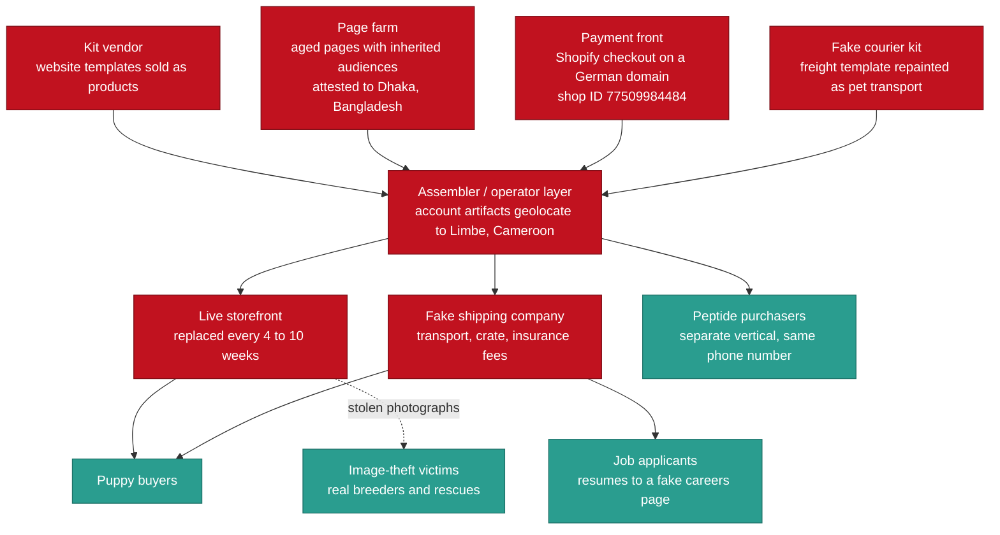
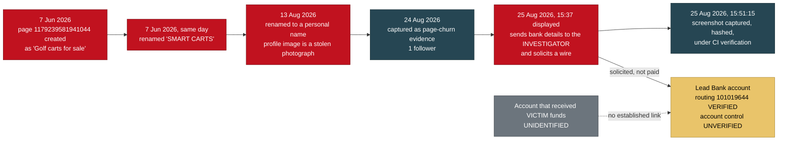
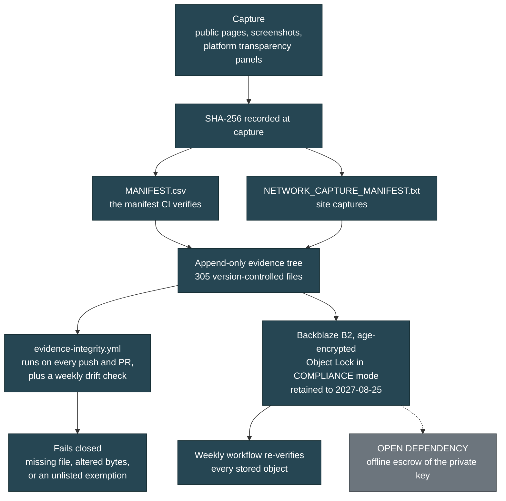

# BRIEF-01: Law Enforcement Brief

> Category: Public Brief | Version: 1.0 | Date: August 2026 | Status: Active

For the detective, IC3 analyst, or federal agent deciding in ninety seconds whether this file is worth opening: it is, because a US chartered bank holds the account the operators asked us to wire money to.

**Related:**

- [`../REDACTION_CONTRACT.md`](../REDACTION_CONTRACT.md), binding on this document
- [`BRIEF-02-victims.md`](BRIEF-02-victims.md), the same case for the people it happened to
- [`BRIEF-03-technical-analysts.md`](BRIEF-03-technical-analysts.md)
- [`BRIEF-04-intelligence.md`](BRIEF-04-intelligence.md)
- [`BRIEF-05-media-public.md`](BRIEF-05-media-public.md)
- [`BRIEF-06-how-to-help.md`](BRIEF-06-how-to-help.md)

This brief carries no analysis or opinion marker because it asserts only what the
record establishes. Per the redaction contract, `BRIEF-04` and `BRIEF-05` do.

---

## 1. The jurisdictional hook, first, because it is why you are still reading

On 2026-08-25 the operators of this fraud network sent bank account details over
Facebook Messenger and asked for a wire transfer. The account sits at a
**United States chartered institution** (Z-1):

| Field | Value | Status |
|---|---|---|
| Bank | **Lead Bank** | Institution identified (Z-1) |
| Bank address | 1801 Main St., Kansas City, MO 64108 | Matches the address given to the recipient exactly (Z-2) |
| Routing number | **101019644** | **VERIFIED** against the routing directory (Z-2, Z-24) |
| Account number | Withheld from this document | Suspect-side detail, law enforcement and the bank only (Z-1, Z-26) |
| Account holder | Withheld from this document | **UNDETERMINED**, not named as a suspect (Z-4) |

That single fact is the difference between a case you can work and a case you
cannot. Most fraud of this shape terminates in a referral to a jurisdiction
nobody at your desk can reach, and the file dies in triage. This one has a
domestic nexus: a chartered US bank carrying a BSA/AML obligation, a routing
number that resolves against the routing directory, and a Kansas City street
address that matches (Z-2, Z-3). **Lead Bank can be served. Lead Bank can freeze.
Lead Bank can file a SAR, and can tell you which of its programs holds the
account** (Z-3, Z-5). None of that requires you to reach Cameroon, Bangladesh, or
Hamburg, all of which this case also touches (Q-1, B-15, A3h).

**What we are not saying.** It is **not established** that any victim ever sent
money to that account (Z-12, Z-18). It was solicited **from the investigator**,
which is a different evidentiary object from a completed victim payment. Read
section 3 before you write anything down.

**HYPOTHESIS, labelled as such.** A Thai holder address paired with a Kansas City
routing number is not a branch relationship, and Lead Bank is one of the larger
banking-as-a-service sponsors in the United States, so the account is more likely
a sponsored fintech program, which would mean remote onboarding and a partner
holding the KYC file. **No KYC or program record supports that yet** (Z-3, Z-13).
The BSA/AML point stands either way: Lead Bank is the chartered institution and
the correct recipient of a report regardless of who holds the front end (Z-13).

---

## 2. Who, what, when, where, why

**Who.** A multi-brand pet-sales fraud network running across Facebook, TikTok,
WhatsApp, and at least five websites. The operator layer geolocates to **Limbe,
Southwest Region, Cameroon** on account-registration artifacts across four
independent platforms (Q-1, Q-8). A separate page-farm layer is
platform-attested to **Dhaka, Bangladesh** (B-15). A payment leg runs through a
**Shopify checkout on a German domain** behind a registered Hamburg entity
(A3g, A3h). Three complainants have come forward, referred to here as
**Complainant A, Complainant B and Complainant C** (Y-1).

**What.** Deposits taken for puppies that do not exist, then escalation into
transport, crate, and insurance fees through fake shipping companies that are
co-hosted on the same server (Q-6, T-1). Co-hosting alone does not establish common control; that shared IP carries 48 or more unrelated tenants, and the linkage rests on persona reuse at Q-5, not on the address (R-4, S-6). Two additional victim classes
exist beyond puppy buyers: job applicants who uploaded resumes to a fake
shipper's careers page, and purchasers in an unrelated peptide vertical run from
a phone number this network also publishes (T-6, V-1).

**When.** Storefront domains registered April through August 2026 and replaced
every four to ten weeks; three domains named in this file were already
deregistered within a day of capture (R-1, R-2). The newest storefront was six
days old when captured (R-1). The wire solicitation landed 2026-08-25 (Z-7).

**Where.** Victims in the United States and, on a separate German-language
surface, in Europe (S-4). Infrastructure at Hostinger, Vercel, Shopify, and
Realtime Register (R-1, Q-5, A3g).

**Why it is actionable now.** The network replaced one storefront and stood up a
second shipping front during the four weeks this investigation ran, so the
infrastructure is being rebuilt faster than reports can be filed against it
(HANDOFF section 7). And the money leg now terminates at a US bank.

---

## 3. What is established, and what is not

**This section governs every other sentence in this brief.** Z-18 is the
controlling note in the underlying record, and it exists because an earlier draft
of the evidence log overstated exactly this point.

> **ESTABLISHED:** on 2026-08-25 the operators sent bank account details to the
> **investigator** and solicited a wire transfer. The bank and routing number
> verify against the routing directory.
>
> **NOT ESTABLISHED:** that any victim ever sent money to that account; that the
> account received victim funds; that the named holder knowingly participated in
> anything. **The account that received victim money remains unidentified.**

Stated as a table, because this is the part that gets copied wrong (Z-24):

| Claim | Status |
|---|---|
| Routing 101019644 is Lead Bank, Kansas City MO | **VERIFIED** against the routing directory |
| The account number exists and is controlled by the named holder | **UNVERIFIED.** Requires the institution |
| The named holder knowingly participated | **UNDETERMINED** (Z-4) |
| Any victim paid this account | **NOT ESTABLISHED** (Z-12, Z-18) |

**Why the holder is not named.** Three readings fit the evidence equally well
(Z-4): a recruited money mule, an identity-theft victim, or an operator. Mules in
fraud of this shape are commonly recruited through fake remote-job offers, and
this case already documents a fake careers page at the shipper surface, which is
exactly that recruitment channel (Z-4, T-6). Every identity this network has
displayed so far has been stolen or fabricated (G, M-1, W-3), so a real name on a
remotely-onboarded account is not evidence of consent to its use. Subscriber
records and payment-rail process resolve this; nothing in open source will (Z-4).

**One further firewall.** The Facebook page that sent the solicitation displays a
**stolen photograph** as its profile image. The person depicted is, on the
existing record, an image-theft victim of this network and not a participant in
it, never contacted and never consenting (Z-9). Their likeness appearing on a
payment solicitation makes that distinction more important, not less.

**Provisional findings, labelled.** The solicitation screenshot is filed and
hashed (Z-29). The Meta "Download Your Information" export is not yet in hand.
Until it is, the conclusions in section 5 about operational tempo remain
**PROVISIONAL** (Z-14, Z-29). A screenshot is a rendering produced by the
investigator; it carries no message ID and no server-side timestamp, so it
corroborates the report but does not corroborate itself (Z-29).

### What this brief does not claim

Stated in its own section so a validator does not have to hunt for the edges.

| We do not claim | Why |
|---|---|
| That any victim paid the account in section 1 | Not established. The account was solicited from the investigator (Z-12, Z-18) |
| Any aggregate dollar-loss figure | The corpus does not support one. Scale is argued from productization and deployment count instead (Z-18) |
| That the named account holder did anything | UNDETERMINED, and three readings fit equally (Z-4) |
| That the page's operational role and the twelve-day cycle time are settled | **PROVISIONAL** until the Meta export lands (Z-8, Z-9, Z-14, Z-29) |
| A total count of domains or countries | The investigation has no attested count of its own, and no figure is asserted here |
| That shared infrastructure links these operators | Tested and downgraded. See section 7 (R-4, S-6) |
| Any identification of a person from an image | Forbidden under standing rules. Identification comes from subscriber records and payment rails (HANDOFF section 2b) |

---

## 4. The governing model: a supply chain, not a suspect

**Do not look for "the guy." Look for the chokepoints** (HANDOFF section 1).

The evidence describes a market of rented services rather than a single
organization: separate vendors sell separate components, and whoever runs a given
storefront assembles them. This is not an inference drawn to sound sophisticated,
it is visible in the shipped artifacts (W-6). The hardest single proof is that
`safepup-delivery.com` publishes its **template vendor's demonstration
credentials** in plain text on a public admin page, ships `(demo)` in the footer
of every page in English and German, and serves the vendor's demo shipment record
from a live tracking database (T-1). That is not an operator who built a site.
That is an operator who bought a product and deployed it unmodified.

**Why this matters operationally.** Taking down one storefront removes an
instance, not the supply (N-1). The durable targets are the shared components:
the Shopify shop ID that can enumerate sibling stores (A3g), the page-farm
inventory (B-15), and the template vendor whose published demo string can be
searched across every vertical it was ever sold into (HANDOFF section 5, item 9).
**The general principle worth carrying into any charging decision:** this case's
durable linkages are at the **content layer**, meaning persona pools,
stolen-image provenance, and template artifacts. **Infrastructure linkages have
failed every test** (HANDOFF section 4b). Section 7 lists the failures.

---

## 5. The solicitation: a recycled page, twelve days from identity to money ask

The page that solicited the wire was **already in this file** before it ever
asked for money. It was documented on 2026-08-24 as an example of automated page
churn, with one follower and a rename history captured from Facebook's own Page
Transparency panel (N-1). The next day it solicited a wire transfer (Z-7).

**Twelve days from identity assignment to payment solicitation.** The page was
renamed on 13 August and solicited a wire on 25 August (N-1, Z-7, Z-8). That is a
concrete cycle time for this network, testable against the other recycled pages
in the file, and **it is PROVISIONAL** because it is computed from a solicitation
date that currently rests on a screenshot rather than on Meta's own record
(Z-14, Z-29).

**Three things this changes** (Z-8). First, the page pool is not dormant
inventory, it is the delivery mechanism: removing one page removes an instance
and not the supply (N-1), and this shows what an instance does once activated.
Second, operational tempo becomes measurable and testable against the rest of the
pool. Third, the Facebook layer and the money layer now connect through a single
artifact, where before the file had a persona layer, a website layer, a shipper
layer, and no financial trail.

**On the timestamps, and this matters for your timeline.** The filename and
filesystem mtime record **15:51:15** as the capture time, which is directly
evidenced. The **15:37** value is what Messenger displayed inside the rendering,
which is a picture of a clock and authoritative for nothing on its own (Z-29).
There is also an unresolved one-hour ambiguity: in August, US Eastern observes
daylight time, so 15:37 EDT is 19:37 UTC, while a genuine EST reading would be
20:37 UTC (Z-10). The Meta export resolves it; a screenshot cannot resolve its own
timezone (Z-29). That precision is not pedantry, because the file documents an
operator activity window of 22:00 to 03:00 UTC with 91 percent clustering on one
storefront and a completely different window on another, which is one of the few
findings bearing on how many people are involved (U-5).

---

## 6. The eight findings that survived every test

These are content-layer, already captured, hashed, and the operators cannot
retract them (HANDOFF section 4).

1. **A fake courier publishes its template vendor's demo credentials.**
   `safepup-delivery.com/admin/login.php` prints `admin / Admin@12345` in plain
   text beneath the login form, ships `(demo)` in every page footer in English
   and German, and serves the vendor's demo shipment record from a live tracking
   database. **No login was attempted and none should be**; the evidentiary value
   is entirely that the string is published, preserved in the captured file
   (T-1).

2. **A storefront never renamed the photographs it stole.** Upload paths on
   `usapetsforhome.com` retain source filenames verbatim, including a third-party
   marketplace's brand string and its `breed-listingID-imageNumber` convention.
   The filenames prove the images came from a listing site and were not
   photographed by the seller; **which** marketplace is not asserted until
   confirmed (U-3).

3. **Millisecond upload timestamps give a minute-resolution build log.** The
   13-digit suffix on each upload decodes to a Unix millisecond timestamp. Eleven
   of twelve images were uploaded in a continuous 93-minute session **finishing
   34 minutes before the domain was registered** (U-4), at a steady 3-to-16
   minute cadence. Whether that cadence reflects a person collecting listings by
   hand rather than a script pacing its uploads is **HYPOTHESIS**: the timestamps
   establish timing and cadence, not who or what produced them.

4. **82 timestamped uploads on a second storefront give a pattern of life.**
   91 percent fall in a 22:00 to 03:00 UTC window, **incompatible with the first
   storefront's window** (U-5). This is a behavioral indicator, not a
   geolocation: upload timestamps reflect the server clock, and an operator
   targeting US buyers may deliberately work US hours (U-5).

5. **A shared persona pool links three domains across two hosting stacks.** The
   fabricated testimonial name "Priya" appears four times across three domains,
   alongside "James" and "Sarah M." On two sites they are bound as one couple
   with different assigned cities; on a third they are split into two individuals
   with new surnames (Q-5, S-3, T-3, U-7). **This linkage never depended on
   hosting**, which is why it survived when the infrastructure linkages did not.

6. **Backdating, three separate instances.** Blog posts and Terms of Service
   dated weeks before the domain existed (T-4).

7. **No Impressum on a site claiming German establishment, German governing law,
   and Frankfurt jurisdiction.** A standalone violation of German law requiring
   no proof of fraud whatsoever, reportable on its own (T-5).

8. **A hard registry timeline.** Continuous storefront replacement every four to
   ten weeks across five months, registry-attested via RDAP, with three domains
   already deregistered (R-1, R-2). One domain named in the corpus on 8/23 was
   unregistered by 8/24, so **anything still resolving must be archived on sight,
   not scheduled** (R-2).

---

## 7. The five claims that were tested and downgraded

A file that only ever grows in one direction is a file nobody should trust
(HANDOFF section 2d). These were promising, they failed, and they stay in the
record so that nobody rebuilds the case on them (HANDOFF section 4b).

1. **Shared IP does not prove common control.** The address that appeared to bind
   three domains is a shared Hostinger FTP gateway with 48-plus tenants. Three
   domains web-serve from it, which is a narrower claim and is how it should be
   stated (R-4, S-6). Co-tenants surfaced by reverse IP are innocent bystanders,
   excluded from every network claim (S-6). One business initially flagged on
   this basis was **cleared outright**; publishing the co-tenancy would defame a
   working company (S-7).

2. **Phone numbers are not clean operator identifiers.** One number runs an
   unrelated peptide vertical on TikTok. Another returns a probably-uninvolved
   private individual, never contacted and treated as a third party, not a
   suspect (V-5, V-4).

3. **A square 2048x2048 image is not by itself an AI indicator.** A
   confirmed-real photograph in the corpus has exactly those dimensions, so the
   indicator is corroborative only (W-3).

4. **Error Level Analysis is corroborative, not probative** (M-2). An earlier
   draft overweighted it as an AI-generation signal and that was corrected.

5. **The camera serial route does not exist.** The camera model that produced the
   only file with intact EXIF writes no body serial number, so the identification
   path that appeared open is a dead end (W-5).

Two further negative results worth your time: a perceptual-hash sweep across the
full corpus returned **zero image reuse** between clusters (K-4), and a
separately flagged business was cleared as a website-appropriation **victim**
(A5c).

**None of the eight findings in section 6 depends on any of these five.**

---

## 8. Where each authority has a hook

Nothing in this case requires one agency to carry all of it. Several of these
hooks stand entirely on their own, without proving fraud at all.

```mermaid
flowchart TD
    caseFile["Wiener-Gate evidence corpus<br/>305 version-controlled files"]

    ic3["FBI IC3<br/>Recovery Asset Team,<br/>Financial Fraud Kill Chain"]
    leadBankAuth["Lead Bank<br/>BSA/AML, SAR, freeze,<br/>identifies the sponsoring program"]
    originBank["Each complainant's own bank<br/>or payment provider<br/>recall and reversal"]
    ftc["FTC<br/>pattern, scope, consumer harm"]
    fda["FDA<br/>the peptide vertical,<br/>stands independent of the pet fraud"]
    meta["Meta<br/>page, profile and group IDs<br/>plus preservation"]
    tiktok["TikTok<br/>two handles,<br/>ban-evasion language"]
    shopify["Shopify Trust and Safety<br/>shop ID 77509984484<br/>enumerates sibling stores"]
    hostinger["Hostinger<br/>registrar and host<br/>for one whole cluster"]
    germanAuth["German authorities<br/>missing Impressum,<br/>false EU establishment claim"]

    caseFile --> ic3 & leadBankAuth & originBank
    caseFile --> ftc & fda & meta & tiktok
    caseFile --> shopify & hostinger & germanAuth

    classDef evidenceArt fill:#264653,stroke:#152d33,color:#ffffff
    classDef moneyFlow fill:#e9c46a,stroke:#b08f3c,color:#000000
    classDef scamInfra fill:#c1121f,stroke:#7a0c14,color:#ffffff
    class caseFile evidenceArt
    class ic3,leadBankAuth,originBank moneyFlow
    class ftc,fda,meta,tiktok,shopify,hostinger,germanAuth scamInfra
```

The escalation mechanism is where the repeat losses come from. A deposit is
taken, then transport, crate, or insurance fees are demanded, and the victim is
referred to a shipping company that is **the same hosting provider on the same server**.
Both ends of that ladder were found on one IP address (Q-6).

The ladder runs: contact via a recycled page or template storefront, deposit
taken, referral to the "shipping company", then transport, climate-controlled
crate, and shipping insurance fees in sequence. A `PAW-########` tracking number
arriving in a complainant's inbox proves the **shipper stage**, not merely the
sale, and is a specific intake question worth asking every victim you interview
(T-3, Y-3). The tracking system works, which is the point: it returns the
vendor's demo shipment record from a live database (T-1, T-3).

---

## 9. Evidence integrity: why you can rely on this file

This corpus was built to be attacked. Every claim above traces to a captured
artifact with a recorded hash.

**The specifics.**

- **305 files** are under version control in the evidence tree. `MANIFEST.csv`
  carries the SHA-256 and byte count for the collected corpus; site captures are
  hashed separately in `NETWORK_CAPTURE_MANIFEST.txt`.
- **The tree is append-only.** Captured artifacts, site captures, images, session
  logs, and message exports are never edited and never renamed. When a filename
  arrived untidy it was kept as it arrived, because renaming it to look neater is
  the kind of silent alteration the rule exists to prevent (Z-29).
- **CI verifies the manifest on every push** and on every pull request touching
  the evidence tree, plus a weekly scheduled drift check. It fails closed. A
  manifest entry with no file on disk is an integrity failure unless it appears
  in a hardcoded allowlist, and that allowlist is deliberately not derived from
  the ignore rules, since deriving it would let a change authorize its own
  exemption.
- **The most recent full verification run** reported 141 files verified exact,
  1 expected-absent, 0 missing, 0 mismatched, replicated locally before commit
  (Z-27). Two source artifacts previously hashed only in a point-in-time snapshot
  were brought under continuous verification then (Z-27), and the solicitation
  screenshot followed (Z-29).
- **Off-site duplication is done.** The full corpus plus three large originals
  that exceed practical repository size live in Backblaze B2, age-encrypted,
  under **Object Lock in COMPLIANCE mode retained until 2027-08-25**. Compliance
  mode cannot be bypassed by any credential, including the account owner and the
  provider's own support. The upload key deliberately lacks delete, bypass, and
  retention-write capabilities; a delete attempt against the stored archive
  returns 401 unauthorized. A scheduled workflow re-verifies every stored object
  weekly (HANDOFF AMENDMENT 1 A3 item 19).
- **The honest weakness.** The archive's private key currently exists in two
  online locations controlled by one person. Offline escrow is an open dependency
  and is recorded as one (HANDOFF AMENDMENT 1 A3 item 19).
- **One integrity nuance, stated plainly.** Two large session logs were hashed at
  one moment and kept appending afterward, so their whole-file hashes no longer
  match the values recorded earlier. Those hashes still match the files' byte
  prefixes exactly, verified at archive time: the growth is pure append and
  nothing was modified in place (HANDOFF section 8).

---

## 10. Contamination controls, and one disclosure we would rather make than have you find

**Standing procedure since 8/24** (HANDOFF section 2c): no form population, no
cart creation, no checkout interaction, no login attempt, and no message sending
against any surface in this case. Retrieval is limited to reading publicly served
pages. The published demo credentials at `safepup-delivery.com` **were not used
and must not be**; accessing that panel would be unauthorized access regardless
of how the credentials were obtained (T-1). Every contact with an operation
surface is logged, dated, and classified, and the classification set separates
what the investigation sent **to** the operation from what the operation sent
**to** the investigator. Those are opposite things evidentially: the first is
investigator conduct a defence can attack, the second is operator conduct that
supports the case (INTERACTION_LOG Amendment 2.1).

**The disclosure.** One interaction cannot be cleanly classified, and rather than
leave a self-contradiction in the record it is classified conservatively and
stated openly (HANDOFF AMENDMENT 1 A4):

> The `banbestmk.click` checkout interaction of approximately 8/24 is classified
> **ACTIVE-OUT**. A form was populated with placeholder identity data and a cart
> API was contacted. **Whether this was performed manually by the investigator,
> by browser autofill, or by an automation tool was not recorded and is not
> recoverable.** No payment instrument was entered and no order was placed. The
> conservative classification is used because the evidence does not support the
> narrower one.

The canonical class token is `ACTIVE-OUT`; an earlier descriptive phrase,
"ACTIVE SUBMISSION", is prose and not a class (Z-25). This wording should travel
with any filing that relies on the checkout material, because it is materially
better to disclose an unrecorded mechanism than to have opposing counsel discover
the contradiction unaided (HANDOFF AMENDMENT 1 A4).

**Six of nine interaction-log entries are marked UNRESOLVED.** That is an
uncomfortable number and it is the honest one, reflecting that the log was
reconstructed after the fact rather than kept contemporaneously (INTERACTION_LOG
Amendment 3.1). The governing rule: an unresolved fact must be **reviewed**
before filing, never necessarily **completed**. Where it is recoverable, record
it; where it is not, the honest answer is final and ships as-is, because guessing
to close a field damages the record (INTERACTION_LOG Amendment 3.4).

**One further disclosure, recorded because it belongs on the record.** A payment
to the solicited account was **contemplated and not made**. The investigator
considered remitting funds to create a traceable transaction and did not do it,
logged so that any later reader finding the account details in the private file
can establish that no investigator funds entered that account (INTERACTION_LOG
Amendment 1).

---

## 11. Required disclosure: the investigator is not a neutral third party

**The compiler of this file is personally acquainted with one of the named
complainants, who forwarded the initial material. Which complainant is not
stated here and is not derivable from anything published in this corpus. All
infrastructure findings are independently verifiable from the captures and
hashes provided (Y-2).**

This is stated early and plainly because concealing it would be the problem, not
the relationship itself. Fraud referrals routinely originate from someone
connected to a victim, and an analyst who discovers an undisclosed relationship
discounts everything around it (Y-2). It also explains why a forensic file of
this size exists over a puppy deposit, which is otherwise the first question an
analyst asks (Y-2). The mapping between Complainant A, B, and C and their real
identities is held only in the private law-enforcement package, and no public
document in this corpus attaches the forwarding to a letter (REDACTION_CONTRACT
sections 3 and 3a).

**On the complainants generally.** All three consented to public attribution
(Y-6), and version 1 of this public corpus does not use their names anyway. The
reasoning is recorded: consent given in the first flush of anger about losing
money is real, but it is given without much sense of what it feels like to be a
searchable result attached to "puppy scam victim" for years. Pseudonymity is
reversible on their say-so; publication is not (Y-6, REDACTION_CONTRACT section
3). Whether two of the three represent one household or two separate loss events
is an open intake question, and it changes the count (Y-1). The referral package
that goes to IC3 and to the platforms is **unredacted**; consent was never the
constraint there (Y-6b).

---

## 12. What we are asking you to do, ranked, time-critical first

### Tier 1: clocks are already running

1. **Get the transfer dates from each complainant.** This is the single most
   urgent missing field in the entire case (Z-5, Z-6, Z-17). It determines
   whether the FBI Recovery Asset Team can attempt a freeze through the Financial
   Fraud Kill Chain, which is strongly time-dependent and works best within
   roughly 72 hours of the transfer (Z-5). Without dates this is purely
   evidentiary. The Recovery Asset Team pathway applies to qualifying domestic
   transfers and wire recalls and is **not** a universal remedy across app-based
   rails (Z-20).

2. **Tell each complainant to contact their own bank or payment provider now,
   ahead of everything else.** This is the fastest lever a victim personally
   controls, it runs on the sending institution's clock rather than on IC3's, and
   the sending institution acts on its own customer's instruction without needing
   legal process (Z-16). It is rail-specific (Z-20):

   | Rail | First action by the victim |
   |---|---|
   | ACH or wire | Originating bank fraud team, request recall or reversal |
   | Zelle, Cash App, Apple Pay, Chime | The provider's fraud team; ask **which** recovery process applies, as dispute rights differ sharply and several are not reversible |
   | Card | Issuer chargeback |
   | Gift card | The card issuer's fraud line immediately; some balances can be frozen if unspent |
   | Cryptocurrency | The exchange or wallet provider; report the receiving address |

   In every case, ask which process applies and **record the provider's reference
   or case number**. It is useful supporting detail, not an IC3 requirement
   (Z-20).

3. **Serve or contact Lead Bank.** As the chartered institution it can freeze,
   can file a SAR, and can identify which of its programs holds the account
   (Z-5). Ask one narrow, answerable question alongside the report: **which
   fintech program sponsored this account?** That identifies the platform that
   onboarded the holder and holds the KYC documents (Z-5). A civilian report to
   the bank requires no standing; a subscriber-record request requires you.

4. **Meta preservation, which requires law enforcement process.** Privacy
   settings do not delete underlying records (HANDOFF section 5, item 6).
   Preservation is requested on page **1179239581941044** (the soliciting page,
   N-1, Z-7), profile **100022087874969**, and the suspected successor account
   (HANDOFF section 5, items 4 and 6). The network is **actively hardening**:
   friend and group lists were locked down during this investigation, and the
   solicitation gives the operators a fresh reason to clean up (X-2, Z-11).
   **TikTok preservation** likewise requires your process, on handles
   `@meyouqpbokz` and `@herman.walker90`; a third account in the same set has
   already been removed (HANDOFF section 5, item 5).

5. **The Meta "Download Your Information" export of the solicitation thread.** It
   is materially stronger than the screenshot because it carries Meta's own
   timestamps and message IDs rather than a rendering of them (Z-15). Until it
   lands, the operational-tempo findings in section 5 remain PROVISIONAL (Z-14,
   Z-29). Each complainant should likewise export their own thread today; if the
   operator blocks or deletes, the payment instructions in the operator's own
   words are gone permanently (Y-3).

### Tier 2: high yield, no clock but no reason to wait

6. **Shopify.** Report shop ID **77509984484** with the storefront-to-checkout
   redirect as evidence. Payment processors retain historical merchant-to-domain
   mappings, so this can potentially enumerate **every storefront funnelling into
   that account** (A3g). One terminology note your analysts will want: a Shopify
   shop ID is not a Merchant ID. It identifies the store account receiving funds,
   where a MID would identify the acquiring relationship, and only the shop ID
   has been recovered (A3g).

7. **Each complainant files their own IC3 complaint and records the number.**
   Third-party reports triage down. Victim-filed complaints receive a number and
   IC3 clusters related numbers on its own side. **Three linked complaint numbers
   plus this file is a materially different submission from one civilian report
   about three people** (Y-3).

8. **Obtain the live-chat provider's written retention statement.** Property
   `6a68d4d16e813a1d4d6629ee` was reported and the account preserved and
   terminated. Termination ends the live channel; **what was retained from before
   termination is unknown** and must be established in writing. Ask what data was
   preserved, covering what date range, under what retention policy, and for how
   long it will be held (HANDOFF AMENDMENT 1 A3 item 10, AMENDMENT 2 B1). Victim
   chat transcripts would be in it.

9. **Hostinger abuse**, one registrar and host covering an entire cluster of
   these domains, a single desk with unusual reach (HANDOFF section 7, R-1).
   **German authorities**, on the missing Impressum and the false
   EU-establishment claim, a standalone violation requiring no proof of fraud,
   plus a separate German-language victim surface (T-5, S-4). **FDA**, on the
   peptide vertical, independent of the pet fraud (HANDOFF section 7, V-3).

### Tier 3: what would strengthen the file most

10. **Which victim sent money to which account.** If a complainant's records show
    payment to the solicited account, that is materially stronger than either
    fact alone, because it links the solicitation channel to completed money
    movement (Z-12). If they show payment elsewhere, that is also a finding: a
    second receiving account would establish a **mule network** rather than a
    single receiver (Z-6).

11. **The operator's own message directing a victim to an account.** The account
    details alone show where funds went; the operator's instruction is what ties
    the account to the fraud (Z-6). Preserve that message before anything else.

12. **A file-hash comparison** between the profile image now on page
    `1179239581941044` and the image captured on 8/24. If they match, the page
    carried the same stolen photograph from 13 August through the solicitation.
    **This is a hash comparison against an existing capture, not a comparison of
    faces**; face matching is forbidden under this investigation's standing rules
    (Z-8, HANDOFF section 2b).

---

## 13. How to disprove this

Every finding in section 6 is independently reproducible from the captures and
hashes provided, and each has a stated failure condition.

- If the demo credential string is absent from the captured file, finding 1
  fails. It survives in the capture even if the live page is fixed (T-1).
- If the stolen-photo upload paths decode to timestamps after the domain
  registration, finding 3 fails. They do not (U-4, R-1).
- If the persona names do not recur across the domains named, finding 5 fails.
  They recur four times across three domains on two hosting stacks (Q-5, S-3).
- If RDAP returns registration dates inconsistent with the timeline, finding 8
  fails. RDAP and DNS are registry-attested, not user-editable narrative (R-1).

And the standing caution, restated once because it is the sentence most likely to
be dropped in a summary: **it is not established that any victim paid the account
described in section 1** (Z-12, Z-18).

**If you take one thing from this brief.** The parts of this case that survived
scrutiny are the parts already captured and hashed on disk, and they do not
depend on any account staying visible. The parts that kept failing are the ones
that tried to link operators through shared infrastructure (HANDOFF section 9).
Open-source collection has reached its ceiling: **who controls the accounts, who
receives the money, and whose numbers these are were never answerable from
outside** (HANDOFF section 9). Those questions are answerable with subscriber
records, bank process, and platform preservation, and every one of those requires
you. The door that was open is closing, and three domains named in this file are
already gone from the registry (R-2).
