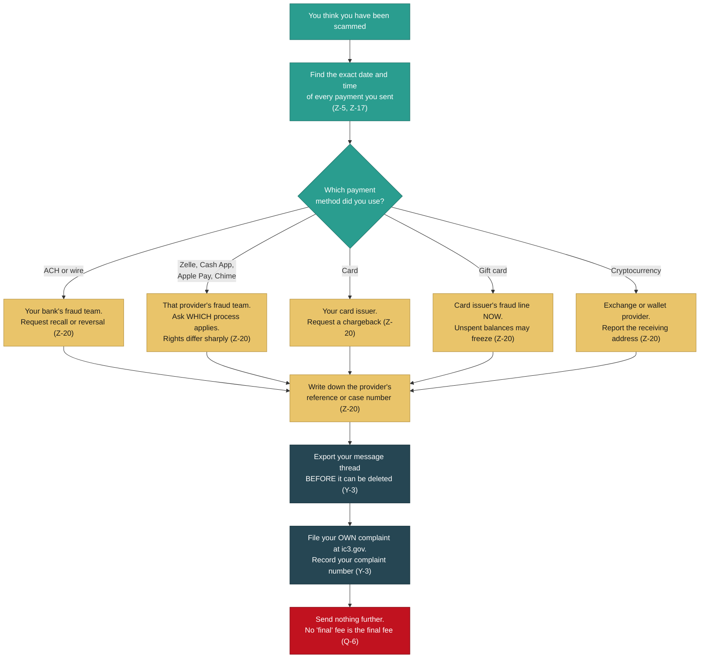
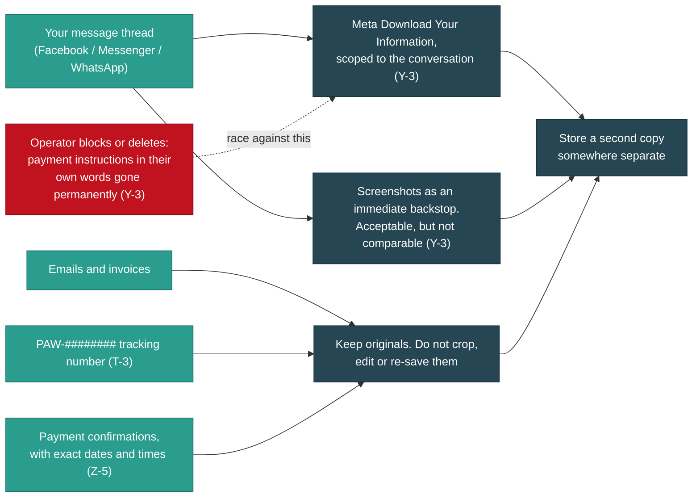
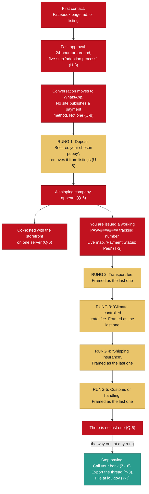
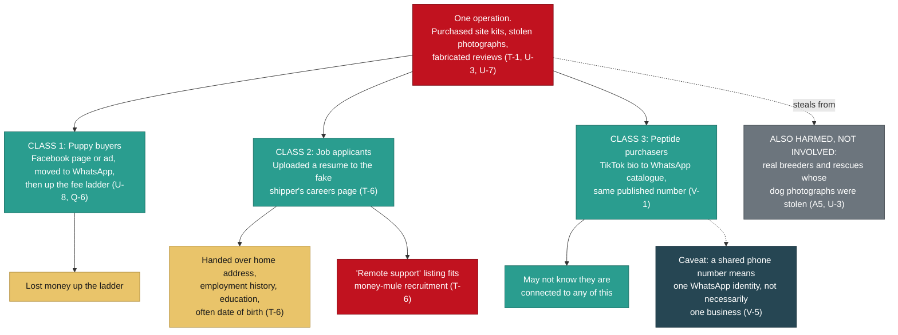

# If You Think You Have Been Scammed Buying a Puppy

> Category: Public Brief | Version: 1.0 | Date: August 2026 | Status: Active

For anyone who has just realised something is wrong with a puppy they are buying online, or who is mid-purchase and unsure: what the warning signs actually are, what to do in the next few hours, and why none of this is your fault.

**Related:**

- [`BRIEF-06-how-to-help.md`](BRIEF-06-how-to-help.md), what you can do with what you know, if you want to do something
- [`BRIEF-05-media-public.md`](BRIEF-05-media-public.md), the general-audience account of the whole operation
- [`BRIEF-01-law-enforcement.md`](BRIEF-01-law-enforcement.md), the version written for investigators and filing desks
- [`BRIEF-03-technical-analysts.md`](BRIEF-03-technical-analysts.md), the full technical evidence, for readers who want to check the work
- [`BRIEF-04-intelligence.md`](BRIEF-04-intelligence.md), analysis and assessment, labelled as such
- [`../REDACTION_CONTRACT.md`](../REDACTION_CONTRACT.md), the rules governing what this corpus will and will not publish
- [`../README.md`](../README.md)

If you only have the energy for one more page after this one, make it BRIEF-06. It is the shortest and the most actionable.

**A note on names.** The three people who came forward in this investigation are called Complainant A, Complainant B and Complainant C throughout. All three agreed to be named publicly. We are not using their names in this version anyway, because agreeing to that in the first hours after losing money is not the same as choosing to be a search result attached to the words "puppy scam victim" for the next ten years (Y-6). That door stays open for them, on their timing.

**A disclosure, up front.** The compiler of this file is personally acquainted with one of the named complainants, who forwarded the initial material. Which complainant is not stated here and is not derivable from anything published in this corpus. All infrastructure findings are independently verifiable from the captures and hashes provided (Y-2).

---

## 1. Read this part first

You are not stupid. Please sit with that for a second before you read anything else.

We have spent weeks pulling this operation apart, and here is what we found underneath it. The websites are not homemade. They are professional templates, bought or downloaded, and deployed by people who did not even bother to change the demo settings (T-1). The puppy photographs are real photographs of real dogs, stolen from real breeders and rescues who had nothing to do with any of this (U-3, A5). The glowing customer reviews are fabricated, and the same invented names turn up on site after site that are supposed to be unrelated companies (Q-5, S-3, T-3, U-7).

You were not fooled by a badly spelled email. You were shown a working business, built out of parts that a real business would have used, staffed by people whose entire job is this conversation.

Being deceived by a professionally built deception is not a failure of intelligence. It is the deception working as designed.

The embarrassment you are feeling right now is the single most useful thing this operation has going for it. It is what stops people calling their bank on day two. It is what stops people filing reports. Everything in section 3 of this brief works better the sooner you do it, and embarrassment is the only thing standing between you and doing it.

So: set it down. You can pick it up again later if you really want to. Right now there are some phone calls to make.

---

## 2. Am I being scammed? A checklist

None of these on its own is proof. Two or three of them together and you should stop sending money today.

### 2.1 The shipping company appeared after you paid

This is the big one.

You agreed a price for a puppy. You paid a deposit. Then, somewhere between the deposit and the delivery date, a shipping company entered the conversation. And that shipping company needs money too.

The fee ladder documented in this case runs: deposit, then transport, then a "climate-controlled crate", then "shipping insurance", sometimes then customs (Q-6). One of the fake shippers we captured publishes an actual rate card, charging by the kilogram plus a percentage of the declared value of the animal (T-8). Its own sample record shows a transport cost set against a much larger declared pet value (T-3), which is the shape of the ask: make the fee look small next to what you would lose by walking away.

The crate fee and the insurance fee are the two most reliable signals in the entire pattern. A real transporter quotes you once, in writing, before you commit.

### 2.2 The tracking number looks like PAW-######## and the tracking page actually works

The fake shipper we captured uses tracking numbers in the format `PAW-` followed by exactly eight digits (T-3).

Here is the part that catches people, and it is worth understanding, because it is the cleverest thing in the whole operation. The tracking page is not a bluff. Type in a valid number and you get a real record from a real database: a status, a route, a named coordinator, a live map with an aircraft moving across it and updating every few seconds, and a line reading "Payment Status: Paid" (T-3). Type in a made-up number and it correctly tells you the number does not exist.

That is a working system. And it means the operators can issue you a genuine-looking tracking number the moment you pay.

This is the retention mechanism. It is what keeps people believing, and paying, for weeks (T-3). If you have been watching a little plane cross a map and feeling reassured, that reassurance was manufactured and you had no reasonable way to know.

### 2.3 The site claims to be a German or EU company but has no Impressum

If a website tells you it is established in Germany or the EU, says German law governs your contract, and names a German court, then German law requires it to publish an Impressum: a page identifying the company, its registration number, its VAT number and a named responsible person.

We searched every captured page of one of these shipper sites for "Impressum", "Imprint", "Handelsregister", "Amtsgericht", "Umsatzsteuer" and "USt-IdNr". Zero matches (T-5).

You do not need to read German to check this. Scroll to the footer. A real German or EU commercial site puts a link there. If a site claims Frankfurt and there is no Impressum anywhere, that is a violation on its own, before anyone even argues about fraud (T-5).

### 2.4 The same customer reviews appear on sites that are supposed to be unrelated

Reviews are the cheapest thing to fake and the easiest thing to check.

Across separate "breeder" and "shipping" websites that present themselves as different companies, the same invented reviewer identities keep reappearing. One first name shows up four times across three domains on two different hosting providers, sometimes as half of a couple, sometimes as a standalone person with a new surname (Q-5, S-3, T-3, U-7). Two of the invented reviewers also turn up as the "customer" and the "recipient" in the shipper's sample tracking record (T-3).

One site carries 43 reviews marked "Verified" in two visibly different styles, produced in two separate batches. The second batch includes a reviewer whose name is a city and a state abbreviation, misspelled, being used as a person's name (U-7).

**How to check this yourself:** copy a sentence from a review, put it in quotation marks, and search for it. Then do the same with the reviewer's name plus the word "puppy". If that person is reviewing four different companies in four different states, you have your answer.

### 2.5 Blog posts and Terms of Service dated before the website existed

Every domain has a creation date, and anyone can look it up for free. Search for "whois" plus the domain name.

Then look at the site's own dates. On one shipper site, three blog posts are dated from April, May and June. The Terms and Conditions claim they were last updated on 1 July. The domain was registered on 28 July (T-4). The Terms claim to have been revised 27 days before the website existed, and the newest blog post predates the domain by eight weeks (S-2).

There is no innocent explanation for a company blogging three months before it registered its domain. The history was manufactured to make a site registered last month look like a business with a past.

Backdating appears three separate times in this case (T-4). It is a habit, not an accident.

### 2.6 The delivery company's website is a template, and it still says "demo"

The fake shipper ships the word **(demo)** live in its own footer, in both English and German, inside a trust badge claiming live-animal certification (S-2).

It gets worse, from their side. The site publishes an admin login page that prints the template vendor's demonstration username and password in plain text, right there on the public page (T-1). The statistics counters all read zero ("0 Pets Delivered Safely, 0 Countries Served") on a page that simultaneously claims to have served tens of thousands of families (S-2).

Underneath the pet branding, the page filenames are generic freight forwarding: ocean freight, warehousing, customs clearance, cargo insurance (T-2). The quote form asks for your **company name** and your **cargo type** (T-2). One "pet carrier" hero image is, byte for byte, a photograph of a shipping container truck that somebody renamed (T-2).

There is no company. There never was one. The template was bought and deployed without modification (T-1).

### 2.7 Everything moves to WhatsApp, and no payment method is ever published

Across all four storefronts in this case, not one publishes a payment instrument. No bank details, no card processor, no wallet. Every single one funnels you to WhatsApp (U-8).

That is deliberate. A published payment method can be reported and shut down. A conversation cannot.

Watch also for the pace: a 24-hour application turnaround, a five-step "adoption process", an approval that arrives fast and warm, a deposit that "secures your chosen puppy" and removes it from the listings, and a pickup date close enough to keep you moving (U-8).

### 2.8 The storefront disappears

If the website you bought from is suddenly gone, that is not the end of it and it does not mean you imagined it.

This network replaces its storefronts every four to ten weeks. Three domains named earlier in the investigation are already deregistered (R-1, R-2). One shipping site had its web pages stripped so it returns an error, but its mail records, its sender policy and its security certificate are all still live and freshly renewed (R-3). Translated: the website is gone so you cannot screenshot it, but they can still email you invoices as a shipping company from that same domain.

Removing the site removes the evidence. It does not remove the capability (R-3).

**This is why section 3.3 matters so much.** Save everything now.

---

## 3. What to do right now, in order

This is the most important section in this brief. Time genuinely matters here, and the order matters too.

Do these in sequence. Do not wait until you are certain. Being wrong about a scam costs you an awkward phone call. Being slow costs you the money.

### 3.1 First: your own bank or payment provider

**Before the police, before the FBI, before anything else, contact the bank or app that the money left from and ask them to recall or reverse it** (Z-16).

This is the fastest lever you personally control. Recalls, disputes and chargebacks run on the sending institution's clock, and your bank acts on your instruction as its own customer. It does not need law enforcement's permission and it does not need to wait for anyone (Z-16).

Say clearly: "I have been the victim of fraud. I need to know which recovery process applies to this payment, and I want to start it now."

Then **ask which process applies to your specific payment method, and write down the reference or case number they give you** (Z-20).

That question is not a formality. Dispute rights differ sharply between payment types and several are not reversible at all (Z-20). Here is the rail-by-rail picture:

| How you paid | Who you call first | What to ask for |
|---|---|---|
| **ACH transfer or wire** | Your own bank's fraud team | A recall or reversal. Ask them to attempt it today (Z-20) |
| **Zelle** | Your bank or the Zelle provider's fraud team | Ask **which** recovery process applies. Rights here differ sharply from card rights (Z-20) |
| **Cash App** | Cash App's fraud team | Ask which process applies to your transfer type (Z-20) |
| **Apple Pay** | Apple's fraud process, and the bank behind the card or account you funded it with | Ask which process applies. Person-to-person transfers and card payments are treated very differently (Z-20) |
| **Chime** | Chime's fraud team | Ask which process applies to your transfer type (Z-20) |
| **Card (credit or debit)** | Your card issuer | A **chargeback**. Use that word (Z-20) |
| **Gift card** | The gift card issuer's fraud line, immediately | Ask them to freeze the balance. Some unspent balances can still be frozen (Z-20) |
| **Cryptocurrency** | Your exchange or wallet provider | Report the receiving address. Be prepared for this to be evidentiary rather than recoverable (Z-20) |

**Be honest with yourself about the harder rails.** Several of these are not reversible, and we are not going to pretend otherwise. You should still make the call, still ask the question, and still get the case number, because that record matters later even when the money does not come back.

**The date you sent the money is the single most important detail you have** (Z-5, Z-17). There is a mechanism through which the FBI can attempt to freeze funds on the receiving side, and it is strongly time-dependent, working best within roughly 72 hours of the transfer (Z-5). It applies to qualifying domestic transfers and wire recalls, and it is **not** a universal remedy across app-based payment rails (Z-20). So find the exact date and time before you make any call, and lead with it.

If you are past 72 hours: still do all of this. The window affects whether recovery is procedurally available. It does not affect whether your report matters, and section 3.2 stands regardless.

### 3.2 Second: file at IC3 yourself

Go to **ic3.gov** and file your own complaint. Then write down the complaint number you receive.

**File it yourself. Do not rely on someone else filing on your behalf.** This matters more than it sounds like it should.

Third-party reports triage downward. A complaint filed by the actual victim receives a complaint number, and IC3 clusters related complaint numbers on its own side (Y-3). Three linked complaint numbers plus a documented infrastructure file is a materially different submission from one civilian report describing three people (Y-3).

Put plainly: your individual complaint is not a drop in an ocean. It is the thing that makes everyone else's complaint count for more. The clustering only works if the complaints exist.

This runs in parallel with section 3.1, not after it. Your own bank may recall the funds while IC3 works the receiving side (Z-16).

### 3.3 Third: preserve everything, before it disappears

Do this today. Do it even if you are still hoping this is all a misunderstanding.

**Export your message thread.** If the conversation happened on Facebook or Messenger, use Meta's **Download Your Information** tool, scoped to that conversation (Y-3).

**Screenshots are acceptable. A timestamped export is not comparable** (Y-3). Take the screenshots too, by all means, and take them right now as a backstop. But the export carries structure and timing that a screenshot cannot.

**Here is why the urgency is real.** If the operator blocks you or deletes the conversation, the payment instructions in their own words are gone permanently (Y-3). Not recoverable. Not retrievable by asking nicely. Gone.

And this network is actively hardening its operational security (X-2). Storefronts are being replaced on a four-to-ten-week cycle (R-1). One shipper's website was already stripped down to a mail-only asset, which removes exactly the evidence a victim could have screenshotted while leaving the operator's ability to keep emailing you fully intact (R-3).

Also save, in whatever form you have them:

- Every email, including any invoice for shipping, crating, insurance or customs
- Any tracking number you were given, especially in the `PAW-########` format (T-3)
- The website addresses, even if the sites are already gone
- The WhatsApp number or numbers you spoke to (U-8)
- Screenshots of the listing and the puppy photograph you were shown
- Every payment confirmation, with dates and times (Z-5)
- The name on the receiving account, if you ever saw one. This is one of the highest-value details in the entire intake, and it is more searchable than any email address (Y-3)

### 3.4 Fourth: stop paying

If you are mid-scam and reading this, this is the section for you.

There is no final fee. The ladder is deposit, transport, crate, insurance, customs (Q-6), and every rung is presented as the last one. That framing is the product. It is what section 4 of this brief is about.

You will likely be told that the puppy is already in transit, that it is distressed, that it is in a holding facility, that the fee is refundable on delivery, or that walking away now loses everything you have already paid. Some of that will be delivered with real warmth, by someone who has had this exact conversation many times.

There is no puppy. The tracking page that shows you an aircraft moving across a map is running on the template vendor's demonstration database (T-3).

Stop paying. Go back to section 3.1.

---

## 4. The escalation pattern, and why it is designed this way

Understanding the shape of this helps, both for deciding what to do next and for forgiving yourself for how far it went.

The canonical ladder documented in this case: **deposit taken, then "transport", then "climate-controlled crate", then "shipping insurance"** (Q-6). Customs charges appear in some variants.

Three design features make it work.

**First, each fee is framed as the last one.** You are never told the total. You are told about one more obstacle, and one more payment that clears it. Each individual request is small compared to what you have already committed, which makes each individual "yes" feel rational. It is rational, at each step. That is the trick.

**Second, the sunk cost does the work.** By the time the crate fee arrives, you have paid a deposit and formed an attachment to a specific animal with a specific name and a specific face. Walking away does not feel like avoiding a loss. It feels like causing one.

**Third, the tracking theatre keeps you believing between payments.** This is the part that separates this operation from a crude scam. A working tracking database issues you a genuine record with a live map, a named coordinator and a "Payment Status: Paid" line (T-3). Between fee demands, you are not sitting in silence growing suspicious. You are watching a plane move.

**And the shipper is not an independent third party.** In this case the fake shipping company and the puppy storefront sat on the same server (Q-6). The "shipping company" arguing with you about crate fees is the same operation that sold you the puppy. Both ends of the ladder, one operator (Q-6).

The escalation is not opportunism. It is the design. The puppy sale is the entry point; the fee ladder is the business.

---

## 5. Walking through the IC3 form

The form at **ic3.gov** is not difficult, but it asks for things in an order that assumes you already know what matters. Here is what each part is really asking for, in plain language.

Two things before you start. **Gather your dates and amounts first**, because the form does not save well mid-flight and the transfer dates are the most important detail you have (Z-5, Z-17). And **the exact field names and layout may differ from what is written here**; treat this as a guide to what the form wants, not a screen-by-screen script.

### Who you are

Your name, address, phone and email. Straightforward.

If you are filing about money your child or a family member sent, file as the victim's representative and say so plainly in the description. Do not file as though it happened to you if it did not; the record needs to be accurate.

### What happened, and when

**The dates.** This is the field to get exactly right. Every payment, with its date and if possible its time (Z-5, Z-17). If there were four payments across three weeks, list all four.

**How you were first contacted.** A Facebook page, a group, an advertisement, a website, an email. Name the brand or page name if you remember it.

**Who contacted you.** The email address, the WhatsApp number, the page name, the display name of the person you spoke to.

### The financial transaction section

This is where the form asks for transaction details and account identifiers (Z-20).

Give it, for each payment:

- The amount
- The date
- The payment method (ACH, wire, Zelle, Cash App, Apple Pay, Chime, card, gift card, cryptocurrency)
- Where the money went: the receiving name, handle, account identifier or address, if you have it

**On the receiving name.** If you saw a name attached to the account, include it. This is the highest-value single field in a victim intake, because a name on a receiving account is more searchable than any email address in the case (Y-3).

**On your provider's case number.** If you already called your bank per section 3.1 and have a reference number, include it. Be clear on what it is and is not: **IC3 requests transaction details and account identifiers, and does not list a provider case number as a required field. It is useful supporting detail, not a requirement** (Z-20). Do not delay your filing to chase one.

### Describing the incident

This is a free-text box and it is where your filing either helps the clustering or does not.

Write it in order. What you saw, what you were told, what you paid, what happened next. Plain sentences.

**Include these specifics if they apply to you**, because they are what links your complaint to other people's:

- The tracking number, especially if it was in the `PAW-########` format (T-3)
- The name of the "shipping company"
- Whether an invoice arrived for a crate, for insurance, or for customs (Q-6)
- Whether any invoice came from a shipping or logistics domain, even one whose website no longer loads. One such domain in this case still has live mail records and a freshly renewed certificate, meaning it can still send you email while showing nothing on the web (R-3)
- Whether the conversation moved to WhatsApp, and the number (U-8)
- The website addresses, even if they are gone now (R-1, R-2)

**Say what you do not know.** If you are unsure whether a payment completed, write that you are unsure. Accuracy is worth more than completeness, and an analyst who catches one overstatement discounts everything around it.

### Have you reported this elsewhere

Yes, if you have. Name your bank or payment provider and give the reference number from section 3.1. Name any local police report. Name the platform, if you reported the page to Facebook or TikTok.

### Submit, then record your complaint number

**Write the complaint number down and keep it with your evidence** (Y-3).

If more than one person in your family was involved, or if you know other people hit by the same page, **each person files separately and each records their own number** (Y-3). That is what makes clustering possible on IC3's side. Do not consolidate into one filing to be tidy.

---

## 6. What this investigation has surfaced

You are not looking at one person with a fake profile. Here is what the record shows, without the jargon.

**The websites are bought kits, not builds.** One fake shipping site publishes its template vendor's demonstration login credentials in plain text on a public page, ships the word "(demo)" in its own footer in two languages, and serves the vendor's demonstration shipment record from a live tracking database (T-1). Underneath the pet branding it is a freight-forwarding template with the paint still wet: the page filenames are ocean freight, warehousing, customs clearance and cargo insurance, and the quote form asks for your company name and cargo type (T-2). One "pet carrier" image is byte-for-byte a photograph of a container truck (T-2).

**The puppy photographs are stolen from real breeders and rescues.** One storefront never even renamed the files, so the upload paths still carry the original source filenames and marketplace listing identifiers (U-3). Several real breeders and rescues appear in this material purely as **victims of image theft** (A5). They had no part in any of this. Most have not yet been notified, which is why this brief does not name them (Y-5).

**The reviews are invented, and reused.** The same fabricated identities recur across domains that present as unrelated companies, on different hosting stacks (Q-5, S-3, T-3, U-7). One site's 43 "Verified" reviews were produced in two visibly different batches (U-7). Two of the invented reviewers double as the customer and the recipient in the shipper's demonstration tracking record (T-3).

**The history is manufactured.** Blog posts and Terms of Service dated weeks or months before the domain was registered. Three separate instances (T-4, S-2). A claimed founding year contradicted by the registry (T-4). Named executives with no photographs (T-4).

**The company that claims Germany is not registered in Germany.** No Impressum, no company form, no register number, no VAT identification, no named responsible person, on a site asserting EU establishment and Frankfurt jurisdiction (T-5). That is a standalone violation that a German authority can act on without proving any fraud at all (T-5).

**The infrastructure is rebuilt faster than reports can be filed against it.** Storefronts replaced every four to ten weeks over five months. Three domains named earlier in the investigation are already deregistered (R-1, R-2). One shipping front was replaced by another six weeks later (S-1). During the four weeks this investigation ran, the network replaced one storefront and stood up a second shipping front.

**Two honest limits.** We have been careful to say what is not established, because a report that overstates one thing gets discounted on everything. Some things that looked like strong links between operations turned out not to be, and were downgraded after testing: a shared server address turned out to be a shared gateway with dozens of unrelated tenants (R-4, S-6), and phone numbers turned out to move between operations and carry stale third-party history (V-5). The linkages that survived every test are all at the content layer: the persona pools, the stolen-image provenance, the template artifacts (HANDOFF section 4b).

And on money: what is established is that operators sent bank account details and solicited a transfer from the **investigator**. It is **not** established that any victim's money ever reached that account, and the account that received victim funds remains unidentified (Z-12, Z-18). We are not going to tell you we know where your money went. We do not.

---

## 7. Protecting yourself, and other people

### Reverse image search the puppy photograph

This is the single most effective check available to you, it is free, and it takes about a minute.

Save the photograph you were sent, or right-click it. Then run it through a reverse image search: Google Images, TinEye, Bing Visual Search or Yandex. Try more than one; they index differently.

What you are looking for is the same dog on a different website, under a different name, belonging to a different business, possibly in a different country. In this case the dogs in the photographs are real and belong to real breeders, some of them on the other side of the world from where the seller claimed to be (U-3, A5).

If the photograph appears on a stock photography site, that is equally conclusive in the other direction.

**A caveat, so you do not over-trust this.** At least one site in this network deliberately destroys the identifying information in its images before publishing them (U-6), and reverse search is not guaranteed to find a match. **A hit is proof. A miss is not clearance.**

### Verify the breeder independently, not through anything they gave you

The rule is simple: **never verify a seller using a link, phone number or reference the seller gave you.**

- Search the kennel or business name plus the word "scam", and plus "reviews"
- Look them up in the relevant national or regional breed club or registry, found through your own search, not their link
- Ask for a live video call with the puppy, at a time you choose, with something specific held up beside it. A real breeder will find this normal. Note that a refusal is a red flag but a video is not proof; treat it as one signal among several
- Ask for the veterinary practice's name, then call that practice using the number you find yourself
- Check the domain's registration date yourself, with a "whois" search. A business claiming fifteen years of operation on a two-month-old domain has told you everything (T-4)
- Look for an address you can find on a map, and a phone number that is not only a WhatsApp handle (U-8)

### Never pay by an irreversible rail

The payment method is not a detail. It is the whole game.

Anyone who *requires* a payment method with weak or no reversal rights, and who resists any method with dispute protection, has told you what they are. Reasonable sellers accept reasonable payment methods.

The rails with the weakest recovery position are gift cards, cryptocurrency, and person-to-person app transfers (Z-20). Card payments carry chargeback rights (Z-20). If a seller talks you off a card and onto an app, that is the signal.

And watch for the pattern from section 2.7: across every storefront in this case, no payment method was ever published on the site. Everything moved to WhatsApp (U-8).

### What a legitimate transport company actually looks like

If someone genuinely needs to ship you an animal, here is the contrast.

| A real transporter | What this network does |
|---|---|
| Quotes the full cost once, in writing, before you commit | Escalates: deposit, transport, crate, insurance, customs, each framed as the last (Q-6) |
| You choose and engage them yourself | They appear in the conversation after you have already paid a deposit (Q-6) |
| Independent of the seller | Co-hosted with the storefront on the same server (Q-6). Shared hosting alone is weak evidence of common control (R-4) |
| Publishes a verifiable company registration, and an Impressum if it claims EU establishment | No Impressum, no register number, no named responsible person (T-5) |
| Verifiable accreditation you can check with the accrediting body | Ships a "(demo)" placeholder inside its own trust badge (S-2) |
| A traceable business history | Blog posts and Terms dated before the domain existed (T-4, S-2) |
| A working switchboard and a findable address | A WhatsApp number and a live chat widget (U-8, T-7) |
| Never asks for insurance money that goes to them rather than to an insurer | "Shipping insurance" as a rung on the ladder (Q-6) |

One more thing worth saying plainly: **a real transporter does not hold an animal hostage against a fee.** If the emotional pressure is the product, it is not a transport company.

---

## 8. Three kinds of victim, and one of them does not know it yet

This is here because you may be in the second or third group and have no idea you are connected to any of this.

**Puppy buyers.** The group this brief is mostly written for. Solicited through Facebook pages, groups and advertisements, moved to WhatsApp, taken up the fee ladder (U-8, Q-6).

**Job applicants.** The fake shipping company runs a careers page. It advertises four positions and carries a live upload form that collects your full name, email, phone, a resume file and a cover letter (T-6).

Think about what is in a resume: your home address, your employment history, your education, often your date of birth. This is a document and personal-data harvesting channel aimed at job seekers, and it is **entirely separate from the pet-buyer victims** (T-6). If you applied for a remote pet-transport coordinator or customer-support role at a company matching this description, you did not lose a deposit, but you handed over a dossier on yourself.

The "Customer Support Representative, Remote" listing also fits the standard money-mule recruitment pattern and should be assessed that way (T-6). If you were hired into a remote role that involved receiving payments and forwarding them on, please read that sentence twice, and get advice.

**Peptide purchasers.** A phone number published on one of the puppy storefronts is also published as the WhatsApp contact on two TikTok accounts selling peptides (V-1). Both live accounts share the same signature: heavy follow-spam ratios, almost no engagement, and a "DM for catalogue" bio whose only call to action is an off-platform WhatsApp handoff (V-1). A third account in the set has already been removed, and one of the survivors opens with "This is our first official account", which is what a respawned account says after a ban (V-1).

If you bought peptides through a WhatsApp catalogue after finding it on TikTok, you may be dealing with people who also run the puppy operation. **An honest caveat:** phone numbers move between operations and carry stale history, so a shared number means one WhatsApp identity, not necessarily one business (V-5). It is a lead worth knowing about, not a proof of identity.

There is also a separate European surface. One of the shipping sites opens with a German language interstitial and offers EU-specific services, so the victims of that front are not all in the United States (S-4).

**One more group, named here only so it is clear where they stand.** Real breeders and rescues whose dogs' photographs were stolen are victims in this too, not participants (A5). Several have not yet been notified that their images are being used this way, which is why this brief does not name them (Y-5). If you recognise your own dogs in a listing like this: whoever took the photograph normally holds its copyright, which is often you but not always, and it is the rights holder who can file a takedown or authorize someone to file on their behalf. Reaching the families in your photographs is the part only you can do.

---

## 9. You are not alone, and it is not your fault

Three people came forward in this case (Y-1). They are not three people who fell for something obvious. They are three people who were shown a professionally produced business, with a working tracking system, a real photograph of a real dog, and an approval message written in warm and competent English.

Everything in section 6 is what it took to see through it: registry lookups, file hashing, source-code inspection, a full-text search for German corporate disclosure terms, and cross-referencing invented reviewer names across multiple domains and hosting providers. Weeks of it. That is not a fair fight, and you were never given the tools to have it.

The operation is designed so that each individual decision you made was reasonable. The deposit was reasonable against the price. The transport fee was reasonable against the deposit. The crate was reasonable against everything already committed. Each rung is rational, which is exactly why the ladder works (Q-6).

There is also a specific cruelty in this one that deserves saying out loud. Most fraud takes your money. This takes your money while you are picturing a specific animal in your home, and it uses that picture against you. If you feel a grief that seems out of proportion to the amount involved, it is not out of proportion. You were sold a family member, and the loss you are feeling is the loss they engineered.

So, if nothing else lands, take these:

- **You did not fail an intelligence test.** You encountered a professionally built deception (T-1, U-3, U-7).
- **Your report is not a drop in an ocean.** Complaints filed by victims get clustered. Yours makes the next person's count for more (Y-3).
- **Speed matters more than certainty.** Call your bank before you are sure (Z-16). Export the thread before you decide what to do with it (Y-3).
- **Save everything now.** These operators delete, block and rebuild, and once the payment instructions in their own words are gone, they are gone (Y-3, X-2, R-3).
- **Whatever you do next, stop paying.** There is no final fee (Q-6).

If you are still mid-conversation with them and part of you is hoping this brief is wrong: that hope is the mechanism. Go to section 3.1, and make the call.

---

*This is a public brief. It is derived from a private evidence record, and every load-bearing claim about the network carries a reference to that record. Names of complainants, of individuals whose status is undetermined, and of image-theft victims who have not yet been notified are withheld under the redaction contract that governs this corpus.*
