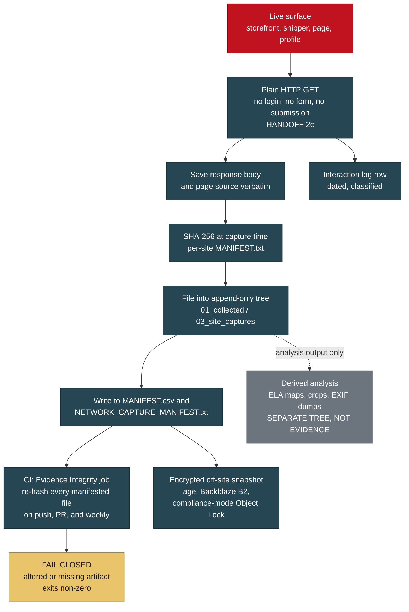
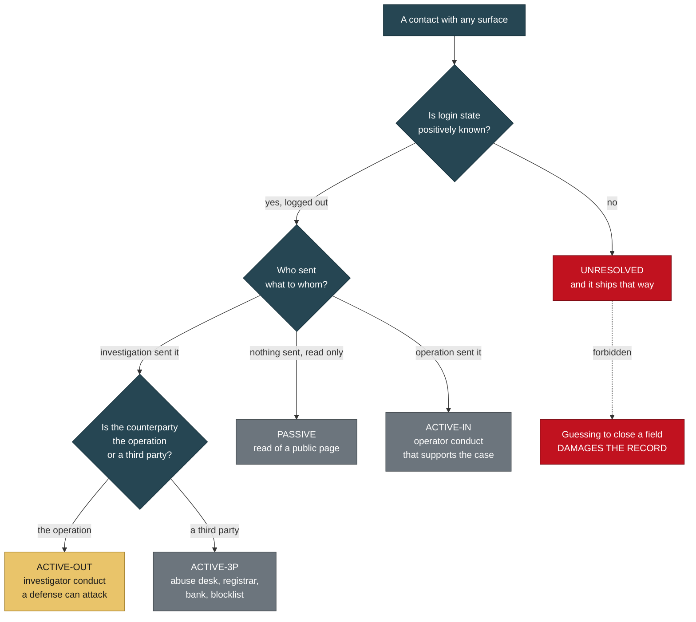
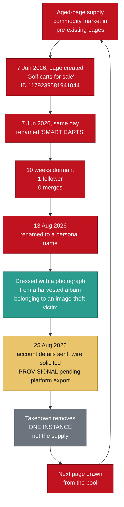

# Reproducing the Wiener-Gate Technical Record

> Category: Public Brief | Version: 1.0 | Date: August 2026 | Status: Active

For threat analysts, DFIR practitioners, and OSINT researchers who intend to reproduce this investigation's findings from public sources, test them adversarially, and extend them into adjacent verticals.

**Related:**
- [Redaction contract, binding on this document](../REDACTION_CONTRACT.md)
- [Verify our work: hashes, manifests, and the integrity job](../wiki/verify-our-work.md)
- [Methodology: capture procedure and contamination controls](../wiki/methodology.md)
- [Indicators](../wiki/indicators.md)
- [Domain roster](../wiki/domain-roster.md)
- [Who is not a suspect](../wiki/who-is-not-a-suspect.md)
- [BRIEF-01: law enforcement](BRIEF-01-law-enforcement.md)
- [BRIEF-04: intelligence assessment](BRIEF-04-intelligence.md)

---

## Required disclosure

**The compiler of this file is personally acquainted with one of the named
complainants, who forwarded the initial material.** Which complainant is not
stated here and is not derivable from anything published in this corpus. All
infrastructure findings are independently verifiable from the captures and
hashes provided (Y-2).

This is stated at the front for the reason the record itself gives: an analyst
who discovers an undisclosed relationship discounts everything around it. It
also explains why a file of this size exists over a puppy deposit, which is
otherwise the first question a reader asks.

---

## 1. What this document is, and the reading contract

This is the reproduction guide. Every substantive claim below carries a bracketed reference to the section of the private evidence log where it originates, in the form `(U-4)`, `(T-1)`, `(N-1)`. Those references are stable identifiers, not page numbers. When you challenge a claim, challenge it at its reference.

Three constraints govern what appears here, and you should know them before you weigh anything else.

**The corpus is redacted, not summarized.** Suspect-side financial detail, the identities of image-theft victims, imagery depicting minors, and one HTTP archive carrying live session credentials are withheld under a published contract. Everything else in the technical record is here: domains, page IDs, hashes, timestamps, template artifacts, tooling, and the negative results. Where a redaction removes something you would need to reproduce a finding, this document says so at that point rather than leaving you to discover the hole.

**Complainants are pseudonymous.** Three named complainants exist and consented to public attribution. Version 1 of the public corpus does not use their names anyway, on the reasoning that consent given in the first days after losing money is real but is given without much sense of what it is like to be a searchable result attached to "puppy scam victim" for years. They appear as Complainant A, Complainant B, and Complainant C.

**Ten findings in this record make the case smaller.** They are in section 10, and they are not an appendix. They are the reason to trust section 2.

### 1.1 What the investigation covers

A multi-brand pet-sales fraud network operating across Facebook, TikTok, WhatsApp, and at least five websites, taking deposits for animals that do not exist and escalating buyers into transport, crate, and insurance fees through fake shipping companies (Q-6, T-8). Three victim classes are documented, not one: puppy buyers, job applicants who uploaded resumes to a fake shipper's careers page (T-6), and purchasers on a gray-market peptide vertical running off a phone number published by one of the storefronts (V-1).

The governing model is a supply chain, not a suspect. Separate vendors sell separate components, and whoever rents them assembles the result.

---

## 2. The thesis: content layer versus infrastructure layer

This is the intellectual core of the case, and it was arrived at by failure rather than by design.

**Every infrastructure-layer linkage claim in this investigation was tested and downgraded. Every content-layer linkage claim survived.**

That statement is not rhetorical. It describes three specific, dated retractions.

### 2.1 The three infrastructure failures

**Failure one: the shared IP (R-4).** Four domains in the network resolved through one hosting provider, three of them to `77.37.34.75`. The initial reading was common control. Live nameserver queries returned three *different* provider nameserver pairs across those three domains (`pixel`/`byte`, `nebula`/`aurora`, `ns1`/`ns2`, all under `dns-parking.com`). That provider assigns nameserver pairs per hosting plan, so three distinct pairs on one shared address is consistent with three separate hosting purchases rather than one account holding three domains. Passive DNS already showed 48 co-hosted domains on that address. Co-residency there proves nothing (R-4).

**Failure two: the FTP gateway (S-6).** A co-tenancy list for the same address ran to roughly 87 entries, and the overwhelming majority were `ftp.<domain>` hostnames. Checking apexes directly settled it: `safepup-delivery.com` serves its apex from `2.57.91.196` and `84.32.84.119`, and only `ftp.safepup-delivery.com` points at `77.37.34.75`. The address is a shared Hostinger FTP endpoint, not a web host (S-6).

The inverse turned out to be the interesting part, and it is the only version of this claim that should ever be filed. Three domains have their **apex A record**, not merely their FTP hostname, on that address, and all three serve live content from it. Every other tenant in the list uses it for file transfer only. So:

> Do not say "48 domains share this IP, therefore related." Say "these three domains web-serve from an address that other tenants use only as an FTP endpoint, and they share a registrar, a mail configuration, and a persona pool." (S-6)

That precision is what keeps the section credible. An analyst who tests the loose version, finds shared hosting, and discounts everything downstream of it is behaving correctly.

**Failure three: the phone numbers (V-5).** Five WhatsApp numbers were recovered across the storefronts (U-1). The working assumption was that each is an operator handle for its site. Two findings broke it. One number is concurrently the published WhatsApp contact in the bios of two live TikTok accounts selling peptides, a different vertical on a different platform (V-1). Another returns, on reverse lookup, a private individual in Oregon whose profile does not fit the operation on any axis and who is treated throughout this record as a probable uninvolved third party and possible victim, never as a suspect (V-4). Revised position: the numbers are working infrastructure that moves between operations and carries stale third-party history. A name returned by a reverse lookup on any of them is not an operator identification and must never be filed as one (V-5).

Note that V-1 is not itself a downgrade. A WhatsApp number is bound to one registration and the messages land on whatever device holds it, so it is a categorically different artifact from a shared IP and should not be discounted the same way (V-2). What V-5 downgrades is the assumption that a number maps cleanly to one business.

### 2.2 The content-layer linkages that held

**The persona pool.** Two fabricated testimonial identities, "Sarah M." and "James & Priya K.", appeared on two independent storefronts with different assigned cities (Q-5). A third site later split the couple into two separate individuals with new surnames, "Priya Sharma" and "James Whitfield" (S-3). A fourth appearance came as "Priya N." in a testimonial block (U-7), and a fifth as the recipient in the shipper's demo tracking record (T-3). The name "Priya" now appears four times across three domains on two separate hosting stacks. That linkage never depended on hosting at all, which is exactly why it survived R-4 and S-6.

**Stolen-image provenance.** One storefront preserved the source filenames of every photograph it stole (U-3, section 8 below). That is a self-documenting provenance chain that cannot be argued with and cannot be retracted, because it is already captured and hashed.

**Template artifacts.** A published demo credential string, `(demo)` shipped in the footer of every page in two languages, a vendor's demonstration shipment record served from a live database, and a purchased-template placeholder email address left in a contact `mailto:` (T-1, T-9, T-3, N-2). These are the cleanest exhibits in the case because they require no interpretation.

```mermaid
flowchart TD
    subgraph contentLayer["CONTENT LAYER: linkages that held"]
        personaPool["Shared persona pool<br/>Priya x4, James, Sarah M.<br/>Q-5, S-3, T-3, U-7"]
        filenameProv["Unrenamed stolen filenames<br/>marketplace listing IDs<br/>U-3"]
        templateArt["Template artifacts<br/>(demo) EN and DE, demo credentials,<br/>vendor demo DB record<br/>T-1, T-3, T-9"]
        scrapeStrings["Unedited search-result strings<br/>shipped as site copy<br/>M-3"]
    end

    subgraph infraLayer["INFRASTRUCTURE LAYER: linkages that failed"]
        sharedIp["Shared IP 77.37.34.75<br/>DOWNGRADED: 48 tenants,<br/>3 distinct nameserver pairs<br/>R-4"]
        ftpGateway["FTP co-tenancy<br/>DOWNGRADED: shared FTP<br/>endpoint, ~87 entries<br/>S-6"]
        phoneNumbers["WhatsApp numbers<br/>DOWNGRADED: move between<br/>operations, stale history<br/>V-5"]
    end

    storefrontA["Storefront A<br/>Vercel stack"]
    storefrontB["Storefront B<br/>Hostinger stack"]
    shipperSite["Fake shipper<br/>Hostinger stack"]

    personaPool --> storefrontA
    personaPool --> storefrontB
    personaPool --> shipperSite
    filenameProv --> storefrontA
    templateArt --> shipperSite
    scrapeStrings --> storefrontA
    scrapeStrings --> storefrontB

    sharedIp -.->|"proves nothing"| storefrontB
    ftpGateway -.->|"proves nothing"| shipperSite
    phoneNumbers -.->|"proves nothing"| storefrontA

    classDef scamInfra fill:#c1121f,stroke:#7a0b14,color:#ffffff
    classDef evidence fill:#264653,stroke:#16303a,color:#ffffff
    classDef cleared fill:#6c757d,stroke:#444a4f,color:#ffffff

    class storefrontA,storefrontB,shipperSite scamInfra
    class personaPool,filenameProv,templateArt,scrapeStrings evidence
    class sharedIp,ftpGateway,phoneNumbers cleared
```



### 2.3 Why this generalizes

Infrastructure is rented, so it links nothing. Content production is the thing the operators actually do, so it links everything (V-5, W-6).

If you work fake-storefront networks, this is the transferable finding. The reflex in this space is to pivot on hosting: reverse IP, passive DNS, nameserver clustering, WHOIS registrant. In a market where kits, pages, hosting, and payment fronts are each purchased separately from separate vendors, those pivots return the vendor's customer list, not the operator's asset list. What links two fraudulent properties is the artifact that came out of the same content-production pass: the same fabricated name, the same unedited placeholder, the same scraped filename convention.

State it that way in filings. It also happens to be the version an adversarial reviewer cannot break.

---

## 3. Collection methodology

### 3.1 What was captured

| Corpus | Volume | Method |
|---|---|---|
| Collected image evidence | 140 files (97 JPEG, 40 PNG, 1 AVIF) | Downloaded from Facebook surfaces and one Messenger thread; grouped into 38 account clusters by fbid middle-segment tail (K-3, L) |
| Live site captures | 104 files across four live sites | Unauthenticated HTTPS GET of publicly served pages; page source saved, per-site SHA-256 manifests written (U, count corrected at Z-31) |
| OSINT platform exports | 10 JSON exports | Account-enumeration service run by the investigator (P, Q-1, R) |
| Registry and DNS | RDAP, authoritative DNS, certificate records | Live queries, 8/24 (R-1 through R-6) |
| Session custody | Harness session JSONL and audit log, sanitized | Byte-prefix hashed; originals held off-repo (HANDOFF section 8) |

The four site crawls produced 11, 21, 24, and 48 files respectively. None of the four sites serves a `robots.txt` or a `sitemap.xml` (U).

### 3.2 The capture and verification pipeline



Two design decisions in that pipeline are worth copying.

**Derived artifacts live outside the manifest, deliberately.** Error Level Analysis maps, crops, contact sheets, and EXIF dumps are analysis output, not evidence. They sit in a separate directory with a README stating exactly that, and they are deliberately excluded from `MANIFEST.csv` (W-2 item 4.5). Mixing generated artifacts into an evidence manifest is how a corpus quietly acquires items nobody can source.

**Investigator screenshots are separated from collected evidence at the directory level** (L). Any recipient can see at a glance which files came from the targets and which were produced during the investigation. Provenance you have to reconstruct is provenance you will get wrong.

### 3.3 Reproducing a site capture

```bash
# Capture a page and its exact bytes. Save the body, not a rendering.
curl -sS -A "$UA" --compressed -D headers.txt -o pages/index.html "https://<target>/"
sha256sum pages/*.html >> CAPTURE_HASHES.txt

# The byte-identity test that proves a templated catalogue (U-9).
for slug in bella daisy luna max oliver winston; do
  curl -sS -o "detail_${slug}.html" \
    "https://<target>/individual-puppy-detail?slug=${slug}"
done
sha256sum detail_*.html
```

On the target storefront, all six of those detail pages returned **byte-identical HTML**, SHA-256 prefix `8649dbb1cfeb...`. The slug is ignored and the page renders the first record regardless: requesting `slug=bella` returns "Chloe". The same listing page states "9 Available Now" and "Showing 12 puppies" on one screen (U-9). Identical hashes are identical bytes, and identical bytes across six named animals is one page with a name swapped in at render.

That is a claim any competent engineer can falsify in ninety seconds, which is the property you want in a headline claim.

### 3.4 Registry and DNS procedure

```bash
# Registry-attested creation dates. RDAP is authoritative and not user-editable.
curl -sS "https://rdap.verisign.com/com/v1/domain/<domain>" | jq '.events'

# Authoritative DNS: nameserver pairs are the tell, not the A record.
dig +short NS <domain>
dig +short A  <domain>
dig +short A  ftp.<domain>     # this is where the co-tenancy claim dies (S-6)
dig +short MX <domain>
dig +short TXT <domain>        # SPF, DKIM, DMARC posture
```

The registry timeline that came out of this is the spine of the case (R-1): four one-year registrations, the standard disposable-asset term, with a fake shipping domain registered roughly ten weeks after the first storefront and roughly three weeks before the second. One shipper served two consecutive breeder brands. Three further domains referenced in the corpus returned RDAP 404, not merely offline but deregistered, within a day of being logged (R-2).

The operational consequence is a collection rule: **anything still resolving is archived on sight, not scheduled** (R-2).

One further finding worth reproducing at R-3. A shipping domain whose website returns HTTP 404 still resolves, still publishes MX records and SPF, and had its certificate renewed ten days before capture. A domain with live MX, live SPF, and a freshly renewed certificate is a working mailbox. Removing the site removes the evidence a buyer could screenshot; it does not remove the capability. Do not record a domain as "dark" on the basis of the web surface alone.

One artifact worth recording because it is counterintuitive. The fake shipper's domain returned a clean reputation verdict, zero malicious and zero suspicious across 91 engines (R-6). Reputation services do not catch pet-fraud infrastructure. Do not treat a clean scan as exculpatory in this category, and do not treat a dirty one as a prerequisite for filing.

---

## 4. Evidence integrity architecture

### 4.1 The manifests

Three SHA-256 manifests cover the corpus at different scopes: `MANIFEST.csv` for the 140-file collected-evidence set with per-file size and a verification column, `NETWORK_CAPTURE_MANIFEST.txt` for the live-site captures, and `EXPORT_MANIFEST.txt` for the whole repository as it stood at handoff. All 140 files were hashed before a folder reorganization, moved without modification, and re-hashed after: 140 of 140 identical, zero integrity failures (L).

Verify from the evidence root on an LF checkout:

```bash
sha256sum -c <(awk -F, 'NR>1 && $3 != "" {print $3 "  " $2 "/" $1}' MANIFEST.csv)
```

One manifested file is excluded from version control by design and will report missing: an HTTP archive carrying 209 live `Cookie` headers and 2 `Authorization` headers. It is treated as secret-bearing and exists only inside the encrypted off-site archive. Its hash is recorded in the custody documents.

### 4.2 The CI job, and why it fails closed

A GitHub Actions workflow re-hashes every file in `MANIFEST.csv` on every push and pull request touching the evidence tree, plus weekly as a drift check. It exits non-zero on any altered file and on any manifested file that is missing.

Three details in that job are the interesting part.

**The CRLF re-expansion allowance.** A file counts as intact if its bytes match the recorded hash either directly, or after re-expanding LF back to CRLF. This exists because Git's `core.autocrlf` normalized CRLF to LF when some artifacts were first committed, so the stored bytes differ from the bytes hashed at capture time by line endings alone.

Does that weaken tamper detection? No, and the reason is worth being precise about. The transform is a fixed, reversible, content-preserving substitution over a single byte pair. Accepting exactly two candidate encodings of the same content does not admit any content change, because **a real content edit matches neither form**. What it costs you is the ability to detect a pure line-ending rewrite, which is not a threat model anyone is defending against here. What it buys you is a job that does not cry wolf on every Windows checkout, and a job that cries wolf is a job that gets disabled.

You can run the same normalization by hand:

```bash
python -c "import hashlib,sys;print(hashlib.sha256(open(sys.argv[1],'rb').read().replace(b'\r\n',b'\n')).hexdigest())" <file>
```

**The allowlist is hardcoded, not derived from `.gitignore`.** This is the sharper design decision. Deriving the expected-absent list from the ignore file would let a single change authorize its own exemption: delete an artifact, add a matching ignore rule in the same commit, and the check goes green. An integrity control must not be bypassable by the change it is meant to police. Hardcoding fails closed instead. Newly excluding an artifact breaks the job until someone updates the list on purpose, and that is the intended friction. Adding an entry is an evidence-custody decision requiring repository-owner review, and the excluded artifact's hash must be recorded in the custody folder.

**Actions are pinned to commit SHAs, not tags.** Standard supply-chain hardening, and it matters more than usual for a job whose entire purpose is asserting that files have not changed.

### 4.3 The append-only tree

Nothing in the evidence tree is ever edited, renamed, re-encoded, or re-saved. Corrections happen in analysis documents, never in artifacts.

This has consequences that look like defects and are not. The evidence log's header records a last-updated date that is wrong, and the correction is an appended note rather than an edit (Z-21). A screenshot filed under a machine-generated name keeps that name even after a tidier convention is proposed, because renaming it to look tidier would be exactly the kind of silent alteration the rule exists to prevent (Z-29).

The rule also creates a real navigation problem, which the record acknowledges and solves rather than ignoring. Append-only means superseded statements remain in place with no inline marker, so a reader who stops at the body can act on a statement a later addendum already corrected. Two review findings arrived against text that had already been superseded, which is that failure mode showing up in practice. The fix is a **corrections index**: every superseded or qualified statement, and where its correction lives, later entries winning, with a standing rule that any future correction must add a row in the same addendum that makes it. As the index itself says, a corrections index that is not maintained is worse than none, because it implies a completeness it does not have.

### 4.4 The off-site archive

The full corpus plus three gitignored originals sit in Backblaze B2 as a single `age`-encrypted tarball under **compliance-mode Object Lock** with a retention date one year out. Compliance mode cannot be bypassed by any credential, including the account owner and the provider's own support, until that date expires.

The access-control shape is worth copying:

- The CI runner holds the age **public** key only. It can encrypt and upload; it can never decrypt anything in the bucket, including its own output.
- The B2 application key is scoped to one bucket and deliberately lacks `deleteFiles`, `bypassGovernance`, `writeKeys`, `writeBucketLifecycleRules`, `writeFileRetentions`, and `shareFiles`. A compromised runner can add objects but cannot destroy or alter what is stored.
- CI snapshots are written under a separate `ci/` prefix so they are never confused with the canonical hand-built archive, which is the only copy containing the three off-repo originals.
- There is no `pull_request` trigger on the archive workflow. Archive credentials must never be reachable from a branch that has not been merged and reviewed.
- The verification step enforces a **retention floor**, not merely a mode check. Object Lock protection ends at `retainUntilTimestamp`, so `mode == "compliance"` alone is insufficient: a compliance retention expiring early would satisfy a mode check while failing the custody requirement. Every verified object must be retained at least as long as the earliest retention across the stored set.

Two custody details generalize. First, the session originals are append-only logs that kept writing after their hashes were taken, so their whole-file hashes no longer match. Verification was done by hashing the recorded byte prefix, which still matches exactly. The growth is pure append; nothing was modified in place, and the recorded originals survive intact as byte-prefixes. Recording *why* a hash no longer matches is worth more than a hash that always matches.

Second, the restore procedure was itself audited and found defective twice. The published script set `-u` but never assigned the key path, so copying it verbatim halted with an unbound-variable error before decrypting anything. More seriously, under `set -e` a failing plaintext checksum or a failing tar exited before the final `shred` line, leaving the fully decrypted corpus on disk: victim PII and imagery of minors, which is precisely what the encryption exists to protect. The corrected form decrypts to a `mktemp` path and registers an `EXIT` trap **before the plaintext exists**, so it is removed on every exit path including interrupt.

```bash
set -euo pipefail
CT=<archive>.tar.gz.age
: "${AGEKEY:?set AGEKEY to the path of the age private key}"

PT="$(mktemp ./archive.XXXXXX)"
trap 'shred -u "$PT" 2>/dev/null || rm -f "$PT"' EXIT

echo "<ciphertext-sha256>  $CT" | sha256sum -c -
age -d -i "$AGEKEY" -o "$PT" "$CT"
echo "<plaintext-sha256>  $PT"  | sha256sum -c -
tar -xzf "$PT"
```

Register the trap before the plaintext is created, not after. Registering it afterwards reintroduces a window in which an interrupt leaves the corpus decrypted on disk.

One dependency remains open and is stated rather than buried: offline escrow of the age private key. It currently exists in two online locations controlled by one person. Without it the archive is unrecoverable.

### 4.5 The known gap, stated plainly

**Twenty-nine HTML files under the site-capture tree do not match their recorded hashes under any transformation**: not the stored git bytes, not the working-tree bytes, not LF normalization, not CRLF re-expansion.

Worked example on one file:

| Form | SHA-256 |
|---|---|
| Recorded in both manifests | `3153aed916f1b6f37be9da90056653eaa5157c40d693ed809fc6df90ced72fea` |
| Git stored blob, LF | `4b5b95f7f79b57f675997fbe60bc5b14dca21c1a086cef99990e21609a00fda7` |
| Working tree, CRLF | `bc07d7b3891971b87beaa01a6589356d2e5c97d515ae4a4f52b172ba64d96859` |

Line-ending conversion only toggles between the latter two; neither reaches the recorded value. The most likely cause is that the originals carried mixed line endings, which `core.autocrlf` normalized irreversibly at first commit.

What is established about the gap: it predates the folder reorganization, since the same pass/fail split is present before any file moved. The two manifests agree with each other on the site captures, so the recorded hashes are internally consistent and were taken from the original captured bytes. Across the full export manifest, of the evidence files checked, 264 match the stored bytes, 12 match the working-tree bytes, 29 match nothing, and one is the intentionally excluded archive.

What is **not** being done about it: the files are not being re-saved or overwritten. This tree is append-only, and restoring bytes into it is a custody decision, not a routine edit. Until resolved, treat those 29 files as present but not hash-verifiable from the repository, and cite the archive copy when the exact captured bytes matter.

If you are building a corpus, add a `.gitattributes` with `* -text` on day one, on a clean tree, followed by `git add --renormalize .`, and confirm the resulting diff is empty before committing. This gap is the entire argument for that one line.

---

## 5. Contamination controls

### 5.1 The problem, and why it is the first thing a defense will reach for

An external review identified a self-contradiction: a note describing a checkout as "inspected read-only" while simultaneously describing a populated form with a test name, a test street address, and a ZIP the form rejected. Populating a form is an interaction. The record never said which mechanism produced it, and that silence was the finding (W-1).

Three consequences followed, and all three were accepted without qualification.

**The operators may already know.** Merchant platforms surface abandoned checkouts in the merchant admin. A backend cart API call is loggable. Logged-in Facebook views appear in page insights. Any deletion clock that is running may be running for an active reason.

**The file needs a contact log.** The reasoning is the part that matters: it forecloses the only viable defense theory against the web-capture evidence, which is *the activity on our servers was the investigator's own*. That argument should die in disclosure, not in cross-examination.

**Active probing stops.** Adopted as standing procedure and carried into every subsequent capture: no form population, no cart creation, no checkout interaction, no login attempt, no message sending against any surface in the case. Retrieval limited to reading publicly served pages. Any future capture comes from a clean machine or a fully isolated browser profile: no logins, no autofill, no saved wallet state (HANDOFF 2c).

The single strongest exhibit in the case exists because that rule was followed. A fake shipper publishes its template vendor's demo credentials in plain text on a public admin login page. **No login was attempted and none should be.** Accessing the panel would be unauthorized access regardless of how the credentials were obtained. The evidentiary value is entirely in the fact that the string is published, and that fact is preserved in the captured file (T-1).

One interaction in that capture round is declared rather than buried: a tracking lookup endpoint was requested three times, using the site's own printed placeholder number plus two obviously invalid numbers. No personal data was submitted. It is a URL parameter on a public lookup page, and it belongs in the log as a read with a query parameter (W-1).

### 5.2 The classification set

Bare `ACTIVE` was retired because it collapsed two opposite things. The complete set:

| Class | Meaning |
|---|---|
| **PASSIVE** | Reading a publicly served page. No login, no form, no submission, and login state **positively known** to be logged out |
| **ACTIVE-OUT** | Something sent by the investigation **to** the operation: a form, a message, a cart, a login attempt, a payment |
| **ACTIVE-IN** | Something sent by the operation **to** the investigator, in a channel the investigator is party to. Establishes operator conduct, not investigator conduct |
| **ACTIVE-3P** | Contact with a third party about the operation: an abuse desk, a registrar, a bank, a blocklist. Not contact with the operation |
| **UNRESOLVED** | The facts needed to classify are not recoverable |

**Direction is the whole point.** ACTIVE-OUT is investigator conduct that a defense can attack. ACTIVE-IN is operator conduct that supports the case. Recording both under one label defeats the purpose of keeping the log at all.



### 5.3 The honest disclosure: six of nine entries are UNRESOLVED

The interaction log has nine entries. Six of them are classified `UNRESOLVED`.

That is an uncomfortable number and it is the correct one. It reflects that the log was reconstructed after the fact rather than kept contemporaneously, which is precisely the cost the original note warned about.

The path to that number is instructive, because the log corrected itself three times in one day and each correction *increased* the count.

- Two TikTok profile captures were classified `PASSIVE` while simultaneously recording login state as unrecorded. `PASSIVE` requires no login. Classifying them `PASSIVE` presumed the answer to the open question. Reclassified `UNRESOLVED`.
- The same amendment then left two other entries as `PASSIVE` on the basis that they were "recorded as anonymous", while itself noting that should be confirmed rather than assumed. That is the identical error one paragraph later. Both reclassified `UNRESOLVED`.
- An improvised label, `ACTIVE-IN-adjacent`, was used at the point of need for a logged-in third-party view. No such class existed. Removed. Do not invent classes at the point of use; the entire reason bare `ACTIVE` was replaced is that an undefined label is unsearchable.

The governing rule, stated once and scoped to every unresolved fact or field in the log:

> An unresolved fact must be **reviewed** before filing, never necessarily **completed**. Where it is genuinely recoverable, record it. Where it is not, the honest answer is final and ships as-is. Guessing to close a field damages the record.

An earlier draft said `UNRESOLVED` entries "should be completed before filing." That was corrected precisely because it pressures an investigator to supply an answer under deadline, which is exactly how a reconstructed-from-memory fact enters an evidence record and later collapses under cross-examination.

Note the distinction between an entry whose *class* is `UNRESOLVED` (we cannot say what kind of contact it was) and an unresolved *field* within a classified entry (a contact is firmly `ACTIVE-IN`, but its outbound side is unknown pending an export). Both are governed by the same rule; they are not the same thing.

### 5.4 The disclosure that could not be resolved

The checkout interaction that started this section could not be reconstructed. The mechanism that populated the form was not recorded at the time and is not recoverable from the corpus. Rather than leave a self-contradiction in the record, it is classified conservatively and disclosed:

> The checkout interaction is classified **ACTIVE-OUT**. A form was populated with placeholder identity data and a cart API was contacted. Whether this was performed manually, by browser autofill, or by an automation tool was not recorded and is not recoverable. No payment instrument was entered and no order was placed. The conservative classification is used because the evidence does not support the narrower one.

That wording is intended to appear verbatim in any filing relying on that material. It is materially better to disclose an unrecorded mechanism than to have opposing counsel or a skeptical analyst discover the contradiction unaided.

One further entry belongs in the same category and is recorded for completeness: a payment to the solicited account was **contemplated and not made**. It is in the log because the log must show what was considered as well as what occurred, and so a later reader finding account details in the file can establish that no investigator funds entered that account.

---

## 6. Template-artifact forensics

This is the highest-yield technique in the case and the cheapest to run. Fraud kits are purchased products. Operators deploy them under time pressure and edit only what is visible above the fold. Everything they did not edit is a fingerprint of the vendor, and the vendor's customer list is the network.

### 6.1 The published demo credentials

A fake pet-transport site renders an "Admin Control Panel" login form at `/admin/login.php` and prints beneath it, in plain text:

> **Demo credentials: admin / Admin@12345**

Combined with `(demo)` in the footer of every page, this settles the question permanently. The vendor's demonstration text, demonstration credentials, and demonstration database are all still in place. There is no company. There never was (T-1).

The page does implement a CSRF token, which tells you the underlying template is competently built. The operator simply never edited it. That is the vendor-layer model made visible in a shipped artifact rather than inferred from behavior (W-6).

### 6.2 The `(demo)` footer, in two languages

The English footer trust badge reads, verbatim, `IATA Live Animal Certified (demo)` (S-2).

The German build reads `IATA-zertifiziert für Lebendtiere (Demo)` (T-9).

Read that second one carefully. Someone hand-translated the placeholder rather than deleting it, and capitalized it to match German convention. The operator read that string, processed it, and left it in. The German localization file is roughly 87 KB of English-to-German phrase mapping, thorough and idiomatic across legal text, data-protection language, pricing, tracking statuses, and job listings. This is not machine-dumped output; someone with German competence produced or carefully reviewed it, and the giveaway survived translation anyway.

Supporting artifacts of the same unedited character on that page: animated statistics counters that all read `0` ("0 Pets Delivered Safely, 0 Countries Served, 0 Pets In Transit Now, 0 Happy Pet Families") on a page that simultaneously claims 31,000-plus families served, and a live tracking widget showing a single hardcoded static shipment (S-2).

### 6.3 The vendor's demo shipment record, served from a live database

The tracking form enforces the format `PAW-\d{8}` and prints a sample number as placeholder text. Querying that sample number returns a fully populated shipment record: status Delivered at 100 percent, a live position updating every few seconds, a named origin and destination airport, a dispatch date, a named pet owner and a named recipient both at `@example.com` addresses, breed and weight and crate dimensions, a declared pet value, a transport cost, insurance status, payment status "Paid", and a multi-stage journey history with timestamps (T-3).

Arbitrary numbers return "Tracking Number Not Found". So this is a real database with real records, not a generator that fabricates output for any input.

Two conclusions follow, and the second is the one that matters operationally.

**This record is the vendor's demo seed data.** The `@example.com` addresses give it away, and the "customer" and "recipient" are two of the same fabricated personas that appear in the testimonial block on that site and across two other domains (S-3, T-3).

**The operator can create records.** When a buyer pays, they can be issued a genuine tracking number that produces a live map, a moving aircraft position, a named coordinator, and a line reading "Payment Status: Paid". That is the retention mechanism. It is what keeps someone believing and paying escalating fees for weeks instead of calling their bank on day three (T-3).

The demo record also discloses the intended fee scale, and the calculator publishes the rate card behind it: per-kilogram rates across four transport methods, plus an add-on priced at 1.5 percent of declared value, plus urgency tiers (T-8). The insurance line is the escalation lever. The buyer is induced to declare a high value for the animal they believe they bought, then charged a percentage of that declared value. The urgency tiers supply the pressure.

### 6.4 The template underneath the paint

The pet-services navigation on that site is cosmetic. The page filenames are generic freight forwarding:

| Nav label shown to buyers | Actual page file |
|---|---|
| Ferry Ground Transport | `ocean-freight.php` |
| Boarding Layover Care | `warehousing.php` |
| Import Export Documents | `customs-clearance.php` |
| Pet Travel Insurance | `cargo-insurance.php` |
| Van Road Transport | `road-transport.php` |
| Air Pet Transport | `air-freight.php` |

The quote form collects `cargo_type`, `shipment_type`, `weight_kg`, `company_name`, `origin_country`, `destination_country`. A pet relocation service asking a grieving family for their **company name** and **cargo type** is the template showing through the paint (T-2).

The image assets confirm it, and one pair is conclusive. All 19 images are exactly 1600px on the long edge with EXIF fully stripped, the signature of bulk stock-photo download. Four pairs are byte-identical duplicates under different filenames:

| Filename A | Filename B | SHA-256 prefix |
|---|---|---|
| `hero-pet-carrier.jpg` | `container-truck.jpg` | `c0cb5abf319426e9` |
| `puppy-carrier-ready.jpg` | `puppy-travel-carrier.jpg` | `58bfb6f8e4de7a57` |
| `logistics-hub.jpg` | `hero-containers.jpg` | `502fdf1ca1fae637` |
| `warehouse-alt.jpg` | `shipping-dock.jpg` | `b160c5aca35846ec` |

`hero-pet-carrier.jpg` is byte-for-byte a photograph of a shipping container truck. They renamed a freight image to a pet filename and shipped it. Of 19 assets only three are pet-related, and two of those are the same file twice (T-2).

Hashing every asset on a candidate site and looking for internal byte-identical pairs under semantically different filenames is a fast, high-precision test for a repainted kit. It requires no reverse image search and no external service.

### 6.5 The Porto placeholder

A Wayback capture of a now-deregistered storefront shows its contact `mailto:` resolving to `porto@consulting.com`. That is the demo placeholder address from the "Porto" HTML/Bootstrap template, one of the best-selling commercial website templates on the market. The operators deployed a purchased commercial template and never replaced the demo contact address (N-2).

Note the method: the domain was already dead when this was found. The artifact came out of a web archive, not a live fetch. Archive coverage is a first-class collection surface in a case where domains burn every four to ten weeks.

### 6.6 The unedited-artifact table

Every one of these is a string or asset the operator shipped without editing. Together they are the case's most durable class of evidence, because they are already captured and hashed and cannot be retracted by fixing the live site.

| Artifact | What it is | Ref |
|---|---|---|
| `Demo credentials: admin / Admin@12345` | Vendor demo credentials published on a public admin page | T-1 |
| `IATA Live Animal Certified (demo)` | English footer trust badge, `(demo)` shipped to production | S-2 |
| `IATA-zertifiziert für Lebendtiere (Demo)` | German footer, placeholder hand-translated and capitalized | T-9 |
| Vendor demo shipment record | Seed data served from the live tracking database, `@example.com` parties | T-3 |
| `porto@consulting.com` | Commercial template demo contact address, never replaced | N-2 |
| `1234 Oak Street, Richmond VA 23219` | Template placeholder address published as a business address | A6 |
| `0+ satisfied clients` | Unpopulated counter shipped as a trust signal | A6 |
| Alt text naming a real Tennessee kennel | Scraped alt text left intact, exposing the source of the imagery | H-4, M-3 |
| Search-result strings as product titles | Verbatim image-search result strings emitted as site copy | M-3 |
| `/static/default/img/20220514153821.png` | Template fallback image, filename encodes 2022-05-14 15:38:21, rendered as a live product photo | A3f |
| Integer category names ("6", "28", "32", "118") | Backend taxonomy never populated with real labels | A3f |
| Two theme directories deployed at once | Duplicate jQuery and Bootstrap builds; kit assembled from multiple purchased templates | A3f |

The dated placeholder is the single strongest item in that table. It appeared *in the live rendered page*, standing in for two product photos where no scraped image was available. Two implications: the kit predates the domain by years, and the catalog is auto-generated filler with no inventory behind it. A genuine retailer does not ship a placeholder as a product photo (A3f).

A second-generation tell sits alongside it. One storefront carries 43 "Verified" reviews in two visibly different production styles on one page: an initial-plus-surname set matching the persona pool, and a full-name-plus-city set that is visibly mangled, including a city name rendered as a person's name and several entries corrupted in a way that suggests scraped or OCR-degraded real names rather than generated ones. Two distinct production methods on one page means two separate content passes, probably at different times or by different hands. That is a methodology fingerprint worth carrying forward (U-7).

---

## 7. Timestamp forensics

### 7.1 The build sequence

One storefront is a Next.js application serving images through the framework's image optimizer, but the underlying upload paths are recoverable. Each path carries a 13-digit suffix, which is a Unix millisecond timestamp. Decoded, twelve uploads resolve to the minute (U-4):

```
2026-08-17 17:57:05 UTC   Teacup_poodle                              -
2026-08-18 10:11:44 UTC   Yorkie_Puppy_for_Sale_-_Heavenly_Puppies   +16h
2026-08-18 10:27:39 UTC   Yorkie_puppy_golddust                      +16m
2026-08-18 10:54:33 UTC   yorkie-puppy-for-sale-male-21334-1         +27m
2026-08-18 10:56:33 UTC   Poodle_for_sale                            +2m
2026-08-18 11:07:35 UTC   25171-1                                    +11m
2026-08-18 11:18:37 UTC   26042-1                                    +11m
2026-08-18 11:26:29 UTC   mini-goldendoodle-...-24287-1              +8m
2026-08-18 11:33:47 UTC   26091_Male_Goldendoodle_HeavenlyPuppies_1  +7m
2026-08-18 11:37:49 UTC   Golden-Doodle-20074-2                      +4m
2026-08-18 11:40:38 UTC   English-Bulldog-140935-2                   +3m
2026-08-18 11:44:49 UTC   English-Bulldog-160221-2                   +4m
```

The domain was registered, per the registry, at **2026-08-18 12:18:40Z** (R-1).

Eleven of the twelve images were uploaded in a continuous 93-minute session finishing **34 minutes before the domain was bought.**

```mermaid
flowchart LR
    priorDay["2026-08-17 17:57:05Z<br/>first upload<br/>Teacup_poodle"]
    sessStart["2026-08-18 10:11:44Z<br/>session opens<br/>filename retains<br/>source marketplace brand"]
    sessMid["10:27 to 11:26Z<br/>steady 2 to 27 minute cadence<br/>a person working a source site<br/>listing by listing"]
    sessEnd["2026-08-18 11:44:49Z<br/>eleventh upload<br/>session closes"]
    gapNode["34 MINUTES"]
    domainReg["2026-08-18 12:18:40Z<br/>REGISTRY: domain created<br/>one-year term"]
    conclusion["Content harvested FIRST.<br/>Domain bought SECOND.<br/>An operator activity window<br/>measured to the second."]

    priorDay --> sessStart
    sessStart --> sessMid
    sessMid --> sessEnd
    sessEnd --> gapNode
    gapNode --> domainReg
    domainReg --> conclusion

    classDef scamInfra fill:#c1121f,stroke:#7a0b14,color:#ffffff
    classDef evidence fill:#264653,stroke:#16303a,color:#ffffff
    classDef money fill:#e9c46a,stroke:#a8842f,color:#1a1a1a

    class priorDay,sessStart,sessMid,sessEnd scamInfra
    class domainReg evidence
    class gapNode,conclusion money
```



The steady 3-to-16-minute cadence is a person working through a source listing by listing, not a script. This is the finest-grained behavioral artifact in the case.

### 7.2 Pattern of life across 82 uploads

A second storefront uses PHP `uniqid()` plus a Unix-second suffix in its upload filenames: `pup_69d1c544481e6_1775355204.jpg`. Both components encode the same moment, so the timeline is self-verifying. 82 unique images recovered (U-5).

Upload sessions by day show two bulk stocking passes, 39 images on one day and 28 four days later, building the inventory in the first week after the domain was registered, then a slow trickle and nothing at all for the final seven weeks even though the storefront was still taking inquiries.

Hour-of-day distribution across all 82: **75 of 82 uploads, 91 percent, fall between 22:00 and 03:00 UTC.**

The correct reading of that window is careful rather than conclusive:

- Mapped to US Eastern in that month, it is 18:00 to 23:00 local: ordinary evening hours.
- Mapped to the attributed operator region, it is 23:00 to 04:00 local: the middle of the night.
- Mapped to the attributed content-farm region, it is 04:00 to 09:00.

And the other storefront's window is incompatible: its upload session ran 10:11 to 11:44 UTC, morning in Europe and Africa and pre-dawn in the US.

**The assessment is that the two storefronts show incompatible working-hour signatures**, consistent with the infrastructure split already recorded, and arguing that they are operated by different people or different shifts while drawing on a shared content-production toolkit (U-5).

### 7.3 The limits of this method, which must travel with the finding

Upload timestamps are **server-side**. They reflect the server's clock, not the operator's location. An operator targeting US buyers may deliberately work US hours. VPN use changes nothing about these timestamps but says nothing about them either.

This is a behavioral indicator, **not a geolocation**. It must not be used to walk back or to reinforce the geographic attribution elsewhere in the record, which rests on entirely separate account-level evidence (U-5).

A second limit is a hard stop on reproduction: **the upload epochs are recoverable only while the sites are live.** When the sites go down, the filenames go with them. If you are extending this work, capture the paths first and analyze them later.

A third site in the same network defeats the method entirely. It stores images under a content-hash naming scheme with 32-character hexadecimal filenames. No original filenames and no upload timestamps survive. Whether that is deliberate or simply the CMS default, the practical effect is that this analysis cannot be repeated against it, and its imagery has to be traced by reverse image search and perceptual hashing instead (U-6).

### 7.4 Capture time is not event time

One further discipline, because it is the kind of thing that gets collapsed silently.

A screenshot in the corpus has a filename and filesystem mtime encoding one time, while the message depicted inside it displays a time fourteen minutes earlier. These are two facts about two different events and must not be merged (Z-29):

| Value | What it is | Authoritative for |
|---|---|---|
| The mtime | Capture metadata | **When the investigator captured the screen.** Directly evidenced, already settled |
| The displayed time | A rendering of a clock inside an application | Nothing on its own. A picture of a clock |

A screenshot cannot resolve its own timezone. The displayed value also sits under a daylight-saving ambiguity of exactly one hour, which matters because a precisely placed UTC value is a data point about which of the two working patterns at U-5 an operator follows (Z-10). It stays labeled as *displayed by the application* until a native platform export carries the server-side timestamp.

---

## 8. Filename provenance

The single highest-value find in the site captures, and the easiest to reproduce.

**The operator of one storefront never renamed the photographs after downloading them.** The upload paths retain the source filenames verbatim (U-3):

```
/assets/images/Yorkie_Puppy_for_Sale_-_Heavenly_Puppies-1787047904186.jpg
/assets/images/26091_Male_Goldendoodle_HeavenlyPuppies_1-1787052827691.webp
/assets/images/yorkie-puppy-for-sale-male-21334-1-1787050473882.webp
/assets/images/mini-goldendoodle-puppy-for-sale-male-red-24287-1-1787052389551.webp
/assets/images/Golden-Doodle-20074-2-1787053069791.webp
/assets/images/English-Bulldog-140935-2-1787053238978.webp
/assets/images/English-Bulldog-160221-2-1787053489849.webp
/assets/images/25171-1-1787051255597.webp
/assets/images/26042-1-1787051917213.webp
```

Two filenames carry a source brand string verbatim. The rest carry a `breed-listingID-imageNumber` convention used by large puppy-listing marketplaces: `21334-1`, `24287-1`, `20074-2`, `140935-2`, `160221-2`, `25171-1`, `26042-1`, `26091`.

This is a direct, self-documenting provenance chain. The operator browsed a third-party sales site, saved listing photos, and uploaded them straight to their own storefront with the source site's filenames intact. It is the same failure class as leaving `(demo)` in the footer.

**The discipline that goes with it.** The domain matching that brand string currently resolves to a domain-parking address, so the source site is not presently live at that name. **Do not assert which marketplace the images came from until it is confirmed.** Assert only what the filenames prove, which is that they came from a third-party listing site and were not photographed by the seller (U-3).

That restraint is not squeamishness. Naming the wrong marketplace in a filing hands an adversary a free, checkable error, and the marketplace behind those listing IDs is a victim of large-scale image theft with takedown standing nobody else has. Identifying it correctly and notifying it is an open action item, not a published conclusion.

### 8.1 How to run this against a candidate site

```bash
# Next.js image optimizer: the underlying path is in the query string.
curl -sS "https://<target>/" | grep -oE '/_next/image\?url=[^"&]+' | \
  python -c "import sys,urllib.parse; [print(urllib.parse.unquote(l.split('url=')[1])) for l in sys.stdin]"

# Decode a 13-digit millisecond suffix.
python -c "import datetime,sys; print(datetime.datetime.utcfromtimestamp(int(sys.argv[1])/1000))" 1787047904186
```

Look for three things in the recovered paths: a source brand string, a `listingID-imageNumber` convention from a known marketplace, and an epoch suffix. Any one of them is worth something. All three together give you provenance and a build timeline from a single `curl`.

---

## 9. Page recycling

### 9.1 The full record on one page

Facebook's Page Transparency panel is platform-attested and cannot be edited by the page owner. Captured for one page (N-1):

| Field | Value |
|---|---|
| Page ID | `1179239581941044` |
| Followers | **1** |
| Category | Product/service |
| **Created** | **7 June 2026, as "Golf carts for sale"** |
| Renamed | **7 June 2026, same day, to "SMART CARTS"** |
| Renamed | **13 August 2026, to a personal name** |
| Merged with | 0 other pages |
| Profile image | A photograph from a harvested persona album belonging to an image-theft victim |

A page created for golf carts, renamed the same day, then converted ten weeks later into a personal-name identity carrying a stolen photograph.

Combined with a second documented history (a page that cycled through a personal name, then viral-video content, then news aggregation, then religious content, then pet rescue, carrying 26,000 inherited followers through all of it), this establishes page recycling as standard operating practice rather than an isolated case (N-1, B-15).

**This directly explains the takedown failure.** A rights-holder in this case reported being unable to keep pace with DMCA takedowns because pages respawn faster than they can be removed. That is the expected outcome when identities are drawn from a pool of pre-existing, recyclable pages rather than created fresh. Removing one page removes an instance, not the supply (N-1).

### 9.2 The twelve-day cycle, labeled PROVISIONAL

On 25 August, twelve days after that page was renamed to a personal name, an account displaying that name sent bank account details to the investigator over Messenger and solicited a wire transfer (Z-7).

Three consequences follow (Z-8):

1. **The page pool is not dormant inventory. It is the delivery mechanism.** The earlier finding concluded that removing one page removes an instance. This shows what an instance does once activated.
2. **Operational tempo becomes measurable.** Twelve days from identity assignment to payment solicitation. That is a concrete cycle time for this network, and it is testable against the other recycled pages.
3. **The identity layer and the payment layer connect through a single artifact.** Previously the record had a persona layer, a website layer, a shipper layer, and no financial trail.

**All three of those conclusions are PROVISIONAL and are labeled that way under the record's own rules (Z-14, Z-29).**

The reason is methodological and worth stating in full, because it is the exact discipline this document is arguing for. The artifact currently in the corpus is a screenshot: filed, hashed, and under CI verification, but a rendering produced by the investigator, not a native export produced by the platform. It carries no message ID, no server-side timestamp, and nothing that independently ties it to the account it depicts. **It corroborates the report; it does not corroborate itself.** These conclusions are load-bearing, so they should rest on the platform's own record. They become established when the platform export lands and is filed, and not before (Z-29).

Note also what is **not** claimed. It is **not established** that any complainant's funds ever reached the solicited account, that the account received complainant funds, or that the named holder knowingly participated in anything. The account that received complainant money remains unidentified, and the named holder's status is UNDETERMINED and is not published (Z-12, Z-18).

The bank institution behind the routing number verifies against the ACH routing directory, and the institution address given matches the registered address exactly, which distinguishes this artifact from most of what this network produces (Z-2). That verification establishes that the banking details are real. It establishes nothing about whose money went where. The account number itself is suspect-side infrastructure and is withheld from every public artifact.

There is also a firewall consideration that outranks all of it: the photograph on the soliciting page belongs to the harvested album of an image-theft victim who has never been contacted and has given no consent (Z-9). The person depicted on the account that solicited a payment is, on the existing record, a victim of this network and not a participant in it. The coincidence of their likeness appearing on a payment solicitation makes that distinction more important, not less.



### 9.3 The reproducible part

Page Transparency is public, platform-attested, and not editable by the page owner. Open any page's Transparency panel and read the creation date, the full name history with dates, the merge history, and the ads status. For a page presenting as a small breeder or rescue, a name history spanning unrelated verticals is dispositive of commodity page flipping, and it costs one click.

A cheap, decisive extension nobody has run yet: check the Ad Library across the page set. Paid amplification is separately archived and searchable. The captured Transparency panel for the page above already shows it was not running ads, so the check is answerable at scale (N-4).

---

## 10. Negative results

This section is why the rest of the document should be believed.

Ten findings in this record make the case smaller, weaker, or narrower. They are retained deliberately, they survive every packaging pass by standing instruction, and they are listed here rather than buried (HANDOFF 2d, W-9).

**A file that only ever grows in one direction is a file nobody should trust.**

| # | Finding | What it killed | Why it was retained | Ref |
|---|---|---|---|---|
| 1 | **The `majori` theme correction** | A theme path had been flagged as a possible unique kit signature. It is a legitimate commercial e-commerce theme sold through mainstream template marketplaces. Its presence indicates a pirated or adapted commercial template, not a bespoke fraud kit, and is not a reliable pivot on its own | The reasoning trail matters more than the conclusion. A downstream investigator needs to know this was checked so they do not spend a day re-checking it | A3c |
| 2 | **The `huidaodingbu` correction** | A pinyin-derived identifier in client-side source was proposed as a strong hunting signature. Tested: it is standard, widely used vocabulary throughout the Chinese web-development ecosystem, appearing in public plugin directories, tutorials, icon-font class names, and commercial CMS asset manifests. It occurs across thousands of unrelated legitimate sites and has **no discriminating power** | Same reason, plus a second one: it prevents an over-read of a foreign-language artifact as an operator-location indicator when it is a kit-authorship indicator | A3e |
| 3 | **Zero cross-account image reuse** | All 98 photographic files were compared with perceptual (pHash) and difference (dHash) hashing to detect the same image re-encoded across accounts. **Result: zero reuse.** The only near-duplicate pairs were download artifacts of the same file | This is a **probative negative**. Each account is supplied with different stolen photographs rather than all accounts recycling a shared pool. That implies large ongoing harvesting volume, is consistent with whole-gallery theft, and is deliberate detection avoidance: non-reuse defeats the most common check a buyer runs, reverse-image-searching a listing and finding it on another scam page | K-4 |
| 4 | **The shared-IP downgrade** | See section 2.1. Three distinct nameserver pairs on one shared address, 48 co-hosted domains | The loose version is the easiest thing in the case to falsify. An analyst who tests it and finds shared hosting discounts everything downstream | R-4 |
| 5 | **The FTP-gateway downgrade** | The co-tenancy list is roughly 87 entries, overwhelmingly `ftp.` hostnames on a shared endpoint. Co-residency there is close to meaningless | It also produced the narrower claim that *does* hold: three domains web-serve from an address other tenants use only for file transfer | S-6 |
| 6 | **The phone-number downgrade** | Five WhatsApp numbers are working infrastructure that moves between operations and carries stale third-party history, not clean operator identifiers | Directly protects a probably uninvolved private individual from being filed as a suspect, and makes carrier and line-type lookups *more* valuable rather than less | V-5 |
| 7 | **The square-2048 correction** | A perfect 2048x2048 dimension had been treated as a synthetic-image signal across the corpus. A thirteenth file in the persona album is square 2048 and is a demonstrably real photograph: coherent crowd geometry with correct occlusion at depth, anatomically consistent hands and face, natural single-source outdoor lighting, believable specular reflection, plausible depth-of-field falloff. The platform's own pipeline produces square 2048 renditions | The dimension indicator was carrying more weight than it could bear. Demoted to **corroborative only**, on the same footing as the ELA demotion. The finding came out of closing a completeness gap a reviewer identified, which is the argument for closing such gaps | W-3 |
| 8 | **The camera-serial dead end** | A budget compact camera model was the only device in the corpus with intact EXIF, and a body-serial-to-warranty-records route was proposed. Run and closed: that model **does not write a body serial into its MakerNote.** The route does not exist for this device | Recorded so nobody spends another hour on it. The same pass found the MakerNote partially corrupted and the file to be a downscaled derivative carrying its parent's metadata, not a camera original | W-5 |
| 9 | **A co-tenant business cleared** | A working web-development and social-media business appeared in the co-tenancy list and drew immediate attention because its domain name contains a country name matching the geographic attribution. It does not hold up. Its public portfolio lists its clients, none of which is a pet, breeder, rescue, or logistics domain, and several other entries in the same co-tenancy list are its own portfolio clients, which explains a visible chunk of the list benignly. Its only connection to the address is the shared FTP endpoint every tenant on that host uses | **Assessment: coincidental co-tenancy, no evidentiary value, do not contact, do not name, do not include in any referral.** A real small business sharing a hosting provider with fraudulent sites is not evidence of anything, and treating a country name in a domain as an indicator would be exactly the reasoning error corrected at items 1 and 2 | S-7 |
| 10 | **An Arizona breeder cleared, and an Oregon individual refused** | A breeder reported as a co-admin was checked and cleared: their website was appropriated by a two-follower sock page borrowing their credibility, making them a victim of website appropriation and not a participant. Separately, a reverse lookup returned a named private individual associated with one of the published phone numbers, and the record refused to pursue it | The refusal is the point. Everything in this network is built on stolen identity: stolen photographs, stolen persona names, a fabricated executive roster, a fake head office. An operation that steals every other identity it displays is not likely to have published its own name. Standing rules were adopted: no enumeration against that address, no data-broker dossier, no naming in any referral, and consideration for victim notification once the case is filed | A5c, V-4 |

Two of those, items 1 and 2, are hypotheses that were proposed by this investigation and then disproven by this investigation. Both corrections are retained in place rather than deleted. An investigative log that shows which leads were checked and discarded is more useful to a downstream investigator than one that shows only the surviving conclusions (A3e).

### 10.1 Two defects found in our own source corpus

The argument of this section is that a record which retains its own negative results is worth trusting. That argument obliges us to disclose defects we find in our own documents, not only hypotheses we killed. Two were identified during preparation of this brief and are stated here rather than quietly corrected.

**Defect one: an internal count contradiction in the hotlink victim registry (A3b).** The prose introducing that registry states that 21 third-party domains had images served directly from their servers onto a fraudulent storefront. The table beneath it lists 22 numbered rows. Counted and confirmed. Nothing downstream depends on which figure is right, and no finding in this brief rests on either, but an analyst who counts the table and finds a discrepancy against the stated figure gets a free shot at the record's accuracy over nothing at all. Until the discrepancy is resolved at its source under the append-only rule, the correct public phrasing is **"more than twenty"**, and that is the phrasing this document uses.

The entities in that registry are recorded as victims of bandwidth theft and copyright infringement, with independent standing to file takedowns. Two of them are major rights-holders with active enforcement operations. None of them is a suspect, and the count defect does not change that.

**Defect two: an unattested scale figure circulating in the derivative deliverables.** A figure of the form "400-plus domains across 10-plus countries" appears in eight audience-specific deliverables built from this investigation. It appears **zero** times in the evidence log. It has no artifact behind it in the record.

It is therefore not carried here, and it should not be carried anywhere else. This document makes no claim about the total size of the network. Where scale needs situating, cite published research explicitly as somebody else's measurement of the wider fake-storefront market and state plainly that this investigation has no count of its own.

That is the same failure mode as the two disproven hypotheses in the table above, arriving from the opposite direction. There, a real artifact was over-read into a signature it could not support. Here, a number with no artifact behind it propagated through eight documents because each inherited it from the last. Both are caught the same way: by asking what specific captured thing the sentence points at, and refusing the sentence when the answer is nothing.

A third figure in the same class was flagged in the investigation's own counter-thesis review and is recorded here for completeness: a dramatic account-spawn rate quoted in early conversation is unsubstantiated and was never measured. It is either derived by counting new pages appearing in a fixed set of groups over a measured interval, or it is removed. It has not been derived, so it is removed.

---

## 11. Tooling, and where each tool stops

| Tool or method | What it produced here | Limit |
|---|---|---|
| `sha256sum`, manifest diffing | Proof that six named "puppies" are one templated file; four byte-identical asset pairs under different filenames; corpus integrity across a folder move | Line-ending normalization can make a byte-identical file appear altered. Normalize before concluding anything (section 4.2) |
| RDAP and authoritative DNS | The hard registration timeline, three deregistered domains, three distinct nameserver pairs, live MX and SPF on a domain whose website was stripped | Registry data is authoritative for dates and registrar. It is not authoritative for control. Privacy proxies and reseller registrars are the norm |
| Passive DNS and reverse IP | Discovery of two previously unknown domains in the network | **Downgraded as a linkage claim.** Produces the hosting provider's customer list, not the operator's asset list (R-4, S-6) |
| `exiftool -a -G1` | Three EXIF survivors out of 140 files; one ICC profile indicating Android capture; one `ImageDescription: "Screenshot"` tag proving manual screen-capture harvesting rather than download | The platform strips EXIF, camera make and model, and GPS server-side. 91 of 97 JPEGs in the corpus carry the platform's own re-encode signature. Only files that never passed through the platform are checkable |
| Perceptual hashing (pHash, dHash) | The zero-reuse negative across 98 files | Returns a similarity score, not an identity. Useful for detecting re-encodes of one image; useless for proving two different images share an owner |
| **Error Level Analysis** | Cited in two early authenticity calls | **Corroborative only. Not probative.** ELA and noise-residual comparison are unreliable discriminators against modern diffusion output and would not withstand expert challenge. The authenticity conclusions were re-based on strong indicators alone and are unchanged (M-2) |
| Image dimension profiling | Twelve perfect-square files against a corpus otherwise dominated by 3:4 phone ratios | **Square 2048x2048 is not by itself an AI indicator.** A confirmed-real photograph in this corpus is square 2048, and the platform pipeline produces square renditions of its own accord. Corroborative only (W-3) |
| Generator-path inspection | **Conclusive** where an image URL self-declares its generator, for example a path segment literally reading `generatedImages` | Only works where the operator hotlinks from the generator rather than re-hosting |
| In-frame text inspection | **Strong.** Garbled rendered text inside an image is a characteristic large-model failure and is visible without tooling | Improves with model generation. Treat as strong today, weaker each year |
| Page Transparency panels | Full name histories with dates, creation dates, merge counts, managing-location attestations, ads status | Platform-attested and not editable, which is why it outranks anything the page itself says. It attests to a management session, not to a residence |
| Wayback and archive.today | A template placeholder contact address recovered from a domain that no longer exists | Coverage is patchy and cannot be created retroactively. Archive on sight |
| Reputation services | A clean verdict across 91 engines on a live fraud domain | **Reputation services do not catch this category.** Do not treat a clean scan as exculpatory (R-6) |

### 11.1 The revised indicator weighting

The authenticity determinations in this case were re-based after review. The resulting weighting is the transferable artifact (M-2):

| Indicator | Weight |
|---|---|
| Garbled rendered text inside the image | **Strong** |
| Self-declaring generator path in the asset URL | **Conclusive** |
| Generator-default dimensions (2048x2048, 1024x1024) | **Moderate**, and further demoted to corroborative by W-3 |
| ELA mean, noise floor | **Corroborative only. Not probative** |

One correction in that pass reversed an interpretation rather than merely weakening it. Two persona images had been grouped as "AI-generated" alongside genuinely fabricated testimonial faces. They are not the same phenomenon. The persona images are a real person's **own likeness** placed into a generated scene, and a filter applied to a real photograph. Generating stylized scenes from an actual likeness requires source photographs of that individual. Combined with a bulk-scraped album and a file flagged as a screen capture, the correct reading is that the operator obtained deep access to one person's personal photo library and generated derivative content from it. That is likeness misappropriation, not identity fabrication, and it substantially **increases** the assessed harm (M-1).

No further detail about that individual appears anywhere in this corpus, by design. They are an image-theft victim who has never been contacted and has given no consent, and describing them is prohibited independently of whether any image is reproduced.

The methodological point: a correction that flips an interpretation is worth more than one that only adjusts a confidence score, and you only find it by re-examining the items you were most confident about.

### 11.2 One handling rule that constrains the tooling

No facial recognition, no face matching between images, no reconstruction or enhancement of tattoos or other identifying marks, and no recommending tools in that class. Observable details are described where completeness requires it, and no further (G, HANDOFF 2b).

The reasoning is evidentiary rather than squeamish. In stolen-identity pet fraud, persona photographs frequently belong to uninvolved third parties whose accounts were scraped, and at least one set of subjects in this corpus is already established as a legitimate breeder's customers, meaning victims. A reconstructed or inferred identifier is a fabrication, and introducing one into an investigative record risks directing investigators toward the wrong person while carrying the appearance of evidence without the substance. Attribution belongs to parties with subpoena authority, resolved through account records, subscriber data, and payment rails (G).

Note what this rule does *not* forbid. Comparing a profile image against a previously captured file by **hash** is a file-identity test, not a face-matching test, and it is expressly available (Z-8).

---

## 12. What is unrun, and what to run first

### 12.1 The highest-yield unrun item

**The exact-phrase dork on the published demo credential string.**

The fake shipper publishes its template vendor's demonstration credentials in plain text on a public page (T-1). That exact string is not a pet-industry artifact. It is a **vendor** artifact. Any operator who deployed the same kit without editing the login page publishes the same string.

Searching for it as an exact phrase across general web search and code-search surfaces may enumerate **every deployment of that kit across every vertical**, not only pet transport. Freight, courier, escrow, parcel, and any other front that vendor sells into.

This is the single cheapest high-yield pivot in the case and it has not been run (W-7 item 3.1, HANDOFF 5 item 9).

Companion strings from the same class, in rough order of expected precision:

```
"Demo credentials: admin / Admin@12345"
"IATA Live Animal Certified (demo)"
"Every Paw's Journey, Safely Home"
"$500 secures your chosen puppy"
"Free ground delivery to all 50 states on orders over $2,500"
```

The first is a vendor fingerprint and should return the kit's install base. The rest are operator copy and should return siblings within this network. Run them against general search, code search, and full-text site-scan corpora, and against archive indexes for domains already dead.

### 12.2 Everything else unrun, and why it is worth running

| Item | Why it is worth running | Ref |
|---|---|---|
| **Web-archive capture of every live domain** | Three domains named in the corpus were already deregistered within a day of being logged. Anything still resolving is archived on sight, not scheduled | R-2, W-7 item 3.4 |
| **Binary asset hash comparison across candidate siblings** | Fetch the logo and template-placeholder image from candidate domains and compare hashes. Identical binaries do not occur by convention, so a match is near-conclusive evidence of shared deployment. Higher precision than any text string | A3f |
| **Backend catalog API comparison** | One storefront exposes a category-tree endpoint returning eight-digit record IDs in a sequential range that implies a large shared backend serving far more than one storefront. Querying it on siblings and comparing ID ranges would indicate whether they share one backend instance | A3f |
| **Listing enumeration on the sequential-ID storefront** | A quick-view endpoint returns records across a numbering range with visible gaps. The gaps are deleted or sold-out listings. **Sold or removed listings are exactly where paid buyers are found** | U-9, HANDOFF 5 item 14 |
| **Reverse-image and perceptual-hash sweep of the 82-image pool** | The highest-volume pool of stolen photography in the case. Each match is a rights-holder entitled to notification and holding takedown standing | U-10 item 6 |
| **Identify the marketplace behind the listing-ID filenames** | A named victim of large-scale image theft with takedown standing nobody else has. Do not name it publicly until confirmed | U-3, U-10 item 4 |
| **The largest and least-examined account cluster** | 18 files with fbids spanning a wide range, indicating posting over time rather than a single bulk dump. An account posting over time leaves more history. Still unexamined | K-3, W-7 item 3.10 |
| **Carrier and line-type lookups on all five numbers** | Establishing that a number is VoIP or a recently ported resale, and dating its assignment, is exactly what separates present control from stale history. More valuable after the V-5 downgrade, not less | V-5 |
| **Ad Library check across the page set** | Cheap and decisive on whether any page in the network ran paid amplification. Separately archived and searchable | N-4 |
| **C2PA provenance check** | Only viable on assets that never passed through the platform, since the platform strips metadata. Caveat: generator-hosted originals may no longer be retrievable, and if so the check dies with them | W-7 item 3.3 |
| **Archive every third-party citation** | Scam-report databases, scanner records, and business-bureau profiles rotate. A referral citing dead links is weaker for no reason | W-4 |

### 12.3 One thing this case does not need

More enumeration. The record says so plainly and it is worth repeating to anyone extending it: the file roughly doubled in size over two days while the foundational gap stayed open, and thirty-two action items were added in a single review pass without advancing it (W-8). The gap in question was a documented loss narrative with a payment rail and a receiving account name. It has since been partially closed by three complainants coming forward, and the remaining bottleneck is narrower and specific:

> The case has three named, consenting complainants and an infrastructure map that has survived six rounds of adversarial review. What it does not have is money movement. Until each complainant's amounts, dates, payment rails, and receiving account names are on paper, there is a fraud story with no financial trail. (HANDOFF Amendment 1, A6)

If you are extending this work, the receiving account name is the field to chase. Money lands somewhere with a real name attached, that name is typically a reused mule, and mule accounts recur across otherwise unconnected complainants. Two complainants who dealt with two different brand personas paying the **same** receiving name is the hard link between networks that no amount of DNS or image analysis has produced. It is more searchable and more actionable than any mailbox in the record (M-9).

---

## 13. Falsification paths

Every headline claim below is stated as claim, method, independent verification, and what would falsify it. Teaching the falsification path is what separates an investigation from a conspiracy board.

| Claim | How to verify independently | What would falsify it |
|---|---|---|
| The storefront inventory is one templated page reused for every animal | Fetch each detail page by slug, `sha256sum`, compare. Identical hashes are identical bytes | Distinct hashes with genuinely different content per listing |
| Testimonial faces on one storefront are machine-generated | View source, read the image URLs, note the self-declaring generator path segment. Optionally check for content-provenance metadata, noting it only survives on files that never passed through the platform | URLs resolving to a real photographer or stock house, and faces reverse-imaging to real, consenting customers |
| The template kit predates the domains by years | Fetch the fallback asset, read the `YYYYMMDDHHMMSS` filename, confirm it renders as a live product photo | The file is unused, or the timestamp is coincidental and the catalog is genuinely populated |
| The shipper is a purchased kit deployed unmodified | Retrieve the public admin login page and read the published credential string. **Do not use it.** Read the footer in both language builds. Query the printed sample tracking number and confirm a populated record, then query an arbitrary number and confirm "not found" | The credential string absent, the footer clean, and the tracking system returning generated output for arbitrary input |
| Content was harvested before the domain was bought | Recover the upload paths, decode the millisecond suffixes, compare against the RDAP creation event | Upload epochs falling after the registry creation event, or paths without recoverable epochs |
| The photographs were not taken by the seller | Read the upload filenames. Marketplace listing-ID conventions and a source brand string are on their face not the seller's own naming | Filenames consistent with original photography, and imagery not appearing on any third-party listing site |
| Pages are recycled commodity inventory | Open the Page Transparency panel and read the name history with dates | Name histories confined to one vertical, with creation dates consistent with the business the page claims to be |
| Corporate history is backdated | Diff every published date on the site (blog posts, legal pages, "last updated" stamps) against the RDAP creation event | Publication dates falling after domain creation |
| The site claiming EU establishment violates disclosure law | Full-text search every captured page for the required disclosure terms. Zero matches is the finding | Any compliant disclosure block present anywhere on the site |
| The two storefronts show incompatible working hours | Recompute the hour-of-day distribution from the recovered epochs yourself | A distribution that overlaps, or a demonstration that the server clock is not UTC |
| The corpus has not been altered since capture | Run the manifest verification. Normalize line endings before concluding anything. Note the documented 29-file gap in section 4.5 | Files matching neither their recorded hash nor any documented transformation, beyond the 29 already disclosed |

Three claims in this record are deliberately **not** on that list, because they are not established: that the twelve-day cycle time is confirmed rather than provisional (Z-14, Z-29), that any complainant's funds reached the solicited account (Z-12, Z-18), and that the co-hosted domains share operators rather than a hosting provider (R-4, S-6).

---

## 14. Provenance of this document

Everything here derives from a private evidence log addressed by section ID, an interaction log, three SHA-256 manifests, and a set of adversarial review responses. The private record contains material this document does not: suspect-side financial detail, the identities and imagery of image-theft victims, imagery depicting minors, one HTTP archive carrying live session credentials, and the mapping from complainant pseudonyms to names. Those withholdings are governed by a published contract, and a script that fails closed on every literal in it runs before anything in this tree ships. Automation catches literals; it does not catch a paraphrase that identifies someone, so a human reads the diff as well.

Two things follow for anyone extending this work.

**Cite at the reference.** `(U-4)` and `(T-1)` are stable identifiers into a record that is append-only and carries a corrections index. If a claim here is wrong, it is wrong at a specific place that can be corrected without rewriting anything.

**Assume the live surfaces are gone.** The parts of this case that survived scrutiny are the parts already captured and hashed. They do not depend on any account staying visible. The parts that kept failing are the ones that tried to link operators through shared infrastructure. That asymmetry is the finding, and it is the reason this document is organized the way it is.
