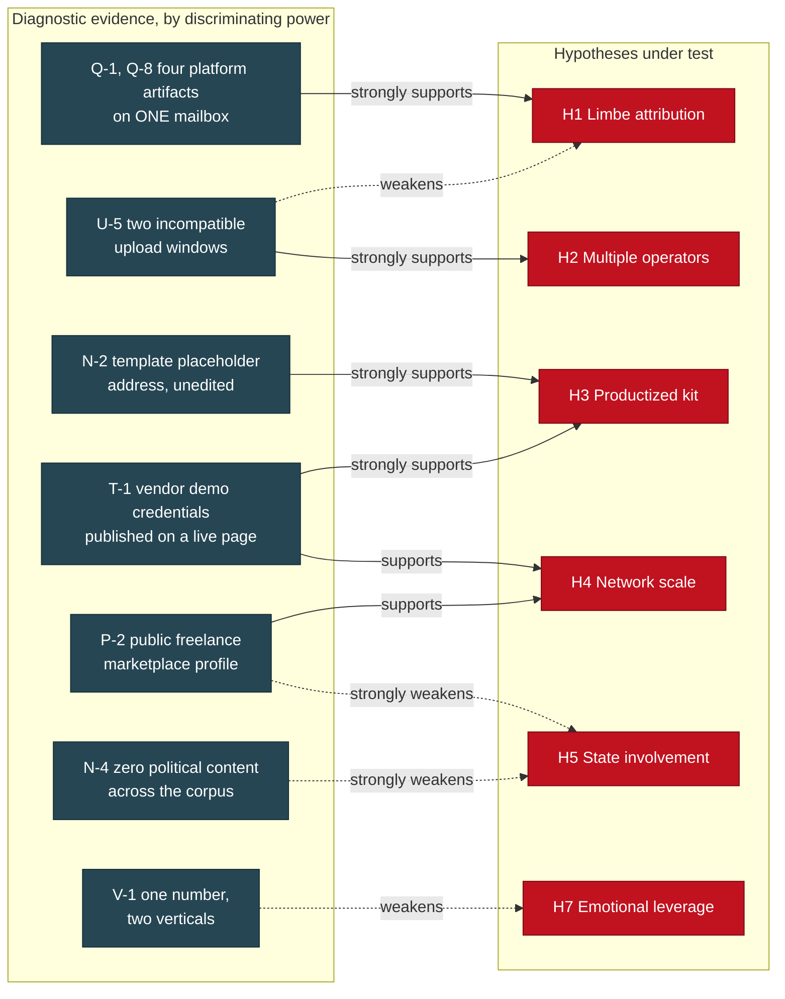
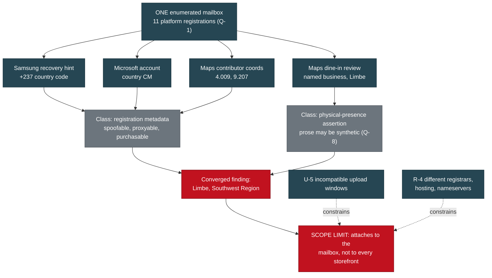
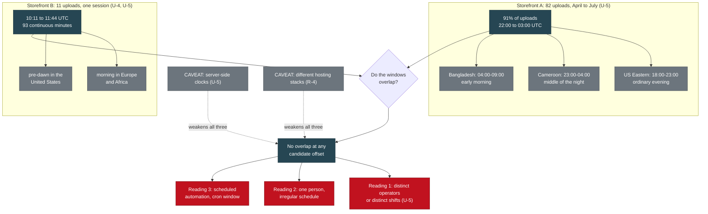
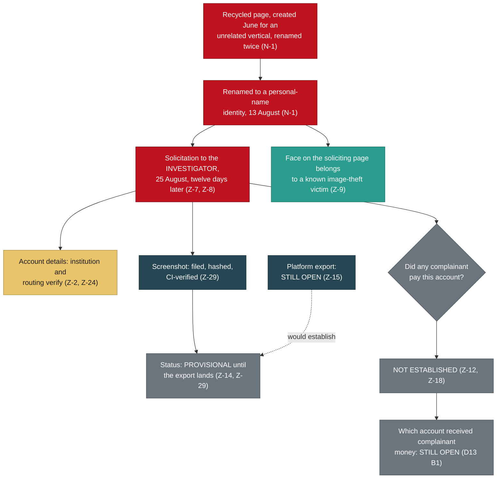

# BRIEF-04: Intelligence Assessment, Wiener-Gate Puppy-Fraud Network

> Category: Public Brief | Version: 1.0 | Date: August 2026 | Status: Active

> ## READ THIS BEFORE ANYTHING ELSE
>
> **This brief contains assessed judgments and hypotheses. They are the authors' analysis. They are not established fact.**
>
> Every other document in this corpus is built to a narrower standard: a claim appears only when an artifact supports it. This brief is deliberately allowed to reason past that line, because an intelligence consumer needs to know what the analysts think is happening and not merely what has been photographed. The cost of that permission is that every step past the evidence must be visible.
>
> Three markers are used, and only these three. They are the sanctioned vocabulary defined at `CONTRIBUTING.md` line 15 and at A5.1. No others are introduced anywhere in this document.
>
> | Marker | Means |
> |---|---|
> | **[ASSESSED]** | A conclusion the evidence supports. Contestable, but the artifacts are on the table and they point this way. |
> | **[HYPOTHESIS]** | A proposed explanation that has not been tested. It fits the evidence; so may several others. It is offered so it can be attacked. |
> | **[UNVERIFIED]** | A claim that outruns its evidence. Recorded because it is in circulation, not because it is believed. |
>
> An unmarked sentence is a factual claim and carries a reference to the private evidentiary record. A sentence with neither a marker nor a reference is an editorial connective and carries no weight.
>
> **What this brief will not do.** It will not name a complainant, name any person under the firewall, publish suspect-side financial identifiers, state or imply that any complainant paid the account solicited from the investigator, or attach a dollar figure to aggregate loss. Those are binding constraints from the redaction contract, and several of them forbid claims the corpus could not support anyway.

**Related:**

- [`../REDACTION_CONTRACT.md`](../REDACTION_CONTRACT.md), the binding publication contract this brief was written against
- [`../README.md`](../README.md), the scope rule for the public knowledge tier

Companion briefs for the victim-facing, technical, and law-enforcement audiences ship alongside this one in the same folder. This brief assumes none of them.

---

## 1. Scope, sourcing, and the analyst's warning label

### 1.1 What the corpus is

The underlying record is a chain-of-custody evidence log covering a multi-brand pet-sales fraud network operating across Facebook, TikTok, WhatsApp, and five websites, together with the site captures, hashes, OSINT exports, and derived analysis behind it (HANDOFF sections 1 and 3). It has been through six rounds of adversarial review, two of them formal red-team passes whose findings are preserved in full rather than absorbed (HANDOFF A6; analysis documents 03 and 04).

Nearly everything is open-source or platform-attested: registry records (R-1), Facebook Page Transparency panels (N-1, A2-11, B-15), a German commercial register entry (A3h), account-enumeration exports (Q-1, P), and direct HTTP captures of live sites (U, T, S). Two items are different in kind: one Messenger thread supplied by a complainant (Z-27), and one screenshot supplied by the investigator (Z-29). Both are flagged where used, because a rendering produced by a party to the investigation is a different evidentiary object from an export produced by a platform (Z-29).

### 1.2 Structural disclosure: the collector is not a neutral third party

The three complaining victims are referred to throughout the public corpus as **Complainant A**, **Complainant B**, and **Complainant C**, with the mapping held only in the private law-enforcement package (redaction contract section 3). This brief never needs to distinguish between them and therefore never uses an individual label.

**The compiler of this record is personally acquainted with one of the named complainants, who forwarded the initial material** (Y-2). Which one is not stated here and is not derivable from any public document in this corpus.

This is disclosed at the front for the reason the record itself gives: an analyst who discovers an undisclosed relationship discounts everything around it (Y-2). It also answers a question the file otherwise invites, which is why a corpus of this size exists over a pet deposit.

The analytic exposures it creates:

1. **Collection is not random.** The investigation started from material one acquainted person forwarded (Y-1) and expanded outward. **[ASSESSED]** The corpus over-represents the brands and personas reachable from that starting point and systematically under-represents the rest of the network.
2. **The collector interacted with the target.** A Messenger conversation existed, a checkout form on a card-harvesting storefront was populated, and a cart API was contacted (HANDOFF section 6; AMENDMENT 1 A4). The mechanism that populated the form was not recorded and cannot be reconstructed, so it is classified conservatively as an active submission and disclosed rather than characterised more favourably (AMENDMENT 1 A4).
3. **The account solicited at Z-1 was solicited from the investigator, not from a complainant** (Z-12, Z-18). That single fact governs the entire money section of this brief.

### 1.3 Confidence scale

| Term | Means |
|---|---|
| **High confidence** | Multiple independent artifact classes, each captured and hashed, and no surviving alternative explanation the authors can construct. |
| **Moderate confidence** | The evidence points one way and competing explanations are weaker, but a single collection item could move it. |
| **Low confidence** | Offered because a consumer needs a working assumption, not because the evidence compels one. |

A confidence level never substitutes for a marker. A **[HYPOTHESIS]** held with moderate confidence is still a hypothesis.

---

## 2. Bottom line up front

**[ASSESSED]** This is a commercially motivated, multi-vertical fraud operation assembled from purchased components rather than a single bespoke build, with an operator layer whose account artifacts converge on one Cameroonian city and a content and page-farming layer that is platform-attested to Bangladesh (Q-4). High confidence on productization; moderate confidence on each geographic layer; low confidence that any single actor spans both.

**[ASSESSED]** The durable linkages are at the content layer, not the infrastructure layer. Stolen-image provenance and template artifacts have survived every test, and the reuse of persona names across supposedly unrelated brands is documented and reproducible. Shared IP, shared FTP gateway, and shared phone numbers were each advanced as linkage and each was withdrawn after testing (R-4, S-6, V-5; HANDOFF 4b). High confidence, because the record contains the failures as well as the successes.

**[HYPOTHESIS]** The reused names may be operator-generated rather than vendor-seeded data shipped with the kit. That provenance question is untested and it is load-bearing: if the names ship with the template, shared personas show only that two sites bought the same kit. What is documented is the reuse itself, not its origin (Q-5, T-3). Section 6 treats this as the most consequential open assumption in the corpus.

**NOT ESTABLISHED, and it is the most important negative in the file:** that any complainant sent money to the account the operators solicited from the investigator (Z-12, Z-18). The account that received complainant funds remains unidentified (Z-18; D13 B1 supersession note).

**[HYPOTHESIS]** The absence of an identified victim-receiving account is a collection gap rather than a substantive finding. Untested, and there is no artifact behind it.

---

## 3. Analysis of competing hypotheses

The seven hypotheses below are not mutually exclusive. Several can be true at once, which is the analytic point: the record describes a market of services rather than a single enterprise (analysis document 03 W1; HANDOFF section 1).

The matrix scores diagnosticity, meaning how much each item discriminates between hypotheses, not how much it supports the leading one. Evidence consistent with everything discriminates nothing.

| Evidence item | H1 Limbe | H2 Multiple operators | H3 Productized kit | H4 Scale | H5 State | H6 Mule net | H7 Emotional leverage |
|---|---|---|---|---|---|---|---|
| T-1 vendor demo credentials published on a live site | neutral | neutral | **strongly consistent** | consistent | inconsistent | neutral | neutral |
| N-2 template placeholder address left in place | neutral | neutral | **strongly consistent** | consistent | inconsistent | neutral | neutral |
| U-5 two incompatible upload windows | inconsistent | **strongly consistent** | consistent | consistent | neutral | neutral | neutral |
| Q-1, Q-8 four platform artifacts on one mailbox | **strongly consistent** | inconsistent | neutral | neutral | neutral | neutral | neutral |
| Q-5 persona pool shared across domains and stacks | neutral | consistent | **strongly consistent** | consistent | neutral | neutral | neutral |
| N-4 zero political content across the corpus | neutral | neutral | neutral | neutral | **strongly inconsistent** | neutral | consistent |
| P-2 gig-labour profile on a public marketplace | inconsistent | consistent | consistent | consistent | **strongly inconsistent** | neutral | neutral |
| V-1 one phone number spanning two verticals | neutral | neutral | consistent | consistent | neutral | neutral | **strongly inconsistent** |
| T-6 fake careers page with a remote support role | neutral | neutral | consistent | neutral | neutral | **consistent** | neutral |
| R-1 storefront replacement every four to ten weeks | neutral | consistent | **strongly consistent** | consistent | inconsistent | neutral | neutral |

**Reading the matrix.** Two items carry most of the discriminating load. The published vendor demo credentials (T-1) and the untouched template placeholder (N-2) are close to dispositive for H3 and inconsistent with H5. The two incompatible upload windows (U-5) are the only evidence in the corpus that speaks directly to how many hands are on the keyboard, and it cuts against H1's strongest formulation at the same time as it supports H2. That tension is the most analytically interesting thing in the record.

---

## 4. Hypothesis 1: the operator layer is in Limbe, Southwest Region, Cameroon

### 4.1 The pro-advocate case

Four platform artifacts and one timestamped physical-presence indicator converge on a single small coastal city.

| Signal | Source | Class |
|---|---|---|
| Recovery phone hint carrying the +237 country code | Samsung account registration (Q-1) | Registration metadata |
| Account country CM, created 2025-06-20 | Microsoft account (Q-1) | Registration metadata |
| Contributor coordinates 4.0091953, 9.2071428 | Google Maps contributor profile (Q-1, Q-8) | Platform geolocation |
| Dine-in lunch review of a named beachfront business in Limbe | Google Maps review, approximately August 2025 (Q-8) | Physical-presence assertion |

The convergence is the argument. Registration country, phone prefix, and contributor coordinates are all metadata and all spoofable or proxyable, and the record says so explicitly (Q-8). The review is a different class of claim: it asserts that the account holder was bodily at a specific small location, ordering lunch (Q-8). Metadata can be manufactured cheaply. A dine-in review of a named restaurant in a specific district of a small city is a different kind of lie to tell, and there is no reason to tell it.

The corroborating context is real. A previously unexplained francophone thread resolves once the operator layer is francophone: two French-provider mailboxes and a country-FR registration on an office suite all become ordinary rather than anomalous (Q-2). The same account's professional profile claims a United States location while the account operates from elsewhere, which is a documented misrepresentation by the operator rather than an inference about one (Q-1). The finding fits an established, previously prosecuted pattern rather than presenting as novel (Q-3).

The record also earns credit for correcting itself: an earlier draft placed the coordinates in a larger city roughly seventy kilometres east, and the correction is retained in place rather than quietly fixed (Q-8).

**Operational value.** For a referral this converts a generic and frequently triaged classification into a named city with four corroborating signals and a timestamped physical-presence indicator (Q-8). That is approximately the finest geolocation obtainable from open sources without compulsory process.

### 4.2 The devil's advocate case

**The four signals are not four independent observations. They are four platform surfaces of one mailbox.** Every row above derives from account enumeration against a single address and its eleven platform registrations (Q-1). Counting them as four independent corroborations double-counts one underlying object. If that mailbox was purchased, resold, compromised, or operated by someone who is not the person taking deposits, all four rows fall together.

**Registration artifacts are cheap to spoof and cheaper to buy.** A country field on a free account is self-asserted. A recovery phone hint proves a number was attached at some point, not that it is held now. Contributor coordinates reflect where a device reported itself, and consumer VPN endpoints and residential proxy services are commodity products. The account-resale market for aged, geolocated platform accounts is mature. Nothing in the corpus tests whether this mailbox was originally provisioned by the person who later used it.

**The physical-presence indicator is weaker than its billing.** The record itself notes that the review prose is stylistically consistent with machine generation, and that the profile is a low-tier contributor account with one review and six answers, a shape consistent with points farming (Q-8). The corpus's defence is that points-farming accounts overwhelmingly review businesses near the operator (Q-8). That is a behavioural generalisation, not an artifact, and it is exactly the kind of reasoning this corpus demotes elsewhere.

**The corpus's own best evidence argues the mailbox does not speak for the network.** Two storefronts show incompatible working-hour signatures (U-5) and sit on different registrars, hosting, and nameserver pairs (R-4). The log states in terms that account-level evidence establishes where that mailbox's registrations originate, not that the same hands run every storefront (X-4 Q3). A geolocation of one node in a supply chain is not a geolocation of the chain.

**The onomastic support has already been withdrawn**, because names attached to infrastructure in this case are unreliable (X-4 Q3, V-4, A5c). What remains is the mailbox, and the mailbox is one node.

**[UNVERIFIED]** Any statement that the person who collected a deposit from a complainant is located in Limbe. Nothing connects the enumerated mailbox to a completed transaction with any complainant.

### 4.3 Assessment

**[ASSESSED]** The account artifacts place *that mailbox's platform registrations* in Limbe, Southwest Region, Cameroon. Moderate confidence, and the confidence attaches to the mailbox rather than to the operation.

**[ASSESSED]** The corpus does not support extending that geolocation to storefront operators generally. Moderate confidence, resting on U-5 and R-4 rather than on positive evidence of a different location.

The honest formulation is the one the corpus already applies to its Bangladesh finding: this attests to where a service-layer account sits, not to where the person who took the money lives (analysis document 03 W3).

### 4.4 What would resolve it

**Subscriber records.** Carrier subscriber data for the hinted recovery number, platform account records from the four services, and device and IP history from a preservation request (X-2 item 3). These are the only artifacts that separate present control from a purchased history, and the corpus is explicit that open-source collection has reached its ceiling on exactly this question (X-2 item 4; HANDOFF section 9). Second-order and cheaper: whether the enumerated mailbox appears in any complainant's message thread. If it does, the mailbox stops being an isolated node.

---

## 5. Hypothesis 2: one operator versus several

### 5.1 The pro-advocate case for several

Two storefronts in the same network were built in working windows that cannot belong to the same person on the same schedule.

One storefront yielded 82 timestamped uploads, self-verifying because the filenames encode the same moment twice (U-5). Seventy-five of the eighty-two, which is 91 percent, fall between 22:00 and 03:00 UTC (U-5). Two bulk stocking sessions of 39 and 28 images built the inventory in the first week after registration, followed by a trickle and then nothing for seven weeks while the site kept taking inquiries (U-5).

The other storefront's entire image-upload session ran 10:11 to 11:44 UTC, eleven images in a continuous 93-minute stretch at a steady three to sixteen minute cadence, finishing 34 minutes before the domain was registered (U-4, U-5). That is morning in Europe and Africa and pre-dawn in the United States.

The windows do not overlap. **[ASSESSED]** Distinct, non-overlapping working patterns on two storefronts in the same network are consistent with distinct operators or distinct shifts drawing on a shared content-production toolkit (U-5). This is reinforced by infrastructure separation that has nothing to do with time: different registrars, different hosting stacks, different nameserver pairs, and in one case an entirely different platform and mail provider (R-1, R-4). The structural finding follows: different storefront operators are buying from the same marketplace, and a model describing one victim served by four vendors understates it (X-4 Q1).

### 5.2 The devil's advocate case for one

**One person with an irregular schedule produces exactly this signature.** A fraud operator is not on a shift roster. Bulk-stocking a new storefront at night and harvesting images for the next one in the morning six weeks later is not a contradiction. The two windows are separated by four months of calendar time, and the corpus does not demonstrate that both patterns were ever active concurrently.

**Scheduled automation produces the same signature and is cheaper to explain.** Bulk uploads of 39 and 28 images in single sessions are as consistent with a script running against a queue as with a person clicking. If the upload leg is automated, the timestamp reflects the cron window, not a human's waking hours.

**Server clocks are not operator locations, and the corpus says so.** Upload timestamps are server-side (U-5). The two sites sit on different hosting stacks (R-4), so the two windows are not even measured against the same reference unless both hosts run correct UTC.

**An operator targeting a foreign market may deliberately work that market's hours.** The record raises this itself (U-5). The 22:00 to 03:00 UTC window maps to 18:00 to 23:00 US Eastern in the relevant month, which is precisely when a US buyer browses for a puppy.

**And the count is two.** Two windows on two storefronts, out of five sites, is a thin base for a claim about the size of an organisation. It supports "not demonstrably one" far better than any specific number.

### 5.3 Assessment

**[ASSESSED]** At least two distinct working patterns exist. Moderate confidence. The evidence is self-verifying and the corpus treats it as one of the few conclusions bearing on how many people are involved (Z-10).

**[ASSESSED]** The evidence does not establish how many operators there are, and cannot. Low confidence in any specific count. The corpus's posture is correct: allege a shared criminal market with specific linked sub-clusters, not a single monolithic enterprise, because overclaiming one operation is the easiest thing to falsify and would discredit the rest (analysis document 03 W1).

**[HYPOTHESIS]** The most economical reading is a small number of storefront operators purchasing from a common vendor layer that supplies the persona pool, the templates, and the aged pages. Untested, though it predicts observable things.

### 5.4 What would resolve it

**Concurrency, not sequence.** Recover upload or edit timestamps from two storefronts demonstrably live at the same time. Two non-overlapping windows during a shared active period is a far stronger claim than two windows four months apart.

**Session-level records.** Platform login and device history from a preservation request would settle it directly (X-2 item 3).

**An automation test that costs nothing.** Inter-upload interval distribution across all 82 uploads. A human working through a listing page produces the irregular three to sixteen minute cadence already observed (U-4); a script produces tight, near-constant intervals. Unrun.

**A precisely placed solicitation timestamp.** The record identifies this explicitly: a solicitation event placed unambiguously in UTC is a data point about which working pattern that operator follows (Z-10). It currently cannot be placed, because the only artifact is a screenshot and a screenshot cannot resolve its own timezone (Z-29).

---

## 6. Hypothesis 3: a productized kit deployed unmodified, not a bespoke build

This is the strongest structural claim in the corpus and deserves to be argued at full strength before it is attacked.

### 6.1 The pro-advocate case

**The vendor's demonstration credentials are published on the open internet.** A live shipping-company site renders an admin login page and prints beneath it, in plain text, a demo credential string (T-1). The string "(demo)" appears in the footer of every page in both English and German (T-1). The vendor's demonstration shipment record is still live in the tracking database (T-1, T-3). No login was attempted and none should be; the evidentiary value is entirely in the fact that the string is published (T-1; HANDOFF 2c). That is not an inference about a kit market. That is a purchased product deployed unmodified, visible in the shipped artifact (X-4 Q1).

**The paint is thinner than the template underneath.** The pet-services navigation is cosmetic; the page filenames beneath it are generic freight forwarding, so "Ferry Ground Transport" is ocean-freight, "Boarding Layover Care" is warehousing, and "Pet Travel Insurance" is cargo-insurance (T-2). The quote form asks a family relocating an animal for their company name and cargo type (T-2). Four image pairs on that site are byte-identical duplicates under different filenames, and one of them is a photograph of a shipping container truck saved as the pet-carrier hero image (T-2).

**A second, unrelated brand shipped a different vendor's placeholder.** An archived capture of another site in the family shows its contact mailto resolving to a demonstration placeholder address from a well-known commercial template (N-2). Two vendors, two unedited placeholders, one methodology.

**The unedited-artifact table is long and each row is arithmetic rather than interpretation.** Alt text naming a completely different kennel in a different state (A2). A live stat counter reading zero satisfied clients (A-7). A self-referential copyright line naming a throwaway domain as its own publisher (A3). A dated placeholder image rendering as a product photo (analysis document 04 S3). A Terms page claiming it was last updated 27 days before the domain existed, alongside three blog posts dated before the domain existed (T-4). A fabricated corporate history claiming a founding fifteen years before the registration record, with four executives who have no photographs (T-4).

**Content harvesting is self-documenting.** One storefront never renamed the photographs it took, so the upload paths retain the source site's filenames and marketplace listing IDs (U-3). Eleven of twelve images were uploaded in a continuous 93-minute session finishing 34 minutes before the domain was purchased (U-4). Content first, domain second.

**The persona pool is a shared asset.** The same fabricated testimonial names recur across independent domains on different hosting stacks with different assigned cities, and one persona appears four times across three domains, including as the recipient in the template vendor's own demo shipment record (Q-5, S-3, T-3, U-7). One site carries two visibly different generations of fabricated testimonials on a single page, indicating two separate content passes (U-7).

**The replacement cadence is industrial.** Registry records show continuous storefront replacement every four to ten weeks across at least five months, with three domains already deregistered and one storefront registered six days before the file was compiled (R-1, R-2).

**[ASSESSED]** This is a purchased-component operation. High confidence. It rests on artifacts the operators cannot retract, because they are captured and hashed (X-2; HANDOFF section 9).

### 6.2 The devil's advocate case

**Commercial templates are sold to everyone, and using one proves nothing about who you are.** The corpus has already over-read foreign-language template artifacts twice and corrected itself both times (A3c, A3e; HANDOFF 2d). Template evidence has a history in this file of looking more probative than it is.

**"Productized" and "coordinated" are different claims, and the first does not imply the second.** Ten thousand unrelated people buying the same freight template and failing to edit the footer would produce exactly this artifact set on ten thousand unrelated sites. The unedited placeholder is evidence about the vendor's customer base, not about whether these sites share an operator. The corpus's own counter-thesis makes the point: the rebuttal must rest on the specific-shared, not the generic-shared (analysis document 03 C1).

**The strongest cross-network linkage in the file may itself be a template artifact.** The persona pool is the load-bearing linkage, explicitly substituted for the discredited shared-IP claim (R-4, Q-5). But one of those personas appears as the recipient in the template vendor's own demonstration seed data (T-3). If the persona names ship *with the kit*, two sites sharing them proves they bought the same kit and nothing else. **[UNVERIFIED]** That the persona pool is operator-generated rather than vendor-shipped. The corpus does not test it, and T-3 is a live reason to doubt it.

**The kit-deployment count is unmeasured.** The case for productization at scale would be far stronger with a number, and the cheapest way to get one, an exact-phrase search on the published demo-credential string, is listed as the highest-yield unrun pivot in the file (HANDOFF item 9). Until it is run, "this is a product" is well evidenced and "this product is widely deployed" is not.

### 6.3 Assessment

**[ASSESSED]** The sites are purchased kits deployed with minimal or no modification. High confidence. This survives the devil's advocate intact, because the demo credential string and the demo shipment record are properties of the shipped artifact and require no inference at all.

**[ASSESSED]** Productization does not by itself establish common operation across brands. Moderate confidence, and this is where the pro-advocate case overreaches if left unchecked.

**[HYPOTHESIS]** The persona pool is operator-generated and therefore remains a valid cross-network linkage. Moderate confidence, and it is the single most consequential untested assumption in the corpus, because the shared-IP and shared-phone linkages were both already withdrawn (R-4, S-6, V-5) and the persona pool is what replaced them.

### 6.4 What would resolve it

1. **Exact-phrase search on the published demo-credential string** (HANDOFF item 9). Returns the deployment count. Cheapest high-value action in the file.
2. **Inspect the template vendor's demonstration data set.** If the recurring persona names ship in vendor seed data, the persona linkage collapses and a large part of the cross-network case goes with it. If they do not, the linkage hardens substantially.
3. **Certificate transparency pulls and favicon hashing** across the domain family (blind-spots review 3.5; D13 B9). Certificate batches issued together are linkage that survives hosting changes.

---

## 7. Hypothesis 4: network scale

### 7.1 The pro-advocate case

The defensible scale thesis is productization and measurable deployment count. It is not money and it is not a domain tally.

What is measurable and in hand: five sites in the immediate network, four live and one reduced to a working mailbox with live MX, live SPF, and a certificate renewed ten days before capture (U, R-3). Page recycling is documented rather than assumed, with one page created for an unrelated commercial vertical, renamed the same day, then converted ten weeks later into a personal-name identity carrying a stolen photograph (N-1), and another cycling through a personal name, viral-video aggregation, news, religious content, and finally pet rescue while carrying an inherited follower base (B-15). Sock-page admin rosters were captured directly before the network began locking group and friend lists down (B-13, X-2).

Cross-vertical reuse is documented at the identifier level: one published phone number is simultaneously the sole contact for a fraudulent pet storefront and the WhatsApp handle in the bios of two live gray-market peptide accounts on a second platform, with a third account in that set already removed for what its own bio language marks as ban evasion (V-1, V-3). One storefront in the wider corpus is not a pet site at all; its own header advertises clothing, furniture, toys, baby products, and sports merchandise, with puppy listings as auto-generated filler priced at template defaults no living animal is sold for (A3). On that one storefront, more than twenty third-party domains had images served directly from their own servers, each an independent victim of bandwidth theft and copyright infringement with independent standing to act (A3b).

Replacement tempo is registry-attested: four to ten weeks per storefront across at least five months, three domains already deregistered, one storefront six days old at capture (R-1, R-2).

**[ASSESSED]** This is a repeatable production line rather than a single site. High confidence. **[ASSESSED]** Page identities are commodity inventory rather than purpose-built fronts. High confidence (N-1, B-15, X-4 Q2).

### 7.2 The devil's advocate case, and two claims that must be killed

**A domain count and a country count are circulating inside our own deliverables with nothing behind them.** A figure asserting a domain total and a country total appears in eight documents in the D-series, including the submission kit and the master packet. It appears **zero** times in `EVIDENCE_LOG.md`. There is no artifact behind it anywhere in the record. **[UNVERIFIED]**, and that label is generous. The figures are not reproduced in this brief, not even in order to rebut them, and no version of them should reach a validator.

**The propagation is itself the finding, and it is the most instructive thing in this section.** A number that entered at the deliverable layer and replicated across eight documents without ever touching the evidence layer is precisely how a corpus talks itself into a scale claim it cannot defend. It is the same failure mode the record already caught once and corrected as a documented custody exception: a claim living only in a derived, machine-consumed artifact while contradicting the narrative record beneath it (Z-23, Z-26). Corrections that live only in prose do not reach the artifacts that build the filings. **The productization thesis exists to replace that number, and it is stronger than the number would have been even if the number were true, because every element of it is captured and hashed.**

**Third-party market research is not our measurement and must never be transposed.** Published research on the wider fake-storefront market reports franchise networks with tens of thousands of domains resolving to a few dozen IP addresses (A3d). Those are other people's numbers about a market. They establish that this shape of operation exists at industrial scale; they say nothing about the size of *this* network. **We have no count of our own**, and saying so plainly is better analysis than borrowing one.

**Several country claims are already known to outrun the evidence.** The counter-thesis identifies which geographies are evidenced and which are not, and directs that the unevidenced ones be produced or dropped before anything is filed or published, because a single unsupported country claim invites the response that the analyst is seeing patterns everywhere (analysis document 03 W2). One account-spawn-rate figure also in circulation has no measurement behind it at all and the counter-thesis directs that it be derived or removed (analysis document 03 W4). It is not repeated here.

**And the dollar figure must not be written.** There is no aggregate loss estimate in this brief and there will not be one in any version of it. The corpus does not support one (redaction contract section 4; D13; Z-18). The temptation is strong precisely because a dollar figure is what makes a fraud story legible to a general reader. Resisting it is not squeamishness: a number that cannot be reproduced is the easiest thing for a hostile reader to attack, and when it falls it takes the well-evidenced findings with it. What the corpus does support is narrower: published deposit asks and price ranges are recoverable from the site captures (U-8), and the template vendor's own demo record reveals the intended fee scale for the shipping leg (T-3). Neither is a loss.

**The devil's advocate case against the scale thesis itself**, so it is not left unattacked: five sites and two page-recycling case studies is a small sample. Page recycling is a documented commodity market anyone can buy from, so observing recycled pages establishes that these operators are customers of that market, not that they run it. And the cross-vertical phone number is one number; the corpus's own correction says phone numbers are working infrastructure that moves between operations and carries stale third-party history (V-5), which cuts against reading a single shared number as a measure of anything's size.

### 7.3 Assessment

**[ASSESSED]** The productization argument is the defensible scale thesis. High confidence. **[ASSESSED]** Domain and country counts beyond the corpus's own enumeration are unreproducible as the record stands, and the specific figure circulating in the D-series is unattested. High confidence in that negative. **[ASSESSED]** No aggregate loss figure is supportable, and it is a binding publication constraint independent of confidence (redaction contract section 4).

### 7.4 What would resolve it

**Structural enumeration by URL pattern** across the storefront family (D13 B6), named in the record as the way the scale claim gets its receipts, and unrun. **The demo-credential dork** (HANDOFF item 9), which measures deployment of one kit across every vertical rather than domains in one vertical. **Registry creation-date clustering** across the enumerated set (D13 B2), where dates arriving in batches are linkage as well as scale.

---

## 8. Hypothesis 5: state involvement or state tolerance

**Status before the argument begins: this hypothesis has already been assessed in our own record and concluded against.** N-4 evaluates it on the evidence and finds that the evidence supports a commercially motivated page-farming and fraud operation and does **not** support a state-influence attribution (N-4). It is run pro-advocate and devil's advocate below because it continues to circulate and because a consumer is entitled to see the reasoning rather than the verdict. But it is not presented as open. The devil's advocate side has already won inside our own record, and the countervailing evidence at N-4 is the reason.

### 8.1 The pro-advocate case, presented fairly

The underlying concern is legitimate and the record preserves it rather than dismissing it (N-4). The strongest form of the argument is not that political content exists. It is that political content is not what you would expect to see yet.

**The capability is genuinely dual-use.** The commodity market in aged and repurposed pages supplies fraud operations and influence operations alike, and this is documented in open-source research on both (N-4). Described by capability, the machine can mass-produce and age credible social identities, generate synthetic faces and brand assets on demand, harvest real identities and social graphs at scale, move value across borders, and cloak against automated scanners (D10 section 2). That capability set is payload-agnostic (D10 section 2).

**Some observed behaviour is audience-building rather than retail.** One page shows a follower-to-following ratio consistent with aggressive outbound following, which is how you build an audience and not how you run a shop (N-4). One page's name history passes through viral-video aggregation and a news-adjacent category before arriving at pet rescue (N-4, B-15), and news aggregation is influence-adjacent tooling. **A page can be repointed at any time**: the mechanical action that turned a commercial page into a personal-name identity in ten weeks (N-1) is the same action that would turn a rescue page into a cause page.

**The geography is not neutral**, overlapping jurisdictions with documented mass online-fraud ecosystems and weak enforcement, with a European registered entity on the payment leg (D10 section 4). **And the honest form of the timing argument is uncomfortable but real:** a pre-activation commercial ramp looks identical to ordinary fraud until the payload is loaded, so the current absence of political content is what the hypothesis predicts before activation (D10 section 3).

### 8.2 The devil's advocate case, which has already prevailed at N-4

**The monetization is immediate, direct, and asset-burning.** Deposits, escalating fee ladders, and a live card-capture checkout routed through a real merchant account (N-4). Influence operations do not typically monetize assets this way, because doing so burns the asset and attracts payment-processor scrutiny (N-4). Every dollar extracted is an identity spent.

**The staffing is gig labour on a public marketplace.** The single account-level identity recovered in the case resolves to a freelance profile on an open marketplace advertising social media marketing services, with a stated location, a stated timezone, and an edit-dated profile photograph (P). The record calls this the strongest evidence to date against the state-influence hypothesis, for the obvious reason: influence operations do not staff via public freelance marketplaces with searchable profiles (P-2).

**The Chinese-language artifact is a commercial template, purchasable by anyone, and this file has already corrected two over-readings of exactly that kind of evidence** (N-4, A3c, A3e). Kit authorship is not operator attribution (D10 section 4). **The platform-attested location is not China**, across two independent captures of a South Asian managing location for the page layer (A2-11, B-15, N-4).

**The content is apolitical across the entire corpus**, with nothing across 140 files and 38 account clusters containing political messaging, candidates, parties, or election themes (N-4; analysis document 03 C2). **And the category-hopping is better explained as commerce**: pages repurposed to whatever monetizes this week is the signature of commodity page flipping (N-4). The strategic assessment presents the same pivot as evidence of pre-positioning (D10 section 3). One observation, two readings, and the commercial one requires no additional assumptions.

**On the unfalsifiability problem.** The argument that absence of political content is what the hypothesis predicts is structurally unfalsifiable in the short run: it makes every possible present observation consistent with the theory. That is not a reason to dismiss the underlying concern, and the strategic assessment is explicit that it labels itself a hypothesis and pairs every escalation claim with what would confirm and disconfirm it (D10 reading note, D10 section 7). An intelligence consumer should price it accordingly.

### 8.3 Assessment

**[ASSESSED]** The evidence supports a commercially motivated page-farming and fraud operation and does not support a state-influence attribution. Moderate to high confidence. This restates N-4's own conclusion and the devil's advocate case above is the reason (N-4, P-2; analysis document 03 C2).

**[HYPOTHESIS]** The infrastructure could be repurposed or resold for influence work. This is a capability observation, not an attribution, and it is worth carrying to a recipient as an infrastructure concern precisely because it asserts nothing the evidence cannot support (N-4; D10 section 5).

**[UNVERIFIED]** State direction, state tasking, or state tolerance of this network by any government. Nothing in the corpus speaks to it, and the strategic assessment itself classes state direction as unproven opinion (D10 section 7).

### 8.4 What would resolve it, and the cheap decisive test is unrun

**The Meta Ad Library check.** Free, no login, and it surfaces whether any page in the network ever bought paid reach, with spend, targeting, and reach attached (N-4; D13 B3). Paid political amplification is separately archived and searchable (N-4). The record describes it as the single cleanest test of the hypothesis and as cheap and decisive (N-4; D13 B3).

**It has not been run across the network.** One data point exists: a single page capture shows that page not currently running ads (N-4). That is one page, at one moment, and it is a present-tense field rather than a history. **[ASSESSED]** The most decision-relevant open item on this hypothesis is free, takes an afternoon, and would either materially strengthen or materially weaken it. That it remains unrun while the theory continues to circulate is the clearest tradecraft gap in the file.

Secondary tests, all named in the record: audit outbound following lists rather than follower counts, check whether any page previously carried political content in its name history since Page Transparency shows this and cannot be edited, and look for coordinated posting timing across unrelated pages (N-4).

---

## 9. Hypothesis 6: one receiving account or a mule network

### 9.1 What is actually established

This section is written with unusual care, because the record's most consequential self-correction lives here.

**ESTABLISHED:** on one date in August 2026 the operators sent bank account details to the **investigator** and solicited a wire transfer (Z-18). The routing number and the institution verify against the routing directory (Z-2, Z-24).

**NOT ESTABLISHED:** that any complainant ever sent money to that account; that the account received complainant funds; that the named holder knowingly participated in anything (Z-18). The account that received complainant money remains unidentified (Z-18; D13 B1 supersession note).

The account number is not published here and appears in no public artifact (redaction contract section 1). The named holder is not identified here and is not to be named as a suspect (Z-4; redaction contract section 2).

The solicitation arrived from a page already documented in the corpus a day earlier as recycling inventory: created for an unrelated commercial vertical, renamed the same day, and renamed again to a personal-name identity **twelve days** before the solicitation (N-1, Z-7, Z-8). Both the page identifier and its rename history are cleared for publication (redaction contract section 5).

**That finding is PROVISIONAL.** The supporting screenshot is filed, hashed, and under continuous integrity verification (Z-29), so the report is no longer uncorroborated. That does not make the finding established. A screenshot is a rendering produced by a party to the investigation; it carries no message ID, no server-side timestamp, and nothing that independently ties it to the account it depicts (Z-29). The finding becomes established when the platform's own export lands and is filed (Z-15, Z-29).

The timestamps illustrate the discipline. Capture metadata and filesystem modification time agree on when the investigator captured the screen. The time displayed inside the rendering is a picture of a clock and is authoritative for nothing on its own (Z-29). The one-hour daylight-saving ambiguity in the displayed value cannot be resolved from the screenshot, because a screenshot cannot resolve its own timezone (Z-10, Z-29).

### 9.2 The pro-advocate case for a mule network

**All three readings of the account holder fit the evidence equally well** (Z-4): a recruited money mule, an identity-theft victim, or an operator or an operator's associate. That is the record's stated position and it has not moved. The pro-advocate case for the mule reading rests on three things.

**First, the recruitment channel is documented on the operators' own infrastructure.** The fake shipping company runs a live careers page advertising four roles, including a remote customer support position, with an upload form collecting full name, email, phone, a resume file, and a cover letter (T-6). Resumes carry home addresses, employment history, education, and frequently dates of birth. The record classes this as document and identity harvesting aimed at job seekers, and notes that the remote support listing fits the standard money-mule recruitment pattern (T-6).

**Second, the account shape is consistent with remote onboarding.** A holder address in one country paired with a routing number in another is not a branch relationship (Z-3). This is explicitly relabelled: **[HYPOTHESIS]** the account is a sponsored fintech program rather than a branch relationship, which would mean remote onboarding, and an in-person opening is not excluded by anything currently in the file (Z-13). Remote onboarding is the channel through which stolen and synthetic identities pass most easily (Z-3).

**Third, every identity this network has displayed so far has been stolen or fabricated** (Z-4): breeder photographs, an executive roster, testimonial personas, and an entire harvested photo album. A real name attached to a remotely-onboarded account, in a network built entirely from other people's identities, is not evidence that the person consented to its use (Z-4).

### 9.3 The devil's advocate case

**The sample size is one, and it is the wrong one.** A single account, solicited from the investigator rather than from a complainant, cannot distinguish a mule network from a single receiver from an operator's own account. The record frames the discriminating question correctly: whether other accounts were given, because a second account name would establish a mule network rather than a single receiver (Z-6).

**The rail mismatch is a live alternative explanation.** The solicited account is an ACH and wire account at a chartered institution; the rails anticipated from complainant intake are consumer payment apps (Z-12). Those are different rails and possibly different accounts, and three readings remain open: one account across all victims and rails, rotating accounts with complainants having paid earlier and different ones, or this account reserved for wire and ACH with app rails handled separately (Z-12).

**The mule reading may be motivated reasoning.** It is the humane assumption, and humane assumptions deserve the same scrutiny as damning ones. Reasoning from a base rate to an individual case is exactly the move this corpus refuses elsewhere when the direction of the inference is unflattering.

**And the careers page proves capability, not use.** That this network operates a mule-recruitment-shaped channel does not establish that the account holder came through it, or that any mule was ever recruited. Nothing links the two.

### 9.4 Assessment

**[ASSESSED]** The holder's status is genuinely undetermined and all three readings survive. High confidence in the undeterminedness itself, which is a finding rather than an absence of one. **[ASSESSED]** The account and the person are different evidentiary objects and must never be conflated: the number, the routing, and the institution are hard artifacts, while the person is a name on a remotely-opened account (Z-4).

**[UNVERIFIED]** That a mule network exists in this operation, that a single receiving account serves it, or that the named holder occupies any particular role.

**[HYPOTHESIS]** Given a documented recruitment-shaped channel on the operators' own infrastructure (T-6), the mule reading has slightly more supporting structure than the other two. Low confidence, offered so it can be attacked rather than relied on.

### 9.5 What would resolve it

**Subscriber and KYC records from the institution, obtained through process** (Z-4, Z-24). Nothing in open source resolves this and the record says so directly (Z-4). **Whether other accounts were given, to anyone**, since a second holder name converts a single receiver into a network (Z-6). **Which complainant, if any, sent to which account, and on what rail** (Z-6). **Transfer dates**, which the record now names as the number one collection priority in the entire case, because originating-institution recall and the federal recovery pathway both run on clocks that started when funds moved (Z-5, Z-16, Z-17). Recovery process differs sharply by rail and several rails are not reversible (Z-20).

---

## 10. Hypothesis 7: why puppies

### 10.1 The pro-advocate case: emotional leverage

The vertical is chosen for the psychology, and the artifacts show the mechanism.

**The funnel is built for sustained belief, not a single hit.** The sequence is application, then deposit, then escalating transport, crate, and insurance fees, with the victim referred onward to a shipping company that is the same operation (A2, Q-6, U-8). One storefront publishes the clearest version: a five-step adoption process, a 24-hour application turnaround, a fixed deposit that secures the chosen animal, and a delivery promise to all fifty states (U-8).

**The retention mechanism is the strongest single artifact for this hypothesis.** The fake shipper's tracking database is real and populated, not a generator that fabricates output for any input; arbitrary numbers return not-found (T-3). When a victim pays, they can be issued a genuine tracking number that produces a live map, a moving aircraft position, a named coordinator, and a line reading that payment is complete (T-3). The record's assessment is direct: this is what keeps a victim believing and paying escalating fees for weeks instead of calling their bank on day three (T-3).

**The bait is priced to be irresistible rather than plausible**, well below market for every advertised breed (A2, U-8). The harm attaches to something the buyer has already begun to love: the animal is named, photographed, and reserved. The victim population is self-selecting for trust, because families looking for a puppy are not looking for a counterparty.

**[ASSESSED]** The vertical is exploited for emotional leverage and the funnel is engineered around sustained belief rather than a single extraction. High confidence on the mechanism, which is documented in captured artifacts.

### 10.2 The devil's advocate case: the vertical is fungible

**The same identifier sells peptides.** One published phone number is simultaneously the sole contact for a fraudulent pet storefront and the WhatsApp handle in the bios of two live gray-market peptide accounts on a second platform (V-1). A shared WhatsApp number is not shared infrastructure in the way a shared IP is; it is a single account bound to one registered number, so whoever answers it answers for both verticals (V-2). The record's conservative formulation is that whether this reflects one person, one crew, or a resold number is a question subscriber records answer and open-source research does not (V-2), and the subsequent correction downgrades phone numbers generally as operator identifiers (V-5). Even at its weakest, that artifact says the *contact channel* crosses verticals. A crew that has to be sold on the emotional pull of puppies does not also run injectable research chemicals off the same handle.

**One storefront in the corpus is not a pet site at all.** Its own header advertises clothing, furniture, toys, baby products, and sports merchandise; the puppy listings are auto-generated filler built from image-search result strings, priced at uniform template defaults, with identical five-star ratings and no individual reviews (A3). The puppies there are search-engine bait attached to a card-harvesting checkout, which is a different fraud type entirely (A3).

**The pages themselves have no vertical.** A page created for one commercial vertical became a personal-name identity in ten weeks (N-1). Another passed through viral video, news aggregation, and religious content before arriving at pet rescue while carrying an inherited audience (B-15). The pet framing is packaging; the audience is the commodity (blind-spots review section 2).

**So the emotional-leverage thesis answers the wrong question.** It explains why a puppy funnel converts well. It does not explain why *this* operation is in puppies, because this operation is in whatever is converting.

### 10.3 Assessment

**[ASSESSED]** Emotional leverage explains the funnel design and the retention mechanism. High confidence. **[ASSESSED]** Emotional leverage does not explain vertical selection, because the same infrastructure and in at least one case the same contact identifier serve unrelated verticals. Moderate to high confidence (V-1, V-5, A3, N-1, B-15).

**[HYPOTHESIS]** Vertical selection is driven by conversion rate and enforcement friction rather than by the emotional properties of the product, with the pet vertical currently favoured because it combines high emotional commitment, an above-average tolerance for shipping delays, and buyer expectations that normalise paying a stranger before receiving anything. Untested.

**A consequence worth stating.** Three victim classes are documented, not one: buyers, job applicants who uploaded identity documents to the fake shipper's careers page, and purchasers on the second vertical (X-4; HANDOFF section 7). Framing this as a pet-fraud case understates the harm surface and under-serves two of the three classes.

---

## 11. Analytic confidence levels, consolidated

| # | Judgment | Marker | Confidence | Load-bearing evidence |
|---|---|---|---|---|
| 1 | Sites are purchased kits deployed with minimal modification | **[ASSESSED]** | High | T-1, T-2, N-2, T-4, U-3 |
| 2 | Durable linkages are at the content layer, not infrastructure | **[ASSESSED]** | High | R-4, S-6, V-5, Q-5 |
| 3 | Page identities are commodity recyclable inventory | **[ASSESSED]** | High | N-1, B-15 |
| 4 | The funnel is engineered for sustained belief | **[ASSESSED]** | High | T-3, Q-6, U-8 |
| 5 | Commercially motivated, not state-directed | **[ASSESSED]** | Moderate to high | N-4, P-2 |
| 6 | At least two distinct working patterns exist | **[ASSESSED]** | Moderate | U-5, R-4 |
| 7 | The enumerated mailbox's registrations sit in Limbe | **[ASSESSED]** | Moderate | Q-1, Q-8 |
| 8 | That geolocation does not extend to all storefront operators | **[ASSESSED]** | Moderate | U-5, R-4, X-4 Q3 |
| 9 | Emotional leverage does not explain vertical selection | **[ASSESSED]** | Moderate to high | V-1, A3, N-1 |
| 10 | The account holder's role is genuinely undetermined | **[ASSESSED]** | High | Z-4, Z-24 |
| 11 | The persona pool is operator-generated, not vendor-shipped | **[HYPOTHESIS]** | Moderate | Q-5; T-3 against |
| 12 | The account is a sponsored fintech program, remotely onboarded | **[HYPOTHESIS]** | Low to moderate | Z-3, relabelled at Z-13 |
| 13 | The infrastructure could be repurposed for influence work | **[HYPOTHESIS]** | Capability claim | N-4; D10 section 2 |
| 14 | Vertical selection is driven by conversion economics | **[HYPOTHESIS]** | Low | V-1, A3, N-1 |
| 15 | A mule network exists behind the solicited account | **[UNVERIFIED]** | None | none |
| 16 | The D-series domain and country figure | **[UNVERIFIED]** | None | zero support in the evidence log |
| 17 | State direction, tasking, or tolerance | **[UNVERIFIED]** | None | D10 section 7 classes it opinion |
| 18 | Any complainant paid the solicited account | **NOT ESTABLISHED** | None | Z-12, Z-18 |

---

## 12. Collection gaps, ranked by decision value

Ranked by how much each closure changes a decision, not by how interesting it is. A gap whose closure changes nothing is not a priority however large it looks.

```mermaid
flowchart TD
  classDef scamInfra fill:#c1121f,stroke:#7a0b14,color:#ffffff;
  classDef victims fill:#2a9d8f,stroke:#1d6f66,color:#ffffff;
  classDef cleared fill:#6c757d,stroke:#495057,color:#ffffff;
  classDef evidenceNode fill:#264653,stroke:#16303a,color:#ffffff;
  classDef moneyNode fill:#e9c46a,stroke:#b08d3c,color:#1a1a1a;

  startNode{"Is the decision<br/>time-bound?"}
  recoveryBranch{"Are recovery remedies<br/>still procedurally live?"}
  transferDates["GAP 1: transfer dates<br/>Decides recovery eligibility (Z-5, Z-16)"]
  railPerRail["GAP 2: rail per transfer<br/>Decides WHICH remedy; several<br/>rails are irreversible (Z-20)"]
  evidenceBranch{"Does it rest on a<br/>provisional finding?"}
  metaExport["GAP 3: platform export of the<br/>solicitation thread. Converts<br/>PROVISIONAL to established (Z-15, Z-29)"]
  preservation["GAP 4: preservation requests.<br/>Privacy settings do not delete<br/>underlying records (X-2)"]
  attributionBranch{"Does it rest on<br/>attribution?"}
  subscriberRecords["GAP 5: subscriber and KYC records.<br/>Only path to control and role (Z-4)"]
  transparencyPanel["GAP 6: Page Transparency on the<br/>successor account (X-1)"]
  cheapBranch{"Is there a free test that<br/>flips a whole hypothesis?"}
  adLibrary["GAP 7: Ad Library sweep. Cheap and<br/>decisive on H5 (N-4, D13 B3)"]
  credentialDork["GAP 8: exact-phrase search on the<br/>demo credential. Measures kit<br/>deployment (HANDOFF 9)"]
  urlEnumeration["GAP 9: structural URL enumeration.<br/>Makes scale reproducible (D13 B6)"]
  deferNode["DEFER: enumeration backlog.<br/>Open, not blocking (AMENDMENT 1 A3)"]

  startNode -->|"yes"| recoveryBranch
  startNode -->|"no"| evidenceBranch
  recoveryBranch -->|"unknown, and that is the problem"| transferDates
  transferDates --> railPerRail
  railPerRail --> evidenceBranch
  evidenceBranch -->|"yes"| metaExport
  metaExport --> preservation
  evidenceBranch -->|"no"| attributionBranch
  preservation --> attributionBranch
  attributionBranch -->|"yes"| subscriberRecords
  subscriberRecords --> transparencyPanel
  attributionBranch -->|"no"| cheapBranch
  transparencyPanel --> cheapBranch
  cheapBranch -->|"yes"| adLibrary
  adLibrary --> credentialDork
  credentialDork --> urlEnumeration
  cheapBranch -->|"no"| deferNode

  class startNode,recoveryBranch,evidenceBranch,attributionBranch,cheapBranch,deferNode cleared
  class transferDates,railPerRail moneyNode
  class metaExport,preservation,subscriberRecords,transparencyPanel,adLibrary,credentialDork,urlEnumeration evidenceNode
```

| Rank | Gap | Resolves | Cost | Why this rank |
|---|---|---|---|---|
| 1 | Transfer dates, per transfer | Whether recovery is available at all | Ask the complainants | Named the number one collection priority; the clocks already started (Z-5, Z-16, Z-17) |
| 2 | Payment rail per transfer | Which remedy applies | Ask the complainants | Remedies differ sharply by rail and several are not reversible (Z-20) |
| 3 | Platform export of the solicitation thread | Converts the identity-to-money bridge from provisional to established, resolves the timezone | One export | Two load-bearing findings are gated on it (Z-14, Z-15, Z-29) |
| 4 | Preservation requests on operator accounts | Everything downstream of account control | One request | Configuration changes do not delete underlying records, and the network is hardening (X-2) |
| 5 | Subscriber and KYC records | H1 and H6 simultaneously | Requires process | The only path; open source has reached its ceiling (X-2; HANDOFF section 9) |
| 6 | Page Transparency on the successor account | Operational continuity in the control layer | Free, perishable | Most productive artifact class in the investigation, first to vanish (X-1, B-15) |
| 7 | Ad Library sweep across the network | H5, in one direction or the other | Free, an afternoon | Cheap and decisive, and unrun (N-4; D13 B3) |
| 8 | Exact-phrase search on the demo credential string | Kit deployment count, feeding H3 and H4 | Free | Highest-yield unrun pivot in the file (HANDOFF item 9) |
| 9 | Structural URL enumeration of the storefront family | Makes any scale claim reproducible | Low | Explicitly how the scale claim gets its receipts (D13 B6) |
| 10 | Provenance metadata on non-platform-processed assets | Upgrades machine-generation findings from inference to documentary | Low | Only files that never passed a metadata-stripping pipeline are checkable (D13 B10) |
| 11 | Reverse image search sorted oldest-first | Proves theft direction definitively | Low | Matters for victim notification and any rights-based remedy (D13 B7) |
| 12 | Carrier and line-type lookups | Separates present control from stale history on the phone identifiers | Low | More valuable after the phone-identifier downgrade, not less (V-5) |

---

## 13. What would falsify our own thesis

A brief that cannot state this is advocacy, not analysis. Each item below would damage or destroy a judgment this brief makes, and each is observable.

**1. The persona pool turns out to ship with the template.** If the recurring fabricated testimonial names are vendor seed data rather than operator output, the principal surviving cross-network linkage collapses. This is not speculative: one of those personas already appears as the recipient in the vendor's own demonstration record (T-3). The shared-IP and shared-phone linkages have already been withdrawn (R-4, S-6, V-5). If the persona pool goes, the claim that these brands are connected at all rests on very little. **This is the single most dangerous open question in the file and it is cheap to test.**

**2. Structural enumeration returns a small number.** The strategic assessment's own falsifiability table states the disconfirming condition plainly: if the network turns out to be fewer than a dozen sites, the disproportionate-scale argument dies (D10 section 7). Every strategic inference built on scale dies with it. Note that this brief has already refused the unattested D-series figure, so it is exposed here only to the extent the productization thesis itself depends on breadth.

**3. The platform export shows the solicitation did not come from the documented page.** The bridge between the identity layer and the money layer rests on one page and one screenshot (Z-7, Z-8, Z-29). If the export contradicts it, the twelve-day cycle time and the "page pool is the delivery mechanism" conclusion both fall (Z-14).

**4. Subscriber records place the enumerated account holder outside Cameroon, or show the account was purchased.** H1 falls entirely, and the corpus loses the finest geolocation it has.

**5. The Ad Library sweep returns paid political amplification.** The commercial-motivation assessment at section 8.3, and N-4's conclusion beneath it, both fall, and the hypothesis this brief treats as already decided reopens.

**6. Complainant records show payment to accounts unrelated to anything in the corpus.** The money section's relevance shrinks to a single solicitation directed at the investigator, which is a much smaller finding than it currently reads as.

**7. Concurrency evidence shows one operator working both windows.** H2 falls, and with it the market-of-services framing the whole structural model rests on (analysis document 03 W1).

**8. The retained disproofs turn out to have been withdrawn too aggressively.** The corpus withdrew shared IP, FTP co-tenancy, phone-number identity, a square-dimension AI indicator, and error-level analysis as probative (HANDOFF 4b, M-2, W-3). If any of those were sound, the network is more tightly linked than this brief says, and this brief is wrong in the cautious direction. That is the failure mode this corpus is built to have, and it should be named as a failure mode rather than presented as a virtue.

---

## 14. Tradecraft notes and known biases in the underlying corpus

Offered so a consumer can discount appropriately rather than uniformly.

**What the corpus does unusually well.** It retains its disproofs: nine findings that make the case smaller or weaker are preserved by explicit instruction rather than sanded off during packaging (HANDOFF 2d). It maintains a victim and suspect firewall and moves nobody across it without new evidence (HANDOFF 2a). It records a significant negative result as probative rather than discarding it (K-4). It refuses to fabricate identifiers for persons depicted and declines facial comparison entirely (HANDOFF 2b, X-1b). It corrects itself in place with the prior text retained, including a geographic correction of roughly seventy kilometres (Q-8) and a supersession that reverses the headline of an entire section (Z-18).

**Where the corpus is exposed.**

1. **Selection bias from the collection start point**, as described in section 1.2.
2. **Three linkage claims advanced and withdrawn** (R-4, S-6, V-5). The pattern is consistent enough that the record states the general principle itself: durable linkages are at the content layer and infrastructure linkages have failed every test (V-5; HANDOFF 4b). A reader should apply that same scepticism to the content-layer linkages, which have simply not yet been tested as hard.
3. **Two foreign-language artifacts over-read and corrected** (A3c, A3e). Any language-based inference in this file should be read with that history in mind.
4. **A weak forensic technique used and then demoted.** Error-level analysis would not survive expert cross-examination and is now corroborative colour only (M-2; analysis document 03 W5).
5. **One interaction whose mechanism was not recorded and cannot be reconstructed**, classified conservatively and disclosed rather than characterised favourably (AMENDMENT 1 A4). The correct posture on unrecoverable facts is that unresolved is the final answer and guessing is forbidden (AMENDMENT 2 B2; AMENDMENT 3).
6. **One preservation outcome characterised more confidently than the facts supported, then corrected.** A third-party service terminated an operator account; what it retained from before termination is **[UNVERIFIED]** and must be established in writing (AMENDMENT 1 A3 item 10; AMENDMENT 2 B1).
7. **Numbers that live only in derived artifacts.** A structured index contained a claim contradicting the narrative record, in a file that downstream filings are generated from, and it was corrected in place as a documented custody exception (Z-23, Z-26). The unattested domain and country figure discussed at section 7.2 is the same failure mode, uncaught for longer and replicated across eight documents. **Corrections that live only in prose do not reach the machine-read artifacts that actually build the deliverables**, and this is the corpus's most repeatable weakness.
8. **One internal inconsistency in the evidence log itself.** A count of hotlink-victim domains stated in prose does not match the number of rows in the table beneath it (A3b). This brief writes "more than twenty" rather than either number, and the discrepancy should be reconciled in the log.

**The strategic layer is a hypothesis and labels itself one.** The dual-use and escalation assessment states in its own reading note that it argues a hypothesis and pairs every escalation claim with what would confirm and disconfirm it (D10 reading note), and that the commercial-fraud findings stand independently of whether that strategic layer is correct. A consumer should treat those as two separable products and is entitled to accept the first while rejecting the second.

---

## 15. The weakest link, stated plainly

If this brief is wrong somewhere, the most likely place is the attribution in section 4.

The convergence reads as four independent signals. It is four platform surfaces of one mailbox (Q-1), and the corpus's own best evidence says that mailbox does not speak for every storefront (U-5, R-4, X-4 Q3). The strongest of the four, the physical-presence indicator, sits on a profile the record itself describes as consistent with points farming, carrying prose the record itself describes as consistent with machine generation (Q-8). The defence, that points-farming accounts review businesses near the operator, is a behavioural generalisation rather than an artifact.

The finding is probably right. It is carried at moderate confidence and no higher, and it should never be written as "the operator is in Limbe". The supportable sentence is that one enumerated mailbox's platform registrations converge there, and that the mailbox is one node in a chain the corpus explicitly declines to describe as a single enterprise (analysis document 03 W1; HANDOFF section 1).

---

*Prepared as an intelligence assessment against the private evidentiary record. No source document was modified in its preparation. Verified against the redaction contract before release, per section 6 of that contract, which requires verification every time and not once.*
