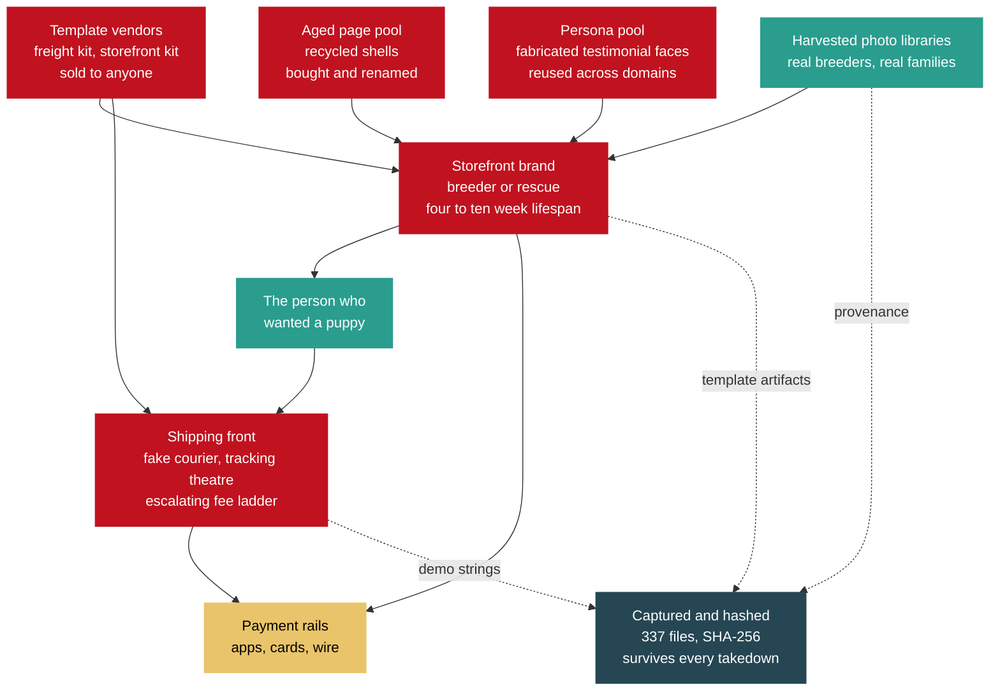
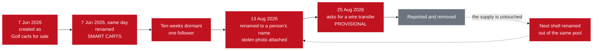
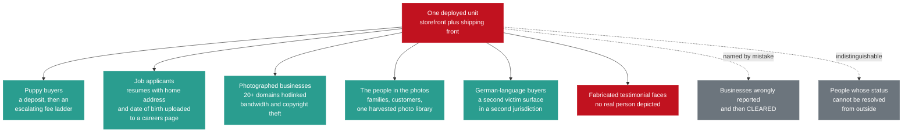

# It Is Not a Scammer. It Is a Factory.

> Category: Public Brief | Version: 1.0 | Date: August 2026 | Status: Active

For a reporter deciding whether there is a story here, and for anyone deciding whether to care: what a four-week investigation into a fake-puppy operation actually found, what it proves, and what it deliberately refuses to claim.

---

## Read this before you read anything else: where the evidence stops and we start

This brief argues a case. That means some of it is documented fact and some of it is our reading of the facts. Those are different things and we are not going to blur them to make the story land harder.

| Marker | What it means | How to check it |
|---|---|---|
| **DOCUMENTED** | Captured, hashed, and reproducible by a stranger with a browser | [`../wiki/verify-our-work.md`](../wiki/verify-our-work.md) |
| **PROVISIONAL** | We believe it and the corroborating artifact is not in hand yet. Labeled every time | Stated inline, with what is missing |
| **OUR VIEW** | Analysis and opinion. Argued, not evidenced | Stated inline |

Every claim in the sections below carries one of those three. If a sentence in this brief is not marked, treat it as DOCUMENTED and go check it.

We would rather you find this brief boring in one paragraph than find it wrong in one paragraph. A reporter who catches a single inflated number is right to throw out everything around it, and we have written this on the assumption that you will try.

**Related:**

- [The victims' guide: what to do if this happened to you](BRIEF-02-victims.md)
- [How to help, in ways that actually help](BRIEF-06-how-to-help.md)
- [Who is NOT a suspect](../wiki/who-is-not-a-suspect.md)
- [Verify our work yourself](../wiki/verify-our-work.md)
- [The network at a glance](../wiki/network-at-a-glance.md)
- [For law enforcement](BRIEF-01-law-enforcement.md)
- [For technical analysts](BRIEF-03-technical-analysts.md)
- [The intelligence picture](BRIEF-04-intelligence.md)
- [Redaction contract](../REDACTION_CONTRACT.md)

---

## The short version

A family went looking for a small dog. They were told within a day that they had been approved, asked for a deposit through a phone payment app, and given a hard pickup date to hurry them along.

There was no dog.

That much is an ordinary sad story, and it happens every week. What makes this one worth your time is what was sitting behind it.

The people behind that listing did not build a fake breeder. They bought one. The fake shipping company attached to it still ships its template vendor's demonstration password, printed in plain text on its own admin page. Its footer still says "(demo)", in English and in German, on every page. Nobody ever edited it, because editing it was never the point. It is a unit, deployed.

That is not a scammer. That is a supply chain with a customer.

---

## Finding one: they did not even change the demo password

**DOCUMENTED.**

`safepup-delivery.com` presents itself as a pet transport company with a Frankfurt head office, German governing law, and Frankfurt jurisdiction written into its terms.

Its admin login page prints the template vendor's demonstration credentials underneath the login form, in plain text, on the open internet.

Its footer carries the string "(demo)" on every page, in both its English and its German localisation.

Its live tracking system will happily serve you the vendor's demonstration shipment record.

We did not log in. Nobody should. Using those credentials would be unauthorized access no matter how obvious they are, and the evidence is entirely in the fact that the string is published, not in anything behind it. That fact is captured and hashed.

Underneath the pet-services navigation, the page filenames and form fields are generic freight forwarding. It is a freight template repainted as a pet courier.

And the site claiming German establishment publishes no Impressum. A full-text search across all 27 captured files for "Impressum", "Imprint", "Handelsregister", "Amtsgericht", "Umsatzsteuer" and "USt-IdNr" returns zero matches. Under German law that is a standalone violation a regulator can act on without proving a single act of fraud.

This pattern repeats. A second site in the corpus was still using its commercial template's demo contact address years after deployment. A third uploaded its stolen puppy photographs without renaming the files, so a third-party listing site's own filenames and listing IDs are still sitting in the URLs.

**OUR VIEW.** You do not leave the demo password up because you are careless. You leave it up because you are running volume, and editing a footer does not scale. Sloppiness at this exact point in the process is what mass production looks like from the outside.

**Context, from published research, not from us.** Peer-reviewed and industry work has already mapped this model at scale: one documented franchise network ran roughly 75,000 fraudulent shop domains; a 2026 industry study mapped 20,000-plus fake shops resolving to only 36 IP addresses; an NDSS 2025 paper machine-classified 46,746 fraudulent shopping sites out of 1.1 million collected.

Those are other people's numbers about the wider market, cited so you can see this is a known criminal industry and not a one-off. **They are not our count of this network, and we do not have one.**

---

## Finding two: the pages are inventory, not people

**DOCUMENTED, with one PROVISIONAL step marked below.**

Facebook publishes a Page Transparency panel showing a page's creation date and every name it has ever carried. The page owner cannot edit it. It is the single most useful public record in this entire investigation.

Here is one page's whole life, out of that panel.

On 7 June 2026, somebody created a page called "Golf carts for sale."

The same day, they renamed it "SMART CARTS."

It sat there for ten weeks with one follower.

On 13 August 2026 it was renamed again, this time into a person's name, and given a profile photograph stolen from a real person's harvested photo library.

Twelve days later, on 25 August 2026, an account displaying that name sent bank account details over Facebook Messenger and asked for a wire transfer.

**PROVISIONAL.** That last step rests on a screenshot the investigator captured, which is filed, hashed, and re-verified by automation on every change. A screenshot is a picture of a record, not the record. The native platform export carrying the server-side message ID and timestamp is requested and not yet in hand. Until it lands, treat the solicitation and the twelve-day cycle time as reported and corroborated but not established. We will say so every time we say it.

That page is not an identity. It is stock.

**This is the answer to a question breeders have been asking for years.**

A dachshund breeder whose entire photo library was stolen reported that she cannot keep pace with takedowns, because the pages come back faster than she can file. That sounds like a platform being slow. It is not.

It is that removing a page removes an instance, not the supply. The identity was never in the page. The identity is a name and a stolen photograph applied to a shell drawn from a pool of pre-existing, recyclable pages. Take one down and the next one is a rename away.

Another page in this corpus cycled through a personal name, then viral videos, then news aggregation, then religious content, then pet rescue. Whatever monetises this week.

One more detail shows how deliberate this is. We perceptual-hashed all 98 photographic files in the corpus looking for the same stolen image reused across different accounts. We found zero cross-account reuse. Thirty-eight separate account clusters, each supplied with different stolen photographs.

**OUR VIEW.** Zero reuse is not an accident of scale. It defeats the one check a careful buyer actually performs, which is reverse-image searching a listing to see whether it turns up on a known scam page. Sustaining thirty-eight fronts on non-overlapping imagery requires continuous theft, and somebody decided that was worth paying for.

---

## Finding three: they are wearing real people's lives

**DOCUMENTED.**

Every photograph on these sites belongs to somebody.

More than twenty separate third-party domains had images served directly off their own servers onto one fraudulent storefront. Those businesses paid the bandwidth to display their own stolen work on a fraud site. Among them are a Getty asset and a Yelp-hosted business photo, alongside a long tail of small breeders and rescues.

Real breeders' dogs, photographed by their owners, are listed for sale by people who have never met them. Real families' "going home" photographs, taken on the day they collected a puppy, are reused as proof that a fake breeder delivers.

And in the worst single case in this file, an operator obtained deep access to one individual's personal photo library. Not one photo. The library. Then generated new images from her actual likeness, placing her real face into scenes she was never in.

She has never been contacted. She has given no consent. Her photographs are evidence, not publishable material, and you will not find them in this corpus or in this brief.

Her face is on the account that asked us for money.

That is the sentence to sit with. **The person whose likeness solicited a payment is, on the record as it stands, a victim of this network and not a participant in it.**

The victim classes are not one group. There are at least five, and they do not know about each other.

Two of those classes deserve naming out loud, because nobody reports them as pet fraud.

**Job applicants.** The fake courier's careers page advertises four roles and runs a live upload form collecting full name, email, phone, a resume file and a cover letter. Resumes carry home addresses, employment history, education, and frequently dates of birth. That is a document and identity harvesting channel pointed at people looking for work. **OUR VIEW:** one of the four listings, remote customer support, resembles the standard money-mule recruitment pattern and we think it should be assessed that way. The documented fact is narrower: the page advertises a remote support role and collects applicant identity documents. The mule reading is our inference, not a finding.

**German-speaking buyers.** One of the shipping fronts is fully localised into German and claims EU establishment. This is not a US-only harm.

---

## Finding four: the emotional targeting is the design, not a side effect

**OUR VIEW.** This section is analysis. The underlying facts are documented; the argument built on them is ours.

Of the four brand identities in this file, two are framed as rescues rather than breeders. "Rescue. Love. Rehome." "Rescue. Rehome. Restore Love."

That framing does two things at once. It suppresses price scrutiny, because you do not haggle with a rescue. And it recruits the specific person who is trying to do a good deed.

Look at the sequence a target actually experiences.

You are not sold to. You are **approved**. Approval feels like being chosen, and it arrives fast, usually within a day.

The photographs are of real dogs, because they are real dogs, stolen from somebody who loves them. The happy customers vouching underneath are faces no camera ever saw.

The deposit is small enough to feel safe, and it is asked for over apps where money does not come back.

Then the pickup date is already set, so you are the one holding things up.

If you pay, a shipping company you have never heard of writes to you about a crate, then insurance, then customs, and shows you a tracking page with a plane crossing a map for a dog that does not exist. Each fee is framed as the last one.

Every one of those design choices targets the part of you that wants to be good to an animal, and routes around the part of you that checks. This is not a scam that happens to involve puppies. The puppies are the mechanism.

Some of the stolen imagery includes children. Those images will never be published here, by anyone, for any reason. Consent for them belongs to their parents and to nobody in this investigation.

---

## Finding five: it rebuilt itself while it was being watched

**DOCUMENTED.** The registry dates are attested by the domain registry, not by anybody's website copy.

This is the urgency framing, and we use this version because it is the one the dates support:

> This network replaced one storefront and stood up a second shipping front during the four weeks this investigation was running. The newest storefront was registered six days before this file was compiled. Three domains named in the earlier evidence are already deregistered. The infrastructure is being rebuilt faster than reports can be filed against it.

Note what that framing is not. It is not "they are pre-positioning for the holiday season." That is the version a reporter would reach for, and the registry dates contradict it, so we do not use it.

Four domains, four one-year registrations, the standard disposable term. Storefront replacement running roughly every four to ten weeks across five months. Three other domains named in this file came back as unregistered within a day of being written down.

One of them shows you the real shape of a takedown. The shipping front's website returns a 404 and its content is gone. Its mail records are live, its sender policy is published, and its certificate was renewed ten days before we looked.

**Removing the site removed the evidence a victim could screenshot. It did not remove the capability.** That domain can still invoice a victim as a shipping company tomorrow.

Meanwhile the accounts began locking down their friend lists and group lists mid-investigation. Facebook does not do that by default and it does not happen by accident across multiple accounts at once. We cannot tell from outside whether that is a response to us, routine rotation, or pressure from somebody else's reports, and the practical consequence is identical in all three cases: anything still visible has to be archived on sight, not scheduled.

---

## Before you share this: nobody in this file is your suspect

**Read this section even if you skip the rest.**

Several of the people whose faces, names and businesses appear in this material are victims. Some are entirely uninvolved. At least one cannot be distinguished from outside, which means treating them as guilty would be a coin flip with a real person's life.

**Do not identify anyone. Do not go looking. Do not tag, name, dox, brigade, or "just ask around about" anyone in connection with this.**

Seven separate entities sit on an exclusion list in this investigation precisely because this failure mode is predictable. It has a shape: a viral post identifies a face on a scam page as the scammer, the face belongs to somebody whose photos were stolen or who was recruited as a mule, and a person who was already harmed gets harmed again, permanently, by strangers who believed they were helping.

Read [**Who is NOT a suspect**](../wiki/who-is-not-a-suspect.md) before you post about this. That page exists for exactly this reason, and it is the most important link in this brief.

Three things follow from it.

**The face on a fraudulent page is usually a stolen face.** In this investigation, the profile photograph on the account that solicited a payment is a stolen photograph of a real person who never consented to anything.

**A name attached to a bank account is not an operator.** People are recruited into those roles, sometimes through fake job listings like the ones described above. Working out who knew what requires subpoena power, account records and payment-rail data. It does not require, and cannot be done with, a search engine.

**The breeders and rescues whose photographs were stolen are the wronged party.** Six of the seven photographed organisations in this file have not even been told yet. That is why we do not name them here.

We have named no individual as an operator anywhere in the public corpus, and we will not.

---

## What we will not claim

**This list is the point of the brief.** These are the claims that would make the story bigger, and the evidence does not carry them, so they are not here.

| We do not say | Why |
|---|---|
| Any dollar total, any aggregate loss estimate, any headline victim count | The corpus does not support a loss estimate. We argue productization and measurable deployment instead |
| That any victim paid the account that was solicited from us | **Not established.** That account was sent to the investigator. Which account received victim money is an open question |
| That any named person runs this | Attribution belongs to parties with subpoena authority. We do not have it, and neither do you |
| That this is a state influence operation | We tested that hypothesis directly and the evidence points the other way. The content is apolitical, the monetization is immediate and financial, and the category-hopping is commodity page flipping |
| That shared hosting proves shared control | We checked. It is a shared gateway with dozens of unrelated tenants. We downgraded our own finding |
| That a given phone number identifies an operator | One of them runs an unrelated business on another platform. Another returns a probably uninvolved private individual |

We also keep our failures. An image-forensics technique we leaned on early was downgraded because it would not survive expert challenge. A camera-serial lead turned out not to exist at all. A square-image heuristic was demoted when a confirmed-real photograph in our own corpus broke it. All of it stays in the record, dated, with the correction attached.

**OUR VIEW.** A file containing only the things that worked is a file that has been curated for an audience. This one has not been.

---

## For reporters

**Verifiable today, by you, without us.**

- The published demo credential string and the "(demo)" footer, in English and German, on a live site.
- The stolen-photo filenames still carrying a third-party listing site's own naming convention.
- Millisecond upload timestamps showing eleven images harvested in a continuous 93-minute session that finished 34 minutes before the domain was registered.
- Registry creation dates, and the three deregistered domains, from RDAP.
- The full page rename history, from the platform's own transparency panel, on page `1179239581941044`.
- The missing Impressum on a site claiming Frankfurt jurisdiction.
- SHA-256 hashes for every file in the corpus. 337 hashed files, re-verified by automation on every change. Instructions are at [`../wiki/verify-our-work.md`](../wiki/verify-our-work.md).

**Provisional, and please label it as such if you use it.**

- The solicitation itself, and the twelve-day identity-to-payment cycle time derived from it. Both rest on a filed and hashed investigator screenshot; the native platform export is outstanding.

**We will not confirm, on the record or off.**

- A loss figure. Any individual's identity. Any attribution of who runs this.

**Required disclosure.** The compiler of this file is personally acquainted with one of the named complainants, who forwarded the initial material. Which complainant is not stated here and is not derivable from anything published in this corpus. We state that up front rather than waiting to be asked. Every infrastructure finding in the corpus is independently verifiable from the captures and hashes provided, without reference to that relationship.

**On the three complainants.** Three people who were targeted have consented to being named publicly. This version does not name them anyway.

The reason is worth stating plainly, because it is the same reason we are asking you not to hunt anybody. Consent given in the first flush of anger about losing money is real. It is also given without much sense of what it feels like to be a searchable result attached to "puppy scam victim" for the next several years. They are Complainant A, Complainant B and Complainant C here. Pseudonymity is reversible on their say-so. Publication is not.

If you want to interview them, ask us and we will ask them properly, with the exposure explained.

**Contact.** Mario Aldayuz, Legion Code Inc., mario@legioncodeinc.com. Available as an on-record technical source. An FBI IC3 filing is proceeding in parallel.

---

## What you can actually do

Ranked by how much good it does per minute spent.

**If you paid money, in this order, today:**

1. **Call your bank or the payment app first.** Before anything else. Some rails have a reversal window measured in hours, and it closes.
2. **Export your own message thread now**, before you report the account. Scope the platform's own data download to that conversation. If the operator blocks or deletes you, the payment instructions in their own words are gone permanently. Screenshots are better than nothing and are not comparable to an export.
3. **File your own complaint at [ic3.gov](https://www.ic3.gov)** and write down the complaint number. A complaint filed by the person who lost the money is treated differently from a third-party report about them.
4. **Report to the FTC** at [reportfraud.ftc.gov](https://reportfraud.ftc.gov).
5. Read [the victims' guide](BRIEF-02-victims.md) for the payment-rail-specific detail, because the recovery route differs for a card, an app transfer and a wire.

**If you want to help and you were not targeted:**

- **Archive pages to the [Wayback Machine](https://web.archive.org/save) on sight.** This is the highest-value thing a stranger can do. Domains in this file went from live to unregistered inside a single day. An archived capture survives the takedown. A bookmark does not.
- **Report to the platforms with specific IDs**, not general descriptions. Page IDs, shop IDs, account handles. The identifiers we can publish are in [`../wiki/indicators.md`](../wiki/indicators.md).
- **Submit domains to blocklists.** Browser and DNS blocklists act faster than registrars, and they protect people who will never read a word of this.
- **Share the public repository, not a screenshot of it.** A screenshot loses the hashes, the corrections and the firewall page, and the firewall page is the part that stops somebody getting hurt.
- **Do not name anyone.** See above. It is the one way a well-meaning share does net harm.

**If you breed or run a rescue:**

- Search for your own dogs' photographs. Check whether your images are being served off your own server onto somebody else's site.
- Turn on hotlink protection. It costs nothing, and it stops you paying the bandwidth bill for your own theft.
- **If you hold the copyright in the photographs, you can file DMCA takedowns.** That is standing we do not have. The photographer normally holds it, but not always: an employment relationship, a work-made-for-hire agreement, or a signed transfer can put it elsewhere, and DMCA is a US procedure rather than a universal one. Where someone else holds the rights, they are the one who can file, or who can authorize you to file for them, so point them at it. Either way you can report the image theft and the impersonation to the platform, which does not require you to own anything.
- Expect the pages to come back, and understand now that this is not your failure. Read finding two again. You are filing against instances while the supply sits untouched.

Full detail on all of it: [**How to help**](BRIEF-06-how-to-help.md).

---

## Why you should trust a document that keeps telling you what it cannot prove

Because that is the whole method.

The parts of this case that survived every review are the parts already captured and hashed on disk. They do not depend on any account staying visible, and the operators cannot retract them. The parts that kept failing are the ones that tried to link people through shared infrastructure, and we deleted our own conclusions when they failed.

Every claim carries a marker. Every correction stays in the record with its date. Every file has a SHA-256 that automation re-verifies on every change. The redaction rules are published so you can hold us to them, and the list of people we refuse to name is longer than the list of things we allege.

**OUR VIEW, and the last thing in this brief.**

The exaggerated version of this story is a number. An enormous loss figure, a vast victim count, a shadowy mastermind at the top of it. That version is easy to write, impossible to check, and the first reporter who checks it discards everything attached to it.

The true version is worse.

The true version is that somebody bought a website kit, deployed it without reading it, hung a stolen photograph of a real woman on a recycled page that used to sell golf carts, and asked for money. Then, while three complainants were being interviewed and this file was being assembled, they did it again with a new domain, and again with a new courier, and the sites they abandoned kept their mail running.

Nobody in that sentence is a mastermind. That is exactly the problem. It works without one.

---

*This brief is analysis and opinion built on a documented evidentiary record. Documented, provisional and opinion claims are marked throughout. Corrections go into the record, dated, with the original preserved. If you find an error in this document, tell us and we will publish the correction rather than the edit.*
