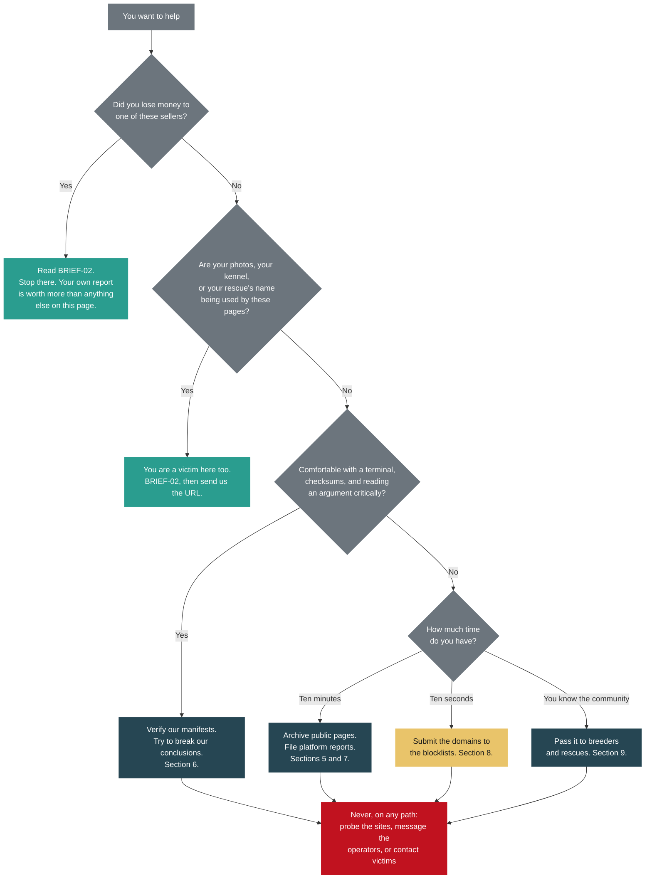
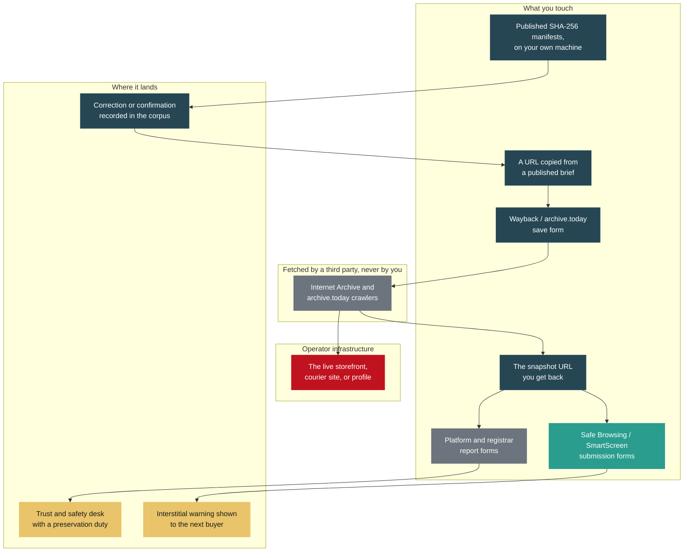

# BRIEF-06: How to Help

> Category: Public Brief | Version: 1.0 | Date: August 2026 | Status: Active

For anyone who has read this material and wants to do something useful with it: what actually helps, what to do first, and the two or three things that would quietly damage the case if a crowd did them.

## Scope of this brief

| | |
|---|---|
| **This brief covers** | Preserving public pages before they disappear. Reporting to the platform and registrar desks that can act. Blocklist submissions that protect people this week. Verifying our published hashes and challenging our conclusions. Passing this to the breeder and rescue community whose images are being used. |
| **This brief does not cover** | Reconnaissance against the operators' websites, storefronts, chat widgets, or social accounts. Identifying the people behind the accounts. Finding, contacting, or interviewing victims. |
| **Why the line is drawn there** | Because those three activities, done by volunteers, damage the evidence, hurt people who have already been hurt, and land on innocent bystanders. Sections 2 through 4 explain each one in full. The investigator scoped this brief deliberately, and the omission is not an oversight. |

**Related:**

- [`BRIEF-02-victims.md`](BRIEF-02-victims.md)
- [`BRIEF-03-technical-analysts.md`](BRIEF-03-technical-analysts.md)
- [`BRIEF-05-media-public.md`](BRIEF-05-media-public.md)
- [`../wiki/verify-our-work.md`](../wiki/verify-our-work.md)
- [`../wiki/domain-roster.md`](../wiki/domain-roster.md)
- [`../wiki/who-is-not-a-suspect.md`](../wiki/who-is-not-a-suspect.md)
- [`../wiki/changelog.md`](../wiki/changelog.md)
- [`../REDACTION_CONTRACT.md`](../REDACTION_CONTRACT.md)

---

## Required disclosure

**The compiler of this file is personally acquainted with one of the named
complainants, who forwarded the initial material.** Which complainant is not
stated here and is not derivable from anything published in this corpus. All
infrastructure findings are independently verifiable from the captures and
hashes provided (Y-2).

This is stated at the front for the reason the record itself gives: an analyst
who discovers an undisclosed relationship discounts everything around it. It
also explains why a file of this size exists over a puppy deposit, which is
otherwise the first question a reader asks.

---

## 1. Start here

Thank you for reading this far. Most people who encounter a scam corpus close the tab, and the fact that you are looking for a way to be useful is the reason any of this ever gets fixed.

The most valuable thing an outside volunteer can do in this case is **preserve and report**. Not investigate. Three of the domains named in the earlier evidence are already deregistered and their content is gone from the live web. Every page archived today is a page that still exists when a regulator, a journalist, or a lawyer goes looking in six months. That is not a consolation prize for people who are not allowed to do the exciting part. It is the part that keeps mattering after the exciting part is over.

---

## 2. Why this brief is report-and-preserve only

Three reasons. None of them is that we do not trust you.

### 2.1 Contamination

No further active probing is standing procedure in this investigation, and every contact with an operation surface gets logged with its date, the surface, the action taken, and a classification of passive capture or active submission.

That log exists for one purpose. The only viable defence against web-capture evidence is *"that traffic on our infrastructure was the investigator's own."* The interaction log forecloses it, because it accounts for every request the investigation made.

Untrained volunteers hitting those same surfaces generate traffic that is **indistinguishable from the investigator's** in any later forensic reconstruction of the server logs. There is no field in an access log that says "this one was a helpful stranger." A hundred well-meaning page loads reopen the door the interaction log was built to close, and hand a defence the argument that the captured evidence was self-generated.

The cost is not theoretical. One interaction in this case had its mechanism go unrecorded at the time. It could not be reconstructed afterward, so it had to be classified conservatively as an active submission and disclosed in full rather than claimed as the narrower and probably accurate thing it was. That is what a single unrecorded touch costs. Please do not make it a crowd.

### 2.2 Contacting victims

A stranger appearing in someone's inbox to talk about the puppy scam they fell for is, from the recipient's side, **indistinguishable from a recovery scam**. Recovery fraud is a well-documented secondary victimisation pattern: the people most likely to be defrauded a second time are the people who were defrauded once, and the second approach almost always arrives as sympathy and an offer to help.

You know your intentions are good. They have no way to know that, and their caution is correct. Even a perfectly worded message teaches them that being a known victim attracts approaches, which is a lesson we would rather they did not have to learn twice.

Beyond the harm to the individual: uncoordinated outreach can tip off operators that a specific person is talking to someone, and it can interfere with an active matter. Notification of affected parties in this case runs through a tracked process, deliberately, one at a time, with the status recorded. Contact from outside does not accelerate that. It corrupts it.

### 2.3 Misidentification

This corpus carries an exclusion list of **seven entities** who must never be named as participants. They are on it because identification was either wrong or unverified. Among them: a working technology business that shared a hosting gateway with the operation and turned out to be an innocent co-tenant; a private individual attached to a scam-published phone number by nothing more than a stale association; a small breeder whose entire website was appropriated by a two-follower sock page; and people whose photographs were harvested wholesale and now appear as the operation's fake staff.

That last one is worth sitting with. **A face on a scam page is evidence of image theft, not evidence of guilt.** In this case that has been true every single time it has been checked. Every identity this network displays has turned out to be stolen or fabricated: breeder photographs, testimonial personas, an executive roster, an entire photo album belonging to a real person who never consented to any of it.

Crowdsourced identification has a poor track record and a very specific failure mode: it is confident, it is fast, and when it is wrong the cost lands on somebody innocent who then spends years explaining themselves. We are not going to be the reason that happens to someone. See [`../wiki/who-is-not-a-suspect.md`](../wiki/who-is-not-a-suspect.md) for how that firewall is maintained.

---

## 3. Where the boundary sits, exactly

The rule is short enough to hold in your head: **you may handle URLs, snapshots, and hashes. You may not handle the live sites.**

The archiving services are the elegant part of this. When you paste a URL into the Wayback Machine or archive.today, *their* crawler fetches the page from *their* infrastructure. The request that lands in the operator's server log comes from the Internet Archive, not from you. You get a permanent, citable copy, and you never touch the site.

Two things that look harmless and are not:

- **"I just opened it to check the link still works."** That is a page load on their server from your address, and it is exactly the traffic the interaction log exists to account for. Paste the URL into the archiver without visiting it. If the page is gone, the archiver will tell you, and *that* is a useful finding in its own right.
- **"I clicked through to see what the checkout does."** No. Never populate a form, add to a cart, start a checkout, attempt a login, or open a chat widget on any surface in this case. One of these sites publishes its template vendor's demo credentials in plain text on a public page. The evidence is that the string is published. The credentials were not used and must not be, by anyone, ever.

---

## 4. If you are a victim

Stop reading this brief and go to [`BRIEF-02-victims.md`](BRIEF-02-victims.md).

That is not a brush-off. Your own first-hand report, with your own dates and amounts, is worth more to this case than every volunteer task on this page combined. BRIEF-02 tells you where to file it and what to gather first. Come back here afterward if you want to, but do that first.

This applies to breeders and rescues too. If your dogs' photographs, your kennel name, or your rescue's branding is being used to sell puppies that do not exist, you are a victim in this case, not a bystander, and BRIEF-02 is written for you as well.

---

## 5. Preserve public pages

**Time: two minutes per page. Skill: none. Value: high and rising.**

This network replaces storefronts every four to ten weeks. Three domains named in the earlier evidence are already deregistered and their content is gone. Anything not archived before the next rotation is simply lost.

### How

For each URL published in [`../wiki/domain-roster.md`](../wiki/domain-roster.md) or in the technical brief:

1. Open the Wayback Machine save form at `web.archive.org/save`. Paste the URL. Submit. Do not visit the URL itself.
2. Open `archive.today` (also reachable as `archive.is` or `archive.ph`). Paste the same URL into the save box. Submit.
3. Record the snapshot URL each service hands back, along with the UTC date and time.

Do both services. They fail differently and they are worth having in parallel. The Wayback Machine is the one institutions cite, and it preserves the raw response, but it renders script-heavy pages poorly and it will honour a later robots.txt exclusion. archive.today produces a frozen visual copy that survives that, and handles scripted pages better.

### What is worth archiving

Beyond the obvious home page, the pages that carry evidentiary weight are the boring ones:

- **Terms of service, privacy policy, and any imprint or legal page.** These carry the false establishment and jurisdiction claims.
- **Blog posts and any page with a visible date.** Backdating is one of the strongest findings in this case, and it only works as a finding if the dated page is preserved.
- **About, team, and testimonial pages.** These carry the recycled personas that link separate storefronts to each other.
- **Tracking and careers pages on the courier sites.** The careers pages matter because job applicants who uploaded resumes are a distinct victim class in this case, and they are the class nobody thinks to look for.
- **Footers.** More than one of these deployments ships its template vendor's placeholder text unmodified in the footer, in two languages.

Then send us the snapshot URLs. Section 10 explains how.

---

## 6. Verify our work

**This is the best contribution a technical volunteer can make, and it is an open invitation.**

We would much rather find out from you that something does not reconcile than find out from opposing counsel.

[`../wiki/verify-our-work.md`](../wiki/verify-our-work.md) is the step-by-step page and it is the one to follow. What belongs here is why it is worth your time and what specifically to attack.

### The manifests

The corpus publishes SHA-256 hashes for its artifacts in three places: a manifest for the original collected-evidence corpus, one for the site captures, and one for the export set. Every hash in those files is cleared for publication, deliberately, so that they can be checked by people who have no reason to trust us. The columns give you a filename, a folder, the hash, and a byte count, which is enough to verify any single artifact or to walk the whole set.

### What the CI job does

A GitHub Actions workflow re-runs that verification automatically: on every push and pull request that touches the evidence tree, once a week as a drift check, and on demand. Two of its design decisions are worth understanding, because both are places where a careless implementation produces a control that looks strict and is not:

- **It accepts a file that matches only after re-expanding LF back to CRLF.** Git's line-ending normalization changed the stored bytes of some artifacts after they were hashed at capture time. That transform is reversible and content-preserving, so accepting it does not weaken tamper detection: a genuine content change matches neither form. Every file that passes this way is reported in the job output rather than passing silently.
- **The list of files allowed to be absent is hardcoded in the workflow, not derived from the ignore rules.** Deriving it would let a single change authorize its own exemption: delete an artifact, add a matching ignore rule beside it, and the check goes green. An integrity control must not be bypassable by the change it is meant to police.

If you can find a way to make that job pass over a corpus that has actually been altered, we want to hear about it more than almost anything else on this page.

### A discrepancy we already know about

So as not to waste your time: **29 site-capture HTML files do not match their recorded SHA-256 under any line-ending transformation.** This is a pre-existing condition, present before the corpus was reorganized, and it is disclosed in the changelog and in the evidence tree's own README. You do not need to report it as new. If you can work out what transformed those 29 files, or recover them from an upstream source, that closes a real gap.

### Adversarial review is the point

This corpus keeps its own negative results. Nine findings in the record make the case **smaller or weaker**, and they stay in the file: a shared-IP linkage downgraded once it turned out to be a hosting gateway with dozens of unrelated tenants; phone numbers abandoned as operator identifiers after one led to an unrelated business and another to a probably uninvolved private individual; an image-forensics indicator corrected after a confirmed-real photograph in the corpus displayed it; a hardware-serial route that turned out not to exist at all; and two entities affirmatively cleared.

A file that only ever grows in one direction is a file nobody should trust. So: read the arguments and try to break them. If a conclusion outruns its evidence, say so. If a claim marked provisional is being leaned on as though it were settled, say so. Someone who finds an error in this corpus is helping it, not attacking it, and corrections are recorded with the same care as findings.

---

## 7. Report to platforms

**Time: ten to twenty minutes per desk. Skill: patience with forms.**

Platform reports work far better when they arrive in the shape the desk expects. A report that names the violated policy and hands over the identifiers gets actioned. A report that says "this is a scam, please help" gets queued. Each desk wants something specific:

| Desk | Lead with |
|---|---|
| **Meta** | Account, page, and group IDs, with the violated policy attached to each. Identifiers, not just profile URLs. Note where a page has been renamed, and include the previous names: page recycling is a documented pattern here, and rename history is exactly what a platform can check and an outsider cannot. |
| **TikTok** | The account handles, plus the ban-evasion language quoted directly from the bio. A phrase such as *"this is our first official account"* is what a respawned account says, and it is independently actionable under platform policy without proving anything at all about fraud. |
| **Shopify** | The shop ID and the redirect evidence showing where the storefront sends buyers. Shopify acts on shop IDs. A screenshot of a storefront is much weaker than the identifier. |
| **Hostinger** | The domains together, in one report, to the one abuse desk. They are registrar and host for the whole cluster, which makes this the single most efficient report available in this case. |
| **The German desks** | The missing imprint, the false EU-establishment claim, and the Frankfurt jurisdiction claim. A missing imprint is a standalone violation of German law and requires no proof of fraud whatsoever. This is the lowest evidentiary bar anywhere in this matter. |

The identifiers themselves are published in [`BRIEF-03-technical-analysts.md`](BRIEF-03-technical-analysts.md) and [`../wiki/indicators.md`](../wiki/indicators.md). Copy them from there rather than gathering them yourself.

**One thing to leave alone: do not file a report with the FBI's IC3 about someone else's loss.** IC3 wants the person who lost the money, with their own dates and amounts. A third-hand report from a volunteer dilutes the signal rather than adding to it, and it can make a genuine victim's later filing look like a duplicate. If you are the victim, see BRIEF-02.

When you file, ask for **preservation**. Most trust and safety desks will retain account data on request even when they will not tell you what they retained. Phrase it plainly: "please preserve all account data associated with these identifiers pending a law enforcement request." Then record the date you asked and the ticket number you received, and send those to us. A dated preservation request is useful in itself, whatever the platform does next.

---

## 8. Blocklist submissions

**Time: under a minute each. Skill: none. Requires no standing whatsoever.**

This is the fastest harm reduction available to anyone reading this page. A domain on the major blocklists means the next person who clicks a sponsored post gets a full-page browser warning instead of a checkout form. That is a person who does not lose a deposit this week, and it does not require you to be a victim, an investigator, or an authority of any kind.

| Where | What it does |
|---|---|
| **Google Safe Browsing** | Feeds the interstitial warning in Chrome, Firefox, Safari, and Android. The highest-reach submission by a wide margin. Use the phishing report form. |
| **Microsoft SmartScreen** | Feeds Edge and Windows. Submit through the Microsoft "report an unsafe site" form. |
| **Netcraft** | Fast human review, and it feeds several downstream blocklists and browser extensions. |
| **APWG** | The Anti-Phishing Working Group clearinghouse, which redistributes to member vendors. |
| **PhishTank** | Community verification, feeding a number of open-source filter lists. |

A substantial part of this has already been done for the domains known at the time. New storefronts appear every few weeks, and any newly published domain that is still live is a two-minute submission nobody has made yet.

You do not need to visit a site to submit it. Copy the domain from the roster and paste it into the form.

---

## 9. Spread it to people who need it

The community most exposed here, and least likely to see this document, is the legitimate breeder and rescue community. Their photographs are the raw material this operation runs on. One rescue's images, one small kennel's entire website, whole albums of somebody's dogs, all lifted and redeployed under a brand that takes deposits.

Most of them do not know. Notifications in this case go out one at a time through a tracked process, and there are more affected businesses than there is time to reach them.

What helps:

- Pass this corpus to breed-specific clubs, rescue networks, and breeder associations, and let them circulate it internally.
- If you moderate or belong to a buyer-facing group, pin the warning signs from [`BRIEF-05-media-public.md`](BRIEF-05-media-public.md). The productization pattern is the useful part: the same purchased website template, the same recycled testimonial personas, the same escalation into transport, crate, and insurance fees through a courier that does not exist.
- If you recognise a stolen photograph as belonging to a specific business, tell **us**, not them. We will check it and notify them through the tracked process. This is the one place where "I will just let them know" creates duplicate and contradictory contact with someone who is about to have a bad day.

Do not turn any of this into a naming-and-shaming campaign. Circulating an analysis is helpful. Assembling a list of suspects is the failure mode in section 2.3, and it is how bystanders get hurt.

---

## 10. How to report something to us

Two channels, and the choice between them matters.

**Public issues on the repository** are the right place for: corrections to a published document, gaps or errors in the analysis, broken links, a newly observed public scam surface (a domain, a page, a handle), or an argument that one of our conclusions does not hold.

**The security reporting channel** is for anything that contains or concerns personal data. Specifically: victim identities, personal information of any third party, credentials or tokens, content that exceeds documented consent, and **evidence-integrity problems, including hash mismatches**. Those do not go in a public issue. The address and the current instructions are in the repository's `SECURITY.md`.

When you use that channel, **do not send the sensitive material itself.** Send only enough to locate the problem: the file path, tag, or commit, the category of problem, and why it is sensitive, described in general terms. If a report cannot be made useful without transmitting sensitive content, say so and wait for a protected channel to be arranged rather than sending it anyway.

### What makes a report useful

A good report is boring and complete:

- **The full URL**, exactly as you found it. Not a shortener, not a description, the actual string.
- **A UTC timestamp** of when you observed it.
- **A screenshot with visible browser chrome.** The address bar and the system clock in the same image is worth a great deal more than a cropped screenshot of page content, because it ties what you saw to where and when you saw it.
- **Where you found it.** A search result, a sponsored post, a group, a comment, a forwarded message. Provenance matters more than people expect: how a surface is being distributed is often more useful than the surface itself.
- **The archive snapshot URL**, if you made one. Please make one.
- **What you did not do.** A plain sentence saying "I did not visit the page, interact with it, or contact anyone" is genuinely valuable, and it lets your contribution be classified correctly the first time instead of conservatively.

And the other side of it: **do not send us anything obtained by probing a site, by messaging the operators, by contacting a victim, or by accessing an account that is not yours.** We cannot use it, and taking it in would contaminate the parts of the record that are clean. If you have already done something along these lines, tell us plainly what and when. That is recoverable. An undisclosed touch is not.

---

## 11. This is an evolving situation

Please read what follows as a caveat on everything above.

**This is an active, developing matter.** Storefronts are being replaced faster than reports can be filed against them. What is accurate in this snapshot may be stale in a month.

**The public corpus is a point-in-time snapshot, synced from a private working repository.** It is not a live view. Some material will never cross over, because of the redaction contract that governs every public artifact here. Lag between the two is normal, and it is not evidence that anything is being improperly withheld.

**Findings marked `PROVISIONAL` or `UNVERIFIED` may change.** Those labels are load-bearing, not decorative. Several claims in this case have already been tested and downgraded, and the downgrades stay in the record permanently rather than being quietly removed. If you are building on something, check its label first, and do not repeat a provisional claim in a stronger form than we stated it.

**The changelog is the place to watch.** Every substantive change to this corpus lands there with its reasoning, at [`../wiki/changelog.md`](../wiki/changelog.md). If you want to track the case, track the changelog rather than re-reading the briefs.

**Automated collection is continuing under the investigator's own vendor-approved arrangements.** That is precisely why volunteers do not need to collect, and should not. The gap in this case has never been more enumeration. It has been the things that cannot be gathered from outside at all.

---

## 12. In short

- **Archive pages.** The archivers fetch on your behalf. You never touch the site.
- **File platform reports** in the shape each desk expects, and ask for preservation.
- **Submit domains to the blocklists.** Sixty seconds, no standing required, and it protects somebody this week.
- **Check our hashes and try to break our arguments.** We would rather hear it from you.
- **Pass it to breeders and rescues**, and let us handle the notifications.
- **Never** probe the sites, contact the operators, or contact victims.

If you have read this far, you are already treating this material more carefully than most people would. That care is the contribution. Thank you.
