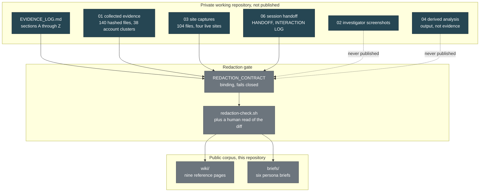

# Wiener-Gate: Start Here

> Category: Public Wiki | Version: 1.0 | Date: August 2026 | Status: Active

The front door to the public record of an investigation into a multi-brand pet-sales fraud network, written for anyone who arrives without context and needs to know what happened, what is proven, and what is not.

> **Before you do anything else:** if you think you recognise a face or a name in this material, read [`who-is-not-a-suspect.md`](who-is-not-a-suspect.md) first. It is one click and it prevents the worst thing that can happen as a result of publishing any of this.

**Related:**
- [`who-is-not-a-suspect.md`](who-is-not-a-suspect.md) - the exclusion list and the firewall principle
- [`network-at-a-glance.md`](network-at-a-glance.md) - the entity map
- [`domain-roster.md`](domain-roster.md) - every domain, with registry dates
- [`indicators.md`](indicators.md) - the filtered public indicator reference
- [`verify-our-work.md`](verify-our-work.md) - check this corpus yourself
- [`methodology.md`](methodology.md) - how the investigation was run
- [`glossary.md`](glossary.md) - every term used here, defined
- [`changelog.md`](changelog.md) - this is an active matter, findings change
- [`../REDACTION_CONTRACT.md`](../REDACTION_CONTRACT.md) - what may never be published, and why

---

## 1. What this is

This is the public layer of a working investigation into a network that sells puppies that do not exist.

The private record is an evidence log of roughly 3,200 lines, a hashed corpus of 140 original collected files, 104 captured files from four live websites, and a set of audience-specific referral packages. That record contains victim identities, suspect-side financial detail, and images belonging to people who never consented to anything. It does not ship.

What ships is this: the infrastructure findings, the registry timeline, the template artifacts, the stolen-image provenance analysis, the methodology, and every hash needed to check the work. Everything published here has been filtered through a binding [redaction contract](../REDACTION_CONTRACT.md), and every load-bearing claim about the network carries a reference to the log section that supports it, in the form `(Z-7)`, `(U-4)`, `(R-1)`.

Connective prose and descriptions of our own method carry no reference, because they assert nothing about the network. If a claim about the network has none, treat it as an error and report it.

## 2. What happened, in short

Someone advertises a puppy on Facebook or on a purpose-built website. A buyer pays a deposit. The puppy never ships. Instead a "shipping company" appears and asks for a transport fee, then a climate-controlled crate fee, then insurance. The shipping company is the same operation on the same server (Q-6).

Four things about this network are worth a stranger's attention.

**It is a supply chain, not a person.** Website templates, aged Facebook pages with inherited audiences, payment-settlement fronts, and fake courier sites are sold separately by separate vendors and assembled by whoever rents them (HANDOFF section 1). Looking for "the guy" is the wrong shape of question. The chokepoints are the vendors, the registrars, and the platforms.

**The operators left the receipts in place.** One shipping site publishes its own template vendor's demonstration credentials on a public page, and ships the string `(demo)` in the footer in both English and German (T-1, S-2, T-9). One storefront never renamed the photographs it took, so a third-party listing site's own filenames and listing IDs are still sitting in the upload paths (U-3). Eleven images were uploaded in a continuous 93-minute session that finished 34 minutes before the domain was registered (U-4).

**The same invented people keep appearing.** A testimonial persona named "Priya" appears four times across three domains on two separate hosting stacks, alongside "James" and "Sarah M." (Q-5, S-3, T-3, U-7). That content-layer linkage is what actually connects the storefronts. The infrastructure-layer linkages were tested and they failed (R-4, S-6).

**It rebuilds faster than reports can be filed against it.** Storefront domains are replaced every four to ten weeks. Three domains named in the earlier evidence are already gone from the registry (R-1, R-2). A second shipping front was stood up while this investigation was running (S-1).

Attribution: the operator layer geolocates to Limbe, Southwest Region, Cameroon on account-registration artifacts across four independent platforms, plus one timestamped physical-presence indicator (Q-1, Q-8). That does not mean every storefront shares operators. The upload-timing evidence at U-5 argues for at least two distinct working patterns.

## 3. What this record does not claim

Three limits, stated up front rather than buried.

| We do not say | Why |
|---|---|
| That any victim paid the bank account the operators solicited | On 2026-08-25 the operators sent bank details to the **investigator** and asked for a wire. It is not established that any victim ever sent money to that account (Z-12, Z-18) |
| A total dollar loss | The corpus does not support an aggregate figure. The argument is productization and a measurable deployment count, not a number (D13, Z-18) |
| That any named person is an operator | Every identity this network has displayed has turned out to be stolen or fabricated. See [`who-is-not-a-suspect.md`](who-is-not-a-suspect.md) |

## 4. Which brief should you read

The wiki is the reference layer. The briefs are the argument, written for six specific audiences. **The numbering is not a ranking.** Read the one that matches why you are here.

| If you are | Read | It gives you |
|---|---|---|
| A detective, an IC3 analyst, a regulator, or a platform trust and safety desk | [`BRIEF-01-law-enforcement.md`](../briefs/BRIEF-01-law-enforcement.md) | The referral case, the jurisdiction hooks, and the preservation asks |
| Someone who thinks they were scammed | [`BRIEF-02-victims.md`](../briefs/BRIEF-02-victims.md) | What to do today, in what order, on which payment rail |
| A DFIR or OSINT practitioner auditing the findings | [`BRIEF-03-technical-analysts.md`](../briefs/BRIEF-03-technical-analysts.md) | Artifact-level detail, reproduction steps, and the failed hypotheses |
| A threat-intelligence analyst | [`BRIEF-04-intelligence.md`](../briefs/BRIEF-04-intelligence.md) | The structural read of the supply chain, marked as analysis |
| A reporter, an editor, or a general reader | [`BRIEF-05-media-public.md`](../briefs/BRIEF-05-media-public.md) | The story, the sourcing, and what you may not print |
| Anyone who wants to help | [`BRIEF-06-how-to-help.md`](../briefs/BRIEF-06-how-to-help.md) | Contributions that are useful, and the ones that cause harm |

Per the redaction contract section 4, `BRIEF-04` and `BRIEF-05` each carry a visible marker distinguishing conclusion from evidence. They are the two briefs permitted to draw inferences. The other four stay on the record.

## 5. How the corpus is organised



The private tree is **append-only**. Corrections are appended as amendments and never edited in place, so a reader can see what was believed at each point and what changed (CONTRIBUTING, HANDOFF Amendment 1). Nine findings in the log actively make the case smaller or weaker. They stay, deliberately (HANDOFF section 2d). A file that only ever grows in one direction is a file nobody should trust.

## 6. The nine pages

| Page | What it answers |
|---|---|
| [`index.md`](index.md) | You are here |
| [`who-is-not-a-suspect.md`](who-is-not-a-suspect.md) | Who is a victim or a cleared party, and why a name attached to this operation proves nothing |
| [`network-at-a-glance.md`](network-at-a-glance.md) | Which brand, domain, page, handle, and shipper front relates to which |
| [`domain-roster.md`](domain-roster.md) | Every domain, its registry dates where known, its hosting, its current status |
| [`indicators.md`](indicators.md) | The publishable subset of the indicator sheet, and what was withheld |
| [`verify-our-work.md`](verify-our-work.md) | The manifests, the commands, the CI job, and an invitation to break this |
| [`methodology.md`](methodology.md) | Capture procedure, contamination controls, and why each control exists |
| [`glossary.md`](glossary.md) | Impressum, ELA, C2PA, RDAP, mule, Kill Chain, ACTIVE-OUT, PROVISIONAL, and the rest |
| [`changelog.md`](changelog.md) | What changed, and how to watch for the next change |

## 7. How to verify this

Nothing here asks to be believed on authority. Every published artifact is hashed and the hashes are published.

The 140-file original corpus is covered by `MANIFEST.csv`. Every document and evidence file in the repository at handoff is covered by `EXPORT_MANIFEST.txt`. Every file captured from the four live sites is covered by `NETWORK_CAPTURE_MANIFEST.txt`. To spot-check any single file:

```bash
sha256sum library/knowledge/private/evidence/01_collected_evidence/<cluster>/<file>
grep -i '<file>' library/knowledge/private/evidence/MANIFEST.csv
```

A GitHub Actions job runs the full check on every push that touches the evidence tree, and again weekly as a drift check. It fails on an altered file, and on a manifested file that has gone missing without an explicit, reviewed exemption. Full detail, including the off-site archive held under compliance-mode Object Lock until 2027-08-25, is in [`verify-our-work.md`](verify-our-work.md).

**Adversarial review is welcome and has already changed this record.** Six rounds of it produced the corrections listed in [`changelog.md`](changelog.md), including the withdrawal of a shared-IP linkage claim (R-4, S-6) and the clearance of a working business that happened to share a hosting provider with the network (S-7).

## 8. The one rule for readers

If you think you have identified a person in this material, **do not act on it and do not publish it.**

Every displayed identity this investigation has been able to check has turned out to be stolen or fabricated: breeder photographs, testimonial personas, an entire fabricated executive roster, a whole photo album belonging to a real image-theft victim (HANDOFF section 2a, T-4, M-1). Others were never resolved and stand as **UNDETERMINED**, which is neither cleared nor implicated. The profile image on the account that solicited a wire transfer from the investigator is withheld here under the redaction contract, and what it establishes is **PROVISIONAL** pending the platform export (Z-14, Z-29). A name attached to this operation is evidence of nothing until subscriber records say otherwise.

[`who-is-not-a-suspect.md`](who-is-not-a-suspect.md) explains the firewall principle in full and tells you what to do instead. Please read it.
