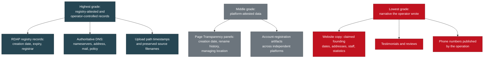
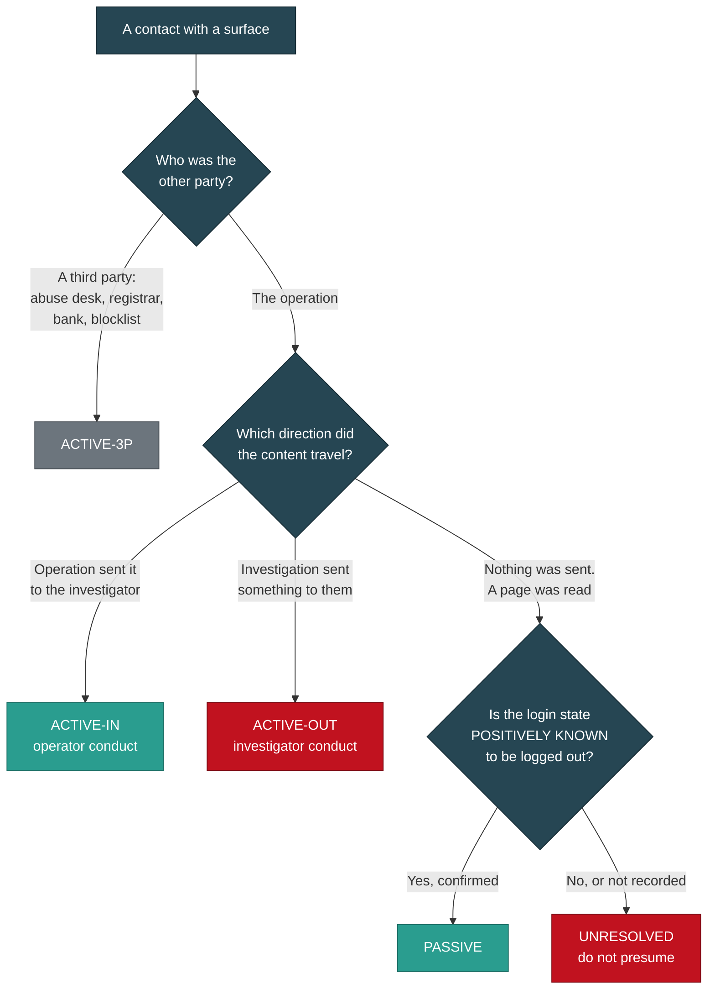

# Methodology

> Category: Public Wiki | Version: 1.0 | Date: August 2026 | Status: Active

How this investigation was actually conducted: the capture procedures, the contamination controls and why each one exists, the interaction log and its classification set, the prohibition on identifying people from images, and the deliberate retention of findings that weaken the case.

**Related:**
- [`verify-our-work.md`](verify-our-work.md) - the integrity chain that protects what these procedures collected
- [`who-is-not-a-suspect.md`](who-is-not-a-suspect.md) - the firewall this methodology enforces
- [`glossary.md`](glossary.md) - PASSIVE, ACTIVE-OUT, ACTIVE-IN, ACTIVE-3P, UNRESOLVED, defined
- [`changelog.md`](changelog.md) - the corrections these controls produced
- [`indicators.md`](indicators.md) - what the collection yielded
- [`../briefs/BRIEF-03-technical-analysts.md`](../briefs/BRIEF-03-technical-analysts.md) - reproduction detail for practitioners
- [`../briefs/BRIEF-06-how-to-help.md`](../briefs/BRIEF-06-how-to-help.md) - the same controls, as rules for contributors

---

## 1. Why methodology is published at all

Most fraud write-ups publish conclusions. This one publishes the procedure, including the places where the procedure failed.

There is a self-interested reason and an honest one, and both are worth stating.

**The self-interested reason.** Web-capture evidence has exactly one viable defence against it: *that traffic on our infrastructure was the investigator's own.* A contemporaneous record of what was touched, when, how, and whether anything was submitted forecloses that argument. Without such a record, every capture in the case is arguable (W-1, INTERACTION_LOG).

**The honest one.** A methodology that is only published when it went well is marketing. This one includes a contamination event that cannot be fully explained, an interaction log where six of nine entries are marked unresolved, and nine findings that make the case smaller. Those are in here because leaving them out would make everything else less believable, not more.

## 2. Sources, and how they are weighted

Not all evidence is the same grade, and the corpus is explicit about the ordering.

**Registry and authoritative DNS records are neither user-editable narrative nor operator marketing, so both outrank anything written on a site** (R). This is what makes the backdating findings work: a blog post dated eight weeks before the domain existed is a contradiction between a low-grade claim and a high-grade record, and the high-grade record wins (S-2, T-4).

Platform-attested data sits in the middle for the same reason. A page's managing location is derived from an actual administrative session, whereas a phone number is trivially provisioned. That is why one carries weight and the other was formally downgraded (A2-11, V-5).

## 3. Capture procedure

**Sites.** Four live sites were crawled in full, retrieving publicly served pages only. Every retrieved file was hashed with SHA-256 and written to a per-site manifest. 104 files total (U). Page source was saved, not just rendered output, because the findings live in the markup: upload paths, image filenames, script comments, and configuration hints (U-3, T-7, T-9).

**Collected artifacts.** The 140-file collected corpus was **hashed before it was reorganised, moved without modification, and re-hashed afterwards. 140 of 140 verified identical, zero integrity failures** (L).

**Original filenames were preserved unchanged**, because platform media identifiers are themselves evidence: they are what groups the corpus into 38 distinct account clusters (L, K-3).

**Derived analysis is segregated.** Error-level-analysis maps, crops, and contact sheets were written to a separate outputs directory and are clearly labelled as derivative. **No original file was modified, cropped, enhanced, or re-encoded**, because the embedded markers that give these files evidentiary value exist only in the unaltered originals (J, L).

**Investigator screenshots are separated from harvested material**, so any recipient can see immediately which files came from the targets and which were produced during the investigation. Mixing them muddies provenance (L).

## 4. Contamination controls

This is the section that most constrained the investigation, and it is standing procedure rather than a one-off decision (W-1, HANDOFF section 2c).

### The rules

> **No form population, cart creation, checkout interaction, login attempt, or message sending against any surface in this case.**
>
> **Retrieval is limited to reading publicly served pages.**
>
> Any future capture that must happen comes from a clean machine or a fully isolated browser profile: no logins, no autofill, no saved wallet state.
>
> **Every contact with an operation surface gets logged**, dated, and classified.

### Why each rule exists

| Control | The failure it prevents |
|---|---|
| No submissions of any kind | A populated form appears in a merchant's admin panel. It is both a signal to the operators that they are being watched, and a defence argument that investigator traffic contaminated the record |
| No login attempts | A logged-in view attaches the investigator's identity to the platform's record of the visit, and appears in the operator's page insights |
| Reading public pages only | Keeps every capture inside what any member of the public could retrieve, which is what makes the captures usable and repeatable |
| Clean machine or isolated profile | Autofill and saved wallet state can submit real identity data without an explicit decision to submit anything. This is not hypothetical: see section 5 |
| Log every contact, on the day | A log reconstructed from memory months later is worth a fraction of one kept contemporaneously, and this investigation has the evidence of that cost (INTERACTION_LOG) |

### The credentials that were not used

One shipping front publishes its template vendor's demonstration administrator credentials in plain text on a public page (T-1).

**They were not used and must not be.** Accessing that panel would be unauthorised access regardless of how the credentials were obtained. **The evidentiary value is entirely in the fact that the string is published**, and that fact is fully preserved in the captured file (T-1, T-10 item 6, contract section 5).

This is the cleanest illustration of the whole posture: the temptation to look inside was real, the value of looking inside was zero, and the cost would have been the admissibility of everything around it.

### A note to readers

**These rules apply to you too.** If you are following up on anything in this corpus, do not submit forms, do not attempt logins, and do not message the operation. Beyond the legal exposure, an outsider's submission lands in the same admin panel and is indistinguishable from the investigation's own traffic, which damages the record for everyone.

## 5. The disclosed contamination event

One interaction breaks the rules above, and the way it is handled is the point.

Around 2026-08-24, a checkout form on a card-harvest domain was **populated with placeholder identity data and a cart interface was contacted.** No payment instrument was entered and no order was placed.

**The mechanism that populated that form was not recorded at the time and cannot be reconstructed from the corpus.** Whether it was performed manually, by browser autofill, or by an automation tool is not recoverable (HANDOFF Amendment 1 A4).

The original note described the interaction as read-only while simultaneously describing a populated form. Those cannot both be true. Rather than leave a self-contradiction in the record, or resolve it by guessing, it is classified **conservatively** and disclosed:

> The checkout interaction is classified **ACTIVE-OUT**. A form was populated with placeholder identity data and a cart interface was contacted. The mechanism is unrecorded and unrecoverable. No payment instrument was entered and no order was placed. **The conservative classification is used because the evidence does not support the narrower one.**

That wording travels with any filing that relies on the material. **It is materially better to disclose an unrecorded mechanism than to have a skeptical analyst discover the contradiction unaided** (HANDOFF Amendment 1 A4).

## 6. The interaction log and its classification set

Every contact between the investigation and any surface in this case has a row: date, surface, action, classification, account used, and notes.

### The classification set

The set went through two revisions, and both revisions were driven by defects found in review.

| Class | Meaning |
|---|---|
| **PASSIVE** | Reading a publicly served page. No login, no form, no submission, **and login state positively known to be logged out** |
| **ACTIVE-OUT** | Something sent by the investigation **to** the operation: a form, a message, a cart, a login attempt, a payment |
| **ACTIVE-IN** | Something sent by the operation **to** the investigator, in a channel the investigator is party to. Establishes operator conduct, not investigator conduct |
| **ACTIVE-3P** | Contact with a third party about the operation: an abuse desk, a registrar, a bank, a blocklist. Not contact with the operation |
| **UNRESOLVED** | The facts needed to classify are not recoverable |

**A bare `ACTIVE` label was retired.** It collapsed two opposite things into one token, and the distinction is the entire reason the log exists:

> **ACTIVE-OUT is investigator conduct that a defence can attack. ACTIVE-IN is operator conduct that supports the case.** Recording both under one label defeats the purpose. (INTERACTION_LOG Amendment 2.1)

### How a contact gets classified

### Six of nine entries are UNRESOLVED

That number is uncomfortable and it is the honest one.

The log was created after the fact rather than kept contemporaneously, which is exactly the cost its own closing note warns about. Two entries originally classified `PASSIVE` were **reclassified to `UNRESOLVED`** on review, because `PASSIVE` requires login state positively known to be logged out, and recording them as anonymous without confirming it presumed the answer to the open question (INTERACTION_LOG Amendments 2.2 and 3.1).

The correction is instructive: the reviewer wrote a precondition, then failed to apply it to two entries in the same document, and a later pass caught it. **The rule was applied to the rule.**

### The governing rule for unresolved facts

Two documents stated this separately with slightly different scope, which is itself a defect, so it now lives in one place:

> An unresolved fact must be **reviewed** before filing, never necessarily **completed**. Where it is genuinely recoverable, record it. Where it is not, the honest answer is final and ships as-is. **Guessing to close a field damages the record.** (INTERACTION_LOG Amendment 3.4)

The reasoning behind that is specific rather than pious. Pressuring an investigator to supply an answer under a filing deadline is **precisely how a reconstructed-from-memory fact enters an evidence record and later collapses under cross-examination** (HANDOFF Amendment 2 B2).

There is also a distinction the rule preserves: an entry *classified* `UNRESOLVED` (we cannot say what kind of contact it was) is not the same as an *unresolved field within a classified entry* (the class is certain, one column is not). Both are governed by the rule; they are not the same thing.

### One thing the log records that did not happen

The log includes a decision that was considered and rejected: remitting funds to the solicited account from an account not in the investigator's own name, in order to create a traceable transaction. **It was not done.**

It is recorded because the interaction log must show what was considered as well as what occurred, and because a later reader finding the account details in the private file should be able to establish that no investigator funds entered that account (INTERACTION_LOG Amendment 1).

## 7. No identification of persons

An absolute rule, applied throughout (HANDOFF section 2b).

> **No facial recognition. No face matching between images. No reconstruction or enhancement of tattoos or other identifying marks. No recommending face-search tools.**
>
> Describe what is plainly visible when completeness requires it, and stop.

**Identification is resolved through subscriber records and payment rails by investigators with legal process, not from images.**

The rule held when it was hardest to hold. When a profile image appeared on the account that solicited a wire transfer, the verification the record calls for is a **file-hash comparison between two captured images**, explicitly noted as a question about bytes rather than a comparison of faces, with the reason given as: section 2b forbids the latter (Z-8).

Who that image depicts, and what their relationship to this network is, is withheld here under the redaction contract and remains **PROVISIONAL** on the private record pending the platform export (Z-14, Z-29). That is exactly the point. A face match would have produced a confident answer long before the evidence could carry one, about a person the record still cannot place on either side of the line.

**The rule also has an evidentiary rationale, not only an ethical one.** An amateur identification that is wrong cannot be taken back, and one bad identification entitles a reviewer to discount everything downstream of it. See [`who-is-not-a-suspect.md`](who-is-not-a-suspect.md).

## 8. The victim and suspect firewall

> **Never move a name from the victim column to the suspect column without new evidence.** (HANDOFF section 2a)

An explicit exclusion list is maintained in the private record, naming parties who must not be enumerated, compiled, or named as suspects: victim mailboxes, cleared businesses, probable uninvolved third parties, and individuals whose status is genuinely indistinguishable.

The list is not a courtesy. It is maintained because **every identity this network has displayed has turned out to be stolen or fabricated**, which makes any displayed identity worthless as an indicator of control. The public expression of that list is [`who-is-not-a-suspect.md`](who-is-not-a-suspect.md).

Statuses come from a fixed taxonomy: `SCAM-INFRA`, `STOLEN-CONTENT`, `AI-ASSET`, `UNDETERMINED`, `LIKELY-VICTIM`, `CLEARED` (CONTRIBUTING). `UNDETERMINED` is a real status, not a placeholder for "probably guilty".

## 9. Labelling, and the append-only rule

**Every factual claim carries a pointer to its evidence**: a log section identifier, a file hash, a URL, or a corpus filename. **Claims that outrun their evidence are labelled `UNVERIFIED` or `HYPOTHESIS`** (CONTRIBUTING).

The labels are used in practice, including against the investigation's own preferred conclusions. An inference about how a bank account was opened was relabelled `HYPOTHESIS` because no record supported it (Z-13). A confidence phrase was removed from a finding because it assigned certainty in the same paragraph that conceded no artifact was yet filed (Z-19). Two findings are marked `PROVISIONAL` pending an export that is not in hand (Z-14).

**The evidence tree is append-only.** No file under it is edited, renamed, re-encoded, or re-saved. Corrections are appended as amendments, so a reader can see what was believed at each point and what changed. Where an in-place edit proved unavoidable, the edit was itself documented as a custody decision, with what was changed, why an appended correction was insufficient, and the explicit limits of the exception (Z-26, CONTRIBUTING).

That is why the private log reads newest-section-last in places and why the handoff document carries three appended amendments that contradict its own body. **The contradictions are the feature.**

## 10. Negative results are retained

**Nine findings in the record make the case smaller or weaker. They stay, and packaging them away is explicitly forbidden** (HANDOFF section 2d).

| Retained negative result | What it cost the case |
|---|---|
| Shared-address linkage narrowed twice | The headline infrastructure link between two storefront clusters (R-4, S-6) |
| Phone numbers downgraded as operator identifiers | Five identifiers that looked like leads (V-5) |
| Zero cross-account image reuse | A perceptual-hash sweep across 98 files returned nothing linking accounts (K-4) |
| Square image dimensions downgraded | An AI-generation indicator, reduced to corroborative only (W-3) |
| Error-level analysis downgraded | An image-manipulation indicator, reduced to corroborative only (M-2) |
| Camera serial route found not to exist | A hardware-attribution path, closed (W-5) |
| A technology business cleared | A superficially compelling geographic coincidence, removed (S-7) |
| A small breeder cleared | A reported scam co-administrator, resolved as an impersonating page (A5c) |
| A third party refused as an identifier | A name attached to a published phone number, declined (V-4) |

**Why this is not self-harm.** A file that only ever grows in one direction is a file nobody should trust. Each of these entries is also a warning to the next analyst not to re-run a route that has already been closed, and one is explicitly recorded to stop a later reviewer "discovering" breach records that are substring matches on unrelated real companies (R-5).

Two of the nine, `K-4` and the interaction-log reclassifications, are **negative findings recorded because they are probative**, not because absence needed noting. Zero image reuse across 38 account clusters is itself a finding about harvesting volume and deliberate detection avoidance (K-4).

## 11. Where the methodology reached its ceiling

Stated plainly, because it bounds everything in this corpus.

**Open-source collection has reached its limit.** Who controls the accounts, who receives the money, and whose numbers these are were never answerable from outside. They are subscriber-record questions requiring legal process (HANDOFF section 9, X-2).

The network hardened during the investigation: friend and group lists were locked down, which is a deliberate configuration change made across multiple accounts while an investigation was running (X-2). Whether that was a response to this investigation, routine hygiene on an account rotation, or pressure from elsewhere **cannot be determined from outside, and the practical answer is the same in all three cases**: capture now, and file rather than enrich.

**One thing that does not change.** The content-layer evidence, the persona pools, the stolen-image provenance, the template artifacts, the demonstration strings, the upload timestamps, is already captured and hashed. It does not depend on any account remaining visible. **The parts of this case that survived every test are also the parts the operators cannot now retract** (X-2).
