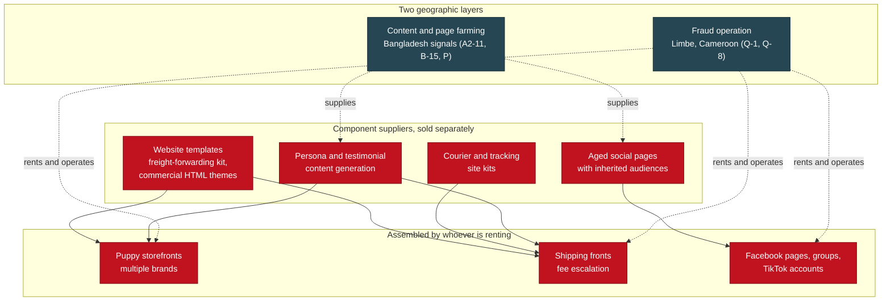
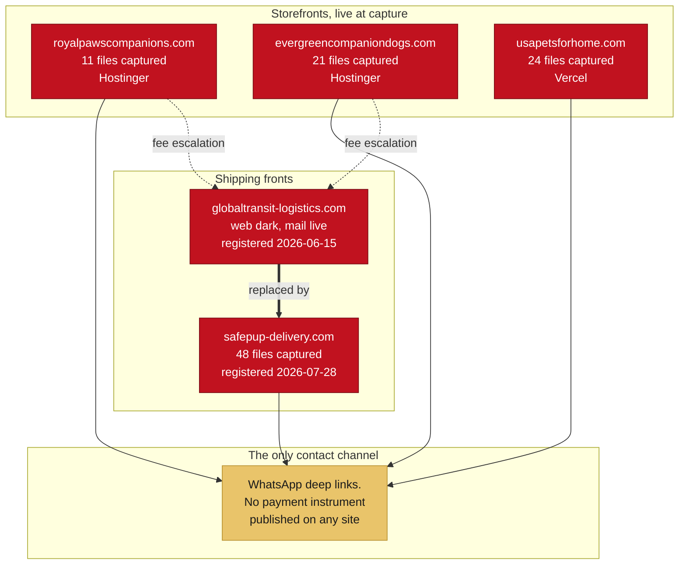
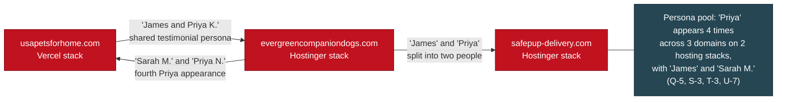
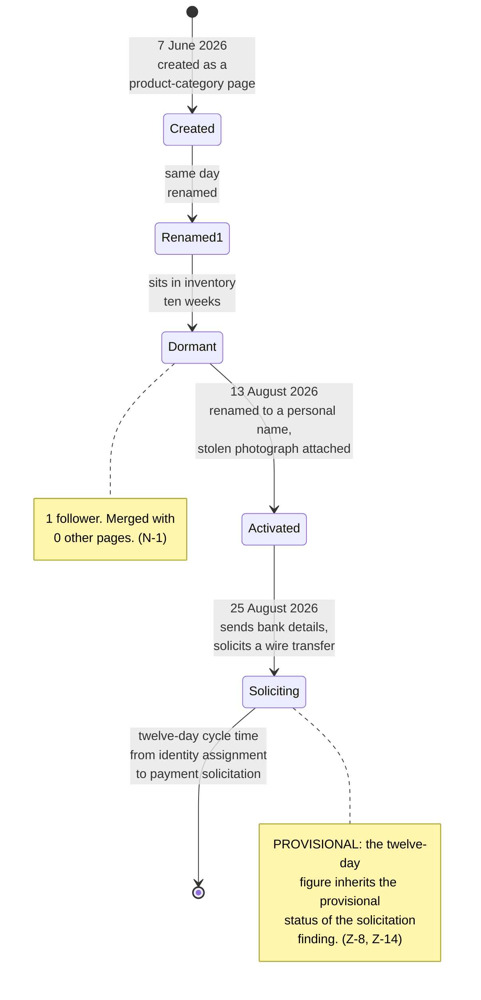
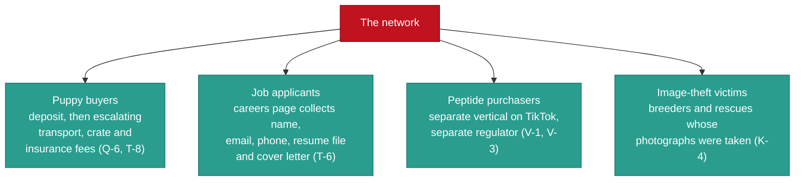

# The Network at a Glance

> Category: Public Wiki | Version: 1.0 | Date: August 2026 | Status: Active

The entity map: which brands, domains, social pages, handles, and shipping fronts exist, how they relate to each other, and which of those relationships actually survived testing.

**Related:**
- [`domain-roster.md`](domain-roster.md) - the same infrastructure with registry dates and hosting
- [`indicators.md`](indicators.md) - the machine-readable indicator subset
- [`who-is-not-a-suspect.md`](who-is-not-a-suspect.md) - the people who appear in this map and are not part of it
- [`glossary.md`](glossary.md) - shipper front, persona pool, page recycling, card-harvest, defined
- [`index.md`](index.md) - the overview this page expands on
- [`../briefs/BRIEF-04-intelligence.md`](../briefs/BRIEF-04-intelligence.md) - the structural read of what this map means
- [`../briefs/BRIEF-03-technical-analysts.md`](../briefs/BRIEF-03-technical-analysts.md) - artifact-level detail behind each node

---

## 1. The governing model

**This is a supply chain, not a suspect** (HANDOFF section 1).

Separate vendors sell separate components. Website templates come from one place, aged Facebook pages with inherited audiences from another, payment-settlement fronts from a third, fake courier sites from a fourth. Whoever is renting them assembles the parts into a storefront. When the storefront burns, they assemble another one from the same parts.

That model explains the two things a reader will otherwise find confusing: why the storefronts look identical but do not share infrastructure, and why removing one page removes an instance rather than the supply (N-1).

The two layers are **not in conflict** (Q-4). They describe different functions. The page-farming layer is plausibly a contracted supplier serving multiple unrelated fraud customers, which is the franchise model documented in published research on this category (Q-4, A3d).

## 2. The brands

Eight brand identities appear in the collected material. All of them use one of two framings, breeder or rescue, and the rescue framing appears twice because it suppresses price scrutiny and attracts adopters who believe they are doing a good deed (C).

| Brand framing | Breed focus | Notes |
|---|---|---|
| "S.M Home Raised Doxies" and its name variants | Dachshund | The original brand that opened the case. Its domain is no longer registered (R-2). Logo is AI-generated (C-1) |
| "USA Pets for Home" | Five unrelated breeds on one site | Built on an AI website generator. Testimonial photographs resolve to a generated-image path (A2-1, A2) |
| "Royal Paws Companions" | Bernedoodle, Dachshund, French Bulldog | "America's #1 Rated Bernedoodle Breeder", "Recognized nationally since 2012" (A4) |
| "Evergreen Companion Dogs" | Dachshund, Poodle, Basset Hound, Chihuahua, Golden Retriever | Publishes a Florida address, a Wisconsin messaging number, and a Pennsylvania telephone (U-1, U-2) |
| "ABKC American Bully Puppies" | American Bully | Cross-linked from the original brand's footer. Domain no longer registered (A-8, R-2) |
| "Happy Tail Dachshunds" | Dachshund | Fourth brand cluster (A6) |
| "Dachshund Rescue and Adoption Network" | Dachshund, rescue framing | AI-generated logo (C-2) |
| "Bernedoodle Hearts Rescue and Rehoming" | Bernedoodle, rescue framing | AI-generated logo. A similarly named entity carries a documented consumer-harm trail in another jurisdiction (C-4) |

**The logos share a generator signature**: identical brown, cream and dusty-pink palette, script-over-serif lockup, paw prints and hearts, a bottom benefit-icon strip, and near-identical tagline construction (C). Same template, same hand.

## 3. The storefronts and the shipping fronts

Four sites were live and fully captured. A fifth had its website stripped but kept its mail capability.

**One shipper served two consecutive breeder brands, then was replaced by a second shipper.** The first shipping domain was registered roughly ten weeks after the first storefront and roughly three weeks before the second, so it was stood up to serve an already-running storefront and then survived into the next storefront's lifecycle. That is operational continuity at the infrastructure layer, independent of anything at the content layer (R-1).

The first shipper's website now returns HTTP 404, but its mail exchange records are live, its sender policy is published, and its certificate was renewed ten days before capture. **It is a working mailbox, not a dead asset.** Removing the site removes what a victim could screenshot; it does not remove the capability to send shipping and crate invoices from a shipping-company address (R-3).

The second shipping front is a freight-forwarding template repainted as pet transport. Its navigation labels are cosmetic; the underlying page filenames are `ocean-freight`, `warehousing`, `customs-clearance`, `cargo-insurance`, `road-transport`, `air-freight`, and its quote form asks a grieving family for their **company name** and **cargo type** (T-2). One image file is served under the name `hero-pet-carrier.jpg` and is byte-for-byte a photograph of a shipping container truck (T-2).

**No site in the network publishes a payment instrument.** No bank details, no processor, no wallet address. Every one funnels to a single messaging number. The site's job is to make the invoice look legitimate; the money moves elsewhere (U-8, T-8).

## 4. What actually links these sites

This is the part most likely to be misread, so it is stated precisely.

**The durable linkage is at the content layer.** Fabricated testimonial personas recur across domains that share no hosting, no registrar, and no nameserver configuration. That linkage never depended on infrastructure and therefore survives every infrastructure correction (S-3, Q-5).

The same persona pool reaches into the shipping front's demonstration tracking record, where the sample shipment's "pet owner" and "recipient" are two of the four testimonial identities used elsewhere (T-3).

**The infrastructure linkage was tested and withdrawn.** Three domains do web-serve from an address that other tenants use only as a file-transfer endpoint, which is a narrower and more unusual observation than it first appeared. But that address carries 48 or more tenants, the domains use three different nameserver pairs consistent with three separate hosting purchases, and one storefront sits on a completely different stack (R-4, S-6). The correct framing for any filing is the narrow one. See [`changelog.md`](changelog.md) for the full list of withdrawn claims.

**General principle from the private record:** this case's durable linkages are at the content layer. Infrastructure linkages have failed every test (HANDOFF section 4b).

## 5. The social layer

| Surface | What is documented |
|---|---|
| **Facebook account clusters** | 38 distinct clusters identified in the collected corpus by media-ID grouping. The largest holds 18 files with IDs spanning a wide range, indicating posting over time rather than a single bulk dump (K-3) |
| **Page recycling** | Documented as standard practice, not an isolated case. One page was created for one product category, renamed the same day, then converted ten weeks later into a personal-name identity carrying a stolen photograph (N-1). A separate page ran through a personal name, viral videos, news aggregation, religious content, and finally pet rescue (B-15) |
| **Group administration** | One captured roster documents all eight administrators of a single group. Seven of the eight were low-follower sock pages (B-13). The capture may no longer be reproducible: rosters are exactly what the network began hiding during the investigation (X-2) |
| **Sock pages appropriating real businesses** | At least one two-follower Page points itself at a legitimate breeder's website to borrow credibility (A5c, B-16) |
| **TikTok** | Three accounts in one cluster sell peptides and publish a phone number that a puppy storefront also publishes. One of the three was removed before capture; the other two carried ban-evasion language (V-1) |
| **Shopify** | One shop identifier is documented alongside redirect evidence (A3g) |
| **Live chat** | A third-party live-chat property was embedded on the second shipping front. It was reported and the account was preserved and terminated. **What the provider actually retained from before termination is UNVERIFIED and must be established in writing** (T-7, HANDOFF Amendment 2 B1) |

## 6. The page-recycling lifecycle

The clearest single illustration of how the page supply works, and the reason takedowns do not keep up.

Two conclusions follow, and both are load-bearing.

**The page pool is not dormant inventory. It is the delivery mechanism.** A page previously documented only as churn evidence turned out to be operationally active in the fraud (Z-8).

**Removing one page removes an instance, not the supply.** This is the direct explanation for the takedown failure a real breeder reported: pages respawn faster than they can be removed, because identities are drawn from a pool of pre-existing recyclable pages rather than created fresh (N-1).

## 7. Three victim classes, not one

A reader who assumes the only victims are puppy buyers will undercount this operation by two whole categories (HANDOFF section 7).

The careers page deserves specific attention. It advertises four positions and carries a live upload form collecting a full name, email, phone, a resume file, and a cover letter. **Resumes contain home addresses, employment history, education, and frequently dates of birth.** That is a document and identity-harvesting channel aimed at job seekers, entirely separate from the pet-buyer victims. One listing, a remote customer support role, also fits the standard money-mule recruitment pattern and should be assessed that way (T-6).

## 8. Adjacent infrastructure

Two clusters appear in the corpus that are related but structurally distinct from the puppy storefronts.

**A card-harvest family of throwaway domains.** A group of short, meaningless `.click` domains operating as card-harvesting storefronts. They are catalogued in [`domain-roster.md`](domain-roster.md). One of them is the subject of the single contamination event in this investigation: a checkout form was populated with placeholder identity data. That event is disclosed rather than minimised, and the mechanism that populated the form was not recorded and cannot be reconstructed. See [`methodology.md`](methodology.md).

**A payment and storefront platform layer.** A small number of hosted-commerce shops and a European payment-adjacent domain appear alongside the card-harvest family. Their exact role is documented but not fully resolved (A3g, A3h).

## 9. What this map does not show

- **Who operates it.** The map shows infrastructure and behaviour. Control is a subscriber-record question and was never answerable from outside (X-2, HANDOFF section 9).
- **A single operator.** The upload-timing evidence shows two storefronts with incompatible working-hour signatures, consistent with different people or different shifts drawing on a shared content-production toolkit (U-5).
- **Money flow.** The account that received victim money remains unidentified. What is established is a solicitation sent to the investigator (Z-12, Z-18). See [`who-is-not-a-suspect.md`](who-is-not-a-suspect.md) section 3j.
- **The full scale.** The enumerated in-corpus slice is roughly 90 candidate domains after noise removal. A larger investigator-tracked total exists and its reconciliation is in progress; the honest citation is the confirmed count, with the larger figure labelled as tracked rather than enumerated (D12).
