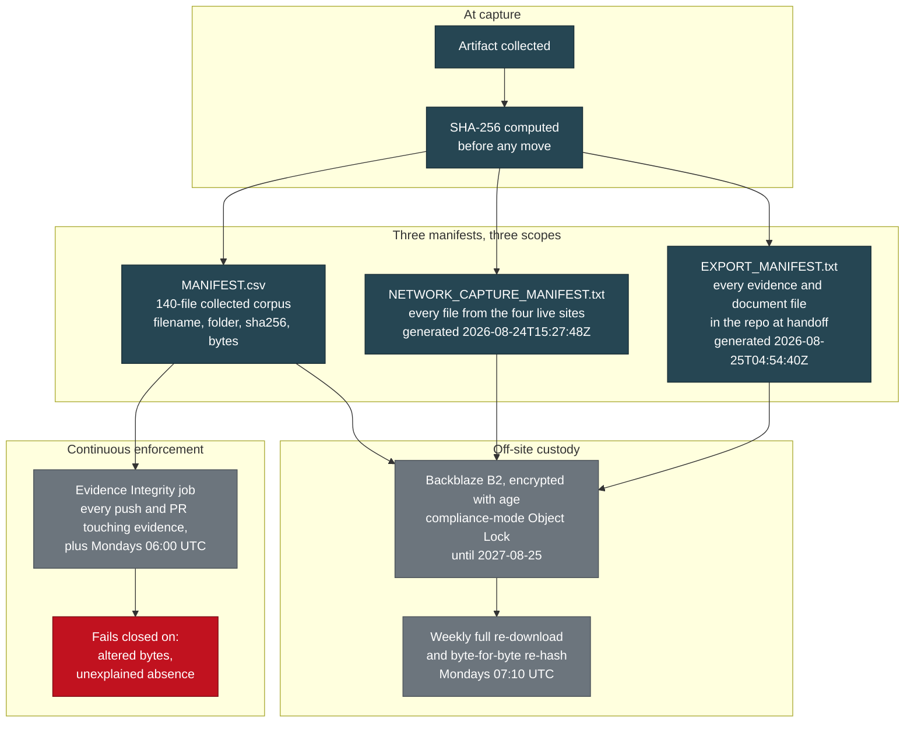

# Verify Our Work

> Category: Public Wiki | Version: 1.0 | Date: August 2026 | Status: Active

How to independently check this corpus: what each hash manifest covers, the commands to re-run the verification yourself, what the continuous-integration job fails on, and how the off-site archive is held.

**Related:**
- [`methodology.md`](methodology.md) - how the material was collected before it was hashed
- [`index.md`](index.md) - the overview, including the quick spot-check
- [`indicators.md`](indicators.md) - the findings this integrity chain protects
- [`domain-roster.md`](domain-roster.md) - registry facts you can re-derive from public sources
- [`changelog.md`](changelog.md) - what adversarial review has already changed
- [`glossary.md`](glossary.md) - SHA-256, Object Lock, append-only, defined
- [`../briefs/BRIEF-03-technical-analysts.md`](../briefs/BRIEF-03-technical-analysts.md) - the analyst brief, for reproducing findings rather than hashes

---

## 1. The claim this page makes

**Nothing in this corpus asks to be believed on authority.**

Every collected artifact is hashed with SHA-256. Every hash is published. A machine re-checks all of them on every change and again every week. The archive is held somewhere that cannot be deleted, by anyone, including the people who put it there, until 2027-08-25.

If any of that is wrong, it is checkable, and the correct response to finding it wrong is to say so loudly. See [section 7](#7-please-try-to-break-this).

## 2. The verification chain



## 3. What each manifest covers

The three manifests have **different scopes and different generation times**. Using the wrong one to check a file produces a false result, so the distinction matters.

| Manifest | Covers | Does not cover | Format |
|---|---|---|---|
| `MANIFEST.csv` | The **140-file original collected corpus**: harvested images grouped into 38 Facebook account clusters, plus non-Facebook-origin files, plus investigator screenshots. Later extended in scope to include the messenger thread material (L, K-3, Z-27) | Site captures. Repository documents | CSV: `filename,folder,sha256,bytes,verified` |
| `NETWORK_CAPTURE_MANIFEST.txt` | **Every file captured from the four live sites**, 104 files, grouped per site. Generated 2026-08-24T15:27:48Z | Collected evidence. Repository documents | `sha256␣␣./relative/path`, with per-site section headings |
| `EXPORT_MANIFEST.txt` | **Every evidence and document file in the repository at handoff.** Generated 2026-08-25T04:54:40Z. Its header records that `MANIFEST.csv` verified 140 of 140 files with 0 mismatches | Version-control internals and harness configuration directories, excluded by design | `sha256␣␣./relative/path` |

**The two collected-evidence manifests overlap deliberately.** `MANIFEST.csv` is the custody record for the harvested artifacts and carries byte counts and a verification column. `EXPORT_MANIFEST.txt` is a whole-repository snapshot at a moment in time. A file can legitimately appear in both, and its hash must agree in both.

## 4. Check it yourself

### The collected corpus against its manifest

```bash
cd library/knowledge/private/evidence

python3 - <<'PY'
import csv, hashlib, os
ok = missing = bad = 0
for row in csv.DictReader(open("MANIFEST.csv", newline="", encoding="utf-8")):
    want = (row.get("sha256") or "").strip()
    if not want:
        continue
    rel = os.path.join(row["folder"], row["filename"])
    if not os.path.isfile(rel):
        missing += 1
        print("ABSENT   ", rel)
        continue
    got = hashlib.sha256(open(rel, "rb").read()).hexdigest()
    if got == want:
        ok += 1
    else:
        bad += 1
        print("MISMATCH ", rel)
        print("  recorded", want)
        print("  on disk ", got)
print(f"\nverified {ok}, mismatched {bad}, absent {missing}")
PY
```

### The site captures and the repository snapshot

Both are in the standard `sha256sum` format, so the standard tool checks them directly. Strip the comment and section-heading lines first.

```bash
cd library/knowledge/private/evidence

# Site captures. Run from the capture root the manifest's paths are relative to.
grep -v '^#' NETWORK_CAPTURE_MANIFEST.txt | grep -v '^##' | grep -v '^$' \
  | sha256sum --check --quiet

# Whole-repository snapshot at handoff. Run from the repository root.
cd "$(git rev-parse --show-toplevel)"
grep -v '^#' library/knowledge/private/evidence/EXPORT_MANIFEST.txt | grep -v '^$' \
  | sha256sum --check --quiet
```

### A single file

```bash
sha256sum library/knowledge/private/evidence/01_collected_evidence/<cluster>/<file>
grep -F '<file>' library/knowledge/private/evidence/MANIFEST.csv
```

### One known wrinkle, disclosed rather than papered over

Some artifacts were first committed while version control was normalising line endings, so their stored bytes differ from the bytes hashed at capture time **by line endings alone**. A file counts as intact if it matches its recorded hash directly, or if it matches after re-expanding line feeds back to carriage-return line-feed pairs.

That transform is reversible and content-preserving, so accepting it does not weaken tamper detection: **any real content change matches neither form.** The integrity job reports every such file explicitly as a notice rather than passing it silently.

## 5. The continuous-integration job, and what it fails on

The workflow at `.github/workflows/evidence-integrity.yml` re-verifies the collected corpus against `MANIFEST.csv`.

**When it runs:** on every push touching the evidence tree, on every pull request touching the evidence tree, every Monday at 06:00 UTC as a drift check, and on manual dispatch. It runs with read-only repository permissions, and the checkout action is pinned to a commit hash rather than a moving tag.

**It fails the build on two conditions.**

1. **Altered bytes.** A file whose contents match its recorded hash in neither form. `EVIDENCE INTEGRITY FAILURE` with the path named.
2. **Unexplained absence.** A file listed in the manifest that is missing from the repository and is not on an explicit allowlist. **In an append-only tree, a manifested artifact going missing is an integrity failure**, and the job treats it as one.

**The allowlist deserves a paragraph, because it is the interesting design decision.**

Exactly one artifact is expected to be absent: an oversized network capture file that is excluded from version control because it carries live session cookie and authorization headers and is treated as secret-bearing. Its hash is recorded separately and it is stored encrypted off-site.

That exemption is **hardcoded in the workflow, not derived from the ignore rules.** Deriving it would let a single change authorise its own exemption: delete an artifact, add a matching ignore rule alongside it in the same commit, and the check goes green. **An integrity control must not be bypassable by the change it is meant to police.** Hardcoding fails closed instead: newly excluding an artifact breaks the job until somebody updates the list on purpose, which is the intended friction. Adding an entry is an evidence-custody decision requiring repository-owner review, and the excluded artifact's hash must be recorded in the session-handoff folder.

## 6. Off-site custody

Everything used to live on one disk. It no longer does (HANDOFF section 5 item 19, Amendment 1 A3).

| Property | Detail |
|---|---|
| **What** | The full repository including version-control history, plus three session originals that are excluded from version control and exist nowhere else in the tree |
| **Encryption** | `age`. The continuous-integration runner holds the **public key only**. It can encrypt and upload; it can never decrypt anything in the bucket, including its own output. The private key is held offline and in a secrets manager, and is deliberately absent from CI |
| **Where** | Backblaze B2, a private bucket |
| **Immutability** | **Object Lock, compliance mode, retained until 2027-08-25.** Compliance mode cannot be bypassed by any credential, including the account owner and the provider's own support |
| **Write credential** | Scoped to one bucket and deliberately lacking `deleteFiles`, `bypassGovernance`, `writeKeys`, `writeFileRetentions` and lifecycle-rule permissions. **Verified: a delete attempt against the stored archive returns 401 unauthorized.** A compromised runner can add objects; it cannot destroy or alter what is already stored |
| **Re-verification** | A weekly job downloads roughly 513 MB and re-hashes **every byte** of every manually uploaded object. Not a sample |

**The re-verification job fails on four conditions**, and the last one is the subtle one:

1. An expected object is missing from the bucket.
2. A stored object's bytes no longer match the ciphertext hash recorded at upload.
3. An object's retention mode is anything other than `compliance`.
4. An object's retention **expires earlier than a hardcoded floor**. Object Lock protection ends at the retain-until timestamp, so a mode check alone is insufficient: a compliance retention that had been shortened would satisfy a mode check while failing the custody requirement. The floor is the earliest retain-until timestamp across the stored objects, expressed in epoch milliseconds, and every verified object must meet or exceed it.

The job also enumerates the whole bucket and selects each object **by exact name** rather than by position, because the listing API returns lexicographic order and indexing by position would silently verify the wrong file.

**Two honest limits on this, stated in the workflow itself.**

**Snapshot scope.** A CI runner can only see what is in version control. The three session originals are not in the automated snapshots. The canonical archive, built and uploaded by hand, is the only copy that contains them. Automated snapshots are filed under a separate prefix specifically so the two are never confused.

**Ciphertext only.** CI holds the public key, so it verifies that the stored bytes are unchanged. It cannot decrypt and therefore cannot check plaintext hashes. Plaintext verification requires the private key and is a separate, manual procedure.

**One open dependency, disclosed.** Offline escrow of the archive's private key is not yet complete. The key currently exists in two online locations controlled by one person (HANDOFF Amendment 1 A3).

### The session originals and the append-only wrinkle

Two of the three session originals are append-only logs. They kept writing after their hashes were first recorded, so their whole-file hashes no longer match those values.

This was checked rather than waved away. **The recorded hashes match as byte-prefixes of the archived files**: hashing bytes 0 through the originally recorded length reproduces the original digest exactly, in both cases. The growth is pure append and nothing was modified in place. The archive record states this explicitly with the original and current byte counts.

## 7. Please try to break this

**Adversarial review is not tolerated here. It is the reason this record is worth reading.**

Six rounds of it have already run, and the corrections it produced are load-bearing. A shared-address linkage claim was tested and narrowed twice, then reframed (R-4, S-6). A working business that shared a hosting provider with the network was cleared and removed from every claim (S-7). A small breeder reported as a scam co-administrator was cleared, and the sock page impersonating her was identified as the real entity (A5c). An image-authenticity indicator was downgraded to corroborative only (M-2, W-3). A forensic route to a camera serial number was investigated and found not to exist (W-5). An interaction log was reclassified twice, ending with **six of its nine entries marked UNRESOLVED**, which is an uncomfortable number and the honest one.

**Nine findings in the private log actively make the case smaller or weaker. They stay** (HANDOFF section 2d). A file that only ever grows in one direction is a file nobody should trust.

The full list is in [`changelog.md`](changelog.md).

### What is most worth attacking

If you are looking for the weak points, here is where the investigators think they are. This is not a rhetorical gesture; these are the open questions.

| Attack this | Why it is the soft spot |
|---|---|
| **The attribution** | Three of four geolocation signals are spoofable metadata. The fourth rests on a review whose prose may be machine-generated (Q-8) |
| **The persona-pool linkage** | It is the load-bearing connection between storefronts. If the persona names are common enough to co-occur by chance, the linkage weakens (Q-5, S-3) |
| **Anything provisional** | The solicitation findings and the twelve-day cycle time are marked `PROVISIONAL` pending an export that is not yet in hand (Z-14, Z-19) |
| **The interaction log** | Six of nine entries are `UNRESOLVED` because it was reconstructed after the fact rather than kept contemporaneously. That is a real defect, disclosed (INTERACTION_LOG Amendment 3.1) |
| **The scale figure** | The enumerated in-corpus slice and the investigator-tracked total have not been reconciled (D12) |

### How to report a defect

Corrections and gaps go through the repository's issue tracker. **Do not report sensitive-data exposure publicly**: a redaction miss, a leaked identity, or an exposed credential goes through the private route in [`../../../../SECURITY.md`](../../../../SECURITY.md). A redaction miss is not a bug fixed in the next release; it is permanent the moment it is public (contract section 6).

## 8. The rules the record runs under

Four conventions govern this corpus, and they are what the verification above is protecting.

**Append-only.** No file under the evidence tree is ever edited, renamed, re-encoded, or re-saved. Corrections happen in analysis documents and in appended amendments, never in the artifacts (CONTRIBUTING). Where an in-place edit was unavoidable, it was itself documented as a custody decision with the reasoning and the limits of the exception recorded (Z-26).

**Hash before reference.** Every new evidence file is added to the manifests with its SHA-256 **before** any document is allowed to cite it (CONTRIBUTING).

**Every load-bearing claim carries a pointer.** Log section identifier, file hash, URL, or corpus filename. Claims that outrun their evidence are labelled `UNVERIFIED` or `HYPOTHESIS` (CONTRIBUTING). Connective prose, procedural instructions, and descriptions of this corpus's own tooling carry no pointer, because they assert nothing about the network. If a sentence makes a factual claim about the network and carries no pointer, that is an error worth reporting.

**Negative results are retained.** Findings that weaken the case are preserved on purpose, and packaging them away is explicitly forbidden (HANDOFF section 2d).

## 9. What verification does not prove

Hashes prove that captured bytes have not changed since capture. They prove nothing about what the bytes mean.

They do not prove that a website said what a capture says it said before the capture was taken; that is what the timestamped manifests, the third-party archive services, and the registry records are for. They do not prove who operated any surface. And they do not convert a `PROVISIONAL` finding into an established one: an artifact that is hashed but not yet corroborated is exactly as provisional as it was before it was hashed (Z-14).

**Integrity is a floor, not a conclusion.**
