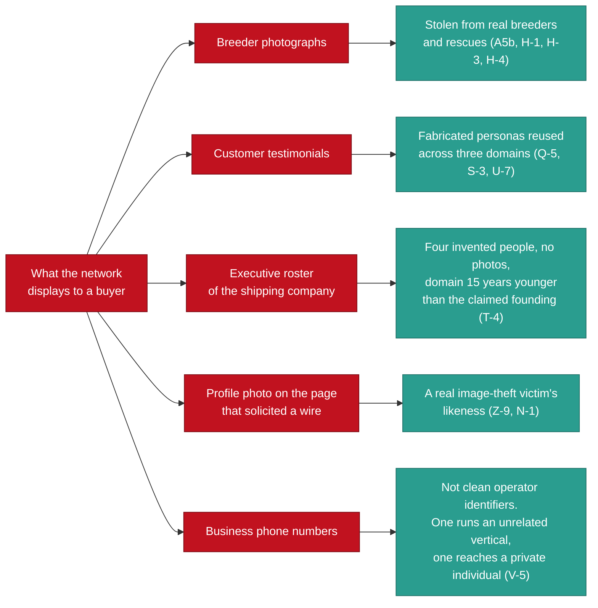

# Who Is Not a Suspect

> Category: Public Wiki | Version: 1.0 | Date: August 2026 | Status: Active

The exclusion list: every party who appears in this material as a victim, a cleared party, or an undetermined identity, and the reason a name attached to this operation proves nothing on its own.

**Related:**
- [`index.md`](index.md) - start here if you arrived at this page first
- [`network-at-a-glance.md`](network-at-a-glance.md) - what the operation actually is, as distinct from who appears in it
- [`methodology.md`](methodology.md) - the no-identification-of-persons rule and why it exists
- [`glossary.md`](glossary.md) - UNDETERMINED, CLEARED, LIKELY-VICTIM and the rest of the status taxonomy
- [`indicators.md`](indicators.md) - what was withheld from the public indicator sheet, and why
- [`../briefs/BRIEF-06-how-to-help.md`](../briefs/BRIEF-06-how-to-help.md) - useful things to do instead of identifying people
- [`../briefs/BRIEF-05-media-public.md`](../briefs/BRIEF-05-media-public.md) - the same boundary, written for publication

---

## 1. This is the most important page here

Publishing a fraud investigation carries exactly one catastrophic failure mode: a reader decides they have identified someone, and acts on it. The person they have identified turns out to be a victim, a bystander, or nobody at all, and the harm is permanent and lands on the wrong human being.

That failure mode is not hypothetical in this case. It is the expected outcome, because of what this network is made of.

**Please read the whole page before you conclude anything about anyone.**

## 2. The firewall principle

The governing rule of this investigation, carried through every document, is this:

> **Never move a name from the victim column to the suspect column without new evidence.** (HANDOFF section 2a)

The reason is empirical rather than cautious. Every displayed identity this investigation was able to check has turned out to be stolen or fabricated. Two were never resolved and stand as **UNDETERMINED** (3e, 3j): the record does not place them on either side of the line, and neither does this page.

Five layers of displayed identity. Every layer that could be checked was theft or invention. What was left over is the two people at 3e and 3j, still **UNDETERMINED**, and leaving them that way is the whole point of this page.

**The consequence for a reader is direct: a name, a face, or a phone number attached to this operation is evidence of nothing until subscriber records say otherwise.** Who controls an account, who receives the money, and whose number a line belongs to are all questions that can only be answered from inside a platform, a carrier, or a bank, under compulsory process. They were never answerable from the outside (X-2, HANDOFF section 9).

An open-source investigation can prove that infrastructure exists and how it behaves. It cannot prove who is holding it. Treating those as the same question is how bystanders get hurt.

## 3. The exclusion list

Everyone below appears somewhere in the private record. **None of them is named as a suspect, a participant, or a person of interest in any public document.** Several are confirmed victims. Several are confirmed uninvolved. Several are genuinely undetermined, which is a status this investigation uses rather than a placeholder for "probably guilty".

Some are not named here at all. Where a party has not been notified that they appear in this material, naming them publicly would tell the internet before it told them, and would attach their business to the phrase "puppy scam" in search results permanently. That is not a cost anyone gets to impose on a victim.

### 3a. The complaining victims

**Three people who lost money and came forward. Referred to throughout as Complainant A, Complainant B, and Complainant C.** (Y-1)

All three consented to public attribution (Y-6). Version 1 of this public corpus does not use their names anyway, and the mapping is held only in the private law-enforcement package. The reasoning is recorded plainly: consent given in the first flush of anger about losing money is real, but it is given without much sense of what it feels like to be a searchable result attached to "puppy scam victim" for years. Pseudonymity is reversible on their say-so. Publication is not (Y-6, contract section 3).

One of the three is the founding witness of the case: the two photographs that opened the investigation came from their message thread (Y-1).

**The investigator is not a neutral third party.** He is personally acquainted with one of the three complainants. This is disclosed here, as it is in every referral, worded so it does not identify which one. Fraud referrals routinely originate from someone connected to a victim; concealing the connection would be the problem, not having it (Y-2, contract section 3).

### 3b. Businesses whose photographs and names were stolen

**Eight entities: legitimate breeders and animal rescues in the United States and Australia whose photographs, names, or alt text appear in the fraudulent material.** They are victims of image theft and appropriation. They are not participants, and no evidence suggests otherwise (A5-1, A5-2, A5b, H-1, H-3, H-4, A5c).

**One has been notified. Seven have not** (Y-5). For that reason this page does not name them individually. Notifying an unnotified victim by publishing their name is not notification, it is exposure.

The character of the theft is worth stating, because it explains the volume:

- All 98 photographic files in the collected corpus were compared by perceptual and difference hashing. **Zero cross-account image reuse was found** (K-4). Each front page is supplied with different stolen photographs, which means the harvesting volume is large and sustained, and which defeats the most common check a buyer performs.
- The pattern is whole-gallery theft: an entire photo library is taken from one breeder and then distributed so that no two fronts show the same picture (K-4, A5b).
- One legitimate breeder reports being unable to keep pace with takedown requests, because pages respawn faster than they can be removed (N-1). That is the expected outcome when identities are drawn from a pool of recyclable pages rather than created fresh each time.

Two of the eight are established, verifiable rescues, and the private record says so explicitly to prevent exactly the reporting error this page exists to prevent (A5-1, A5-2). One of them restricts adoptions to a 100-mile radius, which is a hallmark of genuine rescue practice and the direct opposite of the "nationwide delivery" model every fraudulent entity in this case advertises (A5-1).

### 3c. Minors

**Children appear in material stolen from one of the breeders.** (Y-6a, contract section 1)

No image depicting them is published, described, or reproduced anywhere in this corpus, at any resolution, under any circumstances. Consent belongs to their parents and to nobody in this investigation. No adult can give it on their behalf, and the copyright holder's consent to notification is not consent to publication (Y-6a).

This is the single hardest prohibition in the redaction contract and it has no exceptions clause.

### 3d. The person whose entire photo album was harvested

**A real individual whose complete personal photo library, thirteen files, was taken and used to build operator personas, including at least one restyled version of their own likeness.** (G, M-1, W-3)

They have never been contacted and have given no consent. Their photographs are evidence and are not publishable material. They are not named, not described, and not depicted here.

**One fact about this makes the distinction urgent rather than academic.** On 2026-08-25 a Facebook page sent bank details to the investigator and asked for a wire transfer. That page was, at that moment, displaying this person's stolen photograph as its profile image (N-1, Z-7).

Two things are worth keeping apart there. **Established:** the investigator received that message, and the screenshot of it is in the corpus. **PROVISIONAL:** everything the record concludes from it, including the profile-image identification, rests on that screenshot alone. The platform export that would establish it independently has not been filed (Z-14, Z-29).

> **On the existing record, the person whose likeness appears on the account that asked for money is a victim of this network and not a participant in it.** (Z-9, **PROVISIONAL**)

If you find that page, or a screenshot of it, and recognise the face: you have recognised somebody who was robbed. The coincidence of their likeness appearing on a payment solicitation makes the firewall more important, not less.

### 3e. A person depicted in a successor-account profile photograph

**Status: UNDETERMINED and indistinguishable.** (X-1b)

This individual may be an operator, or may be another image-theft victim. **The evidence does not distinguish between those two possibilities, and no technique available to an open-source investigation can distinguish between them.** They are not named, not described, and no facial analysis of any kind was performed or will be.

UNDETERMINED here means what it says. It is not a soft accusation.

### 3f. A cleared technology business

**A working web-development and social-media business, operating legitimately, which shares a hosting provider's shared file-transfer gateway with several domains in this network. CLEARED.** (S-7)

It drew immediate attention for a superficial reason, and it did not hold up. Its published client portfolio contains no pet, breeder, rescue, or logistics domain anywhere. Its co-tenancy is fully explained by the fact that it is a web shop whose client sites sit on the same host, and several other entries in the same co-tenancy list are its own portfolio clients. Its only connection to the address in question is the shared endpoint that every tenant of that provider uses (S-7).

**Assessment: coincidental co-tenancy, no evidentiary value.** It is not named in this corpus because publishing the co-tenancy would defame a working business (contract section 2). A real small business sharing a hosting provider with fraudulent sites is not evidence of anything.

### 3g. A small breeder whose website was appropriated

**A long-operating small breeder, roughly twenty years of continuous web presence, who was reported to this investigation as a co-administrator of a group alongside a suspect account. CLEARED.** (A5c)

The report was wrong, and the record resolves it precisely. The account on the administrator roster is not hers. It is a Facebook **Page** with two followers that has pointed itself at her website to borrow her credibility, exactly like the seven other low-follower sock pages on the same roster (A5c, B-13, B-16).

A twenty-year business with a photographic review history is not a two-follower page. **She is a victim of website appropriation, and the sock page is the entity to report.** She has not been notified and is not named here (contract section 2).

### 3h. A probable uninvolved third party attached to a published phone number

**A private individual whose email address carries a stale association with one of the phone numbers published by a fraudulent storefront. Never contacted. Probably uninvolved, possibly a victim.** (V-4)

The finding that matters more than this individual is the general one it produced:

> **Phone numbers are not clean operator identifiers.** (V-5)

One number published by this network also runs an entirely unrelated commercial vertical on a different platform. Another returns a probably-uninvolved private individual. Numbers appearing in scam material can be spoofed, recycled, borrowed, or simply wrong. The private record refuses to enumerate this person, and so does this page.

### 3i. The resident, if any, of an unverified address

**One storefront publishes a rural street address in Florida. It has not been verified against parcel records.** (U-2, contract section 1)

Using a stranger's home address is a documented tactic in this category of fraud. The address is not published in this corpus in any form. The standing instruction in the private record is unambiguous:

> If a real person lives there, they are a victim, not a suspect. Do not send anyone to that address. (U-2, HANDOFF section 5 item 17)

The storefront that publishes it simultaneously claims a Florida address, a Wisconsin messaging number, and a Pennsylvania telephone, for one "small, family-run breeding program" (U-1, U-2). The address is best understood as one more fabricated credibility marker, not as a location.

### 3j. The named holder of the solicited bank account

**Status: UNDETERMINED. Not named in any public document.** (Z-4, contract section 2)

On 2026-08-25 the investigator received bank account details and a request for a wire transfer (Z-7, Z-18). The bank and routing number verify against the routing directory (Z-2). The account is registered to a named individual whose name and address are both withheld here (Z-4, contract section 2). That the message came from this network's operators is **PROVISIONAL** pending the platform export (Z-14, Z-29); the account details are in the screenshot either way.

Three readings fit that evidence **equally well**: a recruited money mule, an identity-theft victim whose details were used to open an account remotely, or an operator (Z-4, Z-12). Nothing currently in the record separates them.

Two further limits apply, and both matter:

- **It is not established that any victim ever paid this account.** What is established is that the operators solicited it from the investigator. The account that received victim money remains unidentified (Z-12, Z-18).
- **The likeness on the page that solicited it is the image-theft victim's, described in 3d**, not the account holder's (Z-9, **PROVISIONAL**). The account holder and the displayed face are two different undetermined people, and neither is established as the other.

Naming an undetermined account holder publicly would mark a person who may have been robbed twice: once for their identity and once for their name. The details go to the bank's fraud and anti-money-laundering function and to law enforcement, and nowhere else (Z-1, contract section 1).

### 3k. Everyone else in the frame

Three residual categories, each with the same answer.

**Third parties inside a victim's message thread.** If a victim publishes their conversation with the operators, other people's names travel with it. They are redacted (Y-6a).

**A person the investigator recognised in a group.** One account observed in a pet group is personally familiar to the investigator. **No connection to the operation was established.** It is recorded as possible coincidental group overlap or a compromised or impersonated account, and it stays there (A2-10).

**Co-tenants on shared hosting.** The shared address that once looked like a linkage carries 48 or more unrelated tenants, and is a file-transfer endpoint rather than a web host (R-4, S-6). Every one of those tenants is an innocent bystander unless independently linked, and none has been. The claim built on that address was withdrawn (see [`changelog.md`](changelog.md)).

> **The operator side of a published conversation is fair game. The victim side belongs to the victim. Everyone else in the frame belongs to themselves.** (contract section 2)

## 4. Please do not hunt anyone

This is a direct request, and it is the reason this page exists.

Do not run facial recognition against any image connected to this case. Do not attempt to match faces between images. Do not reconstruct or enhance tattoos or other identifying marks. Do not use PimEyes-class tools. Do not compile a list of names. Do not contact anyone named or depicted in this material. Do not go to any address. (HANDOFF section 2b)

These are not suggestions for the public that the investigation exempted itself from. **They are the rules the investigation ran under.** No facial analysis was performed at any point in this case, including at the moment it would have been most tempting, when a face appeared on an account soliciting money (Z-8, Z-9). The one verification permitted there was a file-hash comparison between two captured images, which is a question about bytes and not about people (Z-8).

Identification is resolved through subscriber records and payment rails, by investigators with legal process. It is not resolved from photographs, and an amateur identification that is wrong cannot be taken back.

There is also a practical argument, for anyone unmoved by the ethical one. **A misidentification does not merely harm a bystander. It discredits the entire record.** An analyst who finds one bad identification in this corpus is entitled to discount everything downstream of it, and the parts of this case that survived six rounds of adversarial review would go down with it.

## 5. What to do instead

If you think you have identified someone, here is the whole list of useful actions.

| Situation | Do this |
|---|---|
| **You think you recognise a face** | Nothing publicly. If you believe it is material, send it privately to law enforcement through [`BRIEF-01-law-enforcement.md`](../briefs/BRIEF-01-law-enforcement.md), or use the reporting route in [`../SECURITY.md`](../../../../SECURITY.md). Do not post it |
| **You think you recognise a stolen photograph as your own** | You are an image-theft victim with standing nobody else has. You can file takedowns directly. Get in touch through the contribution route in [`BRIEF-06-how-to-help.md`](../briefs/BRIEF-06-how-to-help.md) |
| **You think you were scammed by this network** | Go to [`BRIEF-02-victims.md`](../briefs/BRIEF-02-victims.md). File your own complaint under your own name. A victim-filed complaint is treated very differently from a third-party report |
| **You found a new domain, page, or handle** | That is genuinely useful. Report the **infrastructure**, not a person. See [`indicators.md`](indicators.md) for the format and [`BRIEF-06-how-to-help.md`](../briefs/BRIEF-06-how-to-help.md) for where to send it |
| **You think a finding here is wrong** | Say so. Adversarial review has already corrected this record repeatedly. See [`verify-our-work.md`](verify-our-work.md) |
| **You want to warn people** | Point them at [`index.md`](index.md). Do not name individuals in the post |

## 6. If you are on this list

If you have found yourself described on this page, three things are true and worth saying plainly.

You are here because the record says you were **wronged, cleared, or genuinely undetermined**, and because leaving you out entirely would have been worse: an unexplained gap invites a reader to fill it in badly.

You are not named. Where the record can describe a role without identifying a person, that is what it does.

If you believe anything on this page is inaccurate, or you want your status stated differently, that is a correction this project will make and log. See [`changelog.md`](changelog.md) for how corrections are handled, and [`../SECURITY.md`](../../../../SECURITY.md) for the private reporting route. Nothing here is more important than getting this part right.
